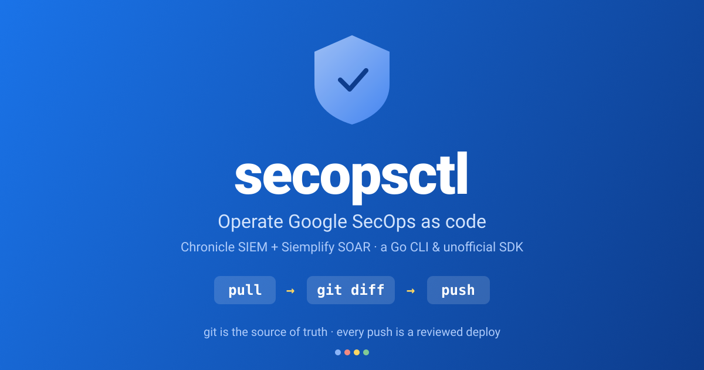

<div align="center">

<a href="https://secops.danny.vn"></a>

# secopsctl

**Operate Google SecOps (Chronicle SIEM + Siemplify SOAR) as code — for *any* tenant.**

[Docs](docs/README.md) · [What's built](docs/CATALOG.md) · [Site](https://secops.danny.vn)

</div>

---

A single Go binary **and** an importable Go SDK that treats your SIEM/SOAR like
Terraform treats infrastructure — the core loop is **pull live state → review the
`git diff` → push it back**:

- **Config as code.** `pull` SIEM rules, reference lists, data tables, dashboards,
  curated sets, feeds, parsers — and SOAR webhooks, environments, playbooks, and
  more — into plain local files. Review the diff, then `push`, reconciled by one
  product-neutral engine.
- **Triage.** `query` live events and `act` on cases/alerts the way an analyst
  does — guarded, never reconciled from a file.

It's **tenant-neutral** (no project numbers or customer IDs baked in — everything
comes from one config file) and built for **humans and LLM agents** alike:
deterministic flags, optional `--json`, clear `--help`, no prompts but the push
confirmation.

> **⚠️ `pull` is read-only. Every `push` is a live production deploy.** Mutating
> commands default to `--dry-run` and print a `LIVE DEPLOY` banner — nothing
> changes until you pass `--yes`. Always dry-run, read it, then deploy.

## Install

```bash
go install danny.vn/secops/cmd/secopsctl@latest
# or, from a clone:  go build -o secopsctl ./cmd/secopsctl
```

Requires Go ≥ 1.26. One static binary — no runtime, no SDK install.

## Authenticate

Two surfaces, two credentials, resolved lazily (so `--help`, `info`, and `config`
never touch the network):

- **SIEM** (`pull` / `push` / `query` / `doctor`) — **Google ADC, no key to fetch:**
  ```bash
  gcloud auth application-default login
  ```
  The OAuth token is minted in-process (nothing written to disk). No `gcloud`? Use
  `GOOGLE_APPLICATION_CREDENTIALS` (service-account JSON) or `SECOPS_ACCESS_TOKEN`.
- **SOAR** (`soar …`) — **an AppKey, no ADC.** Generate it once in the SOAR UI
  (**Settings → Advanced → API Keys → Add**). `secopsctl config` prompts for it
  (hidden) and stores it `0600` in your git-ignored config — so it's never
  committed. Override at run time with `SECOPS_SOAR_APP_KEY`.

## Quickstart

```bash
secopsctl config            # set up ~/.secopsctl/instance.yaml (0600); `init` is an alias
secopsctl doctor            # read-only smoke test of config + connectivity
secopsctl pull rules        # pull live config into local files (read-only)
secopsctl query udm 'metadata.event_type = "USER_LOGIN"' --hours 24 --json
secopsctl soar pull connectors   # SOAR snapshot — needs soar_url + the AppKey
```

Config resolves highest-priority-first (secopsctl does **not** read `.env`):
real `SECOPS_*` env vars → `--config` / `$SECOPSCTL_CONFIG` →
`~/.secopsctl/instance.yaml` → `./config/instance.yaml` →
`~/.config/secopsctl/instance.yaml`.

## Commands

```
secopsctl [--config PATH] [--json] <command> ...
```

| Command | What it does |
|---|---|
| `info` | Print the configured instance (AppKey redacted). |
| `config` (alias `init`) | Set up the config via a single-screen form, or flags / `--non-interactive`. |
| `doctor` | Read-only live smoke test of config + connectivity. |
| `pull <target> [--filter EXPR] [--out DIR]` | Read-only pull of live SIEM config. Targets: `rules`, `reference_lists`, `data_tables`, `dashboards`, `curated`, `curated_rules`, `feeds`, `parsers`, `all`. |
| `push <target> [--dry-run \| --yes] [--prune]` | **Live deploy.** `rules-create` / `rules-disable` + engine-reconciled surfaces. Defaults to `--dry-run`. |
| `query udm <filter> [--hours N] [--from/--to TS] [--limit N]` | Ad-hoc UDM event search. |
| `soar pull <surface> [--out DIR]` | Read-only SOAR snapshot (webhooks, environments, playbooks, connectors, …). |
| `soar push <surface> [--prune] [--dry-run \| --yes]` | **Live deploy.** Reconcile local SOAR files to live. |
| `soar case <verb> …` | Per-case triage (list / get / assign / rename / stage / tag / close / merge, …). |
| `soar legacy call <op>` | Raw passthrough to the Siemplify external API. |

Example UDM filters live in [`examples/queries/`](examples/queries/); the full
surface list and its maturity is in [`docs/CATALOG.md`](docs/CATALOG.md).

## Use as a Go SDK

The `chronicle` package is a standalone, importable client (pure API — no file I/O):

```go
import (
    "context"

    "danny.vn/secops/auth"
    "danny.vn/secops/chronicle"
)

c, _ := chronicle.NewClient(chronicle.Settings{
    ProjectID:     "your-project-id",
    ProjectNumber: "000000000000",
    Region:        "us",
    CustomerID:    "00000000-0000-0000-0000-000000000000",
}, auth.OAuth()) // ADC; credentials resolved lazily on first call

rules, err := c.ListRules(context.Background())
```

## Documentation

| Doc | What it is |
|---|---|
| [`docs/README.md`](docs/README.md) | The map: the model in one screen + index |
| [`docs/ARCHITECTURE.md`](docs/ARCHITECTURE.md) | How it works — engine, lanes, planes, auth, reliability |
| [`docs/CATALOG.md`](docs/CATALOG.md) | Status matrix (designed / built / validated) for every surface |
| [`docs/SOAR-DESIGN.md`](docs/SOAR-DESIGN.md) · [`docs/SIEM-DESIGN.md`](docs/SIEM-DESIGN.md) | Per-product specifics |
| [`docs/ROADMAP.md`](docs/ROADMAP.md) | The forward plan |

The [`tips/`](tips/) directory collects tenant-neutral notes on the craft of
operating SecOps as code — start at [`tips/README.md`](tips/README.md).

## License

Licensed under the [Apache License 2.0](LICENSE).
