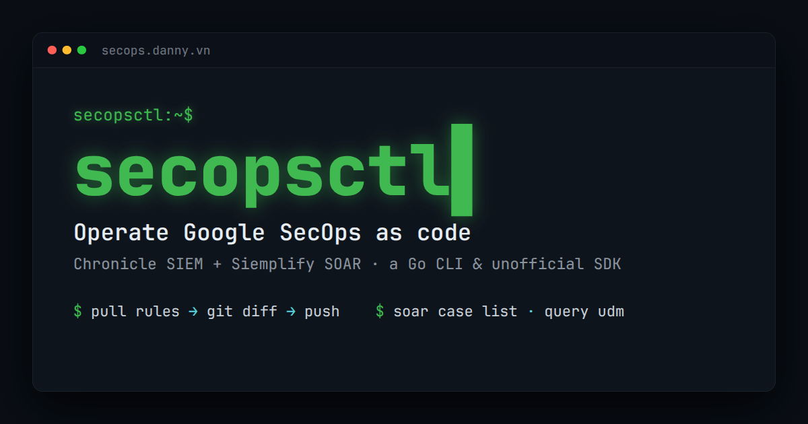

<div align="center">

<a href="https://secops.danny.vn"></a>

# secopsctl

**Operate Google SecOps (Chronicle SIEM + Siemplify SOAR) as code — for *any* tenant.**

[Docs](docs/README.md) · [What's built](docs/design/catalog.md) · [Site](https://secops.danny.vn)

</div>

---

A single Go binary **and** an importable Go SDK that treat your SIEM/SOAR like
Terraform treats infrastructure. The core loop is **pull live state → review the
`git diff` → push it back** — one reconciliation engine, every surface. Live
events, alerts, and cases are read and acted on directly — never reconciled from
a file. It's **tenant-neutral** (nothing baked in; everything comes from one
config file) and built for humans and LLM agents alike: deterministic flags,
optional `--json`, clear `--help`.

> **⚠️ `pull` is read-only. Every `push` is a live production deploy.** Mutating
> commands default to `--dry-run` and print a `LIVE DEPLOY` banner — nothing
> changes until you pass `--yes`. Always dry-run, read it, then deploy.

## Install

```bash
go install danny.vn/secops/cmd/secopsctl@latest
# or, from a clone:  go build -o secopsctl ./cmd/secopsctl
```

Requires Go ≥ 1.26 — one static binary, no runtime. Prebuilt, checksummed,
[cosign](https://github.com/sigstore/cosign)-signed binaries (linux/macOS/windows ·
amd64/arm64) are on the [Releases](https://github.com/dannyota/secops/releases)
page; build verification and signature-checking steps are in the
[install guide](docs/guides/install.md).

## Quickstart

**1. Configure your tenant.** `secopsctl config` (alias `init`) opens a one-screen
form → `~/.secopsctl/instance.yaml` (`0600`, git-ignored). Or pass every field as
flags:

```bash
secopsctl config \
  --project-id your-project-id \
  --project-number 000000000000 \
  --region us \
  --customer-id 00000000-0000-0000-0000-000000000000 \
  --soar-url https://<tenant>.siemplify-soar.com \
  --non-interactive
```

The four identifiers come from the Cloud Console and SecOps **Settings → SIEM
Settings** (customer UUID); set both `project_id` and `project_number`. Where to
find each: [configure.md](docs/guides/configure.md#find-your-secops-identifiers).

**2. Two credentials.** SIEM uses **Google ADC** (minted in-process, nothing on
disk); SOAR uses a long-lived **AppKey** (SOAR UI **Settings → Advanced → API
Keys**; stored in the config or `$SECOPS_SOAR_APP_KEY`):

```bash
gcloud auth application-default login
gcloud auth application-default set-quota-project your-project-id
```

**3. Find your SOAR host.** `soar_url` is tenant-specific and not in the public
docs — read it off a live request:

1. Sign in to the **SecOps Web UI**.
2. Open **dev-tools → Network** and click any case.
3. Requests go to `https://<tenant>.siemplify-soar.com` — that's your `soar_url`.

**4. Verify.** A read-only smoke test of config + both planes — clean means you're
wired up:

```bash
secopsctl doctor
```

Then run the loop (`pull` → review the `git diff` → `push`); see the
[command reference](docs/guides/usage.md) and
[configure guide](docs/guides/configure.md).

## Use as a Go SDK

Three importable clients (pure API, no file I/O), split by surface + credential;
constructing one never touches the network (auth resolves lazily):

| Package | Surface | Auth |
|---|---|---|
| `danny.vn/secops/chronicle` | Chronicle **SIEM** (modern REST, version-pinned per surface) | OAuth / ADC |
| `danny.vn/secops/soar` | Modern **SOAR** v1alpha | AppKey |
| `danny.vn/secops/soar/legacy` | Siemplify external API — the broad, reliable path | AppKey |

```go
c, _ := chronicle.NewClient(chronicle.Settings{
    ProjectID: "your-project-id", ProjectNumber: "000000000000",
    Region: "us", CustomerID: "00000000-0000-0000-0000-000000000000",
}, auth.OAuth()) // ADC; credentials resolved lazily on first call
rules, err := c.ListRules(context.Background())
```

Full SDK guide — all three clients, auth, errors, pagination: [docs/guides/sdk.md](docs/guides/sdk.md).

## Documentation

The [docs site](https://secops.danny.vn) is organized in three folders:

| Folder | For | Start here |
|---|---|---|
| [guides/](docs/guides/) | **using** secopsctl | [Install](docs/guides/install.md) → [Configure](docs/guides/configure.md) → [The loop](docs/guides/the-loop.md) · [Command reference](docs/guides/usage.md) |
| [design/](docs/design/) | **building** secopsctl | [Architecture](docs/design/architecture.md) · [Surfaces](docs/design/surfaces.md) · [Catalog (status)](docs/design/catalog.md) · [Roadmap](docs/design/roadmap.md) |
| [tips/](docs/tips/) | the SecOps **craft** | [SecOps as code](docs/tips/01-secops-as-code.md) · [YARA-L](docs/tips/03-yara-l-rules.md) · [SOAR ops](docs/tips/09-soar-operations.md) |

Example UDM filters are in [`examples/queries/`](examples/queries/); unfamiliar
term? see the [glossary](docs/GLOSSARY.md).

## License

Licensed under the [Apache License 2.0](LICENSE).
