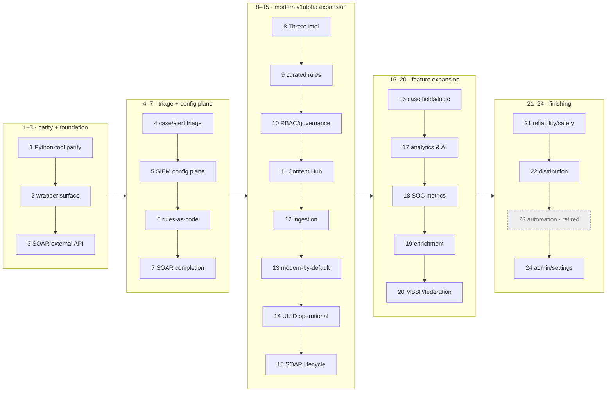

# secopsctl / Go SDK — Roadmap

The **forward plan and wave sequencing** for `secopsctl` (CLI + Go SDK). Build status lives
in [docs/design/catalog.md](docs/design/catalog.md) (this doc doesn't re-track maturity). Guiding
rule: **design cleanly, port the parity slice, then finish the surface** — improving on the wrapper.

> **Scope of this file.** Maintainer **forward plan + milestone wave digest** — NOT an
> agent's operational reading path (use `skills/secopsctl/SKILL.md` + `docs/design/catalog.md`).
> Wave-by-wave history (waves 1–72) was trimmed 2026-06-25; all detail remains in git.

## 🗺️ Package map

```text
danny.vn/secops
├── auth/         split credentials: OAuth/ADC (SIEM) + AppKey + BearerToken (SOAR)
├── chronicle/    the SIEM SDK (pure API, typed structs, no file I/O)
├── config/       instance config (YAML) load/validate/defaults
├── internal/
│   ├── cli/      cobra command tree (secopsctl)
│   └── mirror/   pull/push file mirroring on top of chronicle
└── cmd/secopsctl main
```

Future SecOps products are **sibling packages** so `chronicle` stays focused — today
that is `danny.vn/secops/soar`. (Third-party EDR and chat/notify are non-goals; see below.)

## 🌊 Wave map

Waves are done **strictly in order** — the number *is* the sequence. Per-surface
maturity is in [docs/design/catalog.md](docs/design/catalog.md); this is the plan's shape.

**Phase groups (text, for agents — the diagram below is the human view):**
P1 (1–3) parity · P2 (4–7) triage + SIEM config · P3 (8–15) modern v1alpha · P4 (16–20) features ·
P5 (21–24) finishing · 25–51 operability/UX · 52–72 triage-loop + AI + dashboards · 73–83 v0.5.0.



---

## Waves 1–72 — milestone digest (done; full history in git)

**84 waves shipped to date.** Waves 1–72 are summarized per milestone below; the
detailed per-wave build log lived in `docs/design/roadmap.md` until 2026-06-25 and
remains in git history. Per-surface live status is in
[docs/design/catalog.md](docs/design/catalog.md).

| Waves | Milestone | What landed |
|---|---|---|
| 1–3 | Parity + foundation | Feature-parity with the legacy Python tool; the `secops-wrapper` surface as typed `chronicle/*` SDK; the SOAR external-API (`/api/external/v1`, AppKey) tier + reconcile engine. |
| 4–7 | Triage + config plane | Case/alert triage on the reliable SOAR lane; SIEM config-as-code (`data_tables`/`feeds`/`parsers`/`dashboards`/`curated`) on the reconcile engine; full rule lifecycle; SOAR completion (connectors/jobs/ontology). |
| 8–15 | Modern v1alpha expansion | Threat Intel reads; curated-rules-as-code; SIEM RBAC/governance; Content Hub (SOAR host); ingestion (forwarders/schemas); modern-by-default with `--legacy` fallback; Chronicle UUID operational; SOAR v1alpha lifecycle. |
| 16–20 | Feature expansion | Case fields/logic (customFields/calc); flagship analytics & AI reads; SOC metrics + scheduled reports; enrichment & ingestion governance (dataTaps/errorNotifs); MSSP/federation. |
| 21–24 | Finishing | Reliability/safety (drift mode, request-ids); distribution (CI, goreleaser, completions); automation retired (SOAR owns it); admin/settings (API-key metadata). |
| 25–51 | Operability, UX & coverage | Exit codes + machine-readable `--json`; self-describing `surfaces`/`commands`; SIEM/SOAR triage-UX; detection-state + curated reconcile; SOAR automation-as-code; parser-dev loop + raw-log access; imperative feed delete; SOAR integration/playbook lifecycle; rule-inspection id resolution; case action exec + simulation harness; case chat; parser extensions; log-processing pipelines; Content Hub deploy; system info + case enrichment; audit/notifications/reporting; pull-mirror accuracy; batch playbook delete. |
| 52–72 | Triage-loop + AI + dashboards | Triage-loop closure (alert disposition, id bridges, per-alert verbs, queue filters); agent safety (read-only mode, audit log, command catalog); rule-tuning reads; the AI layer (case summaries, recommendations, Gemini chat, findings graph); per-alert AI investigation; the playbook authoring palette; case queue counts + filter grammar; definition authoring + API-key lifecycle; v0.3.0/0.4.x release readiness; per-command `--json`; typed step insertion; IDE PATCH-by-id; CLI UX polish; one shared HTTP transport; deploy field-masking + grouping reconcile; dashboard chart authoring (`:addChart`/`:editChart`) + inline round-trip (`--with-charts`). |
| 73–83 | v0.5.0 — operator-experience & agent-enablement | Machine-readable CLI schema + `capabilities` probe + structured errors/dry-run plan; in-repo `secopsctl` skill; query library; triage-at-scale (completeness signal, bulk update); case-path hygiene + bulk close; deploy blast-radius preview + `rules promote` + field-masked deploy; dashboard reconcile completion; SOAR fidelity; `query stats` aggregation; dashboard chart execution + authoring ergonomics. |
| 84–100 | v0.5.1 — embedded skill + operator gap-fill | Embedded operating-guide skill + `skill install`; unified case surface + fail-fast reads; descriptive command names (+aliases); dashboard fleet health; case-wall render + attached-playbook visibility; playbook-debug trace; alert-enrichment fix + dashboard deep-copy; quota-aware 429; native `:duplicate` default; export↔import round-trip; case-overview surface; operator gap-fill Tiers 1–2 (containment/IR, rule lifecycle, SOAR connector ops, platform/data, data-access RBAC, bulk triage). |

---

## Recent waves (detail)

> Only the most recent waves are detailed below; older done waves are summarized in the
> table above, with full text in git history (`git log -p -- ROADMAP.md docs/design/roadmap.md`).

### Wave 101 — `query stats` aggregation re-routed to the dashboard-query execution path *(built — offline-tested)*

`query stats` routed the aggregation through `chronicle.GetStats`, a **GET `:udmSearch`** carrying the query as a URL parameter, which returns `400 INVALID_ARGUMENT` for `match:`/`outcome:` aggregations. The Wave 73 structured-error work improved how that failure was *presented* but left the request path unchanged. **Fix:** a new `chronicle.RunStatsQuery` runs the aggregation over **POST `dashboardQueries:execute`** via `ExecuteQuery` — the same execution `dashboards run-chart` (Wave 82) uses — building the input from the resolved `--hours`/`--from`/`--to` window as a microsecond-precision absolute `time_window`, treating a non-WARNING `queryRuntimeError` as a clean fatal error while surfacing WARNINGs (e.g. a server-side row-limit truncation) as notices so a partial result is never shown as complete, and transposing the column-major `results` into the existing columns/rows table (`--json`). The verb gains `--clear-cache`; `--limit` becomes a client-side row cap. `GetStats`/`:udmSearch` stays as the event-stats SDK method. The `--help` example was corrected to the dashboard-query `match:` grammar (a bare field reference, e.g. `match: metadata.log_type`, not `match: $v = field`). **Docs:** catalog-siem.

### Wave 102 — Field-use operator-confidence fixes *(built — offline-tested; dashboard-reconcile + grouping-singleton items deferred)*

Authoring-safety and reconcile-fidelity fixes from operating the tool day to day. **Built:** `rules-create` / `rules promote` now flag in the summary and the per-rule line when a rule is created but lands `enabled=false` (a platform complexity/volume guard) instead of a bare `created`, so a non-running rule isn't read as live. `dashboards add-chart` / `edit-chart` warn at author time when a `match:`/`outcome:` variable name collides with a reserved YARA-L keyword (e.g. `rule`, `events`) — which compiles but 400s at execute time, rendering a blank chart — using the YARA-L keyword reference. `soar playbook components actions --integration <k> --json` now returns each action's full **parameter schema** (name/type/mandatory/default/optionalValues/description): the actions LIST omits parameters regardless of field mask, so the command lists then GETs each action (new `soar.GetActionDef`) and surfaces the schema needed to author a step, tolerant of both the modern (`displayName`/`mandatory`) and legacy (`name`/`isMandatory`) parameter shapes. **Already shipped earlier:** the `--with-charts` pull already logs a loud degraded-to-reference count; `curated set` already previews the set × precision blast radius; `soar playbook export` already emits the save-compatible string-enum shape. **Deferred:** a schema-validating `push dashboards` dry-run and chart layout/reorder/removal reconcile via the `definition.charts` PATCH (higher blast radius); and capturing/reconciling the full alert-grouping settings singleton (the Timeframe/Overflow/co-grouping levers are absent from every spec surface — the writable property keys must be identified first).

### Wave 103 — `soar case run-action` resolves marketplace integration actions *(built — offline-tested)*

`run-action` built the `ExecuteManualAction` body with the bare action name, which the server cannot resolve for a marketplace integration's action — every such action (e.g. a GoogleChronicle action) returned a generic 500 regardless of parameters. Fix: the action is sent in the API's `<integration>_<action>` form — a new `--integration <id>` qualifies a bare action (`--integration GoogleChronicle --action Ping` → `GoogleChronicle_Ping`), while an already-qualified name (`HTTP_Ping`) or a built-in Scripts action is left unchanged (never double-prefixed). `actionProvider` stays `Scripts` (it selects the script-execution framework, not the integration), and `caseId` is sent as a string — matching the request the console issues. With `--integration`, a pre-flight check validates `--param` against the action's parameter schema (`GetActionDef`) before the live call — a missing mandatory parameter aborts with the list, an unknown key warns, `LIST` values aren't enforced — with `--skip-validate` to bypass.

### Wave 104 — SOAR-host bearer-token auth (`--soar-token`), a third credential type *(built — offline-tested)*

An advanced auth override for the SOAR plane. **New `auth.BearerToken`** is a third `Credentials` type alongside OAuth/ADC and the API-key/AppKey: it sends a verbatim, caller-supplied token as `Authorization: Bearer` and mints/refreshes nothing. A **global `--soar-token`** flag (and `$SECOPS_SOAR_TOKEN`) feeds it a SOAR-host bearer token — e.g. a session JWT from the web console — which `resolveSOARCreds` prefers over the AppKey for **every** SOAR command (`newSOARClient`/`newSOARLegacyClient`), so a call runs under the supplied identity; the AppKey is no longer required when a token is set. The value is a literal, an `env:VAR` indirection, or `@/path/to/file` — the indirections keep a sensitive, short-lived token out of the shell history and the process argument list, and it is deliberately **not** persistable in the config (it expires). `doctor` names the SOAR credential it used (`AppKey` vs `bearer token (JWT)`). The AppKey remains the default and the only persistable SOAR secret. **Docs:** configure, usage.

### Wave 105 — `soar case run-action` always scopes to a valid alert group (the real 500 fix) *(built — offline-tested)*

The generic `500 errorCode:2000` `run-action` returned for every action was a server-side NPE on a missing scope, not an auth or action-resolution problem: `legacyCases:executeManualAction` **requires a non-empty `alertGroupIdentifiers`** — omitting it 500s, an empty `[]` 400s, a valid group succeeds (deterministic; identical body, repeated). `run-action` added the field only when `--alert` was passed, so any run without it omitted the scope and failed. Fix: `--alert` is now optional and, when omitted, the group is **auto-resolved** from the case's alerts (the first distinct `alertGroupIdentifier` via `ListCaseAlerts`, with a stderr note when the case has several); `--alert` still takes a group verbatim. The run executes on the working SOAR-host v1alpha path **directly — the modern→legacy auto-fallback was removed** for this verb (both lanes hit the same surface, so a 5xx is surfaced, not retried); `--legacy` selects the legacy lane explicitly. **Docs:** catalog-soar.

---

## Non-goals

- No bundled tenant identifiers, rule names, or secrets — ever (tenant-neutral, pre-commit leak guard `.githooks/pre-commit` enforces it); no third-party EDR or chat/notification integrations.
- No silent overwrite of concurrent edits (honor etag, surface conflicts); `push` is never non-interactive-by-default — dry-run first, explicit `--yes`.
