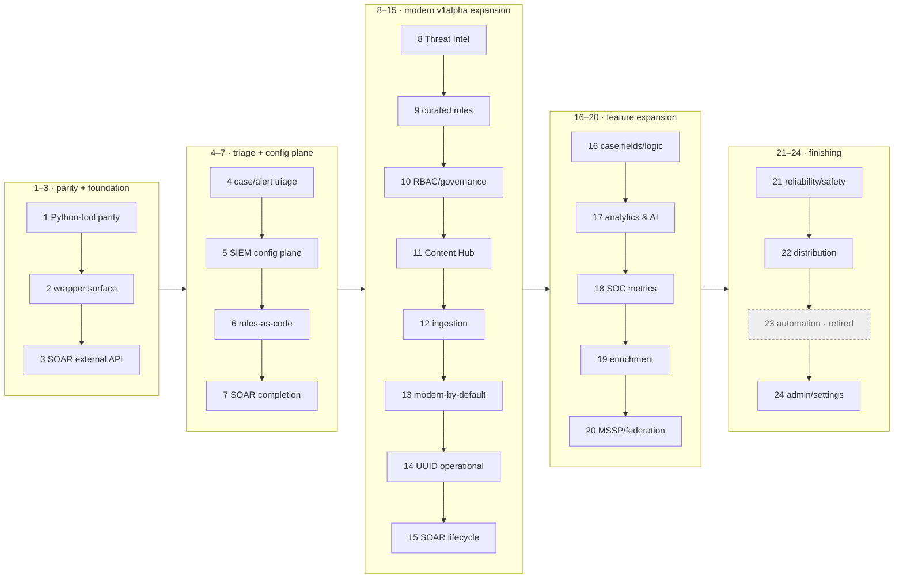

# secopsctl / Go SDK — Roadmap

The **forward plan and wave sequencing** for `secopsctl` (CLI + Go SDK). Build status lives
in [docs/design/catalog.md](docs/design/catalog.md) (this doc doesn't re-track maturity). Guiding
rule: **design cleanly, port the parity slice, then finish the surface** — improving on the wrapper.

> **Scope of this file.** Maintainer **forward plan + recent waves** — NOT an
> agent's operational reading path (use `skills/secopsctl/SKILL.md` + `docs/design/catalog.md`).
> Completed waves are trimmed; full history remains in git.

## 🗺️ Package map

```text
danny.vn/secops
├── auth/         split credentials: OAuth/ADC (SIEM) + AppKey (SOAR)
├── chronicle/    the SIEM SDK (pure API, typed structs, no file I/O)
├── config/       instance config (YAML) load/validate/defaults
├── internal/
│   ├── cli/      cobra command tree (secopsctl)
│   └── mirror/   pull/push file mirroring on top of chronicle
└── cmd/secopsctl main
```

Future SecOps products are **sibling packages** so `chronicle` stays focused — today
that is `danny.vn/secops/soar`. (Third-party EDR and chat/notify are non-goals; see below.)

## 🌊 Wave map

Waves are done **strictly in order** — the number *is* the sequence. Per-surface
maturity is in [docs/design/catalog.md](docs/design/catalog.md); this is the plan's shape.

**Phase groups (text, for agents — the diagram below is the human view):**
P1 (1–3) parity · P2 (4–7) triage + SIEM config · P3 (8–15) modern v1alpha · P4 (16–20) features ·
P5 (21–24) finishing · 25–51 operability/UX · 52–72 triage-loop + AI + dashboards · 73–83 v0.5.0 ·
84–110 v0.5.x · 111–114 v0.6.0 (search + gemini + Phase D rename + Content Hub) ·
115–116 v0.6.x (rules dev-loop + dashboard quality) ·
117–119 v0.7.0 (dashboard authoring + playbook/integration authoring + foundation) ·
120 v0.7.1 (operational polish) · 121 v0.7.2 (case improvements + Gemini reorg + fixes) ·
122 v0.7.3 (parser dev-loop + content-hub + operational polish) ·
123 v0.7.4 (parser diagnostics + content-hub tags + investigate UX) ·
124 v0.7.5 (parser lifecycle + log-type management) ·
125 v0.7.6 (parser extension docs + test refactor) ·
126 v0.7.7 (dashboard chart improvements for agent authoring) ·
127 v0.7.7+ (command reference + SEO + global --output) ·
128–131 search + field-report closeout + repo health + query packs ·
132–133 extension update + rules review + data-table import + progress + entity audit.



---

## Completed waves (1–120)

**133 waves shipped.** Full per-wave history in git (`git log -p -- ROADMAP.md docs/design/roadmap.md`).
Per-surface status is in [docs/design/catalog.md](docs/design/catalog.md).

---

## Recent waves (detail)

> Only the most recent waves are detailed below; older completed waves are in git
> history (`git log -p -- ROADMAP.md docs/design/roadmap.md`).

### Wave 122 — v0.7.3 parser dev-loop + content-hub + operational polish *(built)*

Parser authoring ergonomics (the full create→test→pull→push cycle), Content Hub output fixes, and remaining operational polish.

- **`parsers run` error surfacing.** The `runParser` API returns per-event error details (UDM validation failures, field-type mismatches) alongside or instead of `parsedEvents`, but `parsers run` currently swallows them — a failing parser returns only the raw log with no diagnostic. Surface the API error detail in both `--json` (include error fields per result) and table mode (one-line error per failed log). Unblocks iterative parser authoring (UDM validation, reserved-field collisions, repeated-field patterns all produce zero output today).
- **`parsers extension create` base64 encoding.** The `cbn_snippet` field expects base64-encoded bytes; the command currently sends raw text → HTTP 400. Wrap file contents with `base64.StdEncoding.EncodeToString()` before populating the request.
- **`pull parsers` custom parser discovery.** A newly-created custom parser (active on the server, confirmed via `parsers versions`) is not discovered by `pull parsers`. The list/discovery call likely filters on `creator_source=CUSTOMER` at the list level, missing log types where the first version was prebuilt. Walk all log types with an active custom version.
- **`push parsers` conf-only create.** A `.conf` file without a companion `.yaml` is silently ignored (0 creates). Match the `push rules-create` pattern: treat a `.conf`-only file as a new custom parser to create, no stub `.yaml` needed.
- **`parsers run` prebuilt parser support.** Make `--cbn` optional for prebuilt log types — when omitted, test logs against the active prebuilt parser server-side. Enables safe evaluation of log-type changes (e.g. testing whether a different parser handles a sample correctly) without modifying production feed config.
- **`alerts investigate` progress + error surfacing.** Replace the blocking ~90s poll with incremental progress on stderr (status + elapsed timer). When the investigation returns `STATUS_COMPLETED_ERROR`, surface the notebook error message instead of an empty result.
- **`content-hub featured install` endpoint fix.** `featured install --yes` always returns HTTP 404 (dry-run succeeds because it skips the API call). The POST path or payload shape is wrong — match the browser's Content Hub install request. Blocks restoring deleted playbook blocks from featured content via CLI.
- **`content-hub` text/JSON output fixes.** Multiple subcommands render wrong or missing fields: `list`/`contentpacks` have empty `displayName` (the identifier carries the name but the display field is blank); `diff` text mode prints `response: object` instead of a human-readable comparison; `get` text mode shows an empty `Name:` instead of `title` and reports `Installed: false` for installed packs; `integrations list --instances` lacks `installedVersion` alongside `latestVersion`/`updateAvailable`.
- **`parsers extension list` string validationReport handling.** The API returns `validationReport` as either a resource-name string or a nested object depending on state; the Go struct expected only the object form, crashing on deserialization. Custom `UnmarshalJSON` accepts both.
- **`parsers extension activate` empty body.** The `:activate` RPC expects an empty JSON body (`{}`); sending no body at all causes HTTP 400. Send `struct{}{}` for the POST body.
- **`alerts list --json` valid JSON output.** Replace hand-built JSON array construction (manual `bufio.Writer` with ignored write errors) with `json.NewEncoder` + `SetIndent` — structurally valid output by construction regardless of payload size.
- **`playbooks summary` diagnostic on generic 500.** The workflow-instance-cards API returns a generic 500 (errorCode 2000) when no workflow instance exists for a case+playbook combo (playbook didn't fire, closed case, multi-alert group mismatch). Intercept and surface a diagnostic message instead of a raw 500 dump.
- **`cases list --filter` compound expression warning.** The v1alpha cases API only supports `contains(displayName,...)` and `startswith(displayName,...)`; compound AND/OR expressions and most other filter patterns 500. Warn on stderr when a compound expression is detected.

### Wave 123 — v0.7.4 parser diagnostics, content-hub JSON tags, investigate UX *(built)*

Three field-report fixes: parser error surfacing, content-hub display names, and investigate default behavior.

- **`parsers run` error field fix (FR-50).** The `RunParserResult` struct mapped `json:"errors"` (plural array) but the API returns `"error"` (singular gRPC Status with code+message). Silent JSON mismatch caused all parse errors to be dropped — a failing parser showed "no output" with zero diagnostic info. Fixed the field name, added `parsedFields` and `failedFieldsAndErrors` for partial-parse debugging. Table mode now shows the validation error (e.g. "udm validation failed: target field is not set"); `--json` includes the full error object.
- **`parsers run --cbn` required (FR-49).** The API requires a `parser` block — there is no "test against prebuilt" mode. The help text claimed `--cbn` was optional but omitting it always gave HTTP 400. Made `--cbn` required; removed the dead no-parser-block code path; updated help text. The official Python wrapper also requires parser code.
- **`content-hub list`/`contentpacks` display names (FR-55).** JSON tags on `MarketplaceIntegration` and `ContentPack` structs were wrong: API uses `"title"` not `"displayName"`, `"installed"` not `"isInstalled"`, and `"deployed"` not `"isInstalled"` for content packs. All 407 integrations and 59 content packs now show human-readable names and correct installed/deployed status.
- **`gemini investigate` shows existing result by default.** Matches the web UI behavior: checks for an existing completed investigation first and shows it instantly (no 90s poll wait). Only triggers a new one when none exists. `--rerun` forces a new investigation; `--latest` remains strict read-only. Mutually exclusive flags enforced.

### Wave 124 — v0.7.5 parser lifecycle + log-type management *(built)*

Parser management suite + log-type CRUD + extractor reorganization.

- **`parsers upgrade`** — preview and activate a prebuilt parser release candidate via `activateReleaseCandidateParser`. Dry-run by default.
- **`parsers rollback`** — revert to the last used parser version. Finds the active `RELEASE_CANDIDATE` parser via `ListParsers`, deactivates it via `DeactivateParser`.
- **`parsers extension extract`** — discover extractable raw-log fields (read-only) or create an extractor extension with `--fields`/`--all` (mutation, guarded). Uses `GenerateUdmKeyValueMappings` + `CreateParserExtension` with `dynamicParsing.optedFields`.
- **`parsers extension setting`** — read or update the auto-extraction setting (`OPT_IN`/`ALL_FIELDS`/`DISABLED`) per log type via `getLogTypeSetting`/`updateLogTypeSetting`.
- **`ingest log-types create`** — create custom log types (auto-appends `_CUSTOM` suffix per API requirement). Custom log types are permanent — no delete or rename endpoint exists (API or console).
- **`ingest log-types list`** — default to active feeds only (feedCount > 0), `--all` for full catalog, `--sort` (name/feeds/collection), `--search`.
- **SDK:** `FetchParserCandidates`, `GenerateUdmKeyValueMappings`, `UpdateLogTypeSetting`, `CreateLogType`.

### Wave 125 — v0.7.6 parser extension docs, test refactor, gitignore cleanup *(built)*

Minor release: parser extension documentation improvements, test file renaming to feature-based names, and gitignore cleanup.

### Wave 126 — v0.7.7 dashboard chart improvements for agent authoring *(built)*

Five dashboard improvements enabling LLM agents to author and verify charts programmatically.

- **`charts run --table`** — tabular output for chart query results. Unwraps the API's typed value wrappers (`stringVal`/`doubleVal`/`int64Val`/`intVal`/`boolVal`) into clean scalars for readable data verification without screenshots.
- **`charts add` auto-binds GlobalTimeFilter.** New charts default to `filtersIds: ["GlobalTimeFilter"]` so they respond to the dashboard's time range picker. `--no-filters` disables.
- **`charts edit --title`** — rename a chart in place via `:editChart` with `displayName` in the editMask.
- **`charts edit --filters`** — set a chart's filter bindings by patching `filtersIds` in the dashboard's `definition.charts[]` array.
- **`charts list`/`get` enrichment.** Both now populate `filtersIds` and `chartLayout` from the dashboard's `definition.charts[]` (definition-level fields not present on the chart API object).
- **Stacked bar/line viz fix.** `seriesColumn` at viz top level (not inside `series[0].encode`), `xAxes`/`yAxes` with `axisType`, per-series `dataLabel: {}`/`stack`, `AREA` mapped to `LINE` (API rejects `AREA`).

**Docs:** catalog (`dashboards` row), SKILL (command map + stacked-bar example).

### Wave 127 — generated command reference, SEO generation, global `--output`, docs-site branding *(built)*

Docs-toolchain and output-contract improvements.

- **`docs generate` (hidden).** Walks the command tree and generates one
  reference page per top-level group into `docs/commands/` (23 pages, every
  runnable verb with usage, fenced long help, flags table, guarded-mutation
  note), plus an index, and syncs a marker-delimited block in
  `docs/_sidebar.md`. `--check` regenerates in memory and fails on staleness —
  wired into CI so the published reference can never drift from the binary.
  Generated pages are exempt from the 450-line docs cap (`check-lengths.sh`).
- **`scripts/gen-seo.sh`.** `sitemap.xml` and `llms.txt` are now generated from
  `docs/_sidebar.md` (descriptions extracted from each page's first paragraph,
  `lastmod` from the last git commit date) instead of hand-maintained;
  `llms-full.txt` regeneration is folded in. `--check` replaces `check-seo.sh`
  in CI. The command-reference index feeds `llms-full.txt`.
- **Global `--output table|json|csv`.** Root persistent flag, mutually
  exclusive with `--json` (`--output json` ≡ `--json` everywhere via a root
  PersistentPreRun). The format-aware commands (`query udm`, `mitre`,
  `rules health`) resolve local `--format` → global `--output` → `--json`
  through one shared `effectiveFormat` helper, and their CSV writers share
  `printCSVTo`.
- **Docs-site branding.** `banner.svg` (README + site), `og.svg`/`og.png`
  (1200×630 social card), and `favicon.svg` redrawn as one set — blue gradient,
  shield mark, stat pills, the pull → git diff → push loop; replaces the old
  `banner.png`/`og-facebook.png`.

**Docs:** catalog (`docs generate` + `--output` rows), SKILL (global flags +
self-discovery), this wave.

### Wave 128 — long-window search, count probe, evidence sidecar, raw-field extraction *(built — offline-tested)*

Search-workflow improvements for long look-backs and evidence collection.

- **Auto-chunked wide windows.** The UDM search API caps one request at 90 days;
  `search udm` (and `run`/`saved`) now split a wider `--from`/`--to` window into
  sequential ≤90-day half-open chunks, merge the results, deduplicate events that
  fall on a chunk boundary (by `udm.metadata.id`), and report per-chunk counts on
  stderr. A year-long window is a single command. Applies to the plain, `--all`,
  `--raw`, and `--count-only` paths; a failed chunk is labeled with its position
  and window.
- **`search udm --count-only`.** Prints only the TOTAL match count — the
  complete-results engine computes the baseline count server-side, so no event
  data is downloaded. `--json` returns `{total, chunks[]}` with per-chunk
  subtotals on chunked windows.
- **`--out` + `--meta` evidence sidecar.** `--meta` writes a `<file>.meta.json`
  next to the `--out` file recording the query, window, per-chunk and total
  counts, save time, and tool version — a saved result set carries its own
  provenance.
- **`search event --extract`.** Projects dotted paths out of the raw log's JSON
  (numeric segments index arrays) instead of printing the whole blob — for
  fields UDM does not carry (OAuth scopes, IAM binding deltas, request
  parameters). One JSON object per raw log; non-JSON raw logs yield empty values
  with a stderr warning.
- **Bulk-fetch deadline + progress.** `--all`/`--raw`/`--count-only` default to a
  10-minute per-request deadline (the general 60s `--timeout` default cut large
  single-request result streams mid-download; an explicit `--timeout` still
  wins), and large `--raw` hydrations print `fetched N/M raw logs…` progress on
  stderr instead of staying silent for the whole fetch.

**Docs:** catalog (events/output-contract rows), SKILL (search section), this wave.

### Wave 129 — parser push activation wait, dashboard reserved-word lint, validate diagnostics, extension tips *(built — offline-tested)*

Authoring-loop fixes across parsers, dashboards, and rules.

- **`push parsers` waits for validation before activating.** A freshly created
  parser version validates asynchronously; activating immediately returns a bare
  FAILED_PRECONDITION even when the validation is about to pass. The push path
  now polls the version's validation stage (backoff, 5-minute budget), activates
  on PASSED, reports the validation report's parsing errors on FAILED, and on
  timeout names the exact `parsers activate` command that finishes the job.
- **Reserved-variable lint for dashboard charts.** A chart query binding a
  reserved variable name (`$rule`, `$rules`, `$event`, `$events`, `$entity`,
  `$entities`, `$detection`, `$alert`) saves cleanly but fails at execute time —
  the chart just renders blank. `dashboards lint` flags it as a sixth static
  check, and `dashboards verify` reports it as an error before trusting the
  execute result. Non-zero exit on findings, as before.
- **`rules validate` diagnostics.** Prints every compilation diagnostic with its
  line/column position (previously only the first message, position discarded),
  includes the full diagnostics list under `--json`, and appends a fix hint to
  the opaque `token: "#"` error (the `#event` count operator is condition-only;
  outcome sections use `count(...)`). SDK: `RuleDiagnostic` exported,
  `RuleValidation.Diagnostics` added.
- **`charts get` definition-fields resolution.** `filtersIds` is emitted as `[]`
  (not null) for an unbound chart; a failed or empty dashboard-definition lookup
  is surfaced on stderr instead of silently omitting the fields; `--dashboard`
  supplies the parent when the chart's resource name carries none.
- **`ingest parsers extension tips`.** Prints the parser-extension authoring
  guide embedded in the binary (grok named-capture requirement, JSON-escaped
  quote matching, event_type override merge semantics, extension-specific
  validator rejections, statedump debugging) — offline, no API calls. The guide
  (docs/tips/12) gains the named-capture and validator-rejection patterns and is
  now linked from the tips index.

**Docs:** catalog (parsers/dashboards/rules rows), SKILL (extension verbs), tips 12 + index, this wave.

### Wave 130 — IP geo enrichment, field-projection improvement, SDK doc comments, dry-run banner *(built)*

Search usability and repo health.

- **`search udm --enrich-ip`.** Appends IP geolocation columns (country, state,
  ASN, carrier) to the field projection — combine with `--fields` for a
  login-audit CSV. The inline `principal.location` and the enrichment
  `principal.ipGeoArtifact` fields are both projected.
- **Singleton-array auto-enter in `--fields`.** `extractUDMField` now
  auto-enters a single-element array so a dotted path like
  `principal.ipGeoArtifact.network.asn` resolves without an explicit `[0]`.
  Multi-element arrays still render as compact JSON (no silent data loss).
- **Chore: 43 SDK doc comments** across `soar/` CRUD surfaces + `FindRawLogs`.
- **Chore: `DRY RUN —` banner normalization** — uniform em-dash across all
  25+ guarded commands. `CasePriority` enum dedup (single typed enum, not two
  switch sites).

**Docs:** catalog (UDM events row), SKILL (--enrich-ip, singleton auto-enter), this wave.

### Wave 131 — query packs, feeds health, file splits, verb-specific guards *(built)*

Reusable query templates, feed observability, and codebase health.

- **`search run --param key=value`.** Substitutes `$key` placeholders in a
  `.udm` query file before execution — turns tracked query files into reusable
  templates with bind parameters. Errors on missing placeholders.
- **Parameterised audit query templates.** `examples/queries/user-login.udm`,
  `user-admin.udm`, `user-resource.udm` — per-user activity queries accepting
  `--param email=...`. Existing query files updated to current binary name.
- **`ingest feeds list` last-activity column + `--failed` filter.** The fleet
  table now shows a friendly relative timestamp ("3m ago", "2d ago") from
  `LastFeedInitiationTime`; `--failed` shows only non-healthy feeds.
- **`EntityRiskScore` typed struct** in `chronicle/analytics.go` (was
  `json.RawMessage`); CLI emits `Raw` bytes for lossless JSON output.
- **Chore: file splits.** `soar_case.go` (645→154+503),
  `soar_playbook.go` (662→364+309), `soar_playbook_run.go` (678→451+235)
  split into focused siblings, all well under the 700-line cap.
- **Chore: verb-specific refusal messages.** All 17 generic "Refusing to
  act/apply" sites replaced with verb-specific wording derived from the
  action context (e.g. "Refusing to close case 123", "Refusing to deploy").

**Docs:** catalog (feeds/events rows), SKILL (--param, audit templates), this wave.

### Wave 132 — extension update-in-place, rules review, data-table CSV import *(built)*

Backlog clearout: compound operations, promotion reporting, and bulk data import.

- **`parsers extension update`.** Compound delete → create → poll validation
  → activate in one guarded command. Auto-resolves the extension when only one
  exists for the log type; explicit `--ext` when multiple are present.
  Reuses the exponential-backoff validation poll pattern (2 s → 30 s, 5 min cap).
- **`rules review`.** Read-only promotion report for monitor-mode rules
  (enabled + not alerting). Shows detection counts over a configurable
  look-back window (`--hours`, default 7 d), sorted by detections descending
  (best promotion candidates first). `--min-detections` filters out silent
  monitors. Table / JSON / CSV output.
- **`data-tables import`.** Bulk-imports rows from a CSV file into a data
  table (`--table`). Appends by default; `--replace` clears the table first.
  Skips CSV header by default (`--skip-header`). Guarded mutation with
  dry-run preview.

**Docs:** catalog (parsers/rules/data-tables rows), SKILL (new commands), this wave.

### Wave 133 — global `--no-progress` flag, entity risk/watchlist maturity audit *(built)*

Global `--no-progress` flag for streaming-progress control (s1ctl-inspired); `entities audit` cross-references entity risk scores with watchlist coverage (empty/default-factor health, coverage gaps, `--min-risk`, `--json`).

### Wave 134 — SOAR jobs scheduler: modern instance lane, run history, revisions *(built — offline-tested)*

Modern v1alpha read/write plane for scheduled job instances: `soar jobs instance
list/get/set/run/delete` promoted to modern-by-default with legacy fallback;
flag-based `instance create` with simple interval or advanced calendar schedules
(once/daily/weekly/monthly) and `--param` resolution against the job-def parameter
spec; `instance history` per-run execution logs with status filter; job-definition
`revision list/create/rollback/delete`. The typed instance model matches the live
payload shape (typed parameter array, advanced-schedule config, epoch-millis
timestamps). Recipe page: docs/tips/13-scheduled-jobs.md.

### Wave 135 — Emerging Threats coverage & IoC associations *(built — offline-tested)*

`ti coverage` (rule↔threat-collection coverage mapping, filtered by collection ids),
`ti associations` / `ti related-associations` (malware-family / threat-actor
association records via batchGet + related pivots), `ti filters` (threat-collection
filter-set metadata). SDK chunks long id lists (80 names / 40 collection ids per
call); licensed-add-on 403s surface cleanly.

### Wave 136 — search ergonomics, stats syntax reference, parser lifecycle *(built — offline-tested)*

`search udm --raw --all` runs the complete-results engine before raw hydration
(total match count reported); single-chunk searches show indeterminate stderr
progress. Aggregation queries (`match:`/`outcome:`) auto-route from `search udm`/
`search run` to the stats engine; the full YARA-L 2.0 section/aggregate syntax is
documented in `search stats --help` and docs/tips/14-stats-queries.md; stats tables
render array outcomes comma-joined. Parser lifecycle: pull/reconcile prefer the
CUSTOM parser version when a prebuilt is also active; new guarded `ingest parsers
delete` refuses an ACTIVE version without `--force`.

---

## Non-goals

- No bundled tenant identifiers, rule names, or secrets — ever (tenant-neutral, pre-commit leak guard `.githooks/pre-commit` enforces it); no third-party EDR or chat/notification integrations.
- No silent overwrite of concurrent edits (honor etag, surface conflicts); `push` is never non-interactive-by-default — dry-run first, explicit `--yes`.
