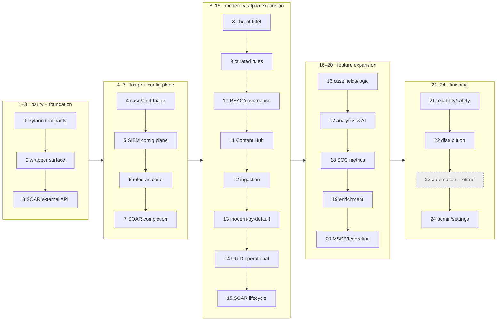

# secopsctl / Go SDK — Roadmap

The **forward plan and wave sequencing** for `secopsctl` (CLI + Go SDK). Build status lives
in [docs/design/catalog.md](docs/design/catalog.md) (this doc doesn't re-track maturity). Guiding
rule: **design cleanly, port the parity slice, then finish the surface** — improving on the wrapper.

> **Scope of this file.** Maintainer **forward plan + recent waves** — NOT an
> agent's operational reading path (use `skills/secopsctl/SKILL.md` + `docs/design/catalog.md`).
> Completed waves are trimmed; full history remains in git.

## 🗺️ Package map

```text
danny.vn/secops
├── auth/         split credentials: OAuth/ADC (SIEM) + AppKey (SOAR)
├── chronicle/    the SIEM SDK (pure API, typed structs, no file I/O)
├── config/       instance config (YAML) load/validate/defaults
├── internal/
│   ├── cli/      cobra command tree (secopsctl)
│   └── mirror/   pull/push file mirroring on top of chronicle
└── cmd/secopsctl main
```

Future SecOps products are **sibling packages** so `chronicle` stays focused — today
that is `danny.vn/secops/soar`. (Third-party EDR and chat/notify are non-goals; see below.)

## 🌊 Wave map

Waves are done **strictly in order** — the number *is* the sequence. Per-surface
maturity is in [docs/design/catalog.md](docs/design/catalog.md); this is the plan's shape.

**Phase groups (text, for agents — the diagram below is the human view):**
P1 (1–3) parity · P2 (4–7) triage + SIEM config · P3 (8–15) modern v1alpha · P4 (16–20) features ·
P5 (21–24) finishing · 25–51 operability/UX · 52–72 triage-loop + AI + dashboards · 73–83 v0.5.0 ·
84–110 v0.5.x · 111–114 v0.6.0 (search + gemini + Phase D rename + Content Hub) ·
115–116 v0.6.x (rules dev-loop + dashboard quality) ·
117–119 v0.7.0 (dashboard authoring + playbook/integration authoring + foundation) ·
120 v0.7.1 (operational polish) · 121 v0.7.2 (case improvements + Gemini reorg + fixes) ·
122 v0.7.3 (parser dev-loop + content-hub + operational polish) ·
123 v0.7.4 (parser diagnostics + content-hub tags + investigate UX) ·
124 v0.7.5 (parser lifecycle + log-type management) ·
125 v0.7.6 (parser extension docs + test refactor) ·
126 v0.7.7 (dashboard chart improvements for agent authoring).



---

## Completed waves (1–119)

**126 waves shipped.** Full per-wave history in git (`git log -p -- ROADMAP.md docs/design/roadmap.md`).
Per-surface status is in [docs/design/catalog.md](docs/design/catalog.md).

---

## Recent waves (detail)

> Only the most recent waves are detailed below; older completed waves are in git
> history (`git log -p -- ROADMAP.md docs/design/roadmap.md`).

### Wave 120 — v0.7.1 operational polish *(built)*

Operational polish, playbook/integration management, and an enum reference.

- **Value-pattern redaction removed.** The `.secopsctl-redact` file and `--redact` flag are gone — inline values (e.g. webhook URLs) are no longer masked on `soar pull`. `soar push playbooks` now round-trips cleanly without restoring redacted values first. Key-name credential redaction for feeds (password, apiKey, token, etc.) is unchanged.
- **`playbooks duplicate` three-tier fallback.** Modern v1alpha `DuplicateWorkflows` as primary (auto-creates copy, renames to `--name`); legacy `DuplicateWorkflow` on modern failure; export → rename → save on legacy 500. New options: `--folder` (target category) and `--env` (override environments).
- **`playbooks categories` CRUD.** `list`, `create`, `rename`, `delete` — full folder management. Also aliased as `playbooks folders`.
- **`playbooks move`** — move a playbook to a different category by name or id.
- **`playbooks deploy` silent enum fallback.** Imported playbooks carry numeric enum fields that the modern v1alpha `SaveWorkflowDefinitions` rejects with HTTP 400. The deploy command now detects this specific error and falls back to the legacy path silently.
- **`integrations rename`** — rename an integration instance's displayName via v1alpha PATCH with updateMask. Resolves by `--instance <uuid>` or `--env <env>`. System default instances (server-managed) cannot be renamed (API returns 400).
- **`integrations list --instances`** — shows configured instances nested under each pack with environment and display name. Non-system instances tagged `[renamable]`.
- **`status enums` — SOAR enum reference.** Lists every SDK-defined enum (CasePriority, CloseReason, SLA types, BlockList types/scopes) with integer-to-name mappings. `--live` adds instance-specific values: case stages and playbook categories. SDK: new `GetMetadata`, `CloneWorkflow`, `DuplicateWorkflows`, `UpdateIntegrationInstance` methods.
- **Playbook ZIP bundle format documented** in the SKILL guide.
- **SDK fix:** `IntegrationInstance.IntegrationIdentifier` field name corrected (was `IntegrationName`, didn't match the JSON). Added `SystemDefault` field.

**Docs:** catalog, SKILL (ZIP format + command map).

### Wave 121 — v0.7.2 case improvements, Gemini reorg, operational fixes *(built)*

Case operational verbs, AI command consolidation, and operational fixes.

- **`playbooks summary` rewrite.** Switch from the broken `GetWorkflowInstanceSummary` to the two-call pattern (`GetWorkflowInstancesCards` → `GetWorkflowInstance`). Fixes 500 on multi-alert/closed cases.
- **`cases list --filter` syntax validation.** Client-side validation rejects OData-style operators (`eq`, `ne`) with guidance on the SQL-style syntax the v1alpha API uses.
- **`WorkflowsStatus` enum.** Added to `status enums` (SDK type + CLI display, values 0–7) and the `WorkflowStatus` typed enum to the SDK.
- **`alerts list --json` fix.** Switched to streaming per-alert output to avoid large-buffer truncation.
- **Gemini command reorg.** All AI features under the `gemini` group: `generate-query` (was `generate`), `search`, `ask`, `investigate`, `summarize`, `generate` (playbook). Hidden backward-compat aliases at old locations. `search generate-query` alias added.
- **`cases incident`** — mark/unmark a case as incident (`--unset` to clear).
- **`cases report`** — export a case report (PDF/DOC/DOCX/XLSX/CSV/HTML; `--out` saves to file).
- **Version "unknown" fix.** `version`/`doctor` omit commit info for non-git installs.
- **Internal: `redact.go` → `secret_strip.go`.** Renamed credential-scrubbing helper to `stripSecrets()`.
- **Transport: `ExternalBytes`** — raw-bytes response path for binary endpoints (reports).

- **Docs overhaul.** Fixed `gemini generate` → `gemini generate-query` across 7 files; shortened verbose headings in surfaces/cli-naming/soar design docs; expanded rules/playbooks/soar-cases guides with missing commands (15+ rule verbs, 17 case verbs, playbook inspect/folder sections); fixed stale status rows (data-access, alert act verbs); cleaned docsify layout (removed Jekyll, streamlined CSS).

### Wave 122 — v0.7.3 parser dev-loop + content-hub + operational polish *(built)*

Parser authoring ergonomics (the full create→test→pull→push cycle), Content Hub output fixes, and remaining operational polish.

- **`parsers run` error surfacing.** The `runParser` API returns per-event error details (UDM validation failures, field-type mismatches) alongside or instead of `parsedEvents`, but `parsers run` currently swallows them — a failing parser returns only the raw log with no diagnostic. Surface the API error detail in both `--json` (include error fields per result) and table mode (one-line error per failed log). Unblocks iterative parser authoring (UDM validation, reserved-field collisions, repeated-field patterns all produce zero output today).
- **`parsers extension create` base64 encoding.** The `cbn_snippet` field expects base64-encoded bytes; the command currently sends raw text → HTTP 400. Wrap file contents with `base64.StdEncoding.EncodeToString()` before populating the request.
- **`pull parsers` custom parser discovery.** A newly-created custom parser (active on the server, confirmed via `parsers versions`) is not discovered by `pull parsers`. The list/discovery call likely filters on `creator_source=CUSTOMER` at the list level, missing log types where the first version was prebuilt. Walk all log types with an active custom version.
- **`push parsers` conf-only create.** A `.conf` file without a companion `.yaml` is silently ignored (0 creates). Match the `push rules-create` pattern: treat a `.conf`-only file as a new custom parser to create, no stub `.yaml` needed.
- **`parsers run` prebuilt parser support.** Make `--cbn` optional for prebuilt log types — when omitted, test logs against the active prebuilt parser server-side. Enables safe evaluation of log-type changes (e.g. testing whether a different parser handles a sample correctly) without modifying production feed config.
- **`alerts investigate` progress + error surfacing.** Replace the blocking ~90s poll with incremental progress on stderr (status + elapsed timer). When the investigation returns `STATUS_COMPLETED_ERROR`, surface the notebook error message instead of an empty result.
- **`content-hub featured install` endpoint fix.** `featured install --yes` always returns HTTP 404 (dry-run succeeds because it skips the API call). The POST path or payload shape is wrong — match the browser's Content Hub install request. Blocks restoring deleted playbook blocks from featured content via CLI.
- **`content-hub` text/JSON output fixes.** Multiple subcommands render wrong or missing fields: `list`/`contentpacks` have empty `displayName` (the identifier carries the name but the display field is blank); `diff` text mode prints `response: object` instead of a human-readable comparison; `get` text mode shows an empty `Name:` instead of `title` and reports `Installed: false` for installed packs; `integrations list --instances` lacks `installedVersion` alongside `latestVersion`/`updateAvailable`.
- **`parsers extension list` string validationReport handling.** The API returns `validationReport` as either a resource-name string or a nested object depending on state; the Go struct expected only the object form, crashing on deserialization. Custom `UnmarshalJSON` accepts both.
- **`parsers extension activate` empty body.** The `:activate` RPC expects an empty JSON body (`{}`); sending no body at all causes HTTP 400. Send `struct{}{}` for the POST body.
- **`alerts list --json` valid JSON output.** Replace hand-built JSON array construction (manual `bufio.Writer` with ignored write errors) with `json.NewEncoder` + `SetIndent` — structurally valid output by construction regardless of payload size.
- **`playbooks summary` diagnostic on generic 500.** The workflow-instance-cards API returns a generic 500 (errorCode 2000) when no workflow instance exists for a case+playbook combo (playbook didn't fire, closed case, multi-alert group mismatch). Intercept and surface a diagnostic message instead of a raw 500 dump.
- **`cases list --filter` compound expression warning.** The v1alpha cases API only supports `contains(displayName,...)` and `startswith(displayName,...)`; compound AND/OR expressions and most other filter patterns 500. Warn on stderr when a compound expression is detected.

### Wave 123 — v0.7.4 parser diagnostics, content-hub JSON tags, investigate UX *(built)*

Three field-report fixes: parser error surfacing, content-hub display names, and investigate default behavior.

- **`parsers run` error field fix (FR-50).** The `RunParserResult` struct mapped `json:"errors"` (plural array) but the API returns `"error"` (singular gRPC Status with code+message). Silent JSON mismatch caused all parse errors to be dropped — a failing parser showed "no output" with zero diagnostic info. Fixed the field name, added `parsedFields` and `failedFieldsAndErrors` for partial-parse debugging. Table mode now shows the validation error (e.g. "udm validation failed: target field is not set"); `--json` includes the full error object.
- **`parsers run --cbn` required (FR-49).** The API requires a `parser` block — there is no "test against prebuilt" mode. The help text claimed `--cbn` was optional but omitting it always gave HTTP 400. Made `--cbn` required; removed the dead no-parser-block code path; updated help text. The official Python wrapper also requires parser code.
- **`content-hub list`/`contentpacks` display names (FR-55).** JSON tags on `MarketplaceIntegration` and `ContentPack` structs were wrong: API uses `"title"` not `"displayName"`, `"installed"` not `"isInstalled"`, and `"deployed"` not `"isInstalled"` for content packs. All 407 integrations and 59 content packs now show human-readable names and correct installed/deployed status.
- **`gemini investigate` shows existing result by default.** Matches the web UI behavior: checks for an existing completed investigation first and shows it instantly (no 90s poll wait). Only triggers a new one when none exists. `--rerun` forces a new investigation; `--latest` remains strict read-only. Mutually exclusive flags enforced.

### Wave 124 — v0.7.5 parser lifecycle + log-type management *(built)*

Parser management suite + log-type CRUD + extractor reorganization.

- **`parsers upgrade`** — preview and activate a prebuilt parser release candidate via `activateReleaseCandidateParser`. Dry-run by default.
- **`parsers rollback`** — revert to the last used parser version. Finds the active `RELEASE_CANDIDATE` parser via `ListParsers`, deactivates it via `DeactivateParser`.
- **`parsers extension extract`** — discover extractable raw-log fields (read-only) or create an extractor extension with `--fields`/`--all` (mutation, guarded). Uses `GenerateUdmKeyValueMappings` + `CreateParserExtension` with `dynamicParsing.optedFields`.
- **`parsers extension setting`** — read or update the auto-extraction setting (`OPT_IN`/`ALL_FIELDS`/`DISABLED`) per log type via `getLogTypeSetting`/`updateLogTypeSetting`.
- **`ingest log-types create`** — create custom log types (auto-appends `_CUSTOM` suffix per API requirement). Custom log types are permanent — no delete or rename endpoint exists (API or console).
- **`ingest log-types list`** — default to active feeds only (feedCount > 0), `--all` for full catalog, `--sort` (name/feeds/collection), `--search`.
- **SDK:** `FetchParserCandidates`, `GenerateUdmKeyValueMappings`, `UpdateLogTypeSetting`, `CreateLogType`.

### Wave 125 — v0.7.6 parser extension docs, test refactor, gitignore cleanup *(built)*

Minor release: parser extension documentation improvements, test file renaming to feature-based names, and gitignore cleanup.

### Wave 126 — v0.7.7 dashboard chart improvements for agent authoring *(built)*

Five dashboard improvements enabling LLM agents to author and verify charts programmatically.

- **`charts run --table`** — tabular output for chart query results. Unwraps the API's typed value wrappers (`stringVal`/`doubleVal`/`int64Val`/`intVal`/`boolVal`) into clean scalars for readable data verification without screenshots.
- **`charts add` auto-binds GlobalTimeFilter.** New charts default to `filtersIds: ["GlobalTimeFilter"]` so they respond to the dashboard's time range picker. `--no-filters` disables.
- **`charts edit --title`** — rename a chart in place via `:editChart` with `displayName` in the editMask.
- **`charts edit --filters`** — set a chart's filter bindings by patching `filtersIds` in the dashboard's `definition.charts[]` array.
- **`charts list`/`get` enrichment.** Both now populate `filtersIds` and `chartLayout` from the dashboard's `definition.charts[]` (definition-level fields not present on the chart API object).
- **Stacked bar/line viz fix.** `seriesColumn` at viz top level (not inside `series[0].encode`), `xAxes`/`yAxes` with `axisType`, per-series `dataLabel: {}`/`stack`, `AREA` mapped to `LINE` (API rejects `AREA`).

**Docs:** catalog (`dashboards` row), SKILL (command map + stacked-bar example).

### Wave 127 — generated command reference, SEO generation, global `--output`, docs-site branding *(built)*

Docs-toolchain and output-contract improvements.

- **`docs generate` (hidden).** Walks the command tree and generates one
  reference page per top-level group into `docs/commands/` (23 pages, every
  runnable verb with usage, fenced long help, flags table, guarded-mutation
  note), plus an index, and syncs a marker-delimited block in
  `docs/_sidebar.md`. `--check` regenerates in memory and fails on staleness —
  wired into CI so the published reference can never drift from the binary.
  Generated pages are exempt from the 450-line docs cap (`check-lengths.sh`).
- **`scripts/gen-seo.sh`.** `sitemap.xml` and `llms.txt` are now generated from
  `docs/_sidebar.md` (descriptions extracted from each page's first paragraph,
  `lastmod` from the last git commit date) instead of hand-maintained;
  `llms-full.txt` regeneration is folded in. `--check` replaces `check-seo.sh`
  in CI. The command-reference index feeds `llms-full.txt`.
- **Global `--output table|json|csv`.** Root persistent flag, mutually
  exclusive with `--json` (`--output json` ≡ `--json` everywhere via a root
  PersistentPreRun). The format-aware commands (`query udm`, `mitre`,
  `rules health`) resolve local `--format` → global `--output` → `--json`
  through one shared `effectiveFormat` helper, and their CSV writers share
  `printCSVTo`.
- **Docs-site branding.** `banner.svg` (README + site), `og.svg`/`og.png`
  (1200×630 social card), and `favicon.svg` redrawn as one set — blue gradient,
  shield mark, stat pills, the pull → git diff → push loop; replaces the old
  `banner.png`/`og-facebook.png`.

**Docs:** catalog (`docs generate` + `--output` rows), SKILL (global flags +
self-discovery), this wave.

### Wave 128 — long-window search, count probe, evidence sidecar, raw-field extraction *(built — offline-tested)*

Search-workflow improvements for long look-backs and evidence collection.

- **Auto-chunked wide windows.** The UDM search API caps one request at 90 days;
  `search udm` (and `run`/`saved`) now split a wider `--from`/`--to` window into
  sequential ≤90-day half-open chunks, merge the results, deduplicate events that
  fall on a chunk boundary (by `udm.metadata.id`), and report per-chunk counts on
  stderr. A year-long window is a single command. Applies to the plain, `--all`,
  `--raw`, and `--count-only` paths; a failed chunk is labeled with its position
  and window.
- **`search udm --count-only`.** Prints only the TOTAL match count — the
  complete-results engine computes the baseline count server-side, so no event
  data is downloaded. `--json` returns `{total, chunks[]}` with per-chunk
  subtotals on chunked windows.
- **`--out` + `--meta` evidence sidecar.** `--meta` writes a `<file>.meta.json`
  next to the `--out` file recording the query, window, per-chunk and total
  counts, save time, and tool version — a saved result set carries its own
  provenance.
- **`search event --extract`.** Projects dotted paths out of the raw log's JSON
  (numeric segments index arrays) instead of printing the whole blob — for
  fields UDM does not carry (OAuth scopes, IAM binding deltas, request
  parameters). One JSON object per raw log; non-JSON raw logs yield empty values
  with a stderr warning.
- **Bulk-fetch deadline + progress.** `--all`/`--raw`/`--count-only` default to a
  10-minute per-request deadline (the general 60s `--timeout` default cut large
  single-request result streams mid-download; an explicit `--timeout` still
  wins), and large `--raw` hydrations print `fetched N/M raw logs…` progress on
  stderr instead of staying silent for the whole fetch.

**Docs:** catalog (events/output-contract rows), SKILL (search section), this wave.

---

## Non-goals

- No bundled tenant identifiers, rule names, or secrets — ever (tenant-neutral, pre-commit leak guard `.githooks/pre-commit` enforces it); no third-party EDR or chat/notification integrations.
- No silent overwrite of concurrent edits (honor etag, surface conflicts); `push` is never non-interactive-by-default — dry-run first, explicit `--yes`.
