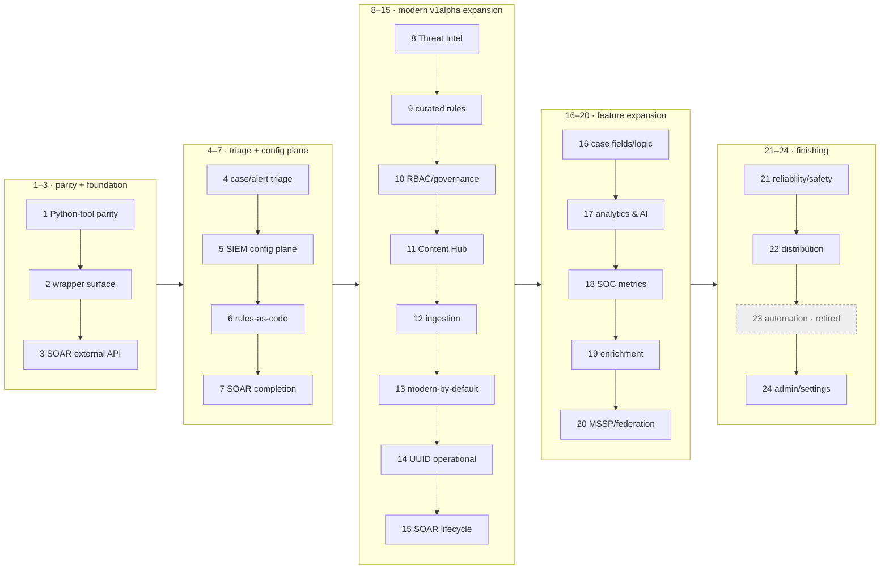

# secopsctl / Go SDK — Roadmap

The **forward plan and wave sequencing** for `secopsctl` (CLI + Go SDK). Build status lives
in [docs/design/catalog.md](docs/design/catalog.md) (this doc doesn't re-track maturity). Guiding
rule: **design cleanly, port the parity slice, then finish the surface** — improving on the wrapper.

> **Scope of this file.** Maintainer **forward plan + milestone wave digest** — NOT an
> agent's operational reading path (use `skills/secopsctl/SKILL.md` + `docs/design/catalog.md`).
> Wave-by-wave history (waves 1–72) was trimmed 2026-06-25; all detail remains in git.

## 🗺️ Package map

```text
danny.vn/secops
├── auth/         split credentials: OAuth/ADC (SIEM) + AppKey + BearerToken (SOAR)
├── chronicle/    the SIEM SDK (pure API, typed structs, no file I/O)
├── config/       instance config (YAML) load/validate/defaults
├── internal/
│   ├── cli/      cobra command tree (secopsctl)
│   └── mirror/   pull/push file mirroring on top of chronicle
└── cmd/secopsctl main
```

Future SecOps products are **sibling packages** so `chronicle` stays focused — today
that is `danny.vn/secops/soar`. (Third-party EDR and chat/notify are non-goals; see below.)

## 🌊 Wave map

Waves are done **strictly in order** — the number *is* the sequence. Per-surface
maturity is in [docs/design/catalog.md](docs/design/catalog.md); this is the plan's shape.

**Phase groups (text, for agents — the diagram below is the human view):**
P1 (1–3) parity · P2 (4–7) triage + SIEM config · P3 (8–15) modern v1alpha · P4 (16–20) features ·
P5 (21–24) finishing · 25–51 operability/UX · 52–72 triage-loop + AI + dashboards · 73–83 v0.5.0 ·
84–110 v0.5.x · 111–114 v0.6.0 (search + gemini + Phase D rename + Content Hub).



---

## Waves 1–110 — milestone digest (done; full history in git)

**114 waves shipped to date.** Waves 1–110 are summarized per milestone below; the
detailed per-wave build log lived in `docs/design/roadmap.md` until 2026-06-25 and
remains in git history. Per-surface status is in
[docs/design/catalog.md](docs/design/catalog.md).

| Waves | Milestone | What landed |
|---|---|---|
| 1–3 | Parity + foundation | Feature-parity with the legacy Python tool; the `secops-wrapper` surface as typed `chronicle/*` SDK; the SOAR external-API (`/api/external/v1`, AppKey) tier + reconcile engine. |
| 4–7 | Triage + config plane | Case/alert triage on the reliable SOAR lane; SIEM config-as-code (`data_tables`/`feeds`/`parsers`/`dashboards`/`curated`) on the reconcile engine; full rule lifecycle; SOAR completion (connectors/jobs/ontology). |
| 8–15 | Modern v1alpha expansion | Threat Intel reads; curated-rules-as-code; SIEM RBAC/governance; Content Hub (SOAR host); ingestion (forwarders/schemas); modern-by-default with `--legacy` fallback; Chronicle UUID operational; SOAR v1alpha lifecycle. |
| 16–20 | Feature expansion | Case fields/logic (customFields/calc); flagship analytics & AI reads; SOC metrics + scheduled reports; enrichment & ingestion governance (dataTaps/errorNotifs); MSSP/federation. |
| 21–24 | Finishing | Reliability/safety (drift mode, request-ids); distribution (CI, goreleaser, completions); automation retired (SOAR owns it); admin/settings (API-key metadata). |
| 25–51 | Operability, UX & coverage | Exit codes + machine-readable `--json`; self-describing `surfaces`/`commands`; SIEM/SOAR triage-UX; detection-state + curated reconcile; SOAR automation-as-code; parser-dev loop + raw-log access; imperative feed delete; SOAR integration/playbook lifecycle; rule-inspection id resolution; case action exec + simulation harness; case chat; parser extensions; log-processing pipelines; Content Hub deploy; system info + case enrichment; audit/notifications/reporting; pull-mirror accuracy; batch playbook delete. |
| 52–72 | Triage-loop + AI + dashboards | Triage-loop closure (alert disposition, id bridges, per-alert verbs, queue filters); agent safety (read-only mode, audit log, command catalog); rule-tuning reads; the AI layer (case summaries, recommendations, Gemini chat, findings graph); per-alert AI investigation; the playbook authoring palette; case queue counts + filter grammar; definition authoring + API-key lifecycle; v0.3.0/0.4.x release readiness; per-command `--json`; typed step insertion; IDE PATCH-by-id; CLI UX polish; one shared HTTP transport; deploy field-masking + grouping reconcile; dashboard chart authoring (`:addChart`/`:editChart`) + inline round-trip (`--with-charts`). |
| 73–83 | v0.5.0 — operator-experience & agent-enablement | Machine-readable CLI schema + `capabilities` probe + structured errors/dry-run plan; in-repo `secopsctl` skill; query library; triage-at-scale (completeness signal, bulk update); case-path hygiene + bulk close; deploy blast-radius preview + `rules promote` + field-masked deploy; dashboard reconcile completion; SOAR fidelity; `query stats` aggregation; dashboard chart execution + authoring ergonomics. |
| 84–100 | v0.5.1 — embedded skill + operator gap-fill | Embedded operating-guide skill + `skill install`; unified case surface + fail-fast reads; descriptive command names (+aliases); dashboard fleet health; case-wall render + attached-playbook visibility; playbook-debug trace; alert-enrichment fix + dashboard deep-copy; quota-aware 429; native `:duplicate` default; export↔import round-trip; case-overview surface; operator gap-fill Tiers 1–2 (containment/IR, rule lifecycle, SOAR connector ops, platform/data, data-access RBAC, bulk triage). |
| 101–110 | v0.5.2 – v0.6.0 — search-path + operator-confidence | Stats aggregation re-routed to `dashboardQueries:execute`; rule-create enabled-state surfacing + author-time YARA-L keyword warnings; `run-action` marketplace-action resolution, alert-group scope auto-resolve, and FAULTED→non-zero exit; full alert-grouping property bag as config-as-code; curated-rules read suite (rule-sets / search / detail); reversible Content Hub install/uninstall + browse. (Playbook scope/debug-enum ergonomics: planned. `--soar-token` shipped v0.5.6, reverted v0.5.7.) |

---

## Recent waves (detail)

> Only the most recent waves are detailed below; older done waves are summarized in the
> table above, with full text in git history (`git log -p -- ROADMAP.md docs/design/roadmap.md`).

### Wave 111 — SIEM search overhaul: the `search` group + agent-first output + server-side saved searches *(built — offline-tested)*

The single `query udm` verb became a full **`search`** command group rebuilt around the shapes an operator actually runs: `search udm` (event search), `raw` (full raw-log regex over content), `stats` (`match:`/`outcome:` aggregations over the dashboard-query path), `event <id>` (one event — enriched UDM, `--udm`, or `--raw` log), `export` (server-side CSV of **all** matches, uncapped by `--limit`), `validate` (syntax only, no run), and `run` (a query from a file or `-`/stdin). The event-returning verbs (`udm`, `run`, `saved run`) gained an **agent-first output contract**: `--format table|json|jsonl|csv` (table on a terminal, JSONL when piped), `--fields` to project a comma-separated set of dotted UDM paths (e.g. `metadata.event_type,principal.hostname`), `--out` to write to a file, and `--all` to return the **complete** result set via the search-view engine and report the **total match count** (an exhaustive sweep rather than a `--limit` sample); `export` writes server-side CSV (uncapped) and `stats` prints the aggregation table. Added **server-side saved & shared searches** (the Search Manager) under `search saved`: `list`/`get`/`run` (read) plus the guarded `save`/`share`/`unshare`/`delete`; a shared search is org-wide, a private one is yours. Part of the **v0.6.0** milestone. **Docs:** catalog-siem, siem, search guide.

### Wave 112 — Gemini: natural-language → UDM and the SecOps assistant *(built — offline-tested)*

Added a **`gemini`** group that turns natural language into deterministic UDM and answers free-form questions: **`gemini generate`** produces a UDM query from a prompt **without running it** (review-first), **`gemini search`** generates **and runs** it with the same `--format`/`--fields`/`--out`/`--limit`/`--hours` output flags as `search`, and **`gemini ask`** queries the SecOps Gemini assistant. The generated query honors the **model's suggested time window** when the prompt implies one. The AI path is **one-time per-account `--opt-in`**, and any generation that would create an artifact is **refused under read-only mode** (`SECOPS_READONLY` / `--read-only`) — the same guard the rest of the agent surface respects. Part of the **v0.6.0** milestone. **Docs:** catalog-siem, gemini guide, tips/11.

### Wave 113 — Phase D: hard command rename to plain groups, no aliases *(built — offline-tested)*

The CLI surface was **hard-renamed** to plain, discoverable command groups with **no back-compat aliases** (the interim descriptive-alias layer from Wave 85 was removed): `query` → `search` + `gemini`; `curated` → `rules curated`; `rule-exclusions` → `rules exclusions`; `iocs`/`indicators`/`threat-intel` → `ti`; `reference-lists`/`watchlists` → `lists`; `soar marketplace` → top-level `content-hub`; `feeds`/`forwarders`/`parsers`/`log-types`/`pipeline`/`ingestion` → `ingest`; `capabilities`/`coverage`/`surfaces` → `status`; `soar playbook`/`integration`/`job` → the plurals, with offline authoring/packaging under `soar ide`; `soar case` → top-level `cases`; `entity` → `entities`. **Unchanged on purpose:** the `pull`/`push` *target* args and on-disk mirror directories keep snake_case (`reference_lists`, `data_tables`, `feeds`, `parsers`, `curated`, `rule_exclusions`), the Go SDK method names, and the top-level `drift`/`data-access`/`commands`/`info`/`doctor`/`config`/`version` commands. `commands --json` is the machine-readable source of truth for the settled tree. Part of the **v0.6.0** milestone. **Docs:** cli-naming, catalog, GLOSSARY, all guides + tips.

### Wave 114 — Content Hub promoted to a top-level group *(built — offline-tested)*

The marketplace verbs were promoted out of `soar` into a top-level **`content-hub`** group: `browse` (catalog + installed-count overview), `list [--installed]`, `get <id>`, `contentpacks` / `contentpacks get <id>`, `diff` (installed vs marketplace version), and `featured list` / `featured install` (featured playbooks), plus the guarded reversible **`install`/`uninstall`** for marketplace integrations (`marketplaceIntegrations:install`/`:uninstall`, dry-run by default) built on Wave 110. All Content Hub surfaces live on the SOAR (siemplify) host. Content-pack deploy (`contentHub/contentPacks:deploy*`) stays SDK-only pending a captured deploy-body shape. Part of the **v0.6.0** milestone. **Docs:** catalog-soar, content-hub guide.

---

## Non-goals

- No bundled tenant identifiers, rule names, or secrets — ever (tenant-neutral, pre-commit leak guard `.githooks/pre-commit` enforces it); no third-party EDR or chat/notification integrations.
- No silent overwrite of concurrent edits (honor etag, surface conflicts); `push` is never non-interactive-by-default — dry-run first, explicit `--yes`.
