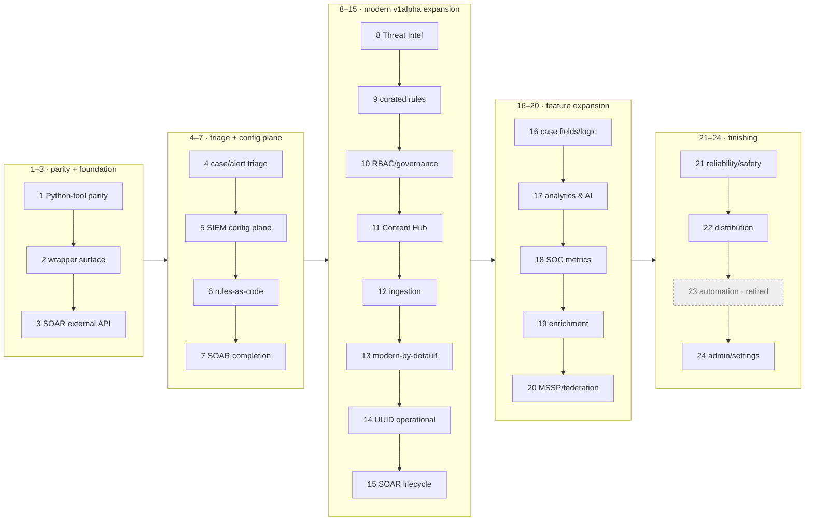

# secopsctl / Go SDK — Roadmap

The **forward plan and wave sequencing** for `secopsctl` (CLI + Go SDK). Build status lives
in [docs/design/catalog.md](docs/design/catalog.md) (this doc doesn't re-track maturity). Guiding
rule: **design cleanly, port the parity slice, then finish the surface** — improving on the wrapper.

> **Scope of this file.** Maintainer **forward plan + recent waves** — NOT an
> agent's operational reading path (use `skills/secopsctl/SKILL.md` + `docs/design/catalog.md`).
> Completed waves are trimmed; full history remains in git.

## 🗺️ Package map

```text
danny.vn/secops
├── auth/         split credentials: OAuth/ADC (SIEM) + AppKey (SOAR)
├── chronicle/    the SIEM SDK (pure API, typed structs, no file I/O)
├── config/       instance config (YAML) load/validate/defaults
├── internal/
│   ├── cli/      cobra command tree (secopsctl)
│   └── mirror/   pull/push file mirroring on top of chronicle
└── cmd/secopsctl main
```

Future SecOps products are **sibling packages** so `chronicle` stays focused — today
that is `danny.vn/secops/soar`. (Third-party EDR and chat/notify are non-goals; see below.)

## 🌊 Wave map

Waves are done **strictly in order** — the number *is* the sequence. Per-surface
maturity is in [docs/design/catalog.md](docs/design/catalog.md); this is the plan's shape.

**Phase groups (text, for agents — the diagram below is the human view):**
P1 (1–3) parity · P2 (4–7) triage + SIEM config · P3 (8–15) modern v1alpha · P4 (16–20) features ·
P5 (21–24) finishing · 25–51 operability/UX · 52–72 triage-loop + AI + dashboards · 73–83 v0.5.0 ·
84–110 v0.5.x · 111–114 v0.6.0 (search + gemini + Phase D rename + Content Hub) ·
115–116 v0.6.x (rules dev-loop + dashboard quality) ·
117–119 v0.7.0 (dashboard authoring + playbook/integration authoring + foundation) ·
120 v0.7.1 (operational polish) · 121 v0.7.2 (case improvements + Gemini reorg + fixes).



---

## Completed waves (1–112)

**120 waves shipped.** Full per-wave history in git (`git log -p -- ROADMAP.md docs/design/roadmap.md`).
Per-surface status is in [docs/design/catalog.md](docs/design/catalog.md).

---

## Recent waves (detail)

> Only the most recent waves are detailed below; older completed waves are in git
> history (`git log -p -- ROADMAP.md docs/design/roadmap.md`).

### Wave 115 — Rules dev-loop + workspace parity: streaming test, MITRE coverage, version diff/restore, duplicate, health roll-up *(built — offline-tested; v0.6.1)*

The **v0.6.1** milestone. Closes the gap between the `rules` command surface and the console's **Rules & Detections** workspace — and sharpens the author→test→ship loop. All reads follow the agent-first output contract (`--format table|json|csv`, `--out`); every write is `--dry-run`-first + `--yes`, etag-honored.

- **Top-level rule surface, organized by source.** **`rules`** = the detections you author (custom); **`curated`** = Google-managed predefined detections. The cross-cutting concerns are top-level, not nested under `rules`: **`exclusions`** (findings refinements filter noise from custom *and* curated detections) and **`mitre`** (ATT&CK coverage aggregates both). `health` stays under `rules` (it rolls up the custom rules you control). This reverts the brief v0.6.0 nesting of `curated`/`exclusions` under `rules`; the `pull`/`push` snake_case target args (`curated`, `rule_exclusions`) are unchanged.
- **`rules get <rule>`** — the current rule in one shot: a running-state header (enabled/alerting/archived, compile + execution state, severity, MITRE, current revision) + the YARA-L; `--text` for the raw source, `--json` for the full rule + deployment. Reads the live rule directly (`GetRule`) without addressing a revision.
- **Streaming `rules test` (headline dev-loop fix).** `rules test` now decodes the `legacy:legacyRunTestRule` chunk stream incrementally — progress percent + detections + compile/runtime errors emitted as they arrive (progress on stderr), instead of buffering the whole window. `--no-stream` keeps the buffered path; `--from`/`--to` set an explicit window alongside `--hours`. The JSON shape is identical on both paths, and a compile or runtime error fails the run (non-zero exit) even under `--json`. The streaming primitive (`chronicle.streamArray`) reads the JSON-array body element-by-element and does not retry the non-idempotent POST.
- **`mitre` — MITRE ATT&CK coverage (top-level).** A per-technique aggregation over custom rules (`metadata.mitre_tactic` / `mitre_technique`) + curated rules' typed tactics/techniques: rule count, involved tactics, and rule ids per technique, plus an `UNMAPPED` bucket for rules with no MITRE meta. `--type custom|curated|all`, `--enabled`/`--alerting` (deployment-authoritative), `--format table|json|csv`, `--out`.
- **`rules versions diff` / `restore`.** Extends the read-only `rules versions` with `diff <rule> <a> <b>` (line-by-line diff of two revisions; each ref a 1-based index or a `v_…` token via `GetRuleRevision` → `rules/{id}@{version}`) and the guarded `restore <rule> <version>` (re-applies a prior revision's text as a NEW revision, etag round-tripped). The `versions` parent now resolves an id/name/slug like its sibling verbs.
- **`rules duplicate <rule> [--name]`.** Guarded clone of a rule's YARA-L under a new name token, created DISABLED; refuses a name collision; re-`pull rules` to mirror the clone.
- **`rules health` — detections-health roll-up.** Classifies every rule failing/erroring/silent/healthy (worst-first) from compile state + deployment execution state + detection volume/last-detection over `--hours`. Composes `ListRules` + `ListRuleDeployments` + `GetRulesTrends`, no new endpoint; `--only`, `--format`, `--out`.
- **Enriched `Rule` model (FULL view).** Parses `metadata` (mitre_tactic/technique/priority/data_source/description), `author`, `runFrequency`, `liveModeEnabled`, `alertingEnabled`, `compilationState`, `revisionId`, `createTime`, `inputsUsed`, plus `MitreTactics()`/`MitreTechniques()` accessors that split on commas/semicolons only (multi-word names stay intact).
- **Deferred to a follow-up:** per-rule **data-scope** (the console Scope selector) and **tags** (*Manage Tags*) — both need the backing write surface captured from the console first; neither is a field on the rule resource.

**Docs:** catalog-siem (`rules`/`curated` rows), cli-naming (top-level rule split), GLOSSARY, SKILL command map.

### Wave 116 — Dashboard quality: lint, fix, and chart inspection *(built — offline-tested)*

Quality-of-life tooling for dashboard chart hygiene — automating the inspect → diagnose → fix cycle that is manual in the console.

- **`dashboards lint <dashboard>`** — static analysis of every chart. Checks: (1) "none" legend on single-series charts (`legends` array with `groupingType: Off` where the query has a single `match:` variable — the console renders "none" as the legend label), (2) long axis labels (email addresses / FQDNs without `re.capture()` truncation — unreadable when >30 chars), (3) per-chart time range out of sync with the dashboard's global time filter (`input.relativeTime` on the query vs the dashboard `filters[].fieldValues`), (4) missing chart title or description, (5) overlapping grid positions. Reports findings per chart as a table; `--format json` for machine consumption. Read-only — no API writes.
- **`dashboards fix <dashboard>`** — auto-fix for the lint findings that have a mechanical remedy. `--strip-domain` wraps email-address match variables in `re.capture(…, "^([^@]+)")` to drop the `@domain` suffix from chart labels. `--no-legend` removes the `legends` array from single-series chart visualizations. `--sync-time` aligns per-chart query time ranges with the dashboard's global time filter. `--dry-run` (default) previews the edits; `--yes` applies via `:editChart`. Each fix re-reads the chart first (etag-safe).
- **`dashboards inspect <dashboard> [--chart-id ID]`** — raw chart debugging: prints the visualization JSON, query body, layout position, and data-source binding for one or all charts. Diagnostic complement to `export` — shows the live server state of individual charts without the full export envelope; `--format json` for the raw API shape.
- **Chart-type coverage (4 → 9).** The builder (`add-chart --chart-type`) extends to all 9 console chart types: **AREA, GAUGE, MAP, METRICS, SCATTER** join the existing BAR, LINE, PIE, TABLE. The visualization shape for each type follows the console's own encoding (gauge ranges, map lat/lon/plot-mode, metrics trend/format, scatter set-ranges).

**Docs:** catalog-siem (`dashboards` row), dashboard guide.

### Wave 117 — Dashboard: full authoring surface *(built — offline-tested)*

Completes the dashboard authoring surface: create, metadata editing, all three tile types (chart/markdown/button), grid layout management, global time filter, and a restructured command tree.

- **Command restructure.** Chart ops move under `dashboards charts` subgroup (list, get, add, batch, edit, remove, run) — cleaner hierarchy; top-level `dashboards` gains `create`, `get`, and `edit`.
- **`dashboards create`.** Create an empty CUSTOM dashboard: `--name`, `--access public|private`, `--description`.
- **`dashboards get <id>`.** Dashboard summary: name, description, type, access, chart count, time filter, etag, timestamps.
- **`dashboards edit <id>`.** Guarded metadata patch: `--name`, `--description`, `--access`. SDK `DashboardUpdate.Access` field added.
- **`dashboards charts get <chart-id>`.** Single-chart detail: visualization, query body, input, layout.
- **`dashboards markdown add/edit/remove`.** Markdown tile authoring via `TILE_TYPE_MARKDOWN`. Content from `--text`/`--text-file`, optional `--background-color`. Edit preserves existing fields when only one flag changes.
- **`dashboards button add/edit/remove`.** Button tile authoring via `TILE_TYPE_BUTTON`. `--label`, `--url`, `--style filled|outlined|transparent`, `--color`, `--new-tab`. Edit reads current state and merges only changed fields.
- **`dashboards layout show <id>`.** Grid map of all widgets: id, type (CHART/MARKDOWN/BUTTON), X, Y, width, height, title — sorted top-to-bottom, left-to-right.
- **`dashboards layout move <id> --widget-id <w>`.** Partial reposition: only `--x`/`--y`/`--span-x`/`--span-y` flags you pass are changed.
- **`dashboards filters show/set`.** Show current filters; set the global time range (`--time <N> --unit HOUR|DAY|WEEK|MONTH`), preserving advanced filters.

**Docs:** catalog-siem (`dashboards` row), reference-siem (command table), SKILL (command map + layout guide + button/filter examples).

### Wave 118 — Playbook & integration authoring suite *(built — offline-tested; v0.7.0)*

Brings the SOAR playbook and integration surfaces to the same authoring-quality bar as dashboards and rules: discover, inspect, lint, diff, health, and operate.

- **`playbooks get <name|uuid>`.** Rich single-playbook detail: type, trigger, step breakdown (action/condition/block counts), integration dependencies, block references, environments, creator, version — in one shot. `--json` returns the full round-trippable definition.
- **`playbooks list` enriched.** New columns: TYPE (Regular/Nested); new flags: `--search`, `--category`, `--sort` (name|type|category|enabled), `--desc`.
- **`playbooks lint (--name | --all)`.** Static analysis across playbook definitions: broken block refs (step references a nested playbook that doesn't exist), missing integration instances, raw placeholders inside JSON action params, whitespace-poisoned trigger conditions.
- **`playbooks health [--hours N]`.** Fleet health roll-up: per-playbook run stats across a time window, sorted by failure rate (worst first). Composes the existing stats API across all enabled playbooks.
- **`playbooks diff <name|uuid> <local-file>`.** Unified diff of live vs local playbook definition (canonicalized JSON). Pre-push review for drift detection.
- **`playbooks duplicate <name|uuid> --name <new>`.** Guarded clone via `DuplicateWorkflow`.
- **`integrations get <identifier>`.** Rich integration detail: display name, version (with update-available flag), certified/custom status, capabilities (actions/jobs), all configured instances across environments, and which playbooks use each instance.
- **`cases simulation create` — `--event-field` / `--alert-field`.** Repeatable `key=value` flags that map to the `additionalEventFields` / `additionalAlertFields` arrays.
- **`integrations test <identifier>`.** Connectivity test for an integration instance; reports PASS/FAIL with the error message. `--instance <id>` tests a specific instance (default: first configured).
- **`simulation export <name>` / `simulation import <file>`.** Round-trip custom simulation definitions as JSON for version control or cross-tenant migration. Import is guarded (dry-run/--yes).
- **`push rules-create` deploy retry.** The inline deploy after rule creation retries with exponential backoff (100/200/400ms) to handle indexing lag on freshly-created rules.
- **Playbook run/rerun error translation.** Detects SOAR 500 on completed-case workflows and translates to actionable guidance ("case workflow already completed — use simulation or a new case").
- **Playbook save error translation.** Detects SOAR 400 "refresh the screen" and translates to "local file based on a superseded version — re-export first".
- **Reserved-word list in `charts add --help`.** Documents the full set of YARA-L keywords that compile but 400 at execute time.
- **Reserved-word error reframe.** `dashboards verify` rewrites "no viable alternative" 400s into actionable "reserved-word variable $X — rename it" messages.

**Docs:** catalog, SKILL command map, reference-siem/soar.

### Wave 119 — v0.7.0 foundation: SDK splits, test gating, CLI tree, agent guide *(built — offline-tested)*

Structural release making the SDK, CLI, and docs solid enough that future versions add features without reorganization drag.

- **10 oversized SDK files split.** Every Go source file over 400 lines split into focused siblings (same package, no API changes). `chronicle/`: dashboards_write→+dashboards_charts, entity→+entity_ioc, datatables_write→+datatables_import, case→+case_actions, alert→+alert_feedback, ti→+ti_iocs, client→+client_paginate, log_search→+log_search_raw. `soar/`: integrations→+integrations_catalog. `soar/legacy/`: playbook_builder→+playbook_coerce. 0 grandfathered oversize files remain.
- **Test gating standardized.** Shared `testclient_live_test.go` in `chronicle/` and `soar/` packages with `liveChronicle(t)` / `liveClient(t)` helpers; double-gated on `testing.Short()` + `SECOPS_*_SMOKE` env. `go test ./...` always passes offline.
- **CLI tree: `playbooks` and `integrations` promoted to top-level.** `soar playbooks *` → `playbooks *` (~35 commands); `soar integrations *` → `integrations *` (~15 commands). Hard renames, no aliases — old paths error cleanly. `soar` drops to ~65 commands (operational: pull/push, jobs, connector, audit, settings, users, legacy, ide).
- **SDK gap-fill (Phase 12).** New `soar/` methods: wildcard integration-instances listing, filtered integrations, users collection (list/get/filter/localization), playbook execution cards + instance detail, environment action definitions, playbook categories/menu/permissions, connector/job executeTest, `generateSoarAuthJwt` (SDK-only).
- **Agent guide.** CLAUDE.md §6: SDK method template (decision tree, struct+Raw+UnmarshalJSON pattern), CLI command template (registration, preferModern, guard), gates checklist.

**Docs:** catalog, SKILL command map, CLAUDE.md §6.

### Wave 120 — v0.7.1 operational polish *(built — offline-tested)*

Operational polish, playbook/integration management, and an enum reference.

- **Value-pattern redaction removed.** The `.secopsctl-redact` file and `--redact` flag are gone — inline values (e.g. webhook URLs) are no longer masked on `soar pull`. `soar push playbooks` now round-trips cleanly without restoring redacted values first. Key-name credential redaction for feeds (password, apiKey, token, etc.) is unchanged.
- **`playbooks duplicate` three-tier fallback.** Modern v1alpha `DuplicateWorkflows` as primary (auto-creates copy, renames to `--name`); legacy `DuplicateWorkflow` on modern failure; export → rename → save on legacy 500. New options: `--folder` (target category) and `--env` (override environments).
- **`playbooks categories` CRUD.** `list`, `create`, `rename`, `delete` — full folder management. Also aliased as `playbooks folders`.
- **`playbooks move`** — move a playbook to a different category by name or id.
- **`playbooks deploy` silent enum fallback.** Imported playbooks carry numeric enum fields that the modern v1alpha `SaveWorkflowDefinitions` rejects with HTTP 400. The deploy command now detects this specific error and falls back to the legacy path silently.
- **`integrations rename`** — rename an integration instance's displayName via v1alpha PATCH with updateMask. Resolves by `--instance <uuid>` or `--env <env>`. System default instances (server-managed) cannot be renamed (API returns 400).
- **`integrations list --instances`** — shows configured instances nested under each pack with environment and display name. Non-system instances tagged `[renamable]`.
- **`status enums` — SOAR enum reference.** Lists every SDK-defined enum (CasePriority, CloseReason, SLA types, BlockList types/scopes) with integer-to-name mappings. `--live` adds instance-specific values: case stages and playbook categories. SDK: new `GetMetadata`, `CloneWorkflow`, `DuplicateWorkflows`, `UpdateIntegrationInstance` methods.
- **Playbook ZIP bundle format documented** in the SKILL guide.
- **SDK fix:** `IntegrationInstance.IntegrationIdentifier` field name corrected (was `IntegrationName`, didn't match the JSON). Added `SystemDefault` field.

**Docs:** catalog, SKILL (ZIP format + command map).

### Wave 121 — v0.7.2 case improvements, Gemini reorg, operational fixes *(built)*

Case operational verbs, AI command consolidation, and operational fixes.

- **`playbooks summary` rewrite.** Switch from the broken `GetWorkflowInstanceSummary` to the two-call pattern (`GetWorkflowInstancesCards` → `GetWorkflowInstance`). Fixes 500 on multi-alert/closed cases.
- **`cases list --filter` syntax validation.** Client-side validation rejects OData-style operators (`eq`, `ne`) with guidance on the SQL-style syntax the v1alpha API uses.
- **`WorkflowsStatus` enum.** Added to `status enums` (SDK type + CLI display, values 0–7) and the `WorkflowStatus` typed enum to the SDK.
- **`alerts list --json` fix.** Switched to streaming per-alert output to avoid large-buffer truncation.
- **Gemini command reorg.** All AI features under the `gemini` group: `generate-query` (was `generate`), `search`, `ask`, `investigate`, `summarize`, `generate` (playbook). Hidden backward-compat aliases at old locations. `search generate-query` alias added.
- **`cases incident`** — mark/unmark a case as incident (`--unset` to clear).
- **`cases report`** — export a case report (PDF/DOC/DOCX/XLSX/CSV/HTML; `--out` saves to file).
- **Version "unknown" fix.** `version`/`doctor` omit commit info for non-git installs.
- **Internal: `redact.go` → `secret_strip.go`.** Renamed credential-scrubbing helper to `stripSecrets()`.
- **Transport: `ExternalBytes`** — raw-bytes response path for binary endpoints (reports).

- **Docs overhaul.** Fixed `gemini generate` → `gemini generate-query` across 7 files; shortened verbose headings in surfaces/cli-naming/soar design docs; expanded rules/playbooks/soar-cases guides with missing commands (15+ rule verbs, 17 case verbs, playbook inspect/folder sections); fixed stale status rows (data-access, alert act verbs); cleaned docsify layout (removed Jekyll, streamlined CSS).

---

## Non-goals

- No bundled tenant identifiers, rule names, or secrets — ever (tenant-neutral, pre-commit leak guard `.githooks/pre-commit` enforces it); no third-party EDR or chat/notification integrations.
- No silent overwrite of concurrent edits (honor etag, surface conflicts); `push` is never non-interactive-by-default — dry-run first, explicit `--yes`.
