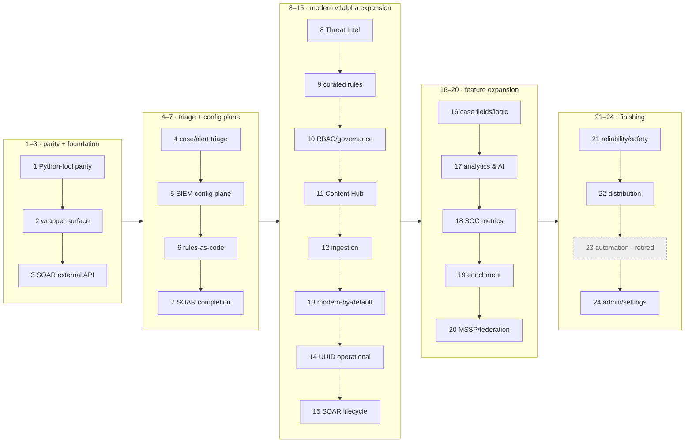

# secopsctl / Go SDK — Roadmap

The **forward plan and wave sequencing** for `secopsctl` (CLI + Go SDK). Live
build/validation status lives in [docs/design/catalog.md](docs/design/catalog.md)
— this doc does not re-track maturity (it would drift). Guiding rule: **design
cleanly, port the parity slice first, then finish the surface**, improving on the
official Python wrapper where it is weak (see the `// DEVIATION:` markers in code).

> **Scope of this file.** This is the maintainer **forward plan + a milestone-level
> wave digest** — it is NOT on an agent's operational reading path (use
> `skills/secopsctl/SKILL.md` + `docs/design/catalog.md` for that). The full
> wave-by-wave build history (waves 1–72) was trimmed on 2026-06-25 to keep this
> readable; every detail remains in git history (`git log -- docs/design/roadmap.md`).

## 🗺️ Package map

```text
danny.vn/secops
├── auth/         split credentials: OAuth/ADC (SIEM) + API key/AppKey (SOAR, key-auth)
├── chronicle/    the SIEM SDK (pure API, typed structs, no file I/O)
├── config/       instance config (YAML) load/validate/defaults
├── internal/
│   ├── cli/      cobra command tree (secopsctl)
│   └── mirror/   pull/push file mirroring on top of chronicle
└── cmd/secopsctl main
```

Future SecOps products are **sibling packages** so `chronicle` stays focused —
today that is `danny.vn/secops/soar`. (Third-party EDR and chat/notification
integrations are explicit non-goals; see below.)

## 🌊 Wave map

Waves are done **strictly in order** — the number *is* the sequence. Per-surface
maturity is in [docs/design/catalog.md](docs/design/catalog.md); this is the shape
of the plan.

**Phase groups (text, for agents — the diagram below is the human view):**
P1 (waves 1–3) parity + foundation · P2 (4–7) triage + SIEM config plane ·
P3 (8–15) modern v1alpha expansion · P4 (16–20) feature expansion ·
P5 (21–24) finishing · then 25–51 operability/UX/coverage · 52–72 triage-loop +
AI layer + dashboards · **73–83 v0.5.0 operator-experience & agent-enablement**.



---

## Waves 1–72 — milestone digest (done; full history in git)

**83 waves shipped to date.** Waves 1–72 are summarized per milestone below; the
detailed per-wave build log lived in `docs/design/roadmap.md` until 2026-06-25 and
remains in git history. Per-surface live status is in
[docs/design/catalog.md](docs/design/catalog.md).

| Waves | Milestone | What landed |
|---|---|---|
| 1–3 | Parity + foundation | Feature-parity with the legacy Python tool; the `secops-wrapper` surface as typed `chronicle/*` SDK; the SOAR external-API (`/api/external/v1`, AppKey) tier + reconcile engine. |
| 4–7 | Triage + config plane | Case/alert triage on the reliable SOAR lane; SIEM config-as-code (`data_tables`/`feeds`/`parsers`/`dashboards`/`curated`) on the reconcile engine; full rule lifecycle; SOAR completion (connectors/jobs/ontology). |
| 8–15 | Modern v1alpha expansion | Threat Intel reads; curated-rules-as-code; SIEM RBAC/governance; Content Hub (SOAR host); ingestion (forwarders/schemas); modern-by-default with `--legacy` fallback; Chronicle UUID operational; SOAR v1alpha lifecycle. |
| 16–20 | Feature expansion | Case fields/logic (customFields/calc); flagship analytics & AI reads; SOC metrics + scheduled reports; enrichment & ingestion governance (dataTaps/errorNotifs); MSSP/federation. |
| 21–24 | Finishing | Reliability/safety (drift mode, request-ids); distribution (CI, goreleaser, completions); automation retired (SOAR owns it); admin/settings (API-key metadata). |
| 25–51 | Operability, UX & coverage | Exit codes + machine-readable `--json`; self-describing `surfaces`/`commands`; SIEM/SOAR triage-UX; detection-state + curated reconcile; SOAR automation-as-code; parser-dev loop + raw-log access; imperative feed delete; SOAR integration/playbook lifecycle; rule-inspection id resolution; case action exec + simulation harness; case chat; parser extensions; log-processing pipelines; Content Hub deploy; system info + case enrichment; audit/notifications/reporting; pull-mirror accuracy; batch playbook delete. |
| 52–72 | Triage-loop + AI + dashboards | Triage-loop closure (alert disposition, id bridges, per-alert verbs, queue filters); agent safety (read-only mode, audit log, command catalog); rule-tuning reads; the AI layer (case summaries, recommendations, Gemini chat, findings graph); per-alert AI investigation; the playbook authoring palette; case queue counts + filter grammar; definition authoring + API-key lifecycle; v0.3.0/0.4.x release readiness; per-command `--json`; typed step insertion; IDE PATCH-by-id; CLI UX polish; one shared HTTP transport; deploy field-masking + grouping reconcile; dashboard chart authoring (`:addChart`/`:editChart`) + inline round-trip (`--with-charts`). |

---

## v0.5.0 — operator-experience & agent-enablement milestone (Waves 73–83)

A refinement milestone surfaced by dogfooding the daily operator loops (query,
alert triage, case work, curated/custom rule tuning, dashboards, SOAR playbooks)
and by driving the CLI from an autonomous agent. These are mostly polish on top of
a tool that already does the job: discoverability and machine-readability for
agents, triage-at-scale ergonomics, deploy-preview honesty, and closing the last
config-as-code fidelity edges. Each wave names its plane and stays dry-run-first
and tenant-neutral; every live mutation remains gated.

**Dashboard authoring & verification extension (Waves 81–83, planned).** A second
pass over the daily chart-authoring loop surfaced that the loop has no *verify*
half and little authoring ergonomics: an aggregation (`match:`/`outcome:`) query
can't be run from the CLI, a chart's rendered VALUES can't be read back, a typed
chart needs hand-written echarts JSON, and a whole-dashboard build trips the
per-minute quota. The underlying APIs already exist — `chronicle.GetStats` and
`ExecuteQuery` (`dashboardQueries:execute`) are in the SDK — so these are largely
CLI-surface waves. Waves 73–83 are built and offline-tested; the live paths stay gated.

**As-built notes (where the live API constrained the design).** A few items
landed in the most faithful form the API allows rather than the literal ask:
`alerts list` has no server cursor (the alerts API is a polling snapshot), so
Wave 76 surfaces a completeness signal — baseline count + a truncation warning —
instead of a fake page token. A curated rule-set's rule roster is not exposed by
the API, so Wave 78's `curated set` preview shows the deployment's current →
requested state and the set×precision scope rather than a literal rule count.
Wave 79's chart layout/reorder PATCH is guarded to run only when every chart
already has a resolved id, so a just-added chart can never be dropped. Wave 80's
grouping settings land as a guarded imperative `soar settings grouping get/set`
over the modern moduleSettings bag (the singleton has no reconcile id/list/delete).

Two items raised against earlier behavior are already closed and only need a
regression guard, not new work — they are folded into Wave 80:

- **Leaf-command `--help`** already resolves to each verb's own usage and flags
  (group and leaf both correct). A tree-walking guard test pins it so a future
  cobra-wiring change can't regress per-verb help.
- **Round-trippable playbook export** already emits the camelCase / string-enum
  pull shape and re-saves through `soar push playbook` (Wave 68, live-validated);
  the single-playbook edit loop works as documented.

### Wave 73 — Agent enablement: machine-readable CLI schema, capability probe, structured errors & plan *(built — offline-tested)*

- **Goal.** Make the tool's own surface machine-discoverable so a scripted or
  LLM-driven operator reads ground truth instead of inferring flags — the
  highest-accuracy-per-effort lift for unattended use.
- **Scope.**
  - **Full CLI schema** — extend `secopsctl commands --json` (and/or a dedicated
    `secopsctl schema --json`) so every leaf carries, beyond today's path / kind /
    flag-name list: per-flag **type, default, required, and enum values**,
    positional args, and a one-line example. Built from the cobra tree at runtime
    (no hand-maintained list), so it can never drift from the binary.
  - **Capability probe** — one `secopsctl capabilities --json` that fuses
    `surfaces` + `doctor` + `commands`: tool version, per-surface maturity
    (`validated` / `built` / `designed` / `blocked`), auth health per plane (SIEM
    ADC vs SOAR AppKey), and read-only state — a single session-bootstrap call so
    an agent self-configures what it can do on the instance and avoids
    known-blocked paths automatically.
  - **Structured errors** — a stable error envelope (`{code, message, retryable,
    request_id}`) on `--json` output across planes, so a caller branches on a
    field instead of regexing a prose line; builds on the existing
    `*APIError` / SOAR `Error` request-id surfacing.
  - **Inspectable dry-run plan** — a `--json` dry-run that returns the structured
    change plan (per object: create/update/delete, fields changing, and blast
    radius such as "set contains N rules") so a mutation can be reasoned about
    before `--yes`; extends the existing `push --json` `would_change` reporting to
    the full per-object plan and pairs with the Wave 77 blast-radius preview.
  - **Universal `--json`** — audit every read for `--json` coverage and converge
    on one top-level envelope (`{data, nextPageToken, warnings}`).
- **Exit.** `commands`/`schema --json` carry full per-flag detail; `capabilities
  --json` answers in one call; errors and dry-run plans are structured on
  `--json`; an invariant test pins the schema shape against the live tree.
- **Docs.** ARCHITECTURE, SURFACES, usage guide, LLM & automation tips, CATALOG.

### Wave 74 — Ship the `secopsctl` Claude Code skill in-repo *(built)*

- **Goal.** Encode the operating model the per-command help can't, and version it
  with the binary so an agent inherits accurate guidance instead of drifting from
  the real command surface.
- **Scope.** A repo-tracked skill (`SKILL.md` + any helper assets) that captures:
  the two auth planes (ADC SIEM vs AppKey SOAR) and which commands need which; the
  **dry-run → review → `--yes`** mutation ritual and read-only mode; the
  pull → `git diff` → push source-of-truth loop; and the standing gotchas (ADC
  reauth, curated set × precision, playbook UUID re-resolve after save). It points
  at the Wave 73 `capabilities`/`schema --json` outputs as the live source of
  truth so prose can't go stale. Tenant-neutral — no bundled identifiers.
- **Exit.** The skill ships in the repo, references the machine-readable surface,
  and is listed in the docs index / site nav.
- **Docs.** README, docs index, site left-nav, ROADMAP.

### Wave 75 — Query library & saved queries *(built — SIEM)*

- **Goal.** Make the UDM/raw predicates an operator re-types daily
  version-controlled and runnable by name, so detection evidence pivots are
  copy-pasteable and reviewable rather than living in shell history.
- **Scope.** `query run --file <q.udm>` / `-` (stdin) to run a predicate from a
  file, and a repo-tracked named-query pack the CLI can run by name (e.g.
  `query saved <name>`) resolved from a mirror directory under the data root.
  Composes with the existing `query udm` / `raw` / `nl` kinds and `--json`.
  Example query files extend the `examples/queries/` set.
- **Exit.** A predicate runs from a file and by name; the pack lives under the
  data root and round-trips through git.
- **Docs.** SIEM-DESIGN, usage guide, CATALOG.

### Wave 76 — Alert triage at scale: completeness signal + bulk update from a filter *(built — SIEM; live paths gated)*

- **Goal.** Turn `alerts` from a snapshot + per-id workflow into a complete,
  reconcilable triage loop over a window.
- **Scope.**
  - **Paged feed** — `alerts list` gains a stable, paged enumeration over a window
    (cursor / `nextPageToken` + a total count) so an operator knows the view is
    complete and can reconcile "alerts seen today" against cases worked, instead of
    a capped snapshot.
  - **Bulk disposition from a filter** — a guarded `alerts update --where <filter>`
    (and/or `alerts list --json | … | alerts update --stdin-ids`) so a known
    false-positive burst closes in one reviewed, dry-run-able command instead of N
    per-id calls. Reuses the typed `AlertUpdate.Validate` client-side check before
    the guard.
- **Exit.** `alerts list` pages with a total; bulk update from a filter is
  dry-run-first and gated; both live-read-validated.
- **Docs.** SIEM-DESIGN, usage guide, CATALOG.

### Wave 77 — Case-path hygiene + bulk close from a query *(built — SOAR + SIEM; live paths gated)*

- **Goal.** Remove a dead/trap surface and finish the case-hygiene automation on
  the reliable lane.
- **Scope.**
  - **Hide the blocked Chronicle-host case path** — the top-level `cases` command
    (Chronicle UUID host) 500s today and the reliable path is `soar case`. Mark it
    hidden/deprecated (kept functional for when the endpoint stabilizes, but off the
    default surface listing) so it stops reading as a usable surface and stops
    trapping anyone who finds it before `soar case`. `surfaces` already reports it
    `blocked`; this aligns the CLI to that.
  - **Bulk close from a query** — promote `soar bulk-close` from `built` to
    `validated` against the live close-reason and root-cause taxonomy, and add a
    guarded `soar case` primitive that closes a *filtered set* with a typed
    close-reason + root-cause + comment in one reviewed command — the native home
    for stale/duplicate case-hygiene logic.
- **Exit.** `cases` no longer surfaces as usable; a filtered set closes with a
  typed reason in one guarded command, live-validated on throwaway cases.
- **Docs.** SOAR-DESIGN, SURFACES (cases-blocked disposition), usage guide, CATALOG.

### Wave 78 — Deploy confidence: blast-radius preview, rule promote, field-masked-deploy live-validation *(built — SIEM; field-mask live-validation pending)*

- **Goal.** Make detection-deployment previews tell the operator (and an agent)
  exactly what a `--yes` will do, and shorten the common ship path.
- **Scope.**
  - **Curated blast radius** — `curated set --dry-run` prints, from the same data
    `curated trends` already has, "this set contains N rules; M currently firing /
    7d" so the blast radius of a set × precision toggle is visible before `--yes`
    (the per-rule control is a platform limit, not the tool's — the preview is the
    mitigation). Feeds the Wave 73 structured-plan blast-radius field.
  - **Rule promote** — a guarded `rules promote <file> --enabled --alerting` that
    runs create → deploy behind one dry-run preview, matching how a rule is
    actually shipped (the create/deploy split stays available).
  - **Field-masked deploy — live-validate.** The field-masked `push rules-deploy`
    (an alerting-only flip sends `alerting` alone; a residual `409 already
    enabled/disabled` is reported as *already in desired state*, not FAILED) is
    built and offline-tested (Wave 68). Promote it to live-validated by an
    approved gated write-smoke (flip a throwaway rule's `alerting` only → apply →
    confirm the summary reports success and `pull` matches), so the truthful
    summary is proven end-to-end on the daily action.
- **Exit.** Toggle/deploy dry-runs show blast radius and exact deploy state;
  `rules promote` works in one guarded step; the field-masked deploy summary is
  live-validated.
- **Docs.** SIEM-DESIGN, usage guide, CATALOG.

### Wave 79 — Dashboard reconcile completion: schema-checked dry-run, chart layout/reorder/removal reconcile, degraded-pull visibility *(built — SIEM; live paths gated)*

- **Goal.** Make a dashboard's full visual state config-as-code, and make the
  dry-run preview a real safety guarantee.
- **Scope.**
  - **Schema-checked dry-run** — `push dashboards --dry-run` validates the payload
    against the API schema (not just display-name diffing), so a body the API will
    reject at `--yes` shows as a problem in the preview rather than a clean
    `+1 create`. Generalize the up-front JSON-flag validation `dashboards add-chart`
    already does to the reconcile path.
  - **Apply chart layout / reorder / removal** — reconcile chart
    layout/filters/datasource edits, reordering, and removal through `push`
    (the `definition.charts` ChartConfig PATCH with resolved ids), so a dashboard's
    *visual* state is config-as-code, not just its queries. Today these are diffed
    and reported but applied via the UI or `dashboards remove-chart`; this closes
    the one open round-trip edge from Wave 72.
  - **Degraded-pull visibility** — `pull dashboards --with-charts` already degrades
    a chart that 404s/429s to a reference so nothing is lost; surface the **count of
    charts that degraded** loudly in the pull summary (not just absent) so a
    partially reference-only mirror is known before a later `drift`.
- **Exit.** Dry-run rejects an API-invalid body; chart layout/reorder/removal
  reconcile through `push`; the degraded-chart count is reported; live-validated on
  a throwaway dashboard.
- **Docs.** SIEM-DESIGN, SURFACES, `tips/06-dashboards`, usage guide, CATALOG.

### Wave 80 — SOAR fidelity + v0.5.0 release readiness *(built — SOAR; live paths gated)*

- **Goal.** Close the remaining SOAR config-as-code fidelity edges and cut the
  release.
- **Scope.**
  - **Playbook secret handling — live-validate + credential references.** The
    pull-time redaction (`.secopsctl-redact` / `--redact`, Wave 68) keeps an inline
    secret-valued step param out of the mirror; live-validate it on a `soar pull
    playbooks` round-trip (masked on write, drift-safe, push marker-guarded). Add
    first-class support for referencing a SOAR secret/credential in an HTTP action
    so the value is never inline in the first place — the cleaner alternative the
    redaction backstops.
  - **Alert-grouping settings push.** `soar push grouping` reconciles the *rules*
    (Wave 68/72) and `pull grouping` snapshots the General/Overflow **settings
    singleton** read-only; extend the push path to reconcile that singleton —
    Timeframe, group-entities / source-grouping-identifiers, and the Overflow
    section — under the same dry-run / `--yes` guard, so the tuning knobs join the
    mirror == live loop.
  - **Release readiness.** Regression guards for the two already-closed items
    (a tree-walk test pinning per-verb `--help`; the export round-trip already
    pinned); `CHANGELOG.md` v0.5.0 notes; a docs/catalog/surfaces sweep so every
    new verb and surface row is tenant-neutral and accurate; cut the signed
    `v0.5.0` tag (gated — no `git push` without confirmation).
- **Exit.** Playbook secrets stay out of the mirror (validated) with a
  credential-reference path; alert-grouping settings reconcile; regression guards
  green; v0.5.0 tagged.
- **Docs.** SOAR-DESIGN, SURFACES, CHANGELOG, README, CATALOG.

### Wave 81 — Query aggregation/stats + interspersed flags *(done — SIEM; live read-validated)*

- **Goal.** Run a stats/aggregation YARA-L query from the terminal, and make flag
  position not matter — so a chart query can be validated before it is authored.
- **Scope.**
  - **`query stats '<aggregation YARA-L>'`** (or `query udm --stats`) — `query udm`
    is an event search and rejects a `match:`/`outcome:` aggregation with a 400;
    this posts the aggregation to the stats API and prints the computed rows /
    series (`--json` for the raw result). The SDK already carries `chronicle.GetStats`
    and `ExecuteQuery` (`dashboardQueries:execute`) — this is the CLI surface that
    lets the exact YARA-L a dashboard chart uses be run end to end first.
  - **Interspersed flags** — `--hours` / `--from` / `--to` / `--limit` / `--raw` /
    `--json` parse whether they precede OR follow the positional query
    (`Flags().SetInterspersed(true)`), instead of `query udm '<q>' --hours 24`
    failing with `unknown flag`.
- **Exit.** An aggregation query runs from the CLI and returns its rows; flags work
  in any position; offline-tested + live read-validated.
- **Docs.** SIEM-DESIGN, usage guide, CATALOG.

### Wave 82 — Dashboard chart execution & verification *(done — SIEM; live-validated)*

- **Goal.** Read what a chart actually renders — the missing *verify* half of
  config-as-code dashboard authoring — from the CLI/CI, not the UI.
- **Scope.**
  - **`dashboards run-chart <dashboard-id> --chart-id <c>`** (alias `values`) —
    dereference the chart to its query and execute it (`ExecuteQuery` /
    `dashboardQueries:execute`), printing the computed rows / series: legend
    labels, axis categories, series values. `--json` for the raw result,
    `--clear-cache`, optional `--filter`.
  - **`dashboards verify <dashboard-id>`** — execute every chart and flag the ones
    returning **0 rows or an error**: a headless, CI-runnable dashboard health
    check (which chart on a dashboard is blank or broken).
  - Shares the execute path with Wave 81 (a free-form `DashboardQuery.query` runs
    without a saved chart). `ExecuteQuery` already exists in the SDK; this is CLI
    wiring plus a chart-scoped (deref → execute) variant.
- **Exit.** A chart's values print from the CLI; `verify` flags empty/errored
  charts; live read-validated.
- **Docs.** SIEM-DESIGN, SURFACES, usage guide, CATALOG.

### Wave 83 — Chart authoring ergonomics & safe bulk authoring *(done — SIEM; live-validated via TestLiveDashboardsAuthoringSmoke)*

- **Goal.** Author real typed charts without hand-writing the echarts
  `visualization` JSON, and build a whole dashboard without tripping the
  per-minute quota or duplicating charts on a re-run.
- **Scope.**
  - **Chart-type ergonomics** — `add-chart --chart-type bar|line|pie|table --x
    <var> --y <var> [--series-by <var>]` GENERATES the `visualization` object and
    **validates `--x/--y/--series-by` against the query's declared `match`/`outcome`
    variables** (fail clean up front, like the existing JSON-flag validation),
    closing the silent-blank-chart failure mode where a typo'd encode var renders
    empty. A **default visualization per result shape** (1 dim + 1 measure → bar;
    time + measure → line; ≤6 categories → pie) so a chart is never a silent table.
    **Grouped/stacked series** via `--series-by` (the chart model's `seriesColumn`).
  - **Visualization as config-as-code** — `pull --with-charts` captures the chart's
    `visualization`; `push` reconciles a changed chart type/visualization (extends
    the Wave 79 chart reconcile so chart *type* round-trips, not just the query).
  - **`edit-chart --visualization <json>` / `--layout <json>`** — change a chart's
    type / position IN PLACE via the `:editChart` field-mask
    (`EditChartInput.DashboardChart`), instead of remove + re-add (which churns the
    chart id, grid position, and dashboard order).
  - **Safe bulk authoring** — client-side throttle + retry-with-backoff on 429 for
    the chart write verbs; an `--if-absent` (upsert-by-title) mode on `add-chart`
    so a re-run after a partial failure converges instead of duplicating; and a
    batch author `add-charts --file <charts.json>` that paces writes under the
    quota for a whole-dashboard build.
- **Exit.** A typed chart is authorable without raw echarts JSON and validated
  against its query; a whole-dashboard build survives quota and is rerunnable;
  chart visualization round-trips through pull → push; live-validated on a
  throwaway dashboard.
- **Docs.** SIEM-DESIGN, SURFACES, `tips/06-dashboards`, usage guide, CATALOG.

---

## Non-goals

- No bundled tenant identifiers, rule names, or secrets — ever (tenant-neutral).
  A pre-commit leak guard (`.githooks/pre-commit`) enforces this; when porting
  logic from a private source, bring over only generic, sanitized code.
- No third-party EDR (e.g. SentinelOne) or chat/notification (e.g. Teams)
  integrations — out of this repo's scope.
- No silent overwrite of concurrent edits — honor etag, surface conflicts.
- `push` is never non-interactive-by-default — dry-run first, explicit `--yes`.
