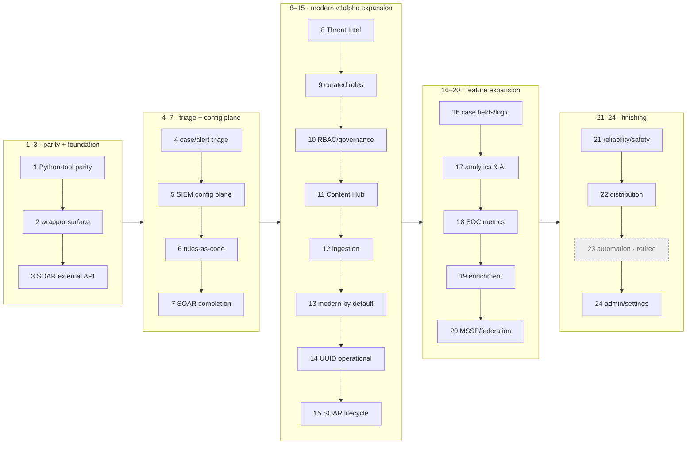

# secopsctl / Go SDK — Roadmap

The **forward plan and wave sequencing** for `secopsctl` (CLI + Go SDK). Live
build/validation status lives in [docs/design/catalog.md](docs/design/catalog.md)
— this doc does not re-track maturity (it would drift). Guiding rule: **design
cleanly, port the parity slice first, then finish the surface**, improving on the
official Python wrapper where it is weak (see the `// DEVIATION:` markers in code).

> **Scope of this file.** This is the maintainer **forward plan + a milestone-level
> wave digest** — it is NOT on an agent's operational reading path (use
> `skills/secopsctl/SKILL.md` + `docs/design/catalog.md` for that). The full
> wave-by-wave build history (waves 1–72) was trimmed on 2026-06-25 to keep this
> readable; every detail remains in git history (`git log -- docs/design/roadmap.md`).

## 🗺️ Package map

```text
danny.vn/secops
├── auth/         split credentials: OAuth/ADC (SIEM) + API key/AppKey (SOAR, key-auth)
├── chronicle/    the SIEM SDK (pure API, typed structs, no file I/O)
├── config/       instance config (YAML) load/validate/defaults
├── internal/
│   ├── cli/      cobra command tree (secopsctl)
│   └── mirror/   pull/push file mirroring on top of chronicle
└── cmd/secopsctl main
```

Future SecOps products are **sibling packages** so `chronicle` stays focused —
today that is `danny.vn/secops/soar`. (Third-party EDR and chat/notification
integrations are explicit non-goals; see below.)

## 🌊 Wave map

Waves are done **strictly in order** — the number *is* the sequence. Per-surface
maturity is in [docs/design/catalog.md](docs/design/catalog.md); this is the shape
of the plan.

**Phase groups (text, for agents — the diagram below is the human view):**
P1 (waves 1–3) parity + foundation · P2 (4–7) triage + SIEM config plane ·
P3 (8–15) modern v1alpha expansion · P4 (16–20) feature expansion ·
P5 (21–24) finishing · then 25–51 operability/UX/coverage · 52–72 triage-loop +
AI layer + dashboards · **73–83 v0.5.0 operator-experience & agent-enablement**.



---

## Waves 1–72 — milestone digest (done; full history in git)

**84 waves shipped to date.** Waves 1–72 are summarized per milestone below; the
detailed per-wave build log lived in `docs/design/roadmap.md` until 2026-06-25 and
remains in git history. Per-surface live status is in
[docs/design/catalog.md](docs/design/catalog.md).

| Waves | Milestone | What landed |
|---|---|---|
| 1–3 | Parity + foundation | Feature-parity with the legacy Python tool; the `secops-wrapper` surface as typed `chronicle/*` SDK; the SOAR external-API (`/api/external/v1`, AppKey) tier + reconcile engine. |
| 4–7 | Triage + config plane | Case/alert triage on the reliable SOAR lane; SIEM config-as-code (`data_tables`/`feeds`/`parsers`/`dashboards`/`curated`) on the reconcile engine; full rule lifecycle; SOAR completion (connectors/jobs/ontology). |
| 8–15 | Modern v1alpha expansion | Threat Intel reads; curated-rules-as-code; SIEM RBAC/governance; Content Hub (SOAR host); ingestion (forwarders/schemas); modern-by-default with `--legacy` fallback; Chronicle UUID operational; SOAR v1alpha lifecycle. |
| 16–20 | Feature expansion | Case fields/logic (customFields/calc); flagship analytics & AI reads; SOC metrics + scheduled reports; enrichment & ingestion governance (dataTaps/errorNotifs); MSSP/federation. |
| 21–24 | Finishing | Reliability/safety (drift mode, request-ids); distribution (CI, goreleaser, completions); automation retired (SOAR owns it); admin/settings (API-key metadata). |
| 25–51 | Operability, UX & coverage | Exit codes + machine-readable `--json`; self-describing `surfaces`/`commands`; SIEM/SOAR triage-UX; detection-state + curated reconcile; SOAR automation-as-code; parser-dev loop + raw-log access; imperative feed delete; SOAR integration/playbook lifecycle; rule-inspection id resolution; case action exec + simulation harness; case chat; parser extensions; log-processing pipelines; Content Hub deploy; system info + case enrichment; audit/notifications/reporting; pull-mirror accuracy; batch playbook delete. |
| 52–72 | Triage-loop + AI + dashboards | Triage-loop closure (alert disposition, id bridges, per-alert verbs, queue filters); agent safety (read-only mode, audit log, command catalog); rule-tuning reads; the AI layer (case summaries, recommendations, Gemini chat, findings graph); per-alert AI investigation; the playbook authoring palette; case queue counts + filter grammar; definition authoring + API-key lifecycle; v0.3.0/0.4.x release readiness; per-command `--json`; typed step insertion; IDE PATCH-by-id; CLI UX polish; one shared HTTP transport; deploy field-masking + grouping reconcile; dashboard chart authoring (`:addChart`/`:editChart`) + inline round-trip (`--with-charts`). |

---

## v0.5.0 — operator-experience & agent-enablement milestone (Waves 73–83)

A refinement milestone surfaced by dogfooding the daily operator loops and driving
the CLI from an autonomous agent — polish on a tool that already does the job:
agent discoverability/machine-readability, triage-at-scale ergonomics,
deploy-preview honesty, and the last config-as-code fidelity edges. Each wave names
its plane, stays dry-run-first and tenant-neutral; every live mutation is gated.

**Dashboard authoring & verification extension (Waves 81–83).** A second pass over
the chart-authoring loop added its missing *verify* half and authoring ergonomics:
run an aggregation query from the CLI, read a chart's rendered VALUES back, generate
a typed chart's viz, and pace a whole-dashboard build under the quota — largely
CLI-surface over SDK APIs that already existed. Waves 73–83 are built and
offline-tested; the live paths stay gated.

**As-built notes (where the live API constrained the design).** A few items landed
in the most faithful form the API allows: `alerts list` has no server cursor (it's a
polling snapshot), so Wave 76 surfaces a completeness signal instead of a fake page
token; a curated rule-set's rule roster isn't exposed, so Wave 78's `curated set`
preview shows current→requested state + the set×precision scope; Wave 79's chart
layout PATCH runs only when every chart has a resolved id; Wave 80's grouping
settings land as a guarded imperative over the moduleSettings bag.

### Wave 73 — Agent enablement: machine-readable CLI schema, capability probe, structured errors & plan *(built — offline-tested)*

Make the tool's own surface machine-discoverable so a scripted or LLM-driven operator reads ground truth instead of inferring flags. `commands`/`schema --json` carry full per-flag detail (type, default, required, enum, positional args, example) built from the cobra tree at runtime; one `capabilities --json` fuses `surfaces` + `doctor` + `commands` (version, per-surface maturity, auth health per plane, read-only state) for a single session-bootstrap call; a stable structured-error envelope (`{code, message, retryable, request_id}`) and a structured `--json` dry-run change plan let callers branch on fields; universal `--json` converges on one `{data, nextPageToken, warnings}` envelope. An invariant test pins the schema shape against the live tree. Docs: ARCHITECTURE, SURFACES, usage, LLM/automation tips, CATALOG.

### Wave 74 — Ship the `secopsctl` Claude Code skill in-repo *(built)*

A repo-tracked skill (`SKILL.md` + assets) encodes the operating model the per-command help can't, versioned with the binary so an agent inherits accurate guidance: the two auth planes (ADC SIEM vs AppKey SOAR), the dry-run → review → `--yes` mutation ritual and read-only mode, the pull → `git diff` → push loop, and the standing gotchas (ADC reauth, curated set × precision, playbook UUID re-resolve after save). It points at the Wave 73 `capabilities`/`schema --json` outputs so prose can't go stale; tenant-neutral. Listed in the docs index / site nav. Docs: README, docs index, site left-nav.

### Wave 75 — Query library & saved queries *(built — SIEM)*

- **Goal.** Make the UDM/raw predicates an operator re-types daily
  version-controlled and runnable by name, so detection evidence pivots are
  copy-pasteable and reviewable rather than living in shell history.
- **Scope.** `query run --file <q.udm>` / `-` (stdin) to run a predicate from a
  file, and a repo-tracked named-query pack the CLI can run by name (e.g.
  `query saved <name>`) resolved from a mirror directory under the data root.
  Composes with the existing `query udm` / `raw` / `nl` kinds and `--json`.
  Example query files extend the `examples/queries/` set.
- **Exit.** A predicate runs from a file and by name; the pack lives under the
  data root and round-trips through git.
- **Docs.** SIEM-DESIGN, usage guide, CATALOG.

### Wave 76 — Alert triage at scale: completeness signal + bulk update from a filter *(built — SIEM; live paths gated)*

- **Goal.** Turn `alerts` from a snapshot + per-id workflow into a complete,
  reconcilable triage loop over a window.
- **Scope.**
  - **Paged feed** — `alerts list` gains a stable, paged enumeration over a window
    (cursor / `nextPageToken` + a total count) so an operator knows the view is
    complete and can reconcile "alerts seen today" against cases worked, instead of
    a capped snapshot.
  - **Bulk disposition from a filter** — a guarded `alerts update --where <filter>`
    (and/or `alerts list --json | … | alerts update --stdin-ids`) so a known
    false-positive burst closes in one reviewed, dry-run-able command instead of N
    per-id calls. Reuses the typed `AlertUpdate.Validate` client-side check before
    the guard.
- **Exit.** `alerts list` pages with a total; bulk update from a filter is
  dry-run-first and gated; both live-read-validated.
- **Docs.** SIEM-DESIGN, usage guide, CATALOG.

### Wave 77 — Case-path hygiene + bulk close from a query *(built — SOAR + SIEM; live paths gated)*

- **Goal.** Remove a dead/trap surface and finish the case-hygiene automation on
  the reliable lane.
- **Scope.**
  - **Hide the blocked Chronicle-host case path** — the top-level `cases` command
    (Chronicle UUID host) 500s today and the reliable path is `soar case`. Mark it
    hidden/deprecated (kept functional for when the endpoint stabilizes, but off the
    default surface listing) so it stops reading as a usable surface and stops
    trapping anyone who finds it before `soar case`. `surfaces` already reports it
    `blocked`; this aligns the CLI to that.
  - **Bulk close from a query** — promote `soar bulk-close` from `built` to
    `validated` against the live close-reason and root-cause taxonomy, and add a
    guarded `soar case` primitive that closes a *filtered set* with a typed
    close-reason + root-cause + comment in one reviewed command — the native home
    for stale/duplicate case-hygiene logic.
- **Exit.** `cases` no longer surfaces as usable; a filtered set closes with a
  typed reason in one guarded command, live-validated on throwaway cases.
- **Docs.** SOAR-DESIGN, SURFACES (cases-blocked disposition), usage guide, CATALOG.

### Wave 78 — Deploy confidence: blast-radius preview, rule promote, field-masked-deploy live-validation *(built — SIEM; field-mask live-validation pending)*

- **Goal.** Make detection-deployment previews tell the operator (and an agent)
  exactly what a `--yes` will do, and shorten the common ship path.
- **Scope.**
  - **Curated blast radius** — `curated set --dry-run` prints, from the same data
    `curated trends` already has, "this set contains N rules; M currently firing /
    7d" so the blast radius of a set × precision toggle is visible before `--yes`
    (the per-rule control is a platform limit, not the tool's — the preview is the
    mitigation). Feeds the Wave 73 structured-plan blast-radius field.
  - **Rule promote** — a guarded `rules promote <file> --enabled --alerting` that
    runs create → deploy behind one dry-run preview, matching how a rule is
    actually shipped (the create/deploy split stays available).
  - **Field-masked deploy — live-validate.** The field-masked `push rules-deploy`
    (an alerting-only flip sends `alerting` alone; a residual `409 already
    enabled/disabled` is reported as *already in desired state*, not FAILED) is
    built and offline-tested (Wave 68). Promote it to live-validated by an
    approved gated write-smoke (flip a throwaway rule's `alerting` only → apply →
    confirm the summary reports success and `pull` matches), so the truthful
    summary is proven end-to-end on the daily action.
- **Exit.** Toggle/deploy dry-runs show blast radius and exact deploy state;
  `rules promote` works in one guarded step; the field-masked deploy summary is
  live-validated.
- **Docs.** SIEM-DESIGN, usage guide, CATALOG.

### Wave 79 — Dashboard reconcile completion: schema-checked dry-run, chart layout/reorder/removal reconcile, degraded-pull visibility *(built — SIEM; live paths gated)*

- **Goal.** Make a dashboard's full visual state config-as-code, and make the
  dry-run preview a real safety guarantee.
- **Scope.**
  - **Schema-checked dry-run** — `push dashboards --dry-run` validates the payload
    against the API schema (not just display-name diffing), so a body the API will
    reject at `--yes` shows as a problem in the preview rather than a clean
    `+1 create`. Generalize the up-front JSON-flag validation `dashboards add-chart`
    already does to the reconcile path.
  - **Apply chart layout / reorder / removal** — reconcile chart
    layout/filters/datasource edits, reordering, and removal through `push`
    (the `definition.charts` ChartConfig PATCH with resolved ids), so a dashboard's
    *visual* state is config-as-code, not just its queries. Today these are diffed
    and reported but applied via the UI or `dashboards remove-chart`; this closes
    the one open round-trip edge from Wave 72.
  - **Degraded-pull visibility** — `pull dashboards --with-charts` already degrades
    a chart that 404s/429s to a reference so nothing is lost; surface the **count of
    charts that degraded** loudly in the pull summary (not just absent) so a
    partially reference-only mirror is known before a later `drift`.
- **Exit.** Dry-run rejects an API-invalid body; chart layout/reorder/removal
  reconcile through `push`; the degraded-chart count is reported; live-validated on
  a throwaway dashboard.
- **Docs.** SIEM-DESIGN, SURFACES, `tips/06-dashboards`, usage guide, CATALOG.

### Wave 80 — SOAR fidelity + v0.5.0 release readiness *(built — SOAR; live paths gated)*

- **Goal.** Close the remaining SOAR config-as-code fidelity edges and cut the
  release.
- **Scope.**
  - **Playbook secret handling — live-validate + credential references.** The
    pull-time redaction (`.secopsctl-redact` / `--redact`, Wave 68) keeps an inline
    secret-valued step param out of the mirror; live-validate it on a `soar pull
    playbooks` round-trip (masked on write, drift-safe, push marker-guarded). Add
    first-class support for referencing a SOAR secret/credential in an HTTP action
    so the value is never inline in the first place — the cleaner alternative the
    redaction backstops.
  - **Alert-grouping settings push.** `soar push grouping` reconciles the *rules*
    (Wave 68/72) and `pull grouping` snapshots the General/Overflow **settings
    singleton** read-only; extend the push path to reconcile that singleton —
    Timeframe, group-entities / source-grouping-identifiers, and the Overflow
    section — under the same dry-run / `--yes` guard, so the tuning knobs join the
    mirror == live loop.
  - **Release readiness.** Regression guards for the two already-closed items
    (a tree-walk test pinning per-verb `--help`; the export round-trip already
    pinned); `CHANGELOG.md` v0.5.0 notes; a docs/catalog/surfaces sweep so every
    new verb and surface row is tenant-neutral and accurate; cut the signed
    `v0.5.0` tag (gated — no `git push` without confirmation).
- **Exit.** Playbook secrets stay out of the mirror (validated) with a
  credential-reference path; alert-grouping settings reconcile; regression guards
  green; v0.5.0 tagged.
- **Docs.** SOAR-DESIGN, SURFACES, CHANGELOG, README, CATALOG.

### Wave 81 — Query aggregation/stats + interspersed flags *(done — SIEM; live read-validated)*

- **Goal.** Run a stats/aggregation YARA-L query from the terminal, and make flag
  position not matter — so a chart query can be validated before it is authored.
- **Scope.**
  - **`query stats '<aggregation YARA-L>'`** (or `query udm --stats`) — `query udm`
    is an event search and rejects a `match:`/`outcome:` aggregation with a 400;
    this posts the aggregation to the stats API and prints the computed rows /
    series (`--json` for the raw result). The SDK already carries `chronicle.GetStats`
    and `ExecuteQuery` (`dashboardQueries:execute`) — this is the CLI surface that
    lets the exact YARA-L a dashboard chart uses be run end to end first.
  - **Interspersed flags** — `--hours` / `--from` / `--to` / `--limit` / `--raw` /
    `--json` parse whether they precede OR follow the positional query
    (`Flags().SetInterspersed(true)`), instead of `query udm '<q>' --hours 24`
    failing with `unknown flag`.
- **Exit.** An aggregation query runs from the CLI and returns its rows; flags work
  in any position; offline-tested + live read-validated.
- **Docs.** SIEM-DESIGN, usage guide, CATALOG.

### Wave 82 — Dashboard chart execution & verification *(done — SIEM; live-validated)*

- **Goal.** Read what a chart actually renders — the missing *verify* half of
  config-as-code dashboard authoring — from the CLI/CI, not the UI.
- **Scope.**
  - **`dashboards run-chart <dashboard-id> --chart-id <c>`** (alias `values`) —
    dereference the chart to its query and execute it (`ExecuteQuery` /
    `dashboardQueries:execute`), printing the computed rows / series: legend
    labels, axis categories, series values. `--json` for the raw result,
    `--clear-cache`, optional `--filter`.
  - **`dashboards verify <dashboard-id>`** — execute every chart and flag the ones
    returning **0 rows or an error**: a headless, CI-runnable dashboard health
    check (which chart on a dashboard is blank or broken).
  - Shares the execute path with Wave 81 (a free-form `DashboardQuery.query` runs
    without a saved chart). `ExecuteQuery` already exists in the SDK; this is CLI
    wiring plus a chart-scoped (deref → execute) variant.
- **Exit.** A chart's values print from the CLI; `verify` flags empty/errored
  charts; live read-validated.
- **Docs.** SIEM-DESIGN, SURFACES, usage guide, CATALOG.

### Wave 83 — Chart authoring ergonomics & safe bulk authoring *(done — SIEM; live-validated via TestLiveDashboardsAuthoringSmoke)*

- **Goal.** Author real typed charts without hand-writing the echarts
  `visualization` JSON, and build a whole dashboard without tripping the
  per-minute quota or duplicating charts on a re-run.
- **Scope.**
  - **Chart-type ergonomics** — `add-chart --chart-type bar|line|pie|table --x
    <var> --y <var> [--series-by <var>]` GENERATES the `visualization` object and
    **validates `--x/--y/--series-by` against the query's declared `match`/`outcome`
    variables** (fail clean up front, like the existing JSON-flag validation),
    closing the silent-blank-chart failure mode where a typo'd encode var renders
    empty. A **default visualization per result shape** (1 dim + 1 measure → bar;
    time + measure → line; ≤6 categories → pie) so a chart is never a silent table.
    **Grouped/stacked series** via `--series-by` (the chart model's `seriesColumn`).
  - **Visualization as config-as-code** — `pull --with-charts` captures the chart's
    `visualization`; `push` reconciles a changed chart type/visualization (extends
    the Wave 79 chart reconcile so chart *type* round-trips, not just the query).
  - **`edit-chart --visualization <json>` / `--layout <json>`** — change a chart's
    type / position IN PLACE via the `:editChart` field-mask
    (`EditChartInput.DashboardChart`), instead of remove + re-add (which churns the
    chart id, grid position, and dashboard order).
  - **Safe bulk authoring** — client-side throttle + retry-with-backoff on 429 for
    the chart write verbs; an `--if-absent` (upsert-by-title) mode on `add-chart`
    so a re-run after a partial failure converges instead of duplicating; and a
    batch author `add-charts --file <charts.json>` that paces writes under the
    quota for a whole-dashboard build.
- **Exit.** A typed chart is authorable without raw echarts JSON and validated
  against its query; a whole-dashboard build survives quota and is rerunnable;
  chart visualization round-trips through pull → push; live-validated on a
  throwaway dashboard.
- **Docs.** SIEM-DESIGN, SURFACES, `tips/06-dashboards`, usage guide, CATALOG.

---

### Wave 84 — Self-served agent skill: embedded operating guide + install verb *(done — offline; build-tested)*

`go install …@latest` ships only the binary, so the guide now travels inside it:
`skills/secopsctl/skill.go` `//go:embed`s the canonical `SKILL.md`. `secopsctl skill`
prints it (`--json`); `secopsctl skill install` writes it to `$CLAUDE_CONFIG_DIR/skills`
so a harness detects it as a first-class skill (root help + `capabilities` point at
it). Tests cover embed/parse/install; docs: CATALOG + this wave.

---

## v0.5.1 — command clarity release

Waves 85–86 are v0.5.1: a clarity pass — one case command plus self-describing names, every rename aliased so nothing breaks. Plan: [cli-naming.md](docs/design/cli-naming.md).

### Wave 85 — One record, one command: unify the case surface + fail-fast reads *(built — offline-tested)*

A case is one record reachable on two hosts — surfacing both as separate trees
(`cases …`, `soar case …`) presented it as two, with dead Chronicle `cases
list/get/search` duplicates. Now `cases` is the single top-level command auto-routed
to the working SOAR host; `soar case …` stays a hidden alias; the dead Chronicle
verbs + `cases (chronicle alt)` registry entry are dropped; `cases soar-id` keeps the
UUID→id bridge. It keeps the modern→legacy auto-fallback (mutating verbs on the
legacy lane), so no case feature goes dark when one generation is down. A per-request
`--timeout` (default 60s, `0` disables) bounds each API call (`http.Client.Timeout`)
— fails a blocked endpoint fast without spanning a confirm prompt or capping a
multi-call command; lists keep `--limit`. Docs: GLOSSARY, CATALOG, cli-naming.

### Wave 86 — Command naming clarity: descriptive names, back-compat aliases *(built — offline-tested)*

Some top-level names didn't say what they manage (`iocs`, `ti`) or were inconsistent
(`entity` singular; underscores). Renamed with the old name kept as a hidden alias:
`iocs`→`indicators`, `ti`→`threat-intel`, `entity`→`entities`,
`reference_lists`→`reference-lists`, `rule_exclusions`→`rule-exclusions`. The
`pull`/`push` target args stay snake_case (both spellings accepted); renamed-group
aliases surface in `capabilities --json` (`command_aliases`), leaf aliases in
`commands --json`. No invocation breaks; tests cover alias resolution, the help
tree, and the `--json` shape. Docs: GLOSSARY, cli-naming, usage guide.

### Wave 87 — Dashboard fleet health: parallel verify + list + verify-all

`dashboards verify` ran each chart's two API calls serially; a bounded worker pool
(`--concurrency`, default 8) cuts that to seconds, verdicts/order identical. Only a
404 (a dangling chart ref) counts as broken — a transient 5xx/429 is retried and
reported *inconclusive*, never broken, so a flaky run can't condemn a healthy board.
`dashboards list` (id · type · title) ends the `_server.id` digging; `dashboards
verify --all` checks every CUSTOM dashboard in one parallel rollup (curated skipped
unless `--include-curated`).

### Wave 88 — Case automation visibility: render the wall, surface attached playbooks *(built)*

The automation an analyst needs to see was hidden. Now `cases wall` renders the
timeline (time · kind · activity), `cases get` shows a *▸ playbook(s) attached* marker
(from `hasWorkflows`) with the wall/summary pivot, and `soar playbook summary` dedupes
grouped alerts and auto-resolves the single playbook-bearing alert (else lists real
`--alert` ids, not names — so a wrong id can't 500 the call). Docs: usage.

### Wave 89 — Playbook debug: full per-step execution trace *(built)*

`soar playbook summary` showed only step *counts*. The payload carries `completedSteps`,
so `--steps` now renders the full trace (step · status · integration/action · result ·
logs link, oldest first), completing the author→attach→debug loop (AI `generate` is the
lone AppKey-blocked path, surfaced cleanly). Docs: usage.

### Wave 90 — Alert enrichment fix + dashboard deep-copy *(built — live-validated)*

`alerts enrich` rode `enrichmentAgent:*`, a 500 the console never calls; it now reads `legacy:legacyBatchGetCollections` (the UI's path) for the full per-alert context — rule, UDM events, entities/indicators, MITRE tags, triage, case bridge — and the dead `actions`/`run-actions` verbs are withheld (SDK kept importable). Dashboards: `dashboards duplicate` was implemented as a client-side **deep-copy** (own charts + queries, id-diffed live), `repair` is removed, and `delete` diagnoses the corrupt-chart 500. Chart edits (`edit-chart --layout`/`--query`) are live-validated to update in place without dropping charts. A corrupt native dashboard whose charts are dangling/owned by another dashboard cannot be deleted/repaired by the API *or* the web console (server-side, all versions/hosts) — platform-removal-only. *(Superseded by Wave 92 for the duplicate path.)*

### Wave 91 — Quota-aware 429 handling *(built — v0.5.1 hardening)*

Bursty multi-call ops (deep-copy ~3N, `pull all`, fleet verify) tripped the per-minute API quota, and the shared transport retry gave up too fast: `maxRetries=4` × 300ms↑ ≈ 4.5s, with no `Retry-After`/`RetryInfo` parsing and no jitter. New shared `internal/httpretry` package (one tested place, used by both `chronicle/client.go` + `soar/internal/transport`): (1) honors the server retry hint — `Retry-After` header + `google.rpc.RetryInfo.retryDelay`, bounded by a budget + ctx-interruptible; (2) equal jitter (a floor so retries keep spacing) and a TOTAL backoff budget, with the server hint honored only for 429 (a transient 5xx still fails fast); (3) an opt-in client-side token-bucket limiter (`x/time/rate`, off by default — it can't reliably honor a per-minute quota and would slow bulk reads); (4) a friendly "quota exhausted — wait / lower --concurrency" hint at the CLI when retries exhaust. Unit-tested incl. an end-to-end "429+RetryInfo → honored wait → recovers" case. `dashboardCharts:batchGet` now backs the deep-copy read phase, `dashboards charts`, and `pull --with-charts` (one batch call, per-chart fallback).

### Wave 92 — Native dashboard duplicate is the default *(built — live-validated)*

The server `:duplicate` verb mints the copy its **own independent charts and queries** (no chart or query id shared with the source), in a **single call** — the same path the web console's Duplicate action takes. So `dashboards duplicate` uses `:duplicate` by **default** (`DuplicateDashboard`), with **`--deep-copy`** keeping the client-side rebuild (`DeepCopyDashboard`) as a fallback; both paths inherit the source description when `--description` is omitted. The broken dashboards are a legacy corrupt artifact, not the verb's output. They are unfixable: a corrupt dashboard's `delete` 500s, `:removeChart` 404s, `definition.charts` rewrite 400s, and deleting the chart owner does **not** unstick the 500 — platform-removal-only. The two Legacy dashboard surfaces (SIEM = Looker, SOAR = Siemplify `legacySoarDashboard:*`) are separate collections and cannot reach native dashboards. Docs: catalog-siem, tips/06-dashboards, usage.

### Wave 93 — Dashboard export ↔ import round-trip in one call *(built — live-validated)*

Surface the existing `nativeDashboards:export` / `nativeDashboards:import` SDK methods (`ExportDashboard` / `ImportDashboard`) as a CLI pair: **`dashboards export <id>`** writes the self-contained export-shaped JSON (dashboard + its charts + queries) to a file, and **`dashboards import <file>`** creates it on the instance in **one import call**. Together they make a dashboard portable — export, edit/version locally, re-import — and give a faster build path than `duplicate` + per-chart `add-chart`. `import` is guarded (dry-run → `--yes`); re-pull afterwards to mirror.

### Wave 94 — Case overview surface *(built — live-validated)*

Expose the data behind the console's case **Overview** tab — previously only reachable through the generic `soar legacy` escape hatch. New read-only **`cases overview --id N`** (`soar/legacy` `CaseOverviewGetCaseEntities` / `CaseOverviewGetData`): by default the case's entities with their enrichment (the entity context an analyst sees), or `--widgets` for the overview widget template (the configured layout). `--json` for automation. This completes the case-read trio alongside `cases summarize` (the AI narrative) and `cases get` (the record + alerts), giving an agent the same entity context the analyst sees. Manual response actions are already covered by `cases run-action` (`ExecuteManualAction`) and the pending-step inbox (`playbook pending`).

### Wave 100 — Operator gap-fill, platform & data *(built — live-validated)*

Platform/data-engineer reads: **`log-types list|get`** (`ListLogTypes`/`GetLogTypeDescription`) — the log-type catalog to onboard sources against, with a client-side `--search`; **`forwarders list|get` + `collectors list|get`** (`ListForwarders`/`ListCollectors`) — the on-prem ingestion endpoints; **`feeds service-account`** (`FetchFeedServiceAccount`) — the Chronicle-managed SA email for a push/PubSub/GCS feed's IAM grant (read off the resource name); **`ingestion health`** (`ListErrorNotificationConfigs`) — the watchdog thresholds for delayed/zero-ingesting/erroring sources. Log-types/feeds-SA live-validated; forwarders empty on a cloud tenant (no on-prem forwarders); `ingestion health` needs an error-notification read permission the test identity lacks (the command is correct). (`pipeline list|get|create|delete` already existed.)

### Wave 99 — Operator gap-fill, SOAR connector ops *(built — live-validated)*

New `soar connector` group beside the connectors reconcile loop: **`soar connector stat <identifier>`** — runtime statistics for a connector instance (`GetConnectorStatistics`: events/day, connectivity, last run), to confirm health after a config change (read, live-validated); **`soar connector run --integration/--connector/--instance`** — trigger an on-demand pull (`RunConnectorInstanceOnDemand`, guarded; dry-run validated). Deferred (with reasons): `connector sample-data` (`FetchConnectorSampleData` runs the connector against its live source and takes a freeform body needing discovery), `soar playbook stats --all` (a fleet-scan enhancement of the existing per-playbook `stats`), and `soar playbook permissions` — the `permissions/options` body needs more than the obvious `workflowOriginalIdentifier` (it 400s even with a real `originalWorkflowIdentifier`), and the exact request only fires from the editor's permissions dialog, which the playbook-editor SPA does not expose to automated capture; shipping it unvalidated on a playbook-ACL surface is unsafe, so it stays deferred.

### Wave 98 — Operator gap-fill, rule lifecycle *(built — live-validated)*

Detection-engineer lifecycle reads/ops: **`rules versions <rule>`** lists a rule's saved revisions (`ListRuleRevisions`), `--show N` prints a revision's YARA-L (fetched full when the list view omits it) for external diff/rollback; **`rule-exclusions list|get`** round out the exclusions surface (was deploy-only) with `ListRuleExclusions`/`GetRuleExclusion` — id, type, query, deployment state; **`rules retrohunt create --wait`** polls a retrohunt to completion then points at `rules detections`. (`rules trends` already covers windowed per-rule trend buckets via `--hours`/`--rule`.) Reads live-validated; `--wait` dry-run validated.

### Wave 97 — Operator gap-fill, containment & IR *(built — live-validated)*

Containment/IR commands wiring SDK methods the CLI hadn't exposed: **`watchlists create|delete|remove-entity`** (round out the existing list/get/add-entity — create a tracking/hunting list, delete it, take an entity off; round-trip validated). **`cases task list|add|done|delete`** — the case checklist loop (`CreateCaseTask`/`MarkCaseTaskDone`/`DeleteCaseTask`/`CaseXListTasksByRequest`), validated add→done→delete on a live case and cleaned up. Deferred (with reasons): **IOC disposition** — NOT a real gap (confirmed against the console): there is no standalone IOC-disposition API — IOCs come from the TI feeds, and dispositioning a finding malicious/benign is already covered by `alerts update --verdict|--reason`; **entity blocklist** — the console entity view has no one-click block; blocking is the SOAR model-block-records config store (complex, overlaps the existing `soar push blacklists` reconcile). **`cases evidence add|get` is now BUILT** — `AddEvidence`/`GetEvidenceData` (body `{caseIdentifier, base64Blob, name, type, description, isImportant}`), validated by creating a throwaway case, attaching evidence, and closing the case (the API has no evidence-delete, so the command warns it is one-way).

### Wave 96 — Operator gap-fill, Tier 2 reads, triage sort & queue metrics *(built — live-validated)*

The gap audit's Tier 2: **`entities risk-scores`** (`QueryEntityRiskScores`) — per-entity normalized behavioral risk; **`coverage`** (`ListCoverageDetails`) — MITRE ATT&CK detection coverage per threat-collection × rule; **`alerts list --sort priority|created`** and **`cases list --sort priority|created|updated`** + an SLA-status column — client-side queue sort for fast triage. Queue metrics computed from the case list (createTime/updateTime epoch-millis, assignee, sla): **`cases workload`** (open-case load per analyst), **`cases aging`** (open cases oldest-first by age + SLA status), **`cases stats`** (open/closed counts, open-age p50/p90, closed resolution-time p50/p90 — a create→close proxy, since the case payload carries no separate detection/close timestamp). All live-validated.

### Wave 95 — Operator gap-fill, Tier 1 *(built — live-validated)*

A SOC-engineer gap audit found several surfaces the SDK already implements but the CLI never exposed. Tier 1 wires the highest-value ones: **`rules test <file.yaral>`** dry-runs a YARA-L rule against historical data and reports the detections it would produce — preview coverage/FP load WITHOUT mutating prod (`RunTestRule`; beyond `rules validate`'s compile-check). **`entities graph <detection-id>`** seeds the findings-graph pivot from a detection and walks connected entities/edges (`InitializeFindingsGraph`; `graph explore` expands a node). **`data-access labels|scopes`** list/get/create/delete manage data-access RBAC, previously console-only (`chronicle/rbac.go`; create/delete guarded). **Bulk case triage** — `cases assign|tag|stage` gain `--ids` for one-call bulk ops (`ExecuteBulkAssign`/`ExecuteBulkAddCaseTag`/`ExecuteBulkChangeCaseStage`; request shapes confirmed live). Docs: catalog-siem, catalog-soar, usage.

### Wave 101 — `query stats` aggregation re-routed to the dashboard-query execution path *(built — offline-tested)*

`query stats` routed the aggregation through `chronicle.GetStats`, a **GET `:udmSearch`** carrying the query as a URL parameter, which returns `400 INVALID_ARGUMENT` for `match:`/`outcome:` aggregations. The Wave 73 structured-error work improved how that failure was *presented* but left the request path unchanged. **Fix:** a new `chronicle.RunStatsQuery` runs the aggregation over **POST `dashboardQueries:execute`** via `ExecuteQuery` — the same execution `dashboards run-chart` (Wave 82) uses — building the input from the resolved `--hours`/`--from`/`--to` window as a microsecond-precision absolute `time_window`, treating a non-WARNING `queryRuntimeError` as a clean fatal error while surfacing WARNINGs (e.g. a server-side row-limit truncation) as notices so a partial result is never shown as complete, and transposing the column-major `results` into the existing columns/rows table (`--json`). The verb gains `--clear-cache`; `--limit` becomes a client-side row cap. `GetStats`/`:udmSearch` stays as the event-stats SDK method. The `--help` example was corrected to the dashboard-query `match:` grammar (a bare field reference, e.g. `match: metadata.log_type`, not `match: $v = field`). **Docs:** catalog-siem.

### Wave 102 — Field-use operator-confidence fixes *(built — offline-tested; dashboard-reconcile + grouping-singleton items deferred)*

Authoring-safety and reconcile-fidelity fixes from operating the tool day to day. **Built:** `rules-create` / `rules promote` now flag in the summary and the per-rule line when a rule is created but lands `enabled=false` (a platform complexity/volume guard) instead of a bare `created`, so a non-running rule isn't read as live. `dashboards add-chart` / `edit-chart` warn at author time when a `match:`/`outcome:` variable name collides with a reserved YARA-L keyword (e.g. `rule`, `events`) — which compiles but 400s at execute time, rendering a blank chart — using the YARA-L keyword reference. `soar playbook components actions --integration <k> --json` now returns each action's full **parameter schema** (name/type/mandatory/default/optionalValues/description): the actions LIST omits parameters regardless of field mask, so the command lists then GETs each action (new `soar.GetActionDef`) and surfaces the schema needed to author a step, tolerant of both the modern (`displayName`/`mandatory`) and legacy (`name`/`isMandatory`) parameter shapes. **Already shipped earlier:** the `--with-charts` pull already logs a loud degraded-to-reference count; `curated set` already previews the set × precision blast radius; `soar playbook export` already emits the save-compatible string-enum shape. **Deferred:** a schema-validating `push dashboards` dry-run and chart layout/reorder/removal reconcile via the `definition.charts` PATCH (higher blast radius); and capturing/reconciling the full alert-grouping settings singleton (the Timeframe/Overflow/co-grouping levers are absent from every spec surface — the writable property keys must be identified first).

### Wave 103 — `soar case run-action` resolves marketplace integration actions *(built — offline-tested)*

`run-action` built the `ExecuteManualAction` body with the bare action name, which the server cannot resolve for a marketplace integration's action — every such action (e.g. a GoogleChronicle action) returned a generic 500 regardless of parameters. Fix: the action is sent in the API's `<integration>_<action>` form — a new `--integration <id>` qualifies a bare action (`--integration GoogleChronicle --action Ping` → `GoogleChronicle_Ping`), while an already-qualified name (`HTTP_Ping`) or a built-in Scripts action is left unchanged (never double-prefixed). `actionProvider` stays `Scripts` (it selects the script-execution framework, not the integration), and `caseId` is sent as a string — matching the request the console issues. With `--integration`, a pre-flight check validates `--param` against the action's parameter schema (`GetActionDef`) before the live call — a missing mandatory parameter aborts with the list, an unknown key warns, `LIST` values aren't enforced — with `--skip-validate` to bypass.

---

## Non-goals

- No bundled tenant identifiers, rule names, or secrets — ever (tenant-neutral, pre-commit leak guard `.githooks/pre-commit` enforces it); no third-party EDR or chat/notification integrations.
- No silent overwrite of concurrent edits (honor etag, surface conflicts); `push` is never non-interactive-by-default — dry-run first, explicit `--yes`.
