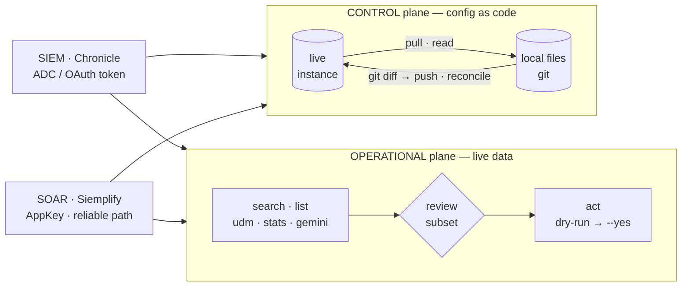

# secopsctl

Operate **Google SecOps** (Chronicle SIEM + Siemplify SOAR) **as code** — one Go
CLI and one importable Go SDK that treat your SIEM/SOAR the way Terraform treats
infrastructure. The core loop is **pull live state → review the `git diff` →
push it back**, driven by a single reconciliation engine across every surface.
Live events, alerts, and cases are read and acted on directly — never reconciled
from a file. It's **tenant-neutral** (nothing baked in; everything comes from one
config file) and built for humans and LLM agents alike: deterministic flags,
optional `--json`, a clear `--help`.

> **⚠️ `pull` is read-only. Every `push` is a live production deploy.** Mutating
> commands default to `--dry-run` and print a `LIVE DEPLOY` banner — nothing
> changes until you pass `--yes`. Always dry-run, read it, then deploy.

New here? **[Install](guides/install.md) → [Configure & auth](guides/configure.md) →
[The loop](guides/the-loop.md).** Building it? **[Architecture](design/architecture.md).**
Want the status of every surface? **[Catalog](design/catalog.md).**

## In 60 seconds

```bash
# 1 — build the single static binary (Go ≥ 1.26)
go install danny.vn/secops/cmd/secopsctl@latest   # or: go build -o secopsctl ./cmd/secopsctl

# 2 — point it at your tenant (one-screen form → ~/.secopsctl/instance.yaml, 0600, git-ignored)
secopsctl config

# 3 — verify config + auth + both planes reach (read-only smoke test)
secopsctl doctor

# 4 — run the loop: pull live state, review it as a diff, push it back
secopsctl pull rules
git diff                       # ← the review surface
secopsctl push rules-create --dry-run   # preview; add --yes to deploy
```

Two credentials, two independent planes: **SIEM** uses Google **ADC** (minted
in-process, nothing on disk); **SOAR** uses a long-lived **AppKey**. SIEM alone
gives a clean `doctor` — add SOAR whenever you need it. Full walkthrough,
including where to find your four identifiers and your SOAR host:
[Configure & auth](guides/configure.md).

## What you can do

- **Config as code** — `pull` → `git diff` → `push` across SIEM and SOAR
  surfaces (rules, reference lists, data tables, feeds, parsers, dashboards,
  playbooks, webhooks, environments, …), reconciled by one engine with a
  canonical diff and `--prune` to delete. See [The loop](guides/the-loop.md)
  and [Reconcile surfaces](guides/reconcile.md).
- **Work the queue** — case counts and server-side filters, per-case and
  per-alert triage verbs, and the alert ⇄ case ⇄ rule bridges; AI-assisted with
  per-alert Gemini investigations, structured case summaries, and
  environment-grounded chat. See [Triage](guides/triage.md) and
  [SOAR cases](guides/soar-cases.md).
- **Playbooks end to end** — discover the authoring palette (every action, flow
  function, trigger, block), author offline or through the API, then run, debug,
  roll back, and promote. See [Playbooks](guides/playbooks.md).
- **Hunt and search** — `search udm`/`raw`/`stats`/`event`/`export`/`validate`
  over UDM events, with agent-first output (`--format jsonl|json|csv|table`,
  `--fields` dotted-path projection, `--out`, `--all` for the complete result set
  plus a total match count) and server-side **saved & shared** searches
  (`search saved …`). See [Search](guides/search.md).
- **Natural-language search with Gemini** — `gemini generate-query` (NL → UDM, no run),
  `gemini search` (NL → UDM, then run), `gemini ask` (the SecOps assistant). The
  model's suggested time window is honored; the AI path is one-time opt-in and
  read-only-aware. See [Gemini](guides/gemini.md).
- **Install from the Content Hub** — `content-hub browse`/`list`/`get` plus the
  reversible, guarded `install`/`uninstall` for marketplace integrations and
  content packs. See [Content Hub](guides/content-hub.md).
- **Use it as a Go SDK** — three importable clients (pure API, no file I/O),
  split by surface and credential; constructing one never touches the network.
  See [Go SDK](guides/sdk.md).
- **Built for agents** — a hard read-only mode (`SECOPS_READONLY=1` /
  `--read-only`), `--non-interactive`, a machine-readable command catalog
  (`secopsctl commands --json`), and a local mutation audit log, on top of the
  dry-run-first guard on every mutating verb. See
  [LLM & automation](tips/10-llm-and-automation.md).

## The model in one screen

Two products (SIEM · SOAR), each split across two planes — **control** (config as
code) and **operational** (live data). One CLI; the two planes are two loops:



- **Control plane = desired state.** Config you want to *keep*:
  **`pull` → review in `git diff` → `push`**, reconciled by one product-neutral
  engine (identity · canonical diff · redaction · additive, `--prune` to delete).
  A `push` is a production deploy behind a `LIVE` banner. See [the loop](guides/the-loop.md).
- **Operational plane = live data.** Events, alerts, cases. You don't reconcile an
  incident from a file — you **query a subset and act on it**. Reads are free;
  every act is guarded (dry-run default, `--yes`, `--limit`-capped).

**The four quadrants — which surfaces live where** (status in [design/catalog.md](design/catalog.md)):

| | **SIEM** · Chronicle | **SOAR** · Siemplify |
|---|---|---|
| **Control**<br/>`pull → push` | rules · lists · data_tables · ingest · dashboards · curated\* | webhooks · environments · networks · idp · soc-roles · case-stages · playbooks · content-hub · … |
| **Operational**<br/>`search → act` | events · alerts · cases† — read via `search` · `gemini` · `ti` | `cases list`/`get` (read) · `cases` (per-case verbs) · `soar push bulk-close` |

<sub>† One case, two APIs on the SOAR domain: `cases list` defaults to the New API (v1alpha) and auto-falls back to the reliable Legacy AppKey queue. \* `curated` = Google-managed: read + enable/disable, not full CUD. The `lists`/`ingest` command groups cover reference lists/watchlists and feeds/parsers/forwarders; their config-as-code `pull`/`push` *targets* keep snake_case mirror-dir names (`reference_lists`, `feeds`, `parsers`, `curated`). Authoritative set + live status in [design/catalog.md](design/catalog.md).</sub>

## Navigation

| Folder | For | Start here |
|---|---|---|
| **[guides/](guides/)** | using `secopsctl` | [Install](guides/install.md) → [Configure & auth](guides/configure.md) → [The loop](guides/the-loop.md) · then [Triage](guides/triage.md) · [Playbooks](guides/playbooks.md) · [Rules](guides/rules.md) · [Search](guides/search.md) · [Gemini](guides/gemini.md) · [Content Hub](guides/content-hub.md) · [SOAR cases](guides/soar-cases.md) · [Reconcile](guides/reconcile.md) · [Go SDK](guides/sdk.md) · [Reference: SIEM](guides/reference-siem.md) · [Reference: SOAR](guides/reference-soar.md) |
| **[design/](design/)** | building `secopsctl` | [Architecture](design/architecture.md) · [Surfaces](design/surfaces.md) · [Catalog (status)](design/catalog.md) |
| **[tips/](tips/)** | the SecOps craft | [All tips](tips/README.md) — [SecOps as code](tips/01-secops-as-code.md) · [YARA-L](tips/03-yara-l-rules.md) · [dashboards](tips/06-dashboards.md) · [feeds & parsers](tips/08-feeds-parsers.md) · [SOAR ops](tips/09-soar-operations.md) |

Unfamiliar term? [Glossary](GLOSSARY.md). Writing docs? [Style guide](STYLE.md). Running an AI agent? [`skills/secopsctl/SKILL.md`](../skills/secopsctl/SKILL.md) — the operating guide for agents driving this CLI.

## Documentation rules

- **[design/catalog.md](design/catalog.md) is the source of truth for status** — every
  surface carries `designed / built / validated`. A code spine (the surface-family
  registry + a drift-guard test) keeps the catalog, the version pins, and the code
  honest, so design and implementation can't silently drift.
- **Docs land with the code** in the same change; a wrong diagram is a bug.
- **Tenant-neutral** everywhere — placeholders only, enforced by the leak guard.
- Full conventions: **[STYLE.md](STYLE.md)**.
