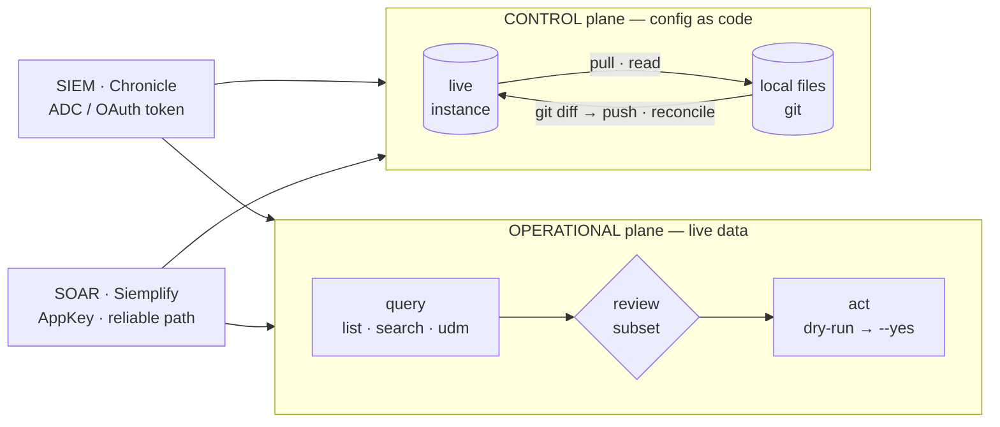

# secopsctl docs

`secopsctl` operates **Google SecOps** (Chronicle SIEM + Siemplify SOAR) **as
code** — the way Terraform operates cloud infra. Two products, two planes, one
CLI. These docs are the contract: read them before changing the surface.

## The model in one screen

Two products (SIEM · SOAR), each split across two planes — **control** (config as
code) and **operational** (live data). One CLI; the two planes are two loops:

- **Control plane = desired state.** Config you want to *keep*. It's
  detection-as-code: **`pull` → review in `git diff` → `push`**, reconciled by one
  product-neutral engine (identity · canonical diff · redaction · additive,
  `--prune` to delete). A `push` is a production deploy behind a `LIVE` banner.
- **Operational plane = live data.** Events, alerts, cases. You don't reconcile an
  incident from a file — you **query a subset and act on it**, the way an analyst
  triages. Reads are free; every act is guarded (dry-run default, `--yes`,
  `--limit`-capped).

**The four quadrants — which surfaces live where** (status in [CATALOG.md](CATALOG.md)):

| | **SIEM** · Chronicle | **SOAR** · Siemplify |
|---|---|---|
| **Control** `pull → push` | rules · reference_lists · data_tables · feeds · parsers · dashboards · curated\* | webhooks · environments · networks · idp · soc-roles · blacklists · case-stages · case-tags · playbooks · visual-families · … |
| **Operational** `query → act` | events (read-only) · alerts · cases (UUID) | `soar case list`/`get` (read) · `soar case` (per-case verbs) · bulk-close |

\* curated = Google-managed: read + enable/disable/alerting, not full CUD. The SOAR list is representative (14 surfaces total) — the authoritative set + live status is in [CATALOG.md](CATALOG.md).

## How these docs are organized

| Doc | What it is | Read it to… |
|---|---|---|
| **[README.md](README.md)** (this) | The map: model, diagram, index | get oriented |
| **[ARCHITECTURE.md](ARCHITECTURE.md)** | The cross-cutting design — engine, lanes, planes, auth, safety, reliability | understand *how* it works (any surface) |
| **[CATALOG.md](CATALOG.md)** | Every surface & command + a **status matrix** (designed / built / validated) | see *what exists* and its maturity — the tracker |
| **[SOAR-DESIGN.md](SOAR-DESIGN.md)** | SOAR specifics (3 tiers, gotchas, per-surface notes) | work on SOAR |
| **[SIEM-DESIGN.md](SIEM-DESIGN.md)** | SIEM specifics (two planes, cases/alerts model) | work on SIEM |
| **[ROADMAP.md](ROADMAP.md)** | Waves / sequencing | see what's next |

**Doc schema (the rules these follow).** One concept per doc; **short prose,
dense content** (no filler). The **CATALOG is the source of truth for status** —
every surface carries a `designed / built / validated` state, so design and
implementation never drift. A surface is not "done" until it's **live-validated**
(read round-trips clean; a write smoke ran on an inert throwaway). Design changes
land in the design docs *with* the code in the same change; CATALOG status updates
in the same commit that moves a surface forward.

## Conventions (apply everywhere)

- **Tenant-neutral.** No real project/customer/host/IP/rule names anywhere —
  placeholders only (`<tenant>`, `<region>`, `000000000000`). Enforced by the
  pre-commit leak guard.
- **No `push` (or live write) without `--yes`.** Dry-run is the default; every
  mutation prints a `LIVE DEPLOY` banner. Bulk operational acts preview a count +
  sample and are `--limit`-capped.
- **Lanes, not exceptions.** Every surface is exactly one of: **reconcile**
  (per-object CUD), **raw** (batch/bundle/selector passthrough), **imperative**
  (per-entity verbs), **operational** (query+act), or **skip**. See ARCHITECTURE.
- **Reliability.** The official new SecOps APIs 500 intermittently (Google is still
  building them); validate against the reliable paths + the swagger, surface a
  clean error on 500, never retry a mutation. See `../CLAUDE.md`.
