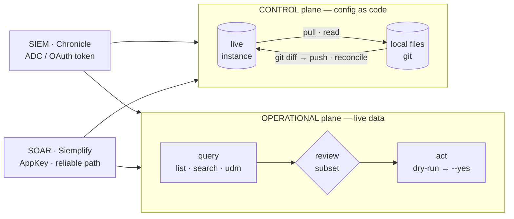

# secopsctl docs

Operate **Google SecOps** (Chronicle SIEM + Siemplify SOAR) **as code** — one Go
CLI and unofficial SDK. Two products, two planes, one loop.

## 🧭 Find your way

| Folder | For | Start here |
|---|---|---|
| 🧭 **[guides/](guides/)** | using `secopsctl` | [Install](guides/install.md) → [Configure & auth](guides/configure.md) → [The loop](guides/the-loop.md) · then [Triage](guides/triage.md) · [Playbooks](guides/playbooks.md) · [Rules](guides/rules.md) · [Query](guides/query.md) · [SOAR cases](guides/soar-cases.md) · [Reconcile](guides/reconcile.md) · [Go SDK](guides/sdk.md) · [Command reference](guides/usage.md) |
| 📐 **[design/](design/)** | building `secopsctl` | [Architecture](design/architecture.md) · [Catalog (status)](design/catalog.md) · [Roadmap](design/roadmap.md) |
| 💡 **[tips/](tips/)** | the SecOps craft | [All tips](tips/README.md) — [SecOps as code](tips/01-secops-as-code.md) · [YARA-L](tips/03-yara-l-rules.md) · [dashboards](tips/06-dashboards.md) · [feeds & parsers](tips/08-feeds-parsers.md) · [SOAR ops](tips/09-soar-operations.md) |

New here? [Install](guides/install.md), then the [loop](guides/the-loop.md). Building it?
[Architecture](design/architecture.md). Unfamiliar term? [Glossary](GLOSSARY.md).
Writing docs? [Style guide](STYLE.md).

## 🧩 The model in one screen

Two products (SIEM · SOAR), each split across two planes — **control** (config as
code) and **operational** (live data). One CLI; the two planes are two loops:

- **Control plane = desired state.** Config you want to *keep*:
  **`pull` → review in `git diff` → `push`**, reconciled by one product-neutral
  engine (identity · canonical diff · redaction · additive, `--prune` to delete).
  A `push` is a production deploy behind a `LIVE` banner. See [the loop](guides/the-loop.md).
- **Operational plane = live data.** Events, alerts, cases. You don't reconcile an
  incident from a file — you **query a subset and act on it**. Reads are free;
  every act is guarded (dry-run default, `--yes`, `--limit`-capped).

**The four quadrants — which surfaces live where** (status in [design/catalog.md](design/catalog.md)):

| | **SIEM** · Chronicle | **SOAR** · Siemplify |
|---|---|---|
| **Control** `pull → push` | rules · reference_lists · data_tables · feeds · parsers · dashboards · curated\* | webhooks · environments · networks · idp · soc-roles · case-stages · playbooks · … |
| **Operational** `query → act` | events (read-only) · alerts · cases† | `soar case list`/`get` (read) · `soar case` (per-case verbs) · bulk-close |

† One case, two APIs on the SOAR domain: `soar case list` defaults to the New API (v1alpha) and auto-falls back to the reliable Legacy AppKey queue. \* curated = Google-managed: read + enable/disable, not full CUD. Authoritative set + live status in [design/catalog.md](design/catalog.md).

## 📏 The rules these docs follow

- **[design/catalog.md](design/catalog.md) is the source of truth for status** — every
  surface carries `designed / built / validated`. A code spine (the surface-family
  registry + a drift-guard test) keeps the catalog, the version pins, and the code
  honest, so design and implementation can't silently drift.
- **Docs land with the code** in the same change; a wrong diagram is a bug.
- **Tenant-neutral** everywhere — placeholders only, enforced by the leak guard.
- Full conventions: **[STYLE.md](STYLE.md)**.
