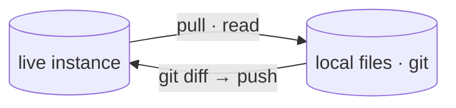

# Docs style guide

The contract every doc in `docs/` follows. Keep it short; keep it true to the code.

## 🗂️ Where a doc goes

| Folder | Audience | Answers |
|---|---|---|
| `design/` | devs building **secopsctl** | *how is it built?* (architecture, surfaces, status, roadmap) |
| `guides/` | operators **using** secopsctl | *how do I do X?* (install, auth, the loop, per-area how-tos, SDK) |
| `tips/` | anyone operating **Google SecOps** | *what's the craft?* (YARA-L, UDM, feeds, SOAR — tenant-neutral practice) |

Root holds only the map (`README.md`), this guide (`STYLE.md`), and the `GLOSSARY.md`.
One concept per file. If a file passes ~300 lines, split it.

## ✍️ Voice

- **Short, dense, technical.** State what's true; cut filler, hedging, and history
  ("we tried…", "it turns out…"). A reader's time is the budget.
- **Active, imperative** in guides ("Pull the rules, edit, push.").
- **Tenant-neutral always** — placeholders only (`<tenant>`, `<region>`,
  `000000000000`, `example.com`). Never a real project/customer/host/IP/rule name.

## 🎨 Format

- **Emoji** signpost sections — at most one per H1/H2, none mid-sentence. Use a
  consistent set: 📐 design · 🧭 guide · 💡 tip · ⚠️ danger · ✅ done · 🔒 read-only.
- **Tables and lists over prose** for any set of things (surfaces, flags, steps).
- **Fenced code** for every command/snippet; show the command, then the why.
- **Mermaid for every flow or structure** (see below) — a diagram beats a paragraph.
- **One H1** per file (the title). Sentence-case headings.

## 📊 Mermaid

Use a fenced ```mermaid block (renders on GitHub **and** the Jekyll site). Reach
for it whenever there's a flow, a plane/lane split, a state machine, or a
component map.



Diagrams are **part of the doc↔code contract**: a diagram must match what the code
does (the planes, the lanes, the surfaces, the auth). When the code changes, update
the diagram in the same change. A wrong diagram is a bug.

**Mermaid on the Jekyll site — mind Liquid's braces.** Jekyll runs Liquid over the
page *before* the browser sees it, and Liquid consumes its delimiters —
`{{ … }}` (output) and `` (tags).
Two consequences: Mermaid's **hexagon node** `id{{"label"}}`
renders on GitHub but is silently stripped to garbage on the site, and a literal tag
delimiter written anywhere in a page breaks the Jekyll build. Use a rhombus/decision
node `id{"label"}` (single braces, Liquid-safe) or a rectangle for diagrams, and wrap
any literal Liquid token you must show in a Liquid `raw` block. Keep `<br/>` for line
breaks (not `\n`) and escape literal angle brackets in labels as `&lt;`/`&gt;`.

## 🔗 Doc ↔ code consistency

- Every command, flag, and path shown must exist in the code (verify against
  `--help` / the source, not memory).
- **`design/catalog.md` is the source of truth for surface status** (designed /
  built / validated); other docs link to it rather than re-stating status.
- Design changes land **with the code** in the same change — docs and code never
  drift. If they disagree, that's a bug.

## ✏️ kramdown (the Jekyll site is stricter than GitHub)

- A **blank line before every table, list, and fenced block**, and **after every
  heading** — a table directly under a heading renders as flat pipes on the site.
- New page under `docs/`? add it to the left-nav in `docs/_layouts/default.html`
  (hand-maintained) or it's unreachable from the site.
