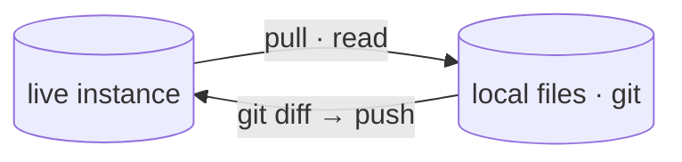

# Docs style guide

The contract every doc in `docs/` follows. Keep it short; keep it true to the code.

## Where a doc goes

| Folder | Audience | Answers |
|---|---|---|
| `design/` | devs building **secopsctl** | *how is it built?* (architecture, surfaces, status, roadmap) |
| `guides/` | operators **using** secopsctl | *how do I do X?* (install, auth, the loop, per-area how-tos, SDK) |
| `tips/` | anyone operating **Google SecOps** | *what's the craft?* (YARA-L, UDM, feeds, SOAR — tenant-neutral practice) |

Root holds only the map (`README.md`), this guide (`STYLE.md`), and the `GLOSSARY.md`.
One concept per file. If a file passes **450 lines**, split it (the enforced cap; see
*Length + lint* below).

## Voice

- **Short, dense, technical.** State what's true; cut filler, hedging, and history
  ("we tried…", "it turns out…"). A reader's time is the budget.
- **Active, imperative** in guides ("Pull the rules, edit, push.").
- **Tenant-neutral always** — placeholders only (`<tenant>`, `<region>`,
  `000000000000`, `example.com`). Never a real project/customer/host/IP/rule name.

## Format

- **Emoji** signpost sections — at most one per H1/H2, none mid-sentence. Use a
  consistent set: 📐 design · 🧭 guide · 💡 tip · ⚠️ danger · ✅ done · 🔒 read-only.
- **Tables and lists over prose** for any set of things (surfaces, flags, steps).
- **Fenced code** for every command/snippet; show the command, then the why.
- **Mermaid for every flow or structure** (see below) — a diagram beats a paragraph.
- **One H1** per file (the title). Sentence-case headings.

## Mermaid

Use a fenced ```mermaid block (renders on GitHub **and** the docsify site). Reach
for it whenever there's a flow, a plane/lane split, a state machine, or a
component map.



Diagrams are **part of the doc↔code contract**: a diagram must match what the code
does (the planes, the lanes, the surfaces, the auth). When the code changes, update
the diagram in the same change. A wrong diagram is a bug.

**Mermaid on the docsify site.** Mermaid blocks render client-side via the mermaid
plugin. Keep `<br/>` for line breaks (not `\n`) and escape literal angle brackets
in labels as `&lt;`/`&gt;`. The theme toggle re-renders diagrams automatically.

## Doc-to-code consistency

- Every command, flag, and path shown must exist in the code (verify against
  `--help` / the source, not memory).
- **Names must match the current renamed surface — no removed aliases.** Use the
  canonical command name as it stands in the binary today (`search`, `gemini`,
  `curated`, `exclusions`, `ti`, `lists`, `ingest`, `content-hub`,
  `status`, `cases`, `entities`, `soar playbooks`/`integrations`/`jobs`/`ide`).
  Earlier names that were hard-renamed (`query`, `curated`, `iocs`,
  `reference-lists`, `watchlists`, `soar marketplace`, `capabilities`/`coverage`/
  `surfaces`, `feeds`/`parsers`/`forwarders` as top-level commands) are **gone, no
  back-compat aliases** — never write them. (Mirror-tree `pull`/`push` *target* args
  stay snake_case — `pull reference_lists`, `pull data_tables`, `pull curated` — they
  name on-disk directories, not the renamed command groups.)
- **`design/catalog.md` is the source of truth for surface status** (designed /
  built / validated); other docs link to it rather than re-stating status.
- Design changes land **with the code** in the same change — docs and code never
  drift. If they disagree, that's a bug.

## Formatting rules

- A **blank line before every table, list, and fenced block**, and **after every
  heading** — consistent whitespace keeps the source readable and the linter happy.
- New page under `docs/`? Add it to `docs/_sidebar.md` or it's unreachable from
  the site.

## Length and lint

- **A doc is capped at 450 lines** (`scripts/check-lengths.sh`, in CI + pre-commit).
  Over it → split into a focused page or trim; history survives in git. A doc that
  becomes a long log (the old 2417-line roadmap) belongs out of `docs/` / in git
  history, not on a reader's — or an agent's — path.
- **Fenced code blocks must declare a language** (` ```bash `/` ```go `/` ```text `).
  Run `npx markdownlint-cli2 "docs/**/*.md"` before committing docs changes.
