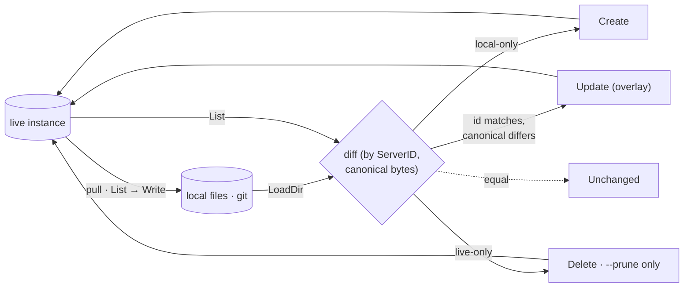
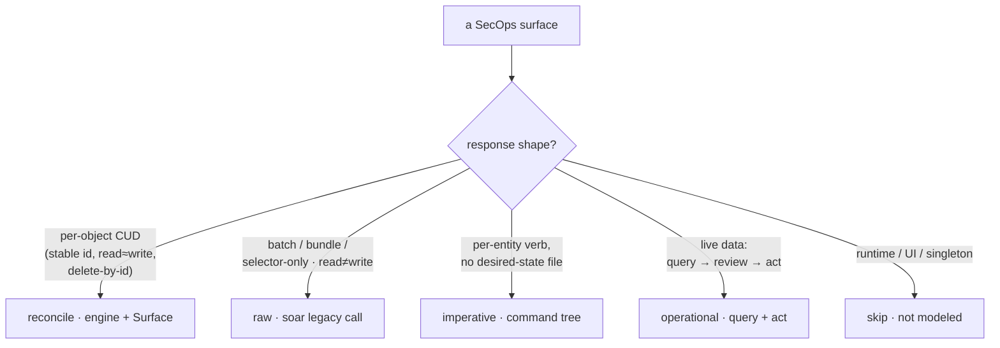

# Architecture

How `secopsctl` works, independent of any one surface. Product specifics live in
[soar.md](soar.md) / [siem.md](siem.md); what exists and its status is in
[catalog.md](catalog.md). New to a term (*plane*, *lane*, *reconcile*,
*canonical*, *etag*)? See the [glossary](../GLOSSARY.md).

## 1. Two planes

| | Control plane | Operational plane |
|---|---|---|
| **Subject** | desired-state *config* | live *data* |
| **Examples** | rules, lists, tables, feeds, parsers, dashboards, SOAR automation | events, alerts, cases |
| **Loop** | `pull` → review in `git diff` → `push` (reconcile) | `query` → review → `act` |
| **Source of truth** | the git repo | the live instance |
| **Files?** | yes — one per object, diffable | no — live data isn't snapshotted as desired state |
| **A mutation is…** | a production *deploy* | a production *action* (triage) |

They never mix. You don't reconcile a case from a file; you don't triage a
detection rule. One CLI, two models.

## 2. The reconcile engine (control plane)

A single product-neutral engine (`internal/mirror/reconcile`, imports no SDK)
drives every config surface. A surface is a declarative descriptor; the engine
does the orchestration: **pull** reads live state to files, **diff** classifies,
**push** applies create/update/delete.



The descriptor: closures the caller fills with the SDK; the engine never sees it.

```
Surface{ Name, Dir, Caps,
         List(ctx)→ListResult,          // live state (+ Incomplete flag)
         LoadDir(dir)→[]Object,         // local files
         Write(dir,Object),             // pull writer
         Create/Update/Delete(...) }    // the CUD ops
```

- **Object** = `{ Slug, ServerID, Etag, Canonical, Raw }`. `Canonical` is the
  diff basis: redacted + volatile-stripped + deterministically serialized, so a
  `git diff` (and the push plan) shows only real config changes.
- **Identity = `ServerID`.** Matching local↔live is by server id, never by slug —
  so non-unique display names, rotating UUIDs (playbooks key on *name*), etc. are
  handled. `Pull` disambiguates colliding filenames with the id.
- **Plan** = classify each object: `Create` (local-only), `Update` (id matches,
  canonical differs), `Delete` (live-only — a *prune candidate*), `Unchanged`.
- **Push** = additive by default (Create+Update). `--prune` is required to Delete,
  gated on a `PruneEligible` surface **and** a complete pull; otherwise server-only
  objects are warned, skipped, and **reprinted in a final summary** (long logs hide
  mid-stream warnings). Dry-run is the default; a real apply needs `--yes` under a
  `LIVE DEPLOY` banner.
- **Redaction round-trip.** Secrets are redacted on pull (`***REDACTED***`). A push
  never sends the marker back: **Update overlays edits onto the live body and drops
  masked fields** (keeping the real secret); **Create refuses** a body that still
  carries a marker.
- **Capabilities** adapt behavior without the engine inspecting payloads:
  `WholeBodyWrite`, `NoDelete`, `NoEtag`, `PruneEligible`.
- The **`jsonSurface` adapter** turns any RawJSON per-object endpoint into a
  Surface from a few JSON-path + method params — this is what makes adding a
  surface a one-struct change. Typed surfaces (reference lists, playbooks) get a
  bespoke Surface but reuse the same engine.

## 3. The lane model

Every surface is **exactly one lane**, determined by the API's actual *response*
schema rather than inferred from a method name — a read that round-trips as a
clean per-object create/update/delete is `reconcile`; a batch, bundle, or
selector-only response is not.

| Lane | Fits | Mechanism |
|---|---|---|
| **reconcile** | clean per-object CUD: stable id, read-shape ≈ write-shape, delete-by-id | the engine + a Surface |
| **raw** | batch upserts, export/import bundles, selector-only reads, read≠write | `soar legacy call` (pull JSON → edit → guarded post) |
| **imperative** | per-entity verbs, no desired-state file | a command tree (`soar case`, `curated`) |
| **operational** | live data: query a subset, act on it | query + act commands (§4) |
| **skip** | runtime/UI/telemetry, singletons, auth topology | not modeled |



The engine **enforces** the boundary: a batch/bundle/selector endpoint cannot
register as a reconcile surface. When the swagger response is grouped/nested or
the write body is an array, it's `raw`, not `reconcile`.

## 4. The operational model (query → review → act)

Live data (events/alerts/cases). The SDK is largely built; the design is the
operator model and its **safety**.

- **Query.** Every `list`/`search` shares a **filter**, a **time window**, a
  **`--limit`** (with a default, so a query never pulls the whole tenant), and an
  output: a compact **table** for humans, **`--json`** as the contract that pipes
  into an act command.
- **Act — per item.** Unambiguous, low blast radius: `<domain> <verb> <id> …`.
- **Act — subset (the dangerous one), two paths, safest first:**
  1. **Reviewed-ids** (preferred): `list --json | … > ids` → `bulk <verb> --ids @ids`
     — you act on exactly what you reviewed.
  2. **Filter-in-one-shot** (gated harder): `--filter` is **always dry-run-first**
     (prints match count + a sample, refuses to mutate) and **`--limit`-capped**.
- **One guard rule:** an operational mutation is a production deploy — `LIVE`
  banner, dry-run default, `--yes`. Events are immutable telemetry: **read-only,
  never mutate**. A case is **one record with two ids** (Chronicle UUID, SOAR
  integer) — operate it on the reliable SOAR AppKey lane, not two case systems.

## 5. Cross-cutting

- **Auth is split and lazy** (`auth/`). SIEM = ADC/OAuth (token, minted in-process,
  never on disk). SOAR = AppKey (in the `0600` config or `$SECOPS_SOAR_APP_KEY`,
  no ADC). Credentials resolve on the first request — `--help`/offline never touch
  ADC. The SIEM token honors `gcloud` ADC or `SECOPS_ACCESS_TOKEN`.
- **etag / optimistic concurrency.** Mutating paths round-trip the stored etag;
  on mismatch, surface a clean conflict — never silently overwrite a concurrent
  edit (a teammate's UI change, a parallel push).
- **Reliability.** The official **new** APIs (Chronicle v1alpha/v1beta REST,
  modern SOAR v1alpha) **500 intermittently** — Google is still building SecOps.
  Validate new surfaces against the **reliable** paths (SOAR AppKey, stable SIEM
  reads) + the **swagger**, not the flaky live API. On a 500: fail cleanly with
  the request id; retry idempotent **reads**, never a **mutation** (double-apply
  risk).
- **Build discipline (how a surface earns "validated").** Swagger-spec the shape →
  **verify SDK signatures by hand** (the spec agents are imprecise) → wire the
  Surface/command → **live read-validate** (pull round-trips clean) → **gated write
  smoke** on a uniquely-labeled, inert, self-deleting throwaway. No `--yes` path is
  trusted until that smoke passes. Status lands in [catalog.md](catalog.md).

## 6. API versions — per endpoint, tested not guessed

SecOps uses **different API versions for different endpoints**, and Google moves
them (an endpoint that answered `v1beta` yesterday may need `v1` today, or 500 at
all of them). So the version is **not** a global constant and **not** a user flag:
each endpoint family pins **its own** version in the SDK (a `const`, e.g.
`caseAPIVersion`), set to **the version that works**. When an API moves or stops
responding, change the const to the version that works and update this table.
**This table is the record — keep it current.**

| Endpoint family | Version | Status | Notes |
|---|---|---|---|
| SIEM config + reads — rules · curated deployments · reference_lists · data_tables · feeds · parsers · dashboards · search · entity | `v1alpha` | ✅ | `DefaultAPIVersion`; doctor + pulls confirm |
| SIEM reporting — `metricDefinitions` · `dashboardScheduledReports` | `v1alpha` | 🔨 | `DefaultAPIVersion`. metricDefinitions is **feature-gated 403** (not enabled/GA on the tenant); scheduledReports **reads OK**, create-report backend **500s** server-side. Both on the engine, offline-tested |
| SIEM governance — `dataTaps` · `errorNotificationConfigs` · `enrichmentControls` | `v1alpha` | 🔨 (dataTaps ✅) | `DefaultAPIVersion`. **dataTaps write-validated** (PATCH 501 → update = delete+recreate); the other two **feature-gated 403**. dataTaps supersedes the Backstory endpoint — same chronicle host |
| MSSP — `federationGroups` · `tenants` · `multitenantDirectory` (chronicle) · `legacySoarIdpMappingGroups` (**SOAR host**) | `v1alpha` | 🔨 (directory ✅, idp-mappings ✅) | federationGroups/tenants 403 on a single tenant; multitenantDirectory read-validated. **legacySoarIdpMappingGroups 500s on chronicle, answers on the SOAR host** (AppKey) — a two-host surface, lives in `soar/` |
| Chronicle **cases** (UUID) API on the **chronicle host** — get/list/patch/merge/bulk | `v1beta` segment (collection 500s at every version) | ⛔ | **alternate, unused path** for the cases function. The chronicle.googleapis.com cases collection **500s at every version** (server-side); the `v1beta` segment (`caseAPIVersion`, mapped `cases_chronicle_alt`→v1beta in `versions.go`) is a **non-working pin** kept only so the alternate path can be exercised, not a validated version. The **modern cases that DO work are on the SOAR host** (`soar.ListCases`, v1alpha — `soar case list` uses it by default); operational case work uses the SOAR AppKey lane. The cases function is **not** blocked — this `⛔` is only this dead chronicle path. One case, multiple APIs |
| SIEM legacy case reads — `legacy:legacyListCases` · `legacyBatchGetCases` | `v1alpha` | ⛔ list · ✅ bridge | `legacyListCases` 404 (⛔, that one path only); `legacyBatchGetCases` is the working SOAR-int ⇄ SIEM-uuid bridge |
| SOAR legacy — `/api/external/v1/…` (**cases** · connectors · jobs · settings · playbooks bridge) | external `v1` · AppKey | ✅ | the reliable path — **incl. the working operational case lane** (`GetCaseCardsByRequest`, `GetCaseFullDetails` → alerts, `ExecuteBulkCloseCase`, `ChangeCasePriority`) |
| SOAR modern — integrations · connectors · jobs · grouping · cases · Content Hub · environments · socRoles · customLists · case*Definitions | `v1alpha` only | 🔨 (cases ✅) | **SOAR host serves v1alpha ONLY** — v1/v1beta 404 for every surface. **cases is live-validated** here (`soar.ListCases`, the default for `soar case list`); the rest are built. The v1>v1beta>v1alpha preference is a **chronicle-host** concern; the SOAR host stays v1alpha |
| SIEM Threat Intel — `threatCollections` · `iocs` | **`v1`** | ✅ | prefer v1>v1beta>v1alpha; all three answer → pinned v1 (`tiAPIVersion`). threatCollections uses project **number** |
| SIEM operational — `watchlists` (read) | **`v1`** | ✅ | all three answer → pinned v1 (`watchlistsAPIVersion`); `watchlists list/get` CLI |
| SIEM governance — `riskConfig` · `dataAccessLabels` · `dataAccessScopes` | **`v1`** | ✅ | all three versions answer → pinned v1 (`rbacAPIVersion`); riskConfig is `{instance}/riskConfig` |
| SIEM ingestion — `forwarders` · `forwarders.collectors` | **`v1beta`** | ✅ | v1 **404s** → pinned v1beta (`forwardersAPIVersion`) |
| SIEM detection — `curatedRuleSetDeployments` · `curatedRules` | `v1alpha` | ✅ | v1/v1beta **404** for curatedRules → only v1alpha works |
| SIEM analytics — `entityRiskScores` (query) · `investigations` (TIN, + steps/comments) | `v1alpha` | ✅ | ride `DefaultAPIVersion`; read-only (Gemini TIN; `:trigger` write gated) |
| SIEM analytics — `bigQueryExport` (get) · `coverageDetails` (list, MITRE) | **`v1`** | ✅ | v1 + v1alpha answer → pinned v1 (`bigQueryExportAPIVersion` / `coverageAPIVersion`); reads (provision/update gated) |
| **SOAR** Content Hub — `marketplaceIntegrations` · `contentHub.contentPacks` | `v1alpha` (SOAR host) | ✅ | served on `*.siemplify-soar.com` (AppKey), NOT chronicle (which 500s); `soar/marketplace.go` |

Principle: **test → hard-code the working version per family → record it here.** No
per-user version flag; the SDK ships the version that works, and this table tracks
which is which (and what's currently down). The pins live in one place —
`chronicle/versions.go` (`APIVersions`) — and a drift-guard test
(`internal/mirror/surface_families_test.go`) fails if this table and that map
disagree, so §6 and the code can't drift apart silently.

## 7. Surface taxonomy & registry

Every API family has one home: a **plane** `(host, auth)` and a **lane**. The full
inventory and the SIEM-vs-SOAR split live in [surfaces.md](surfaces.md); this section
is the design behind it.

**Two orthogonal axes.** Don't conflate them:

- **Plane** (*product + transport*, surfaces.md): **SIEM** (`chronicle.googleapis.com`,
  ADC), **SOAR-legacy** (`*.siemplify-soar.com` `/api/external/v1`, AppKey — reliable),
  **SOAR-modern** (`*.siemplify-soar.com` v1alpha, AppKey — flaky).
- **Lane** (*how it's modeled*, §3): reconcile / raw / imperative / operational / skip.
  A surface is one plane **and** one lane (e.g. SIEM reference lists = SIEM-plane +
  reconcile-lane + control-plane).

**Place by host+auth, not by feel.** Verify the host before you place a surface.
Threat Intelligence reads like an external enrichment add-on, but `threatCollections`
answers on `chronicle.googleapis.com` with ADC — it is **SIEM-plane** (`chronicle/`).
The Content Hub is the opposite trap: it uses the modern v1alpha resource shape, so it
*looks* SIEM, but `marketplaceIntegrations`/`contentPacks` answer on the SOAR host
(`*.siemplify-soar.com`, AppKey; the chronicle host 500s) — it is **SOAR-plane**
(`soar/marketplace.go`). Host+auth, not the resource shape, decides the package.

**One resource can live on two hosts.** For customer-managed-project tenants,
`integrations` / `connectors` / `jobs` answer on **both** the SOAR AppKey host and
`chronicle.googleapis.com` v1alpha. The rule: **operate config-as-code on the legacy
AppKey lane** (reliable) and reach for the modern path only for what the legacy API
lacks (e.g. the per-connector-definition delete). Each dual-host family records the
host it actually uses and why.

**The registry is the spine — and it is code.** Each family is one declarative
entry in `internal/mirror/surface_families.go`:

```
SurfaceFamily{ Name, Area, Plane, Host, Auth, Generation, APIVersion, Lane, Status, SDKLocation }
```

`Area` is the by-function grouping in [catalog.md](catalog.md) (SIEM / SOAR / Other);
`Generation` is the New-vs-Legacy axis. SIEM `APIVersion` is **sourced from**
`chronicle.APIVersions` (`chronicle/versions.go`), so the registry can't disagree
with the SDK's actual pins. A drift-guard test (`surface_families_test.go`) asserts
the host↔auth↔plane↔generation↔version invariants, that **every reconcile surface has
an entry**, and that `chronicle.APIVersions` matches the §6 table — so the map, the
docs, and the code cannot silently drift. Adding a surface is: write the registry
entry → verify the SDK signature against the spec by hand → wire the Surface/command
→ read-validate → gated write-smoke (§5). Keep `chronicle/` and `soar/` flat with one
file per family; the registry, not the package tree, carries the structure.
