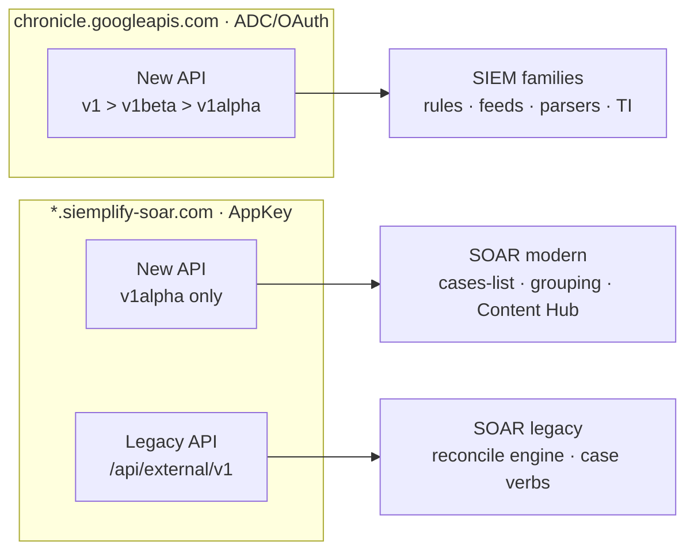

# Catalog & status

The source of truth for **what exists and how mature it is** — one status per
surface, updated in the same commit that moves the surface forward. Design in
[architecture.md](architecture.md); the API split by plane and unbuilt gaps in
[surfaces.md](surfaces.md); product specifics in [soar.md](soar.md) / [siem.md](siem.md).

**Where the code is:** surfaces register in `internal/mirror/registry_{soar,siem}.go`
(playbooks: `soar_playbooks.go`; data_tables: `datatables_surface.go`;
connectors/jobs: `soar_operational_surfaces.go`); the
product-neutral engine is `internal/mirror/reconcile`; live write-smokes are gated by
`SECOPS_SOAR_SMOKE`/`_WRITE` (`reconcile_smoke_test.go`) for SOAR and
`SECOPS_SIEM_SMOKE`/`_WRITE` (`reconcile_smoke_siem_test.go`) for SIEM.

**This catalog has a machine-readable spine.** The status matrix below is mirrored
by the surface-family registry in `internal/mirror/surface_families.go` — one
declarative `SurfaceFamily` entry per API family (`Area`, `Plane`, `Host`, `Auth`,
`Generation`, `APIVersion`, `Lane`, `Status`, `SDKLocation`). SIEM versions in the
registry are sourced from `chronicle/versions.go` (the `APIVersions` map, the single
source of truth for Chronicle-host version pins), and a drift-guard test
(`surface_families_test.go`) asserts the registry, the version pins, and
[architecture.md](architecture.md) §6 stay in agreement.

**Status legend**

| | Status | Meaning |
|:-:|---|---|
| 📐 | **designed** | spec'd, code not landed |
| 🔨 | **built** | code lands |
| ✅ | **live-validated** | reads round-trip clean / a write smoke ran |
| 🔒 | **read-only by choice** | write deliberately not run — RBAC/SSO/high-blast/routing |
| ⛔ | **blocked** | that API path is down server-side (500/404) |
| — | **not used here** | secopsctl doesn't use that API generation for this function |

## How this catalog is sliced

By **function** (cases, rules, playbooks, …) — one row each — grouped into three
areas: **SIEM**, **SOAR**, and cross-cutting **other features** (Threat Intel,
Content Hub). A function can be served by **two API generations**, tracked in
**two columns**, and each column records **status · domain · version**:

- **New API** — Google's modern REST (`projects/…/instances/…` shape). The cell
  reads `<status> <domain> · <version>`, e.g. `✅ chronicle · v1alpha` or
  `✅ siemplify · v1alpha`. **Domain** is a property of the call, not the section —
  the **same function can answer on either domain**. We prefer **v1 > v1beta >
  v1alpha** and pin the version that works per surface (full per-endpoint map:
  [architecture.md](architecture.md) §6).
- **Legacy API** — the Siemplify **external** API (`/api/external/v1`, AppKey, on
  the siemplify domain). SOAR-only; the broad, reliable path the reconcile engine
  and the case verbs run on.

**The two domains** (both are just where the call goes):

- **chronicle** = `chronicle.googleapis.com` (Google), regional, **ADC/OAuth**.
  Serves v1 / v1beta / v1alpha.
- **siemplify** = `*.siemplify-soar.com` (Siemplify), **AppKey**. The modern API
  here is **v1alpha only** (v1/v1beta 404).

A `—` means secopsctl doesn't use that generation for the function. A function is
**not** "blocked" just because one domain/version is down — the status is per
column+domain; if any path serves it, the function works (e.g. **cases** works on
siemplify v1alpha even though the chronicle-host UUID path 500s).

---

## SIEM — Chronicle (`chronicle.googleapis.com`, ADC/OAuth)

Modern-only: the Legacy (Siemplify external) column is `—` throughout — Chronicle
has no legacy external API.

### Control plane — config as code (`pull` → `git diff` → `push`)

| Function (CLI) | Lane | New API (status · domain · version) | Legacy | Notes |
|---|---|---|---|---|
| `rules` | bespoke | ✅ chronicle · v1alpha | — | YARA-L source + deployment state machine (two resources), not a single canonical body. `push rules-create` (initial `--enabled`, `--alerting`, `--run-frequency`) · `rules-update` (etag-guarded text update) · `rules-deploy` (reconcile enabled/alerting/frequency; archived rules report non-deployable; the apply PATCH is field-masked to only the changed fields — an alerting-only flip sends `alerting` alone, so it no longer 409s on an unchanged `enabled` — and the summary reports `deployed`/`already in desired state`/`failed` truthfully) · `rules-disable`. Pull mirrors `deployment.archived`; operational `rules detections/errors/alerts <rule>` (rule id, display name, or slug — resolved against the live rule list, clean `no rule matches` error on a miss instead of the API's opaque 400) + `rules retrohunt list/get/create`; `rules errors` decodes both string and structured execution-error payloads. **Rule-tuning reads (W54, live-validated):** `rules trends` (per-rule day-bucketed detection counts + last detection, noisiest first — no `--rule` sweeps every rule; `legacyGetRulesTrends`, whose bucket window must be bucket-ALIGNED or the API 400s generically — the SDK floors/ceils), `rules counts` (rule + quota stats, `legacyGetRuleCounts`), and `rules events <rule> <detection-id>` (the UDM evidence behind one detection, `legacySearchRuleDetectionEvents`; summary per event variable, full payloads `--json`); `SearchRuleDetectionCountBuckets` is SDK-only. **Batch update:** `rules:modifyRules` SDK (`ModifyRules`, per-index failure map) — built, exercised by the gated lifecycle smoke; the reconcile sweep stays per-rule PATCH until the batch path passes an approved smoke. `RunTestRule` (dry-run vs historical data) + `ArchiveRule`. Read live-validated; lifecycle write smoke `TestLiveRulesLifecycleWriteSmoke` (create→update→deploy→archive→modifyRules→delete, self-cleaning) |
| `reference_lists` | reconcile + imperative | ✅ chronicle · v1alpha | — | typed, `.txt`+`.yaml`; NoDelete; product-neutral engine. Resource-name **normalization**: create echoes the project NUMBER while list echoes the project ID — both rewritten to the id form so reconcile identity (keyed on the name) stays stable. Guarded `reference_lists empty <name>` clears entries for no-delete neutralization without printing values. Write smoke `TestLiveReconcileReferenceListWriteSmoke` reuses one fixed inert list (no delete API) — fresh create-or-reuse + one update each run (rerunnable, no accumulation). An EMPTY list canonicalizes to `[]` on both sides (entries normalized non-nil), so `drift` no longer phantom-reports it `~1` after a clean pull |
| `data_tables` | reconcile | ✅ chronicle · v1alpha | — | `.csv`+`.yaml` on the engine; `push data_tables` (create/update). Columns immutable after create; rows are wholesale destroy-and-replace (`ReplaceDataTableRows`). Not prune-eligible (whole-table delete is high-blast). Write smoke `TestLiveReconcileDataTableWriteSmoke` (create→update desc→replace rows→delete) |
| `feeds` | reconcile | ✅ chronicle · v1alpha | — | `.yaml` on the engine; `push feeds`. Secrets redacted on pull, overlaid on update (real secret preserved; create refuses a masked body); new credentials can be sourced at apply time with `secret_ref: env:VAR` or `secret_ref: secretmanager:projects/<project>/secrets/<secret>/versions/latest` (never YAML). `details` replaced wholesale on PATCH. `assetNamespace`(read) vs `namespace`(write) reconciled (API uses `assetNamespace`); short `logType` expanded to the full resource name on write. Feed state is a runtime toggle, out of canonical. Not prune-eligible (delete stops ingestion) — deletion is the explicit, guarded `feeds delete <id>` imperative. Write smoke `TestLiveReconcileFeedWriteSmoke`; GCS V2 (`gcsV2Settings`, STS-backed) validated; `FetchFeedServiceAccount` for the STS SA grant; templates live in `examples/feed-templates/` |
| `parsers` | reconcile | ✅ chronicle · v1alpha | — | `.conf`+`.yaml` on the engine; `push parsers`. Versioned/immutable → no server-side update: an edit is **create-new-version + activate** (parser id volatile, written back on refresh); old version left inactive (rollback). Not prune-eligible. Write smoke `TestLiveReconcileParserWriteSmoke` runs `RunParser` (pure inert validation) then creates a new **INACTIVE** version, asserts it never goes ACTIVE (live ingestion untouched), deletes it. `RunParser` response shape: `parsedEvents` is `{events:[…]}`. **Parser-dev loop (read):** `parsers sample-logs <type>` lists recent RAW logs directly (`logTypes/<type>/logs`, `data` base64-decoded — the simplest raw-log path, no search) → develop CBN → `parsers run` → `push parsers` (submit) → **`parsers validate <type>`** surfaces the submitted parser's **validation-report parsing errors** (`{parser}.validationReport` + `…/parsingErrors`: the per-log `error` message + failing log) — the detail behind a `push`/`activate` `FAILED_PRECONDITION` that otherwise gives no reason. Live read-validated against KONG_GATEWAY. `chronicle/logs.go`, `chronicle/parsers.go` |
| `dashboards` | reconcile | ✅ chronicle · v1alpha | — | native dashboards (**CUSTOM only**; CURATED read-only/unmanaged); `pull`/`push dashboards`. One `<slug>.json` (config + `_server` id), charts inline under `definition.charts` (replaced wholesale on update); `access` immutable after create. extraStrip drops `createUserId`/`updateUserId`/`dashboardUserData`; root `name` stripped (identity in ServerID). Write smoke (create→update→delete, closure-direct to dodge full-view rate-limiting) |
| `curated` / `curated_rules` | reconcile + imperative | ✅ chronicle · v1alpha | — | Google-managed (no CUD): `pull curated` writes `curated/deployments.yaml`; `push curated` diffs it against live and calls `BatchUpdateCuratedRuleSetDeployments` for changed enabled/alerting tuples. `curated list` reads, and guarded `curated set` remains the one-off toggle. `curated rules` lists individual curated rules (`ListCuratedRules`/`GetCuratedRule`, read-validated, 187 rules). **Curated tuning reads (W54, live-validated):** `curated detections <ur_id>` (`legacySearchCuratedDetections` — the curated twin of `rules detections`, which serves user rules only), `curated trends --rule ur_a,… | --all` (`legacyGetCuratedRulesTrends`, day-bucketed counts + last detection, `--all` sweeps every curated rule in chunked requests), and `curated events <detection-id>` (`legacyGetEventForDetection` — event + rationale behind one curated detection; answers 200 but can be empty for some detection types, e.g. GCTI_FINDING). Batch update is live-validated by `TestLiveCuratedBatchToggleWriteSmoke` (self-restoring enable→verify→restore, alerting off). v1alpha is the **only** version that answers for curated rules — v1/v1beta 404 |
| `rule_exclusions` | reconcile + imperative | ✅ chronicle · v1alpha | — | findings refinements (display_name + type + UDM query + deployment enabled/archived); `pull`/`push rule_exclusions` round-trip both core config and deployment state. Create + Update (PATCH/updateMask); deployment updates use the separate deployment PATCH; **NoDelete** (drift reported, never pruned), NoEtag. Guarded `rule_exclusions deploy <id> --enable|--disable|--archive` handles one-off toggles. Read + write live-validated (create→update→archive); the API has no hard delete — **archive** is the teardown |
| `forwarders` | reconcile | ✅ chronicle · v1beta | — | `.yaml` on the engine; full `pull`/`push`/`drift forwarders`. Diff basis is `display_name` + the freeform `config` block (uploadCompression, metadata, serverSettings, …); runtime `state` and server-stamped times stripped from the canonical. Config replaced wholesale on PATCH so Update overlays local edits onto the live body. NoEtag; **prune-eligible** (clean delete-by-id). Collectors are a separate nested resource. SDK pinned v1beta (v1 **404s**). Write smoke `TestLiveReconcileForwarderWriteSmoke` (inert throwaway, serverSettings disabled, create→update config→delete, self-cleaning) |
| `metric_definitions` | reconcile | 🔨 chronicle · v1alpha | — | custom SOC metrics (id = display name; `text_definition` is **YARA-L 2.0**); `pull`/`push metric_definitions`. **Additive** (create + state-only patch; **textDefinition immutable** — a text edit is refused, change = new id; **no delete API** → NoDelete). One `<slug>.yaml` (display_name, name, state, text_definition). Built + offline-tested; **the live read returns 403 where the feature is not enabled (Pre-GA)**, so the surface is not yet live-validated. `chronicle/metrics.go` |
| `scheduled_reports` | reconcile | 🔨 chronicle · v1alpha | — | scheduled dashboard reports (`dashboardScheduledReports`): recurring PDF/CSV/PNG delivery of a native dashboard on a cron, full CRUD with etag; `pull`/`push scheduled_reports`. One `<slug>.json` (config + `_server` id/etag); the embedded `dashboard` is reduced to its `{name}` reference (the dashboard is managed separately). **Prune-eligible** (clean delete-by-id). Imperative `trigger`/`duplicate`/`fetchHistory` in the SDK. **Reads live-validated** (list 200); the create-report backend currently **500s "failed to fetch native dashboard details"** (server-side — the `{name}` ref shape is accepted/parsed; verified for existing + new dashboards, both project forms), so the write-smoke (`TestLiveReconcileScheduledReportWriteSmoke`) skips on that 500. `chronicle/scheduled_reports.go` |
| `datataps` | reconcile | ✅ chronicle · v1alpha | — | stream UDM events to a Cloud Pub/Sub topic (`dataTaps`): `pull`/`push datataps`. One `<slug>.yaml` (display_name, name, filter ALL/ALERT/LABELED, serialization_format JSON_OBJECT/MARSHALLED_PROTO defaulted, topic). **Prune-eligible**; NoEtag. **Write live-validated** (`TestLiveReconcileDataTapWriteSmoke`, create→update→delete on an inert tap pointed at a nonexistent topic). PATCH is **501 UNIMPLEMENTED** on the backend, so an update is done as **delete-old + create-new** (the id is server-assigned and changes); `UpdateDataTap` is kept for when PATCH lands. Supersedes the legacy Backstory `dataTaps`. Prereq for a live tap: grant Pub/Sub Publisher to `publisher@chronicle-data-tap.iam.gserviceaccount.com`. `chronicle/datataps.go` |
| `error_notifications` | reconcile | 🔨 chronicle · v1alpha | — | ingestion-health alerts (`errorNotificationConfigs`): zero-ingest / size-threshold / normalization-delay → Cloud Monitoring channels; `pull`/`push error_notifications`. One `<slug>.json` (displayName, enabled, notificationChannels + one oneof notification_type block kept raw) + `_server` id. Full CRUD, **prune-eligible**, NoEtag; updateMask derived from present keys (the oneof masks as `notification_type`). Built + offline-tested; **feature-gated 403** on the tenant, so not live-validated. `chronicle/error_notifications.go` |
| `enrichment_controls` | imperative | 🔨 chronicle · v1alpha | — | turn OFF a UDM enrichment per log type / enrichment type (`enrichmentControls`). SDK `ListEnrichmentControls`/`Get`/`Create`/`Disable`/`Delete` (`chronicle/enrichment_controls.go`). **Imperative, not reconcile** — there is no patch, a create for an existing control appends a time-ranged record, and `:disable` closes the latest record, so config-as-code round-tripping doesn't fit. Built + read-attempted; **feature-gated 403** on the tenant. |
| `federation_groups` · `tenants` (MSSP) | reconcile · read | 🔨 chronicle · v1alpha | — | multi-tenant federation. `federationGroups` group subtenant instances (`pull`/`push federation_groups`; typed reconcile, prune-eligible, NoEtag); `tenants` (partner-only enumeration) + `multitenantDirectory` (super/subtenants of this deployment) are SDK reads (`chronicle/federation.go`). MSSP-only — on a single tenant `federationGroups`/`tenants` are **403** (feature/partner-gated); **multitenantDirectory read-validated** (returns this deployment). Built + offline-tested. |
| schema discovery — `feedSourceTypeSchemas` · `logTypeSchemas` · `logTypeSetting` · `logTypes.get` | imperative (read) | ✅ chronicle · v1alpha | — | SDK (`chronicle/schemas.go`): `ListFeedSourceTypeSchemas` (the available feed source types), `ListLogTypeSchemas(sourceType)` (accepted log types + required detail fields per source type), `GetLogTypeSetting` (per-log-type ingestion config), and `GetLogType` (single log type — a documented v1alpha method). The reference for validating feed YAML before a deploy. Read-only (upstream-defined). Rides the feeds family — project ID form, v1alpha default. Read-validated live (`TestLiveSchemaDiscoveryRead`). Per-log-type GET (`logTypes.get`) is wired but is a documented method some instances don't enable — it can 404 "Method not found" across all versions and both hosts; in that case enumerate with `ListLogTypes`. Wire into feed validation |
| governance — `riskConfig` · `dataAccessLabels`/`Scopes` | imperative | ✅ chronicle · v1 | — | **SDK-only (no CLI yet).** SDK `chronicle/rbac.go` (`rbacAPIVersion`; all three versions answer → pinned v1), **write-validated (Wave 10)**: **dataAccessLabels** CRUD (`TestLiveDataAccessLabelWriteSmoke`), **dataAccessScopes** CRUD (`TestLiveDataAccessScopeWriteSmoke` — a throwaway, unassigned scope allowing a throwaway label), and **riskConfig** GET + idempotent `UpdateRiskConfig` (`TestLiveRiskConfigWriteSmoke`, same-value) — all self-cleaning on inert throwaways. Create-body shapes: a label needs a `udmQuery`; a scope sets `allowAll` + `allowed/deniedDataAccessLabels:[{dataAccessLabel:<labelId>}]`. The surface is quirky — **create can return an error yet still persist**, **create→list lags**, deleted ids **tombstone**, body `displayName` ignored — so it is operated **imperatively** (unique ids + delete-by-exact-id), not via the reconcile engine (list lag breaks diffing) |

The **Function (CLI)** column names a CLI verb only where one exists. Rows marked
**SDK-only (no CLI yet)** — `enrichment_controls`, governance (`riskConfig` /
`dataAccessLabels`/`Scopes`), `analytics & AI reads`, and (on the SOAR plane)
`idp-mappings` and `case-data` — have no `secopsctl` command; they are importable
through the Go SDK only.

> **`idp-mappings` is a SOAR-plane surface** — see **SOAR → idp-mappings** below.
> The v1alpha docs file it under the chronicle instance path, but it 500s on
> chronicle and answers on the SOAR host (AppKey), so the registry codes it
> `AreaSOAR` / SOAR-modern.

### Operational plane — query → act (live data)

> **Cases are a SOAR function** — see **SOAR → cases** below (working path:
> siemplify · v1alpha). A `cases` CLI command reaches the *same* case on the
> **chronicle** host by UUID (ADC), but that path 500s at every version, so prefer
> `soar case`. Tracked in the cases row's notes, not as a separate blocked surface.

| Function (CLI) | Lane | New API (status · domain · version) | Legacy | Notes |
|---|---|---|---|---|
| **events (UDM)** | operational (read) | 🔨 chronicle · v1alpha (`query udm`, `query nl`) · 📐 rest | — | immutable telemetry — **read-only, never mutated**. `query udm` + `query nl` (NL→UDM→search) built; `stats` designed |
| **raw logs** | operational (read) | ✅ chronicle · v1alpha (`query udm … --raw`, `query raw`) | — | recent **FULL** raw (ingested) log lines for parser development — two complementary paths, both fetching the COMPLETE bytes by raw-log id via `legacyFindRawLogs?ids=` (GET, batches of 25; `logBytes` base64-decoded), one line per log → pipe into `parsers run --logs -`. **(1) `query udm '<filter>' --raw`** — scopes by UDM metadata (`metadata.log_type`), lifting each event's `udm.metadata.id`; precise, but needs a UDM event. A log type whose parser is missing/broken normalizes to **GENERIC_EVENT** (still `parsed = true`), so `metadata.log_type = "<TYPE>" AND metadata.event_type = "GENERIC_EVENT"` returns exactly the logs a parser fix targets; `--limit` defaults to 100. **(2) `query raw '<regex>'`** — content-based `:searchRawLogs` (`raw = /<regex>/`), matching the raw bytes; reaches even logs with **no parser at all** (no UDM event), `--unparsed` adds `parsed = false`. NB: the `:searchRawLogs` `logTypes` body filter is **ignored server-side** (confirmed across code/displayName/resource-name forms) — log-type scoping comes from the UDM path, content scoping from the regex. Live read-validated against KONG_GATEWAY (`TestLiveFetchRawLogLines`). `chronicle/log_search.go` |
| **alerts** | operational | ✅ read · 🔨 act (CLI wired) | — | `alerts list` (snapshot over a time window — `legacyFetchAlertsView`, streams a JSON-array of progressive fragments) + `alerts get <id>` (`legacyGetAlert`, response wrapped under `alert`) — **read-validated live** (`chronicle/alert.go`; fixed the array-stream decode, the `createdTime`/`detectionTime` keys, and `severityDisplay` being a string). **Act is CLI-wired (W52)**: guarded `alerts update <id>…` sets feedback (status/verdict/priority/reason/reputation/scores/comment/root-cause) over `UpdateAlert`/`BulkUpdateAlerts`, several ids fan out; enum flags take short forms (`closed`, `false-positive`, `high`) normalized to wire tokens and validated client-side (`AlertUpdate.Validate`) before the guard — dry-run validated; live write gated. **Alert→case bridge (W52)**: `alerts get` resolves the alert's SIEM case uuid to the SOAR integer id (fail-soft) and `cases soar-id <uuid…>` is the bulk bridge (`legacyBatchGetCases`) — both read-validated live. Operators also read alerts as a **field of the case** via the reliable SOAR lane (`GetCaseFullDetails.alerts`) |
| **entities** | operational (read) | 🔨 chronicle · v1alpha (`entity summarize`) | — | `entity summarize` (alerts/related/prevalence) — enrichment, read-only. Counter fields (`alertCounts.count`, timeline buckets, widget totals, prevalence counts) decode via a tolerant `flexInt` — the API renders int64 counters as JSON strings (proto3 JSON) |
| **watchlists** | operational (read) | ✅ chronicle · v1 | — | SIEM entity watchlists; `watchlists list`/`get <id>`, read-validated, pinned **v1** (`watchlistsAPIVersion`; all three answer → v1) |
| **analytics & AI reads** — `investigations`(+steps/comments) · `entityRiskScores` · `bigQueryExport` · `coverageDetails` | operational (read) | ✅ chronicle (Wave 17, `chronicle/analytics.go`) | — | Gemini **TIN** investigations (250) + steps read-validated (list/get/trigger in `investigations.go`); `entityRiskScores:query` (301, behavioral risk 0–1000, v1alpha default); `coverageDetails` MITRE coverage (5) + `bigQueryExport` get — both pinned **v1**; `investigationComments` wired, return clean typed errors when not provisioned/implemented (501/400, Pre-GA/Enterprise+). `TestLiveAnalyticsRead`. Writes (`:provision`/`update`) gated, not wired |
| **alert AI investigation** (`investigations:trigger` · `notebooks`) — `alerts investigate` | operational | ✅ chronicle · v1alpha | — | the per-alert Gemini (TIN) triage flow (W57): `alerts investigate <alert-id>` triggers an investigation, polls to `STATUS_COMPLETED_*`, and prints verdict / confidence / summary / next steps (`--json` adds the embedded investigation steps with the agent's actual UDM queries); `--latest` is the read-only variant (the UI's `alert_id='…' AND latest_in_alert=true` filter, no generation). The typed `Investigation` carries status/verdict/confidence/summary/nextSteps/notebook/triggerType; `GetNotebook` reads the agent's working document (`notebooks/<id>`, a resource absent from the public REST index). **Live-validated end-to-end** (trigger + filtered list + notebook in `TestLiveInvestigationTriggerRead`; `--latest` render against a completed investigation) |
| **Gemini chat** (`users.conversations`) — `query gemini` | operational (read) | ✅ chronicle · v1alpha | — | `query gemini '<question>'` asks SecOps Gemini (YARA-L authoring help, UDM field questions, environment-grounded answers) over the existing `chronicle/gemini.go` conversation flow — **live-validated (W56)**; live replies carry HTML blocks, rendered as plain prose on the human path (`--json` for the full block structure); `--opt-in` runs the one-time account opt-in |
| **findings graph** (`findingsGraph`) | operational (read) | ✅ chronicle · v1alpha | — | graph-pivot investigation (W56): `InitializeFindingsGraph` seeds a graph from a **detection id** over a time range, `ExploreFindingsGraphNode` expands nodes (node ids are tied to the initializing range). **Read-validated live** (`TestLiveWave56Read` — a real detection seed returned root + graph). SDK-only (`chronicle/findings_graph.go`) — the structured "what is connected to this detection" primitive |
| **enrichment agent** (`enrichmentAgent`) — `alerts enrich` / `actions` / `run-actions` | operational | ⛔ chronicle · v1alpha (500) · ⛔ siemplify (404) | — | pre-case alert triage (W56): fetch a SIEM alert's enrichment context, list the integration actions executable against its entities, run a batch (guarded `run-actions`, typed `EnrichmentAction`). Wired on BOTH hosts with auto-fallback (`chronicle/enrichment_agent.go`, `soar/enrichment_agent.go`) — the chronicle host returns **500 INTERNAL** and the SOAR host 404s for it, so the surface is currently unavailable server-side (clean combined error); confirm the `siemAlertId` form against a live UI request before concluding more |
| **watchlist membership** (`watchlists.entities`) | imperative | 🔨 chronicle (shape validated; op gated per instance) | — | `watchlists add-entity <id> (--ip\|--mac\|--hostname\|--user\|--email)` puts an entity on a watchlist (`entities:add`, exactly-one-selector contract) — a containment/tracking response action; membership feeds the risk-score multiplier. The request's `entity` is the UDM Entity ENVELOPE (`{entity: <Noun>}` — the selector sits on the inner Noun, one level below; a flat noun is rejected 400). `RemoveWatchlistEntity` removes by the entity resource name the add response returns (`entities.remove`); `BatchRemoveWatchlistEntities` SDK-raw. Watchlist CRUD itself (create/delete) is **write-validated live**; the membership ops can answer 501 UNIMPLEMENTED per instance — the gated smoke (`TestLiveWatchlistEntityWriteSmoke`, self-contained on a throwaway watchlist) skips cleanly there |

---

## SOAR — Siemplify (`*.siemplify-soar.com`, AppKey)

Two API generations on this domain: **New** = modern v1alpha (same
`projects/…/instances/…` shape as SIEM, **v1alpha only** — v1/v1beta 404);
**Legacy** = the external `/api/external/v1` API — the broad, reliable path. The
reconcile engine and the case verbs run on **Legacy**; secopsctl reaches for New
only where it's validated and adds something Legacy lacks. `--legacy` forces Legacy.

### Control plane — config as code (`soar pull` → `git diff` → `soar push`)

All reconcile surfaces run on the **Legacy** engine (reliable). A modern v1alpha
twin exists on the SOAR domain for most; the reconcile engine doesn't route to it
yet (`—`), but the v1alpha **writes are validated** for several config surfaces
(create→get→delete on customLists/socRoles/caseTagDefinitions; environments create
reachable but license-capped) — they do **not** 500 (`TestLiveConfigSurfaceWriteSmoke`),
so `—` is a routing choice, not an API gap. `soar pull <target> --prune` removes
local files whose live counterpart no longer exists, so the mirror is an exact 1:1
reflection; refused on an incomplete listing to prevent false deletions.

| Function | Lane | New API | Legacy (siemplify · external) | Notes |
|---|---|---|---|---|
| `webhooks` | reconcile | — | ✅ | full CUD; create is license-capped (engine surfaces it, smoke skips). **PruneEligible** |
| `environments` | reconcile | ✅ siemplify · v1alpha (create/get/update/delete wired; create reachable — license-capped) | 🔒 | modern write endpoint validated (does not 500) via `TestLiveConfigSurfaceWriteSmoke`; legacy reconcile NoDelete (segregation unit — high blast), writes guarded |
| `networks` | reconcile | ✅ siemplify · v1alpha (`soarNetworks` — CRUD wired `soar/data_surfaces.go`; create→get→delete **write-validated** `TestLiveDataSurfaceWriteSmoke`; +`deleteAll`/`export`/`import` documented) | ✅ | write smoke (RFC5737 throwaway). **PruneEligible**: `DeleteNetwork(id)` is a clean by-id delete (`TestLiveReconcileNetworkDeleteByIDSmoke`); low-blast enrichment data |
| `tracking-lists` | reconcile | — | ✅ | first write-loop proof (clone throwaway) |
| `soc-roles` | reconcile | ✅ siemplify · v1alpha (CRUD wired; create→get→delete live-validated, `TestLiveConfigSurfaceWriteSmoke`) | ✅ | RBAC. Modern write does not 500. Legacy write **path** validated via an inert throwaway role — create→rename→delete (no users assigned); `DeleteSocRole` takes `{socRoleId}`. **Engine-NoDelete** (delete via raw SDK only; `--prune` never deletes these) — reconcile RBAC with care |
| `idp` | reconcile | — | ✅ | SSO; id-from-body update closure. Write **path** validated via a throwaway mapping for a **fake group** (no real users) — create→rename→delete-by-id. **Engine-NoDelete** — reconcile SSO with care |
| `visual-families` | reconcile | — | ✅ | write smoke; validates the `wrapKey` envelope. **PruneEligible**: `DeleteFamilyData` is a clean by-id delete on an inert custom family |
| `sla-definitions` | reconcile | ✅ siemplify · v1alpha (`slaDefinitions` — CRUD wired; create→get→delete **write-validated** `TestLiveDataSurfaceWriteSmoke`; **string** enums `SlaType`/`SlaTimeUnit` not the legacy ints; +`export`/`import`) | ✅ | affects alert routing. Write **path** validated via a throwaway "Case Priority = High" SLA. Legacy `ApiSlaDefinition` int enums are documented in the **swagger schema `description`** fields: `valueType` (`ApiSlaProviderTypeEnum`) 2=AlertRuleGenerator/3=CaseStage/**4=CasePriority**/5=AlertPriority; `slaPeriodType`/`criticalPeriodType` (`ApiPeriodTypeEnum`) 0=Minutes/**1=Hours**/2=Days/3=Seconds; `alertType` (`ApiSlaAlertType`) **0=AllAlerts**/1=SpecificAlerts. For CasePriority the `value` round-trips as a JSON-array string (`["High"]`). (The v1alpha twin uses string enums; Legacy is the reliable one.) **Engine-NoDelete** (delete via raw `RemoveSlaDefinitionRecords`) — routing surface, reconcile with care |
| `case-stages` | reconcile | ✅ siemplify · v1alpha (caseStageDefinitions create/delete wired) | ✅ | wrapped list. Modern create/delete wired (family validated; the v1alpha case-defs do not 500). Legacy write **path** validated via an inert throwaway stage — create→reorder→delete (used by no case); `RemoveCaseStageDefinitionRecords` takes the full record. **Engine-NoDelete** — UI-pollution, reconcile with care |
| `case-tags` | reconcile | ✅ siemplify · v1alpha (caseTagDefinitions create/get/delete **live-validated**, `TestLiveConfigSurfaceWriteSmoke`) | 🔨 | modern create→get→delete works (does not 500; `priority` must be > 0). Legacy write smoke skips (no tag to clone) |
| `close-root-causes` | reconcile | ✅ siemplify · v1alpha (caseCloseDefinitions create/delete wired) | ✅ | modern create/delete wired (case-defs family validated, no 500). Legacy: non-unique names → exercises the slug-collision fix |
| `blacklists` | reconcile | 🔨 siemplify · v1alpha (`entitiesBlocklists` — read + create/get/delete wired `soar/data_surfaces.go`; writes reach the endpoint (HTTP 400, **not** 500) but `action` (`ActionScope`) + `entityType` are undocumented server enums — supply a valid token; not write-validated) | ✅ | model block-list; write smoke |
| `playbook-categories` | reconcile | — | ✅ | write smoke |
| `playbooks` | reconcile (bespoke) | — | ✅ | uuid rotates → key on **name**; whole-body save; SavePlaybook update-by-name verified. `soar playbook export` (default JSON) emits the camelCase, string-enum `GetPlaybook` shape — the same one `pull playbooks` writes and the save accepts — so export → edit → `push playbook` round-trips and the file is what `mold`/`build-playbook` consume (the old `ExportWorkflowWithBlocks` PascalCase/int-enum bundle was save-incompatible and consumed by nothing; the platform bundle is `--zip`). Inline secrets are redacted on pull (see pull-time redaction below); the save refuses a body still carrying the redaction marker. Local playbook loads and singular `soar push playbook --dry-run` validate the save-time name charset (`[A-Za-z0-9 _-]`) before any API call. Interaction helpers: `soar playbook list` discovers live playbooks from SecOps; `soar playbook validate --file` runs the save preflight and reports trigger/step/action shape before a guarded save. Component helpers list installed integrations, actions, jobs, and connector definitions; `soar playbook mold extract/apply` lifts and applies reusable action-step molds from exported playbook JSON; `soar playbook trigger set` edits reviewable trigger fields before validation/save. Operational helpers now cover SecOps debug/run/readback (`test-cases`, `run`, `debug`, `summary`, `results`, `result`, `python-logs`, `debug-step-data`, `simulation-enrichment`, `rerun`, `rerun-block`). (Playbooks/workflows exist **only** on Legacy — no New twin) |
| `connectors` | reconcile | — | ✅ | moved onto the reliable Legacy engine (replaces a former modern v1alpha pull+patch). **Full CUD** — create + whole-body update (`SaveConnector`) + delete-by-id (`DeleteConnector`, **PruneEligible**). `SaveConnector` upserts both: **create** triggers when the body has **no `identifier`** (server assigns one); a client-assigned id routes to update (404 if absent) — a new connector file omits `identifier`, so engine create works. `ListConnectorCards` groups cards by integration, so the list closure **flattens** them. Secret params arrive server-masked and pass through unchanged on update. extraStrip = `version`/`isUpdateAvailable`/`loggingEnabledUntilUnixMs`/`isCustom`. `TestLiveReconcileConnectorWriteSmoke` (throwaway DISABLED connector → create → update → delete; self-cleaning) |
| `connector-allowlist` | reconcile (derived) | — | ✅ | alert allow-list view over connector instances. `pull` writes sanitized files under `soar/connector_allowlist/` with context plus `allowList`; drift compares only `allowList`. `push` is update-only: it fresh-reads the full connector body, replaces `allowList`, and calls `SaveConnector`, preserving parameters/secrets and refusing non-empty allow-lists on connectors that do not support them. Live write-smoke `TestLiveConnectorAllowlistWriteSmoke` performs an idempotent same-value save and verifies the pulled before/after snapshots stay identical |
| `jobs` | reconcile | — | ✅ | Legacy engine (replaces a former modern v1alpha pull+patch). pull + update (`SaveOrUpdateJob` whole-body upsert; the installed-job read item IS the write body); **NoDelete** (delete takes a body, not a clean id). extraStrip drops `version`/`lastRunStatus`/`lastRunTime`/`creator`. `TestLiveReconcileJobWriteSmoke` (throwaway DISABLED job → update → raw delete; self-cleaning) |
| `grouping` | reconcile (modern) | ✅ siemplify · v1alpha | — | alert-grouping rules as config-as-code on the v1alpha SOAR host, via a bespoke `reconcile.Surface` backed by the MODERN soar client (it does not ride the legacy jsonSurface adapter). `pull grouping` writes `grouping/rules/<slug>.json` (writable config — category/groupingType/entityType/categoryDetails + a `_server` id) and the General/Overflow settings singleton to `grouping/settings.json` (read from the legacy `GetMaximumAlertsGroupingConfiguration` config endpoint, modern `moduleSettings` fallback; read-only — edit in SOAR Settings). `push grouping [--prune]` reconciles create/update/delete, dry-run by default; **`--prune` refuses the non-deletable catch-all fallback (`category: ALL`)**. SDK rule lifecycle write-validated — create→get→delete on a self-cleaning inert throwaway (`TestLiveAlertGroupingRuleWriteSmoke`); the reconcile surface is offline-tested (round-trip, fallback guard) with the live reconcile write gated. Numeric `id` decoded as number-or-string |
| `case-data` — `customFields` · `calculatedFieldDefinitions` · `propertySchemaDefinitions` | imperative (modern) | ✅ siemplify · v1alpha — SDK full CRUD (`soar/case_data_surfaces.go`); create→get→delete **write-validated** (`TestLiveCaseDataWriteSmoke`) | — | Wave 16. customFields `scopes`="Case"/"Alert" (FREE_TEXT needs no options; **"All" 500s**); calc is logic-as-code (`SET_VALUE`/`TEXT`/`targetField=CaseCustom.<field>`/`formulaExpression="…"`) and depends on a Free-Text custom field (create field→calc, delete calc→field). SDK-only so far — no CLI wired yet |

### Operational + imperative — query → act / per-entity verbs

| Function (CLI) | Lane | New API (status · domain · version) | Legacy (siemplify · external) | Notes |
|---|---|---|---|---|
| `soar case list` / `get <id>` | operational read | ✅ siemplify · v1alpha (`list` default) | ✅ (`get`; `list` fallback) | **cases work on the New API** — `list` defaults to the modern v1alpha cases API on the siemplify domain (`soar.ListCases`, live-validated) and **auto-falls back to the Legacy queue** (`ListCaseCards`) on error; **`--legacy`** forces Legacy. `list` sends the web-UI query params — server-side `filter` (`--status` → `status = 'OPENED'`/`'CLOSED'`), `orderBy=updateTime desc`, and `expand` (products/tasks/tags/closureDetails/sla/alertsSla) via `ListCasesOpts` (client-side status re-check kept as a safety net); live-validated (open vs closed return different counts). **Triage filters (W52, live-validated):** `--assignee` (substring) / `--priority` / `--tag` / `--since` narrow the fetched page client-side on both lanes (`--tag`/`--filter` are modern-lane and fail loud on the legacy queue); `--filter` passes a verbatim server-side expression to the modern API (`priority = 'PRIORITY_HIGH'` confirmed honored server-side). `get <id>` uses Legacy `GetCaseFullDetails` → case **and its alerts** (each with its `--alert` id for the verbs) — and per alert the **firing rule** (`additionalProperties.ruleGenerator` + `rule_id`) with a `rules detections` pivot hint (W52, live-validated): the case→rule-tuning bridge. Shared `preferModern` helper. **Alternate path (not used):** the same case is reachable on the **chronicle** host by UUID (ADC), but that collection 500s at v1/v1beta/v1alpha — the `cases` CLI routes there, so prefer `soar case`. `legacyBatchGetCases` bridges SOAR int id ⇄ SIEM UUID — CLI: `cases soar-id`, and `alerts get` prints it per alert |
| `soar case summarize` / `counts` / `alert recommend` (AI) | operational (read) | ✅ summarize · ✅ counts (totalSize) · 🔨 recommend (create leg) — siemplify · v1alpha | — | **W56 AI-assist reads, W59 counts.** `summarize --id N` polls `cases:getOrCreateCaseSummary` to a settled state and prints the structured Gemini case summary (summary · reasons · next steps) — **live-validated** (a full real summary round-tripped). `counts [--filter]` (W59, **live-validated**) derives per-priority counts from the modern list's `totalSize` (one `pageSize=1` count per priority, composed with the base filter; `soar.CountCases`/`CountCasesByPriority`) — the `cases:countPriorities` RPC is not served (404/500; the web UI builds its queue from filtered lists) and the SDK method remains only for instances that may serve it. `alert recommend --id N --alert <ident|numeric>` triggers + polls the per-alert AI recommendation; the CREATE leg works against an alert-level-open alert (`caseAlerts:createRecommendationLongRunning` → 202 + recommendationId, numeric id accepted) but `:fetchRecommendation` is not served (400 on every documented form) — where the recommendation feature is absent, the per-alert AI flow is the chronicle-host investigation instead (`alerts investigate`); the verb stays wired and surfaces a clean error |
| `soar case run-action` | imperative | ✅ siemplify · v1alpha | ✅ | `run-action --id N --action <name> --instance <uuid>` wraps `legacyCases:executeManualAction` — runs any installed integration action on a case with `--param key=value` script parameters (secrets via `env:VAR`). Returns the full action result (resultCode, message, resultJsonObject); `--json` emits the raw payload. Guarded; live dry-run validated |
| `soar case simulation` | imperative | ✅ siemplify · v1alpha | ✅ | Playbook-dev test harness: `list` / `get` / `create` / `generate` / `alert` / `delete` wrapping the `legacyCases` simulation surface (`getCustomCases`, `getCustomCaseDetails`, `createSimulatedCustomCase`, `generateUseCases`, `simulateAlert`, `deleteUseCase`). Full write round-trip live-validated (create→list→generate→delete with a throwaway simulation). All guarded |
| `soar case <verb>` (assign/rename/stage/tag/untag/describe/importance/priority/close/reopen/merge + `comment add`) | imperative | — | ✅ 9 verbs · 🔨 W52 verbs (smoke extended, gated) | **the reliable operational case path**. The original 9 mutate verbs are swagger-verified + unit-tested and live-validated end-to-end by `TestLiveSOARCaseVerbsWriteSmoke` (create two throwaway cases → run every verb → merge → close). **W52 adds** `priority` (`ChangeCasePriority`, typed `CasePriority` names — distinct from the `importance` flag), `reopen` (`ExecuteBulkReopenCase`; single `--id` or bulk `--ids`, the inverse of close), and `comment add`/`comment list` (`AddCaseComment` + `GET /cases/comments` — the case-wall triage-rationale record, distinct from `chat`); the write smoke is extended to cover them (comment round-trip read-verified) and awaits an approved run — dry-run + comment-list read validated live. Built on a typed `CreateManualCase` (`ManualCaseRequest`, returns the new case id) that always sends `entities`/`playbooks`/`tags` as `[]` (the server does not null-guard them). `merge` needs the target id in `casesIds` (CLI adds it). `assignedUser` takes `@RoleName`. Hard delete (`RetentionDeleteCases`) is denied to the AppKey role (403) → smoke cleans up by **closing** |
| `soar case alert <verb>` (close/priority/move/reopen) | imperative | — | 🔨 (smoke extended, gated) | **per-ALERT triage inside a case (W52)** — close one false-positive alert without closing the case (`CloseAlert`; reason vocabulary excludes `unknown`, optional `--usefulness` stat), re-prioritize one alert (`UpdateAlertPriority` — the CLI resolves the alert's name + current priority from the case at apply time, so a wrong `--alert` fails on that read before any mutation and dry runs stay credential-free), split a mis-grouped alert out (`MoveAlertToNewCase` — `--to` an existing case, or omit for a new one; the inverse of `merge`), and reopen a closed alert (`ReopenAlert`). All on the standard guard; dry-run + error paths validated live; writes ride the extended `TestLiveSOARCaseVerbsWriteSmoke`, gated |
| `soar playbook generate` (AI drafting) | imperative | 🔨 siemplify · v1alpha (guarded; dry-run validated) | — | **W56.** Gemini playbook drafting: `generate --description <text>` or `generate --case-id N --alert <id>` ("build a playbook for this alert pattern") over `legacyPlaybooks:legacyAiGenerate`/`:legacyAiGenerateByAlert` (+ SDK `AiUpdatePlaybook` / `AiGenerationStatusByAlert`). Generation **creates a draft playbook** on the tenant → guarded; the result flows through the standard review loop (`validate` → `push playbook --dry-run` → save). Live write gated |
| `soar playbook` operational helpers | operational read + guarded execution | — | ✅ | Wave 39 + 51 + 55. Read helpers: list/validate/components integrations/actions/jobs/connectors/test-cases/debug-step-data/simulation-enrichment/pending/step get/summary/results/result/python-logs. **W55 lifecycle ops (read-validated live):** `versions` (the per-save version log — empty until a save mints one) + guarded `restore --version` (rollback; the restore itself mints a new version), `stats` (cross-case run statistics, modern bridge `legacyGetPlaybookStatsMap` with legacy fallback), `export` (definition+blocks JSON — the mold/build-playbook input — or `--zip` the platform bundle, ApiFile blob decoded) + guarded `import --file` (cross-tenant promotion), `trigger tags` (live Tag-Name trigger vocabulary), `components usage` (which playbooks use an action — **W58:** by `--action-id` or by `--action <name>`, resolved through the wildcard action catalog), and guarded `step skip` (the reject half of an approval; `step execute` is the continue half — the SDK's historical `SkipAlert` name is deprecated in favor of `SkipStep`, which overlays `skipComment` onto the exact fetched bytes so int64 step ids survive; the preview surfaces `is_skippable` + the comment, with a warning when the fetched body says not skippable). **`python-logs`** proxies Cloud Logging and can 500 on some instances — `summary` is the recommended triage path (surfaces faulted steps + per-step Logs Explorer link). Guarded mutation: `deploy (--name|--identifier) --enable|--disable` toggles `isEnabled` via a read-flip-save on the full definition (`SaveWorkflowDefinitions`, mints a new version — the only API path); `delete` supports single (`--name|--identifier`) and **batch** (`--identifier a,b,c` or `--from-file <path>`, one UUID per line) — batch uses a single `legacyDeleteWorkflows` API call and reports per-playbook success/failure; single uses `preferModern` with legacy fallback. All playbook types (certified, Content Hub, custom, nested blocks) are deletable — no type is protected. Guarded execution: `run`, `debug`, `rerun`, `rerun-block`, and `step execute` all dry-run by default and require explicit case/test-case/workflow/step selectors before SecOps executes anything. Human output summarizes counts/status/presence only; `--json` returns raw SecOps payloads for scripts. Live write not run by default because playbooks can create cases, tasks, alerts, and external side effects. `summary` surfaces a run's **faulted** steps (action · error/traceback · per-step Logs Explorer link) and resolves `--playbook` name → definition id + the case's alert id (`alerts[].additionalProperties.alertGroupIdentifier`), so no opaque GUIDs are needed; it prefers the v1alpha `legacyPlaybooks:legacyGetWorkflowInstanceSummary` path with legacy fallback (live-validated). **W64:** offline `step insert` splices a brand-new action step into the graph (fresh identity, rewired relations; `legacy.InsertActionStep`), and every playbook save path decodes int64-safely (`UseNumber`) |
| **playbook authoring palette** (`soar playbook components`) | operational (read) | ✅ siemplify · v1alpha wildcard catalogs | — | the designer's Step Selection palette as CLI catalogs (W58, all live-validated): `components actions` with no flag lists EVERY action across every integration in one call (`integrations/-/actions`, field-masked summary + the numeric definition id; `--integration` keeps the one-pack detail view), `components flow` lists transformers (value functions) + logical operators (condition predicates) with usage examples (`integrations/-/{transformers,logicalOperators}`; the logical-operators envelope key is snake_case even under `format=camel`), `components triggers` prints the trigger vocabulary offline (designer kinds → the saved `type` tokens `ALL`/`CASE_DATA`/`GET_INPUTS`; triggers have no list API), `components blocks` lists the reusable nested playbooks. SDK: `ListAllActions`/`ListActions`/`ListTransformers`/`ListLogicalOperators` (`soar/integrations.go`), typed `ActionDef`/`FlowFunction` with numeric-id addressing |
| `soar job` operational helpers | operational read + guarded execution | — | 🔨 | Wave 39 + 55. `soar job list`, `soar job template list`, and `soar job instance list` fetch legacy job/runtime catalogs without printing script bodies. **W55 instance management (guarded; dry-run validated):** `instance set --enable|--disable` (fresh read + byte-preserving `isEnabled` overlay + whole-body PUT — the disable-a-noisy-scheduled-job path; the swagger's update shape declares `jobDefinitionId`/`jobDefinitionName`, which live list records do not carry, so the gated **idempotent same-value smoke** `TestLiveJobInstanceSetWriteSmoke` verifies the PUT shape before any real toggle), `instance create --file` (exact file bytes on the wire), `instance delete` (clean by-id DELETE, unlike the body-taking definition-level delete). Set/delete resolve the target with a live list read before the guard (the dry-run line says so). `soar job logs` reads Python execution logs for SOAR jobs/actions with Cloud Logging filters such as `labels.job_name=~"^."`; human output prints counts only and `--json` emits the raw payload. `soar job run` and `soar job instance run` resolve one explicit id/uniqueIdentifier/name, preview the target, and require `--yes` before SecOps executes it. `--json` returns dry-run/apply metadata and raw response when applied. Live execution is not run by default because jobs can create cases, tasks, alerts, and external side effects |
| `soar push bulk-close` | imperative | — | 🔨 | queue bulk-close (`ExecuteBulkCloseCase`). Takes the **fixed reason enum** (malicious/not-malicious/maintenance/inconclusive/unknown) — the SAME vocabulary single-case `close --reason` now takes (W34), so the two aggregate in metrics. Bulk sends the integer `closeReason`; single sends the PascalCase enum name (e.g. `NotMalicious`) the legacy `Api*` close family expects on the wire (`soar users list` is the assignee directory for `assign`) |
| `soar settings case-assignment` / `move-case-policy` (`get`/`set`) | imperative | — | 🔨 | singleton case-routing policies (one record, no id/list/delete) → imperative get/set, not reconcile. `get` read-only; `set <enum>` guarded |
| `soar settings api-keys` (list/create/revoke) | operational | — | ✅ | SOAR external-API key administration on `/settings/` (all three ops absent from the swagger; **W60, lifecycle live-validated** — create → list → revoke → verified gone). `list` (`GET /settings/GetApiKeys`) is **metadata only**: the server masks the key and the typed view drops it (House Rule 4). Guarded `create --name --permission-group` (`POST /settings/addOrUpdateApiKeyRecord`, no id = create): **the key value is client-generated** — a crypto/rand UUID minted locally, stored verbatim server-side, shown exactly ONCE on success, never logged or persisted (the audit log records action+decision only); a null `socRoleId` is server-defaulted. Guarded `revoke (--name\|--id)` (`POST /settings/RemoveApiKeyRecord`) posts the FULL record as listed (the typed `APIKey` retains its verbatim Raw form for exactly this). `soar/legacy/settings_api_keys.go` |
| `idp-mappings` | imperative | ✅ siemplify · v1alpha | — | **SDK-only (no CLI yet).** IdP group → SOC-role / permission-group / environment mappings (`legacySoarIdpMappingGroups`). SDK `List`/`Get`/`Create`/`Update`/`Delete` + `GetExternalProviders` (`soar/idp_mappings.go`). **Two-host surface**: the v1alpha docs file it under the chronicle instance path, but it **500s on chronicle** and answers on the **SOAR host** (AppKey) — so it lives on the SOAR plane (the registry codes it `AreaSOAR` / SOAR-modern). **Read-validated** live (3 groups + external providers). Writes touch live access — gate carefully |
| `form-dynamic-parameters` | deferred | 🔒 siemplify · v1alpha (unsafe PUT) | 🔒 (read) | investigated as a reconcile surface but **not wired** — the strict PUT update silently resets a parameter's `formType` to Invalid (dropping it from its form) even with the int-enum body the UI sends. Read-only via `soar legacy call settings/form-dynamic-parameters?formType=CloseCase` |
| `soar legacy call <op>` | raw | — | ✅ | passthrough for integrations · ontology-mapping (selector read + batch upsert + body delete; the canonical raw-lane case) · environment-priorities · permissions/SSO (read-only by choice) · system/singleton settings · … (batch/bundle/selector) |

---

## Other features — cross-cutting (domain varies per row)

Grouped by feature, not by domain. The New-API cell names the domain because these
span both Google (chronicle) and Siemplify (siemplify).

### Threat Intelligence (Mandiant / Emerging Threats)

| Function (CLI) | Lane | New API (status · domain · version) | Legacy | Notes |
|---|---|---|---|---|
| `ti collections` / `collection <id>` / `related` | operational read | ✅ chronicle · v1 | — | Mandiant `threatCollections` (campaigns/reports/actors/malware/vuln) — list (`collection_type:` filter + orderBy + `--limit`), get-by-id, related campaigns/reports for an IoC (`iocs related`, `threatCollections:fetchRelated`), and IoC match counts by collection alt name (`ti related`, `threatCollections:fetchIocMatchMetadata`). List/get are read-validated; related pivots are built + offline-tested. Read-only (upstream-sourced). Prefer v1 > v1beta > v1alpha; all three answer → pinned **v1** (`tiAPIVersion`); threatCollections uses the project **number** |
| IoCs — `iocs find` / `iocs get` / `iocs related` | operational read | ✅ chronicle · v1 | — | modern IoC lookup, read-validated. `iocs find <value>` resolves indicators via the `fieldAndValue` body (`{value, valueType}`, type auto-detected for hash/domain/IP or `--type`), pinned **v1**; `iocs get <id>` fetches one record; `iocs related <ioc-id>` lists related campaigns/reports. SDK `FindIoCs`/`GetIoC`/`BatchGetIoCs` plus related IoC and threat-collection pivots (`chronicle/ti.go`); related pivots are built + offline-tested |

### Content Hub & integrations

Installing content (integration **packages** and the connector/job/action
**definitions** they carry) and the marketplace catalog. Configured integration
**instances** are environment-scoped and operated imperatively. All on the
**siemplify** domain.

| Function (CLI) | Lane | New API (status · domain · version) | Legacy (siemplify · external) | Notes |
|---|---|---|---|---|
| `soar marketplace list` / `get` / `contentpacks` | imperative read | ✅ siemplify · v1alpha | — | Content Hub reads (`soar/marketplace.go`) — `list [--installed]` (405 integrations) + `get <id>` + `contentpacks` (59). Read-validated. **Install/uninstall live-validated** (Wave 11, `TestLiveMarketplaceInstallWriteSmoke` — install→verify→uninstall round-trip on an inert, not-installed utility pack, self-cleaning; reversible via the modern `:uninstall`). A single marketplace **integration** installs via `soar integration install --identifier <id>` (guarded; next row). Pack **uninstall** for a custom pack is CLI-reachable via `soar integration uninstall` (next row); the modern `marketplaceIntegrations:uninstall` itself stays SDK-only |
| `info soar-integrations` | operational read | 🔨 siemplify · v1alpha | 🔨 | read-only runtime coverage report. Joins installed integration packs (`soar.ListIntegrations`) with legacy connector/job runtime cards (`ListConnectorCards`, `ListInstalledJobs`), groups aliases such as `<base>__<uuid>` / `productionIdentifier`, and flags `config_without_runtime`, `runtime_without_installed_pack`, `runtime_disabled`, and `unconfigured_runtime`. Built + offline-tested; no live mutation |
| `info cron` | offline utility | — | — | scans local scheduler-like files (`.github/workflows/`, `.gitlab-ci.yml`, `cron/`, crontabs, systemd units, etc.) for known `drift`, SIEM `push`, and SOAR `soar push` command references, then scans pulled `soar/jobs/` and `soar/playbooks/` JSON for scheduled SOAR automation (`cronSchedule`). `--host` adds current-user crontab/user-systemd inspection, and `--heartbeat-status <label>=<url>` HEAD-checks explicit read-only heartbeat status endpoints. Reports file:line references and labels only; no raw command or URL echo. Built + offline-tested |
| `soar build-playbook` / `soar playbook mold` / `soar playbook trigger set` | offline utility | — | — | composes a save-ready playbook JSON file from a full exported base playbook. Sets `trigger.cronSchedule` and can replace named placeholder steps with exported, already-wired integration-action step molds while preserving the base step graph identity. `soar playbook mold extract` extracts one exported action step; `mold apply` applies molds without requiring cron changes. `soar playbook trigger set` edits top-level enabled state and trigger fields in exported JSON. Offline-only; SOAR still validates the final body through `soar playbook validate` and `soar push playbook --dry-run` / save. Built + offline-tested |
| `soar integration scaffold` / `soar package-integration` | offline utility | — | — | scaffolds Python-backed custom action/job directories with JSON definition placeholders, then packages an already-shaped SOAR custom integration directory into a deterministic ZIP for IDE import. Refuses symlinks, skips VCS/OS junk, requires at least one JSON definition/manifest, and warns when no `.py` files are present. Built + offline-tested; no API call; SOAR validates the integration on import |
| `commands` / `surfaces` | offline utility | — | — | machine-readable registries (no API call, no credentials): `surfaces` maps the API families; `commands` walks the cobra tree and lists every runnable verb with its path, kind (`read` vs `guarded-mutation`), local flags, and — **per-command `--json` support** (the `json` field / `JSON` column) so an agent reads "does this verb speak `--json`?" straight from the catalog instead of a hand-maintained prose list. The `json` flag is set from a `markJSON` annotation on every constructor whose output honors `--json`; the build-vs-docs invariant is covered by `internal/cli/wave62_test.go`. Built + offline-tested |
| `soar integration list` / `uninstall` | imperative | ✅ siemplify · v1alpha | — | `list [--custom] [--json]` enumerates installed packs (`soar.ListIntegrations`); `uninstall --key <key>` deletes a **custom** pack (`soar.DeleteIntegration`, guarded). `soar.IsDeletableIntegration` = `custom:true` only — refuses commercial/installed packs. Read live-validated |
| `soar integration connector list` / `delete` | imperative | ✅ siemplify · v1alpha | — | connector **definitions** (templates inside a pack; distinct from the configured connector *instances* in the SOAR reconcile table). `list --integration <key>` (`soar.ListConnectors`); `delete --integration <key> --id <connId>` (`soar.DeleteConnectorDef`, guarded). Only `custom:true` definitions are deletable — removes a duplicated **"Copy of …"** connector without touching the stock one. Read + delete live-validated |
| `soar integration create` / `instances` / `configure` / `delete` (instances) | imperative | — | 🔨 | integration **instances** are not reconcilable (no update endpoint; create body doesn't round-trip from any read) → imperative. `create --integration <id> --environment <env>` (new instance starts unconfigured/inert); `instances --integration <id>` lists configured instances (id · environment · name) via `GetOptionalIntegrationInstances` across `GetAvailableEnvironmentsForAgents`; `configure --integration <id> --param key=value` reads current settings, overlays `--param` values (matched case-insensitively on `propertyName` or `propertyDisplayName`), and saves via `SaveStoreIntegrationConfigurationProperties` — secrets use `--param 'k=env:VAR'` (resolved at apply time, never on disk); `delete --integration <id>` resolves the full object (delete takes a body), **auto-resolving `--id`/`--environment` from the integration's instances** (single → auto; several → listed with copy-paste flags), and warns if playbooks use it. `TestLiveIntegrationInstanceCRUD` + `instances`/auto-resolve/configure live-validated (read + dry-run); guarded |
| `soar integration install` (+ pack `:install`/`:uninstall`) | imperative/raw | ✅ siemplify · v1alpha (`:install`/`:uninstall`) | 🔨 (`/store`) | install a pack + its connector/job/action **definitions**. `soar integration install --identifier <id>` (guarded) installs a marketplace integration via the v1alpha `marketplaceIntegrations:install`. Legacy `legacy.GetPackageDetails` + `legacy.DownloadAndInstallIntegration` (`/api/external/v1/store/…` — **not in the swagger snapshot**, shape from the live Content-Hub request) install from the local store; the v1alpha `marketplaceIntegrations:install`/`:uninstall` is the documented twin — **live-validated and cleanly reversible** (install→uninstall round-trip leaves no residue). Whole-integration delete is v1alpha-only (`integrations.delete`) and limited to genuinely **custom** packs (`custom:true`) — CLI-reachable via `soar integration uninstall`; per-tenant installed copies carry a `__<uuid>` suffix but are `custom:false`, so they are not whole-deletable. The **legacy `/store`** install path is the one with no clean reverse — prefer the modern `marketplaceIntegrations` pair |
| `soar integration action` / `job-def` (template/create/update/delete) | imperative | ✅ siemplify · v1alpha | 🔨 | the IDE's Python-definition authoring loop (W60+W65): `template` fetches the new-definition skeleton (`actions:fetchTemplate`/`jobs:fetchTemplate`, read-only, Python scaffold incl.), `create` posts a filled body (`--file`, or `--name`/`--script` overlaid onto the template; guarded), `update` re-saves a complete modified body (guarded), `delete` removes by numeric id (guarded). create = `POST integrations/{key}/{actions,jobs}`; **update = `PATCH …/{id}?updateMask=<fields>`** (sparse — a POST always creates, colliding on `displayName`, so updates go through PATCH by numeric id); delete = `DELETE …/{id}`. SDK `soar/authoring.go` (`Fetch*Template`/`Create*Def`/`Update*Def`/`Delete*Def`). **Live-validated** by the gated `TestLiveAuthoringWriteSmoke`: create → update (in-place PATCH, description change observed) → delete for **actions**, create→delete for jobs (`job-def update` wired, not yet exercised) |

---

## How to keep this current

When a surface advances: edit its row here **and** the relevant design doc in the
**same commit**. A surface reaches `✅` only after a live read round-trips clean and
(for writes) a gated smoke passed on an inert throwaway — see the build discipline
in [architecture.md](architecture.md) §5.

A `⛔` belongs to a **specific column + domain + version** that's down — never to a
whole function. If the function works on *any* path (another domain or version),
its row stays green and the dead path is a **note** (as with cases: ✅ on siemplify
v1alpha; the chronicle-host UUID path 500s, noted, not blocking). When the working
version of a Chronicle-host New-API surface moves, change the pin in
`chronicle/versions.go` (the `APIVersions` map), then update the cell's
`domain · version` here and the §6 table in [architecture.md](architecture.md). The
surface-family registry (`internal/mirror/surface_families.go`) reads its SIEM
versions from that map, and the drift-guard test fails if the three fall out of sync.
