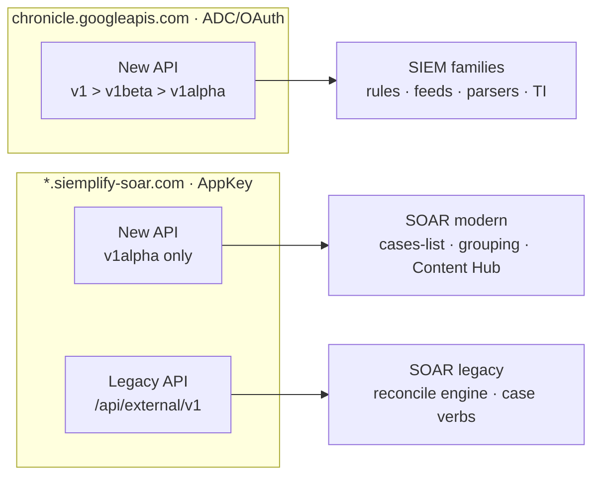

# Catalog & status

The source of truth for **what exists and how mature it is** — one status per
surface, updated in the same commit that moves the surface forward. Design in
[architecture.md](architecture.md); the API split by plane and unbuilt gaps in
[surfaces.md](surfaces.md); product specifics in [soar.md](soar.md) / [siem.md](siem.md).

This page is the **status spine** — the compact tables. Per-surface detail lives
in the auto-generated [command reference](../commands/README.md).

**Where the code is:** surfaces register in `internal/mirror/registry_{soar,siem}.go`
(playbooks: `soar_playbooks.go`; data_tables: `datatables_surface.go`;
connectors/jobs: `soar_operational_surfaces.go`); the
product-neutral engine is `internal/mirror/reconcile`; write-smokes are gated by
`SECOPS_SOAR_SMOKE`/`_WRITE` (`reconcile_smoke_test.go`) for SOAR and
`SECOPS_SIEM_SMOKE`/`_WRITE` (`reconcile_smoke_siem_test.go`) for SIEM.

**This catalog has a machine-readable spine.** The status matrix below is mirrored
by the surface-family registry in `internal/mirror/surface_families.go` — one
declarative `SurfaceFamily` entry per API family (`Area`, `Plane`, `Host`, `Auth`,
`Generation`, `APIVersion`, `Lane`, `Status`, `SDKLocation`). SIEM versions in the
registry are sourced from `chronicle/versions.go` (the `APIVersions` map, the single
source of truth for Chronicle-host version pins), and a drift-guard test
(`surface_families_test.go`) asserts the registry, the version pins, and
[architecture.md](architecture.md) §6 stay in agreement.

**Status legend**

| | Status | Meaning |
|:-:|---|---|
| 📐 | **designed** | spec'd, code not landed |
| 🔨 | **built** | code lands |
| ✅ | **verified** | reads round-trip clean / a write smoke ran |
| 🔒 | **read-only by choice** | write deliberately not run — RBAC/SSO/high-blast/routing |
| ⛔ | **blocked** | that API path is down server-side (500/404) |
| — | **not used here** | secopsctl doesn't use that API generation for this function |

## How this catalog is sliced

By **function** (cases, rules, playbooks, …) — one row each — grouped into three
areas: **SIEM**, **SOAR**, and cross-cutting **other features** (Threat Intel,
Content Hub). A function can be served by **two API generations**, tracked in
**two columns**, and each column records **status · domain · version**:

- **New API** — Google's modern REST (`projects/…/instances/…` shape). The cell
  reads `<status> <domain> · <version>`, e.g. `✅ chronicle · v1alpha` or
  `✅ siemplify · v1alpha`. **Domain** is a property of the call, not the section —
  the **same function can answer on either domain**. We prefer **v1 > v1beta >
  v1alpha** and pin the version that works per surface (full per-endpoint map:
  [architecture.md](architecture.md) §6).
- **Legacy API** — the Siemplify **external** API (`/api/external/v1`, AppKey, on
  the siemplify domain). SOAR-only; the broad, reliable path the reconcile engine
  and the case verbs run on.

**The two domains** (both are just where the call goes):

- **chronicle** = `chronicle.googleapis.com` (Google), regional, **ADC/OAuth**.
  Serves v1 / v1beta / v1alpha.
- **siemplify** = `*.siemplify-soar.com` (Siemplify), **AppKey**. The modern API
  here is **v1alpha only** (v1/v1beta 404).

A `—` means secopsctl doesn't use that generation for the function. A function is
**not** "blocked" just because one domain/version is down — the status is per
column+domain; if any path serves it, the function works (e.g. **cases** works on
siemplify v1alpha even though the chronicle-host UUID path 500s).

---

## SIEM — Chronicle (`chronicle.googleapis.com`, ADC/OAuth)

Modern-only: the Legacy (Siemplify external) column is `—` throughout — Chronicle has no legacy external API.

### Control plane — config as code (`pull` → `git diff` → `push`)

| Function (CLI) | Lane | Status (marker · domain · version) | Notes |
|---|---|---|---|
| `rules` | bespoke | ✅ chronicle · v1alpha | YARA-L source + deployment state machine; multiple CLI verbs + rule-tuning reads + batch update. `push rules-create` retries deploy with backoff (W118). `rules validate` prints every diagnostic with line/col and hints the `#`-in-outcome fix (W129). `rules review` monitor-mode promotion report (enabled+not-alerting, detection-sorted, table/json/csv; W132). |
| `reference_lists` | reconcile + imperative | ✅ chronicle · v1alpha | Typed `.txt`+`.yaml`; NoDelete; resource-name normalization; empty-list canonical fix. |
| `data_tables` | reconcile | ✅ chronicle · v1alpha | `.csv`+`.yaml`; columns immutable after create; rows wholesale destroy-and-replace; `data-tables import` bulk CSV import with append/replace modes (W132). |
| `feeds` | reconcile | ✅ chronicle · v1alpha | `.yaml`; secrets redacted on pull, overlaid on update; `secret_ref` env/Secret Manager; not prune-eligible; `feeds list` shows last-activity + `--failed` filter (W131). |
| `parsers` | reconcile | ✅ chronicle · v1alpha | Versioned/immutable; edit = create-new-version + activate (push waits for the async validation to settle before activating; on FAILED it reports the parsing errors); parser-dev loop (`run` with per-event error/parsedFields/failedFieldsAndErrors diagnostic output, `--cbn` required, `validate`); extensions (list/get/create/activate/delete/update-in-place + extract discover/create + setting read/update + `tips` embedded authoring guide); `update` compound delete→create→validate→activate (W132); conf-only create; custom-parser discovery on pull; `upgrade` (preview + activate release candidate); `rollback` (revert to last used version); `delete` per-version (guarded; refuses an ACTIVE version without `--force`); `deactivate` (revert custom parser to prebuilt, auto-selects ACTIVE CUSTOM); `activate` accepts log-type alone (auto-selects latest INACTIVE CUSTOM); `versions` shows validation_stage + version + release_stage; pull and reconcile prefer the CUSTOM parser version when a prebuilt is also active. |
| `dashboards` | reconcile | ✅ chronicle · v1alpha | Custom dashboards; `create`/`get`/`edit` (metadata + access); `charts` (list/get/add/batch/edit/remove/run — 9 chart types, reserved-word help in `charts add`; `run --table` tabular output; `add` auto-binds GlobalTimeFilter; `edit --title`/`--filters`; `list`/`get` show filtersIds+chartLayout; stacked-bar viz fix); `markdown` (add/edit/remove); `button` (add/edit/remove); `layout` (show/move); `filters` (show/set global time range; `set --apply-to all\|<ids>` binds GlobalTimeFilter to charts in one PATCH); `lint`/`fix`/`inspect` quality (lint also flags reserved variable names statically); `verify` (single + fleet; reserved-word queries flagged as errors before execution); `charts get` merges filtersIds (`[]` when unbound) + chartLayout, `--dashboard` for charts whose name carries no parent, lookup failures surfaced on stderr; `duplicate` + deep-copy; export↔import. |
| `curated` / `curated_rules` | reconcile + imperative | ✅ chronicle · v1alpha | Google-managed; batch enable/alerting reconcile; curated tuning reads; v1alpha only. |
| `rule_exclusions` | reconcile + imperative | ✅ chronicle · v1alpha | Findings refinements; NoDelete/NoEtag; guarded deploy toggle; write-validated. |
| `forwarders` | reconcile | ✅ chronicle · v1beta | `.yaml`; prune-eligible; collectors separate nested resource; SDK pinned v1beta (v1 404s). |
| `metric_definitions` | reconcile | 🔨 chronicle · v1alpha | Custom SOC metrics; textDefinition immutable; NoDelete; feature-gated 403 (Pre-GA). |
| `scheduled_reports` | reconcile | ✅ chronicle · v1alpha | Scheduled dashboard reports; full CUD; create sends bare dashboard UUID (server rejects full resource names); write-smoke validates shape (400 = domain whitelist, not the old 500). |
| `datataps` | reconcile | ✅ chronicle · v1alpha | Stream UDM events to Pub/Sub; prune-eligible; PATCH 501 so update = delete+create. |
| `error_notifications` | reconcile | 🔨 chronicle · v1alpha | Ingestion-health alerts to Cloud Monitoring channels; feature-gated 403, not verified. |
| `enrichment_controls` | imperative | 🔨 chronicle · v1alpha | Turn off UDM enrichment per log type; no patch, imperative only; feature-gated 403. |
| `federation_groups` · `tenants` (MSSP) | reconcile · read | 🔨 chronicle · v1alpha | Multi-tenant federation; MSSP-only (403 on single tenant); `multitenantDirectory` read-validated. |
| schema discovery | imperative (read) | ✅ chronicle · v1alpha | `feedSourceTypeSchemas`, `logTypeSchemas`, `logTypeSetting`, `logTypes.get`; read-validated. |
| `log-types` | imperative | ✅ chronicle · v1alpha | List (default: active feeds only, search/sort), get, create custom (auto `_CUSTOM` suffix); permanent — no delete/rename endpoint (API or console). |
| governance — `riskConfig` · `dataAccessLabels`/`Scopes` | imperative | ✅ chronicle · v1 | SDK-only (no CLI yet); write-validated; quirky create (persist-despite-error, list lag, tombstone). |

### Operational plane — query → act (live data)

> **Cases are a SOAR function, surfaced as one command** — the top-level `cases`
> command works the same case on the **siemplify** host, where every verb answers
> (`cases list` prefers v1alpha and auto-falls back to the legacy AppKey queue). The
> same case is also addressable on the **chronicle** host by UUID (ADC), but that
> collection errors at every version, so it is not surfaced — only `cases soar-id`
> (the UUID→id bridge) reads from chronicle. One case, several APIs.

| Function (CLI) | Lane | Status (marker · domain · version) | Notes |
|---|---|---|---|
| **events (UDM)** | operational (read) | 🔨 chronicle · v1alpha · REST | `search udm`, `search stats`; `search run`/`saved` library; NL→UDM is `gemini search` (W75, W81, v0.6.0); >90-day windows auto-chunk + merge, `--count-only` total-only probe, `--enrich-ip` geo columns (W128/130); `search run --param` query templates (W131); aggregation queries (`match:`/`outcome:`) auto-route from `search udm`/`search run` to the stats engine; `search stats --help` + docs/tips/14-stats-queries.md document the full YARA-L 2.0 section/aggregate syntax |
| **raw logs** | operational (read) | ✅ chronicle · v1alpha | Two paths: `search udm --raw` (UDM-scoped) and `search raw '<regex>'` (content-scoped, reaches unparsed logs) |
| **search output contract** | operational (read) | ✅ chronicle · v1alpha | v0.6.0: `--format jsonl\|json\|csv\|table`, `--fields` dotted UDM-path projection, `--out <file>`, `--all` (complete result set + total match count); `search event <id>`/`export`/`validate`; W128: `--out --meta` provenance sidecar, `event --extract` raw-JSON field projection, 10m bulk deadline + raw-fetch progress; `--raw --all` runs the complete-results engine before raw hydration (total count reported); single-chunk fetches show indeterminate stderr progress; stats tables render array outcomes comma-joined |
| **saved & shared searches** | operational + guarded | ✅ chronicle · v1alpha | v0.6.0: server-side `search saved list/get/run/save/share/unshare/delete`; `save`/`share`/`delete` guarded |
| **alerts** | operational | ✅ read · 🔨 act (CLI wired) | Read + act wired (W52); bulk disposition (W76); alert→case bridge read-validated |
| **entities** | operational (read) | 🔨 chronicle · v1alpha | `entities summarize`/`risk-scores`/`audit` (W133); enrichment read-only; tolerant `flexInt` for proto3 string-encoded counters; `audit` cross-refs risk scores with watchlist coverage (health, gaps, `--min-risk`, `--json`). |
| **audit** | operational (read) | ✅ chronicle · v1alpha | `audit user <email>` runs 6 standard UDM activity queries (login, admin, password, oauth, iam, resource) grouped by category; `--categories` subset filter, `--from`/`--to`/`--hours` window, auto-chunks >90 days, `--format table\|json\|jsonl\|csv`. |
| **watchlists** (`lists watchlists`) | operational (read) | ✅ chronicle · v1 | `lists watchlists list`/`get`; pinned v1 (`watchlistsAPIVersion`) |
| **analytics & AI reads** | operational (read) | ✅ chronicle (W17, `chronicle/analytics.go`) | Investigations + steps + risk scores + MITRE coverage + BigQuery export; writes gated |
| **alert AI investigation** (`gemini investigate`) | operational | ✅ chronicle · v1alpha | Per-alert Gemini TIN triage (W57); default shows existing result (no re-trigger), `--rerun` forces new, `--latest` read-only; v0.7.2: moved to `gemini` group (hidden alias at `alerts investigate`) |
| **Gemini NL→UDM** (`gemini generate-query`/`search`) | operational (read) | ✅ chronicle · v1alpha | v0.6.0: `generate-query` translates NL→UDM (no run); `search` translates + runs (same output flags); honors the model's suggested time window; one-time `--opt-in`; v0.7.2 reorg: all AI under `gemini` group (`investigate`, `summarize`, `generate` also live here; hidden aliases at old locations); `search generate-query` alias *(built)*. |
| **Gemini assistant** (`gemini ask`) | operational (read) | ✅ chronicle · v1alpha | YARA-L / UDM Q&A; verified (W56); HTML blocks rendered as prose; `--opt-in` |
| **findings graph** (`findingsGraph`) | operational (read) | ✅ chronicle · v1alpha | Graph-pivot from detection id (W56); SDK-only (`chronicle/findings_graph.go`) |
| **alert enrichment** (`alerts enrich`) | operational (read) | ✅ chronicle · v1alpha | Full per-alert detection collection (rule + UDM events + entities + triage) via `legacy:legacyBatchGetCollections` — the surface the console uses. The `enrichmentAgent:*` path (W56) is a dead 500 and unused by the console; the pre-case action verbs that rode it are withheld (the in-case equivalent is `cases run-action`). |
| **watchlist membership** | imperative | 🔨 chronicle (shape validated; op gated per instance) | `lists watchlists add-entity`; UDM Entity envelope required; membership can 501 per instance |

## SOAR — Siemplify (`*.siemplify-soar.com`, AppKey)

Two API generations on this domain: **New** = modern v1alpha (same
`projects/…/instances/…` shape as SIEM, **v1alpha only** — v1/v1beta 404);
**Legacy** = the external `/api/external/v1` API — the broad, reliable path. The
reconcile engine and the case verbs run on **Legacy**; secopsctl reaches for New
only where it's validated and adds something Legacy lacks. `--legacy` forces Legacy.

### Control plane — config as code (`soar pull` → `git diff` → `soar push`)

All reconcile surfaces run on the **Legacy** engine (reliable). A modern v1alpha
twin exists on the SOAR domain for most; the reconcile engine doesn't route to it
yet (`—`), but the v1alpha **writes are validated** for several config surfaces
(create→get→delete on customLists/socRoles/caseTagDefinitions; environments create
reachable but license-capped) — they do **not** 500 (`TestLiveConfigSurfaceWriteSmoke`),
so `—` is a routing choice, not an API gap. `soar pull <target> --prune` removes
local files whose live counterpart no longer exists, so the mirror is an exact 1:1
reflection; refused on an incomplete listing to prevent false deletions.

| Function | Lane | Status | Legacy | Notes |
|---|---|---|---|---|
| `webhooks` | reconcile | — | ✅ | Full CUD; create is license-capped. PruneEligible. |
| `environments` | reconcile | ✅ siemplify · v1alpha | 🔒 | Modern write validated; legacy NoDelete (high blast). |
| `networks` | reconcile | ✅ siemplify · v1alpha | ✅ | Write-validated RFC5737 throwaway. PruneEligible. |
| `tracking-lists` | reconcile | — | ✅ | First write-loop proof (clone throwaway). |
| `soc-roles` | reconcile | ✅ siemplify · v1alpha | ✅ | RBAC. Engine-NoDelete; `--prune` never deletes. |
| `idp` | reconcile | — | ✅ | SSO; id-from-body update closure. Engine-NoDelete. |
| `visual-families` | reconcile | — | ✅ | Write smoke; validates `wrapKey` envelope. PruneEligible. |
| `sla-definitions` | reconcile | ✅ siemplify · v1alpha | ✅ | Affects alert routing. Engine-NoDelete. |
| `case-stages` | reconcile | ✅ siemplify · v1alpha | ✅ | Wrapped list. Engine-NoDelete (UI-pollution). |
| `case-tags` | reconcile | ✅ siemplify · v1alpha | 🔨 | Modern create→get→delete verified. |
| `close-root-causes` | reconcile | ✅ siemplify · v1alpha | ✅ | Modern create/delete wired; non-unique names test slug-collision fix. |
| `blacklists` | reconcile | 🔨 siemplify · v1alpha | ✅ | Read + create/get/delete wired; writes reach endpoint (HTTP 400, not 500) but enums undocumented — not write-validated. |
| `playbook-categories` | reconcile | — | ✅ | Write smoke. |
| `playbooks` | reconcile (bespoke) | — | ✅ | uuid rotates → key on name; whole-body save. No New twin. |
| `connectors` | reconcile | — | ✅ | Full CUD on Legacy engine. PruneEligible. |
| `connector-allowlist` | reconcile (derived) | — | ✅ | Alert allow-list view over connector instances. |
| `jobs` | reconcile | — | ✅ | Legacy engine; NoDelete (delete takes a body, not a clean id). |
| `grouping` | reconcile (modern) | ✅ siemplify · v1alpha | — | Alert-grouping rules on v1alpha SOAR host; bespoke Surface. |
| `case-data` | imperative (modern) | ✅ siemplify · v1alpha | — | Wave 16. SDK full CRUD; no CLI wired yet. |

### Operational + imperative — query → act / per-entity verbs

| Function (CLI) | Lane | New API | Legacy | Notes |
|---|---|---|---|---|
| `cases list` / `get <id>` | operational read | ✅ siemplify · v1alpha | ✅ get; list fallback | Cases on v1alpha siemplify domain; auto-falls back to legacy `ListCaseCards`; `--legacy` forces legacy. |
| `gemini summarize` / `cases counts` / `cases alert recommend` (AI) | operational read | ✅ summarize · ✅ counts · 🔨 recommend create leg — siemplify · v1alpha | — | W56 AI-assist reads; W59 counts; recommend CREATE works, fetch leg not served (400). v0.7.2: `summarize` moved to `gemini` group (hidden alias at `cases summarize`). |
| `cases run-action` | imperative | ✅ siemplify · v1alpha | ✅ | Runs any installed integration action on a case; guarded; guarded. |
| `cases simulation` | imperative | ✅ siemplify · v1alpha | ✅ | Full simulation CRUD + export/import. W118 adds `--event-field`/`--alert-field`, `export`, `import`. |
| `cases <verb>` (assign/rename/stage/tag/untag/describe/importance/priority/close/reopen/merge/incident + `comment add` + `report`) | imperative | — | ✅ 11 verbs · 🔨 W52 (smoke extended, gated) | 11 verbs; W52 base; v0.7.2 adds `incident` (mark/unmark) + `report` (PDF/CSV/XLSX/DOC export). |
| `cases alert <verb>` (close/priority/move/reopen) | imperative | — | 🔨 smoke extended, gated | Per-alert triage (W52); guarded. |
| `gemini generate` (AI playbook drafting) | imperative | 🔨 siemplify · v1alpha (guarded) | — | W56 Gemini drafting; creates a draft on the instance; guarded. Write smoke gated. v0.7.2: moved to `gemini` group (hidden alias at `playbooks generate`). |
| `playbooks` operational helpers | operational read + guarded execution | — | ✅ | Waves 39 + 51 + 55; lifecycle ops, export (JSON + `--zip` platform bundle), import (from ZIP), deploy toggle, batch delete, step insert, run/debug/rerun. |
| `playbooks get` / `list` / `lint` / `health` / `diff` / `duplicate` / `move` / `categories` | operational read + guarded mutation | ✅ duplicate · categories — siemplify · v1alpha | ✅ | W118+W120; authoring inspection + folder management. `duplicate` uses modern v1alpha primary with `--folder`/`--env`, legacy+export→save fallback. `categories` (alias `folders`): list/create/rename/delete. `move`: relocate playbook to a category. |
| **playbook authoring palette** (`playbooks components`) | operational read | ✅ siemplify · v1alpha wildcard catalogs | — | W58 designer palette as CLI catalogs; built. |
| `soar jobs` operational helpers | operational read + guarded execution | ✅ siemplify · v1alpha (modern default, legacy fallback) | 🔨 | Instance list/get/set/delete/run on the modern jobInstances surface via `preferModern`; flag-based `instance create` (interval or advanced once/daily/weekly/monthly schedules; `--param` resolved against the job-def spec); `instance history` per-run execution logs with `--status` filter; `revision list/create/rollback/delete` job-definition snapshots; legacy `jobs run`/`logs`/`template` retained. |
| `soar push bulk-close` | imperative | — | 🔨 | Queue bulk-close with typed reason enum. |
| `soar settings case-assignment` / `move-case-policy` (`get`/`set`) | imperative | — | 🔨 | Singleton routing policies; guarded `set`. |
| `soar settings grouping` (`get`/`set`) | imperative (modern + legacy) | ✅ read · ✅ write — siemplify · v1alpha + legacy | — | W80/W107; full General/Overflow property bag (Timeframe/overflow/co-grouping) read+write via moduleSettings; legacy max-alerts-per-case singleton is read-only. |
| `soar settings api-keys` (list/create/revoke) | operational | — | ✅ | W60; key value shown once, never logged. |
| `idp-mappings` | imperative | ✅ siemplify · v1alpha | — | SDK-only (no CLI). 500s on chronicle; answers on SOAR host. Built. |
| `form-dynamic-parameters` | deferred | 🔒 siemplify · v1alpha (unsafe PUT) | 🔒 read | Not wired; PUT silently resets `formType` to Invalid. |
| `soar legacy call <op>` | raw | — | ✅ | Passthrough for integrations, ontology, settings, environment-priorities, permissions. |

## Other features — cross-cutting (domain varies per row)

Grouped by feature, not by domain. The New-API cell names the domain because these span both Google (chronicle) and Siemplify (siemplify).

### Threat Intelligence (Mandiant / Emerging Threats)

| Function (CLI) | Lane | New API (status · domain · version) | Legacy | Notes |
|---|---|---|---|---|
| `ti collections` / `collection <id>` / `collection-matches` / `related` | operational read | ✅ chronicle · v1 | — | Mandiant `threatCollections`; list/get read-validated; related pivots built + offline-tested; pinned v1; uses project number. |
| IoCs — `ti find` / `ti get` / `ti related` | operational read | ✅ chronicle · v1 | — | Modern IoC lookup, read-validated; type auto-detected; SDK in `chronicle/ti.go`; related pivots built + offline-tested. |
| `ti associations` / `related-associations` | operational read | ✅ chronicle · v1 | — | IoC associations (malware families / threat actors): batchGet by id (chunked ≤80 names/call), get, fetchRelated pivots from an IoC/collection/association; resource names use numeric project. |
| `ti coverage` / `ti filters` | operational read | ✅ chronicle · v1 | — | `coverageDetails` rule↔threat-collection coverage mapping (filtered by collection ids, chunked ≤40/call) + the threat-collection filter-set metadata (JSON-only; path form carries a DEVIATION note pending a live probe). |

### Content Hub & integrations

Installing content (integration packages and the connector/job/action definitions they carry) and the marketplace catalog. Configured integration instances are environment-scoped and operated imperatively. All on the siemplify domain.

| Function (CLI) | Lane | New API (status · domain · version) | Legacy (siemplify · external) | Notes |
|---|---|---|---|---|
| `content-hub list` / `get` / `contentpacks` / `browse` / `diff` | imperative read | ✅ siemplify · v1alpha | — | Content Hub reads; 405 integrations + 59 packs; `diff` shows installed-vs-latest comparison; text/JSON output fixes (W122); displayName + installed/deployed tags fixed (W123). |
| `content-hub install` / `uninstall` / `featured install` | imperative | ✅ siemplify · v1alpha | 🔨 (`/store`) | Marketplace install pair + featured-content install (uid-based path); guarded; install round-trip verified (W11, W110, W122). |
| `info soar-integrations` | operational read | 🔨 siemplify · v1alpha | 🔨 | Coverage report joining packs with runtime cards; flags config/runtime gaps; built + offline-tested. |
| `info cron` | offline utility | — | — | Scans local scheduler files + pulled SOAR JSON for scheduled automation; no API call. |
| `soar ide build-playbook` / `playbooks mold` / `playbooks trigger set` | offline utility | — | — | Composes save-ready playbook JSON from an exported base; offline-only; built + offline-tested. |
| `integrations scaffold` / `soar ide package-integration` | offline utility | — | — | Scaffolds Python custom integration dirs; packages to ZIP for IDE import; no API call. |
| `commands` / `status surfaces` / `status capabilities` / `status enums` | offline utility + live probe | — | — | Machine-readable registries; W73 rich flag schema + `status capabilities` live probe; `status enums` lists SOAR integer-to-name enum mappings (CasePriority, CloseReason, SLA types, BlockList types, WorkflowsStatus); `--live` fetches instance-specific values (case stages, playbook categories); `--json` for machine output; *(built — offline-tested)*. |
| `mcp serve` / `mcp install` | offline utility | — | — | W139–140; MCP server over stdio — auto-generates tools from cobra tree + serves docs/tips as resources. Progressive tool disclosure via `listChanged`: initial listing shows ~36 tools (standalone + promoted + category routers); calling a category expands its sub-tools on demand. `install` registers in `.mcp.json`. No external deps; zero-config once `secopsctl config` is done. |
| `docs generate` (hidden) | offline utility | — | — | W127; generates the per-group command-reference pages (`docs/commands/`) + index from the command tree and syncs the sidebar block; `--check` is the CI freshness gate. |
| structured `--json` errors + dry-run plan | output contract | — | — | W73 verified; stderr structured error envelope + stdout dry-run change plan. |
| global `--output table\|json\|csv` | output contract | — | — | W127; `--output json` ≡ `--json` everywhere; table/csv on the format-aware commands (`query udm`, `mitre`, `rules health`), where a local `--format` overrides it. |
| global `--no-progress` | output contract | — | — | W133; suppresses carriage-return streaming progress on stderr (also suppressed by `--json` or non-TTY stderr). Wired into `pull all`, `search udm --raw`, `rules run-test`. |
| `integrations list` / `uninstall` / `rename` | imperative | ✅ siemplify · v1alpha | — | Lists installed packs (`--instances` nests configured instances, tags `[renamable]`); uninstalls custom-only; `rename` patches a non-system instance's displayName via v1alpha PATCH + updateMask. |
| `integrations connector list` / `delete` | imperative | ✅ siemplify · v1alpha | — | Connector definitions inside a pack; delete custom-only; built. |
| `integrations get` | operational read | ✅ siemplify · v1alpha + legacy | — | W118; rich detail: version, instances across envs, playbook usage. |
| `integrations test` | operational read | ✅ siemplify · legacy | — | W118; connectivity test for an integration instance (default or `--instance`). |
| `integrations create` / `instances` / `configure` / `delete` (instances) | imperative | — | 🔨 | Integration instances; not reconcilable; CRUD with auto-resolve + configure overlay; built. |
| `integrations install` (+ pack `:install`/`:uninstall`) | imperative/raw | ✅ siemplify · v1alpha (`:install`/`:uninstall`) | 🔨 (`/store`) | Installs marketplace pack via v1alpha; built. |
| `integrations action` / `job-def` (template/create/update/delete) | imperative | ✅ siemplify · v1alpha | 🔨 | Python definition authoring loop (W60+W65); built. |

## How to keep this current

When a surface advances: edit its row here **and** the relevant design doc in the
**same commit**. A surface reaches `✅` only after a read round-trips clean and
(for writes) a gated smoke passed on an inert throwaway — see the build discipline
in [architecture.md](architecture.md) §5.

A `⛔` belongs to a **specific column + domain + version** that's down — never to a
whole function. If the function works on *any* path (another domain or version),
its row stays green and the dead path is a **note** (as with cases: ✅ on siemplify
v1alpha; the chronicle-host UUID path 500s, noted, not blocking). When the working
version of a Chronicle-host New-API surface moves, change the pin in
`chronicle/versions.go` (the `APIVersions` map), then update the cell's
`domain · version` here and the §6 table in [architecture.md](architecture.md). The
surface-family registry (`internal/mirror/surface_families.go`) reads its SIEM
versions from that map, and the drift-guard test fails if the three fall out of sync.
