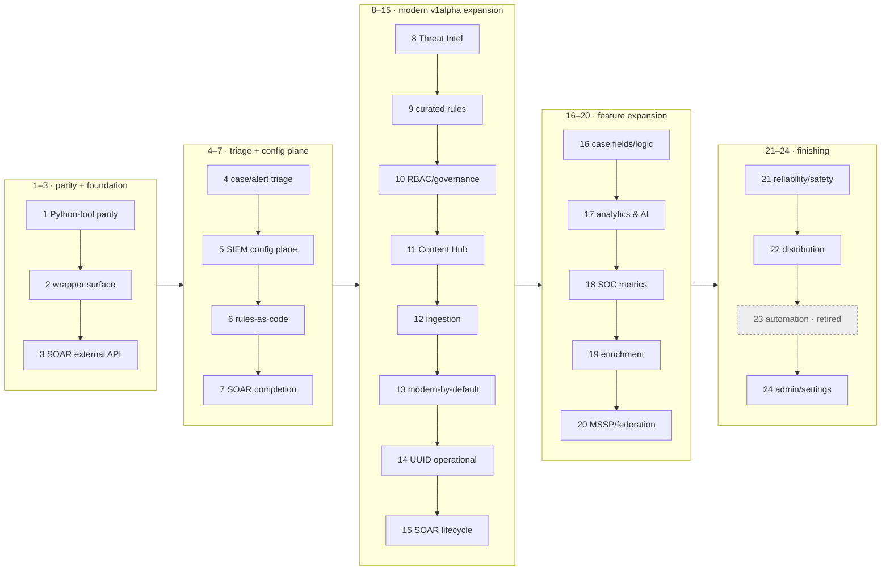

# secopsctl / Go SDK — Roadmap

The **forward plan and wave sequencing** for `secopsctl` (CLI + Go SDK). Live
build/validation status lives in [catalog.md](catalog.md) — this doc does not
re-track maturity (it would drift). Guiding rule: **design cleanly, port the
parity slice first, then finish the surface**, improving on the official Python
wrapper where it is weak (see the `// DEVIATION:` markers in code).

## 🗺️ Package map

```
danny.vn/secops
├── auth/         split credentials: OAuth/ADC (SIEM) + API key/AppKey (SOAR, key-auth)
├── chronicle/    the SIEM SDK (pure API, typed structs, no file I/O)
├── config/       instance config (YAML) load/validate/defaults
├── internal/
│   ├── cli/      cobra command tree (secopsctl)
│   └── mirror/   pull/push file mirroring on top of chronicle
└── cmd/secopsctl main
```

Future SecOps products are **sibling packages** so `chronicle` stays focused —
today that is `danny.vn/secops/soar`. (Third-party EDR and chat/notification
integrations are explicit non-goals; see below.)

## 🌊 Wave map

Waves are done **strictly in order** — the number *is* the sequence. Per-surface
maturity is in [catalog.md](catalog.md); this is the shape of the plan.



---

## Wave 1 — parity with the legacy Python tool *(shipped — status in CATALOG)*

Feature parity with the original `secopstips`:

| Area | SDK (`chronicle/`) | Mirror / CLI |
|---|---|---|
| Rules | `rules.go` — List/Get/Validate/Create, deployments | `pull_rules`, `push` (create + disable) |
| Reference lists | `reflists.go` | `pull_reflists` |
| Data tables | `datatables.go` | `pull_datatables` (CSV) |
| Dashboards | `dashboards.go` | `pull_dashboards` (export CUSTOM) |
| Curated | `curated.go` | `pull_curated` + `pull_curated_rules` |
| Feeds | `feeds.go` | `pull_feeds` (secret redaction) |
| Parsers | `parsers.go` | `pull_parsers` (active CBN) |
| UDM search | `search.go` | `query udm` |

CLI: `info`, `pull <target>`, `push <target>` (dry-run-guarded), `query udm`.

### Deviations from the official wrapper (intentional)

- **Explicit project form** per endpoint instead of 404-then-retry trial/error.
- **Typed structs** instead of `map[string]any` + `.get()` chains.
- **Typed `*APIError`** (status + body) surfaced, not swallowed by broad `except`.
- **One generic paginator** (`paginate`) instead of per-method token loops.
- **Split, lazy auth** — many features need no ADC.
- Rule companion `.yaml` stores a **typed deployment subset** for deterministic
  round-trips (legacy stored the raw API dict).

---

## Wave 2 — finish the `secops-wrapper` (v0.44.x) surface *(mostly landed)*

Most of this surface has **already landed as `chronicle/*.go` files** (`case` ·
`alert` · `entity` · `ingest` · `stats` · `nl_search` · `gemini` · `data_export` ·
`investigations` · `watchlist` · `retrohunt` · `rule_exclusion` · the `*_write.go`
writers · …); the remaining gap is **CLI verbs over the already-built SDK** plus the
few unbuilt files below. Per-file status is in [catalog.md](catalog.md). Read the
matching `third_party/secops-wrapper/src/secops/chronicle/*.py` when implementing.

- **Rule writes & lifecycle** (`rules.go`/`rule_exclusion.go`/`rule_retrohunt.go`):
  UpdateRule (etag), DeleteRule, enable/alerting toggles, retrohunts
  (create/get/list), rule exclusions (+ deployment, activity), list detections,
  list errors, search rule alerts.
- **Entities & IoCs** (`entity.go`): SummarizeEntity (IP/domain/hash/user),
  ListIoCs (Mandiant prioritization).
- **Cases & alerts** (`case.go`, `alert.go`): get/list/patch/merge cases, get/
  update/bulk-update alerts, bulk case ops (tag/assign/priority/stage/close/reopen).
  Note: one case has two ids — a UUID on the Chronicle API and an integer on the
  SOAR AppKey API (same record, not two cases); the reliable path is SOAR (Wave 3).
- **Investigations** (`investigations.go`).
- **Reference-list / data-table / feed / parser / dashboard WRITES**: create/
  update/delete + replace-rows, parser run/copy/activate, parser extensions,
  dashboard create/import/add-chart/execute-query. Each extends its Wave-1 file.
- **Ingestion** (`ingest.go`): IngestLog, IngestUDM, ImportEntities.
- **Forwarders** (`forwarders.go`), **log-processing pipelines** (`log_pipeline.go`).
- **Data export** (`data_export.go`): create/get/list/cancel, available log types.
- **Watchlists** (`watchlists.go`).
- **Analytics & AI**: `stats.go` (get_stats), `nl_search.go` (NL→UDM + search),
  `gemini.go` (query_gemini, opt-in), `log_types.go` (list/classify/describe).

Cross-cutting to add in Wave 2: per-resource etag round-trip on updates, view
enums (rule/reference-list/dashboard), and a streaming/`--as-list` pagination
helper for very large lists.

---

## Wave 3 — features the wrapper does NOT cover

Kept generic and tenant-neutral. **Full design:
[`soar.md`](soar.md)** — read it before implementing.

- **SOAR (`soar/`)** — one host, one AppKey, **no ADC**. The **AppKey legacy external
  API (`/api/external/v1`) is the reliable, most-complete surface** and backs the
  reconcile engine (14 surfaces) + the `soar case` verbs; the **modern v1alpha
  methods are new, pull/patch-only, and 500 intermittently**. The tiers:
  - **Legacy AppKey** `soar/legacy/` — the durable, broad SDK the engine runs on
    (reliable). *Not* a quarantine; see [soar.md](soar.md).
  - **Bridge** `legacyPlaybooks:legacy*` — v1alpha host, legacy op names; the one
    genuinely delete-when-native-ships piece. Gotchas: UUID rotates on save
    (re-resolve by name), int→str coercion, name charset, whole-body replace.
  - **Modern** v1alpha native — integrations · connectors · jobs · grouping ·
    cases; pull + patch only today (flaky), not the primary build path.
  - `soar (modern) → soar/internal/transport ← soar/legacy` (modern never imports legacy).
- **Chronicle `legacy:` verbs** `chronicle/legacy.go` (ADC) — `legacyFindRawLogs`,
  `legacyBatchGetCases` (SOAR integer-id ⇄ SIEM uuid map). Modern v1alpha endpoints
  that carry a `legacy` path segment — New-generation, NOT the Siemplify external API.
- **Connectors & cron jobs**: connector/job instance configs pulled/patched via the
  v1alpha SOAR surface; scheduled runners (case hygiene) — generic scaffolding here,
  kept tenant-neutral.
- **Config secret-at-rest (planned)** — `secopsctl config` writes
  `~/.secopsctl/instance.yaml` (`0600`, git-ignored). v1 stores the SOAR AppKey in
  **plaintext**. v2: encrypt the AppKey at rest bound to the current OS user —
  Windows DPAPI, macOS Keychain, Linux libsecret/Secret Service — decrypted
  in-process at run time. Needs per-OS implementation **and cross-platform tests
  (Linux, Windows, macOS)** before it ships; until then plaintext + `0600` is the
  documented behavior. The mintable OAuth token stays out of the file entirely.

### Wave 3 build-out — SOAR external API (Siemplify `/api/external/v1`) full surface

**Why the external API (not keyless-over-ADC):** the modern v1alpha SOAR methods on
`*-chronicle.googleapis.com` (`generateSoarAuthJwt`, `soarDomains.list`,
`integrations`) require the caller to be a **workforce-identity-federated SOAR
user**; a plain ADC/OAuth token (even with `roles/chronicle.soarAdmin`) is rejected
by the SOAR backend (404/500). The official Python `secops` SDK hits the same wall.
So the **AppKey-authenticated Siemplify external API is the path that works** for
real tenants — and it is by far the most complete surface.

**Reference spec:** local, git-ignored cache
`third_party/siemplify-swagger.json`, refreshed from the public Swagger UI
`https://app.siemplify-soar.com/swagger/index.html` (JSON:
`https://app.siemplify-soar.com/swagger/v1/swagger.json`) — *Chronicle SOAR API*,
OpenAPI 3.0.1, **448 paths / 484 operations / 27 tags**, global security
`AppKey` (header), base `/api/external/v1`. This is the authoritative map for what
to implement. Goal: **support as many users/operations as feasible**, built on the
existing `soar/legacy` tier + `soar/internal/transport` (External, AppKey).

> **Swagger caveat — trust the shape, not the nullability.** The spec is an
> accurate map of paths and field *names*, but its `nullable: true` annotations on
> collection fields are unreliable: e.g. `CreateManualCase` marks
> `entities`/`playbooks`/`tags` nullable, yet the server NPEs (500) if they arrive
> as `null` — they must be sent as `[]`. When a write 500s with the generic
> `errorCode 2000`, diff your request against the **real UI request** (browser
> dev-tools) before assuming the endpoint is broken; the difference is often an
> omitted-vs-empty collection or a value the swagger claims is optional.

Priority order (config + automation that fits pull → diff → push; skip UI/runtime
noise like Homepage, CommandCenter, Agents, Reports, Dashboards):

1. **Connectors** (9) — CRUD, cards, templates, fetch-sample-data, statistics.
2. **Jobs** (10) — installed/templates, instances CRUD, run.
3. **Integrations** (9) — installed integrations, instance config + settings.
4. **Playbooks** (45) — CRUD, export/import, enable/disable, categories.
5. **Ontology** (18) — entity mappings/relations (config-as-code).
6. **Case Management** (135) — automation subset: close, comment, tag, assign, queue.
7. **Settings** (89) — config subset: environments, networks, blacklists.

**Discipline (Wave-3 testing):** smoke-test live with the AppKey; **read endpoints
broadly** (safe), **write endpoints minimally** with create → verify → **delete only
what we created** (every write hits a live production instance). **Do NOT `git push`
until the user confirms.**

---

## The path to the final secopsctl — forward waves (4+)

**Definition of done.** An operator runs *all* of Google SecOps as code and triages
live data from the terminal: full config-as-code (every reconcilable surface, both
products) with safe pull → diff → push + prune + drift-detection; full operational
triage (query → guarded act) for cases/alerts over the **reliable** path; reliable
against Google's flaky new APIs; secure (secret-at-rest, leak guard, no token on
disk); and operable (CI, releases, completions, docs). Each wave ends **validated**
(read round-trips clean; a gated write-smoke ran on an inert throwaway) with its
CATALOG rows moved forward and design docs updated in the same change.

**Waves are done strictly in order** — one wave fully built **and validated** (its
CATALOG rows moved forward, its design docs updated) before the next begins. The
number *is* the sequence. Per-wave: **Goal · Scope · Exit · Docs.** Live status per
surface lives in [catalog.md](catalog.md).

### Wave 4 — Case + alert triage (SOAR AppKey — the reliable lane)  *(done — reads live-validated; all 9 case verbs live-validated end-to-end)*

- **Goal.** Finish the daily triage workflow on the path that is reliable. Small,
  unblocked, high-value — the SDK already exists, this is CLI plumbing + validation.
  (Same case, two APIs: this wave uses the reliable SOAR AppKey lane; the Chronicle
  UUID API reaches the same case but is flaky.)
- **Scope.** Wire the missing **reads** on the AppKey lane: `soar case list`
  (`ListCaseCards`; `--status`/`--limit`/`--json`) and `soar case get <id>`
  (`GetCaseFullDetails` → the case **and its alerts**). Complete the query → review →
  act loop over the verbs already built (`soar case` mutates + `soar push bulk-close`).
- **Exit.** Live read-validated; act verbs dry-run-validated (live mutate on a
  throwaway-safe case only).
- **Docs.** SOAR-DESIGN, SIEM-DESIGN (the cases-are-one-case bridge), CATALOG.

### Wave 5 — SIEM config plane onto the engine  *(done — `data_tables`/`parsers`/`feeds`/`dashboards`/`rule_exclusions` on the engine + `curated` toggles + SIEM write-smoke harness; read **and write** live-validated)*

- **Goal.** Turn SIEM config-as-code from one surface into the whole plane.
- **Scope.** Wire `data_tables` → `feeds` → `parsers` → `dashboards` → `curated`
  (read + enable/disable) onto the shared reconcile engine; add a SIEM write-smoke
  harness (`SECOPS_SIEM_SMOKE` / `_WRITE`). `data_tables` first — its
  `ReplaceDataTableRows` is a wholesale destroy-and-replace, exactly what the
  dry-run guard is for. Resolve the `feeds` `assetNamespace`(read)/`namespace`(write)
  mismatch with a live smoke before wiring it; `parsers` are immutable (Create+Delete).
- **Exit.** Each surface pulls clean + a gated write-smoke passes; CATALOG → ✅.
- **Docs.** SIEM-DESIGN (plan → built), CATALOG, ARCHITECTURE §3.

### Wave 6 — Rules as code (finish the one bespoke surface)  *(done — `rules-update`/`rules-deploy` + `rules` detections/errors/alerts/retrohunt; lifecycle write-smoke passed)*

- **Goal.** Full rule lifecycle as code (rules stay bespoke: YARA-L source + a
  deployment state machine, not one canonical body).
- **Scope.** Over the existing `rules_write`/`rule_exclusion`/`retrohunt`/`rule_results`
  SDK: update (etag), enable/alerting toggles, retrohunts, exclusions, list
  detections/errors, search rule alerts. New `push rules-update` etc.
- **Exit.** Live read-validated + a gated write-smoke on a throwaway rule.
- **Docs.** SIEM-DESIGN, CATALOG.

### Finishing the "done" waves — write-validation gaps

A few write paths in shipped waves were built + read-validated but not yet
live-write-validated. Status after closing them:

- **Wave 5 — `parsers`**: now ✅ — gated write smoke `TestLiveReconcileParserWriteSmoke`
  runs `RunParser` (pure inert logic validation — no server state) then creates a new
  **INACTIVE** version from a real active parser's source, asserts it never goes ACTIVE
  (so live ingestion is untouched) and that the borrowed log type's active parser is
  unchanged, then deletes the throwaway. Deliberately skips `activate` — the only
  ingestion-affecting call. The `RunParser` response decodes `parsedEvents` as an
  object `{events:[{event:…}]}`, not a bare array.
- **Wave 5 — `reference_lists`**: now ✅ — write live-validated. There is no delete (and
  no archive) API, so the smoke can't be a throwaway-and-delete; instead
  `TestLiveReconcileReferenceListWriteSmoke` reuses one fixed, clearly-labeled inert
  list and drives a create-or-reuse + one update each run (fresh description + entries
  → always-present update, rerunnable, no accumulation). Reconcile identity is kept
  stable: create echoes the project NUMBER in the returned resource name while list
  echoes the project ID, so the SDK normalizes both to the id form (the engine keys
  identity on the name).
- **Wave 5 — `feeds`**: ✅ — write live-validated (incl. GCS V2 / Storage Transfer
  Service); short-`logType` expansion fixed; `FetchFeedServiceAccount` added.
- **Wave 4 — `soar case` verbs + `bulk-close`**: now ✅ — live-validated end-to-end by
  `TestLiveSOARCaseVerbsWriteSmoke` (create two throwaway cases → rename/describe/
  importance/priority/tag/untag/stage → merge → close). The legacy server doesn't
  null-guard `entities`/`playbooks`/`tags`, so omitting them returns a 500 *after*
  creating the case (the UI sends those as `[]`). `CreateManualCase` is typed
  (`ManualCaseRequest`, returns the new case id) and always sends those collections as
  `[]`; the transport does not retry non-idempotent POSTs on 5xx (a retry would
  duplicate the half-created case). `merge` needs the target id inside `casesIds` (the
  CLI adds it); hard delete (`RetentionDeleteCases`) is 403 for the AppKey role, so the
  smoke cleans up by closing (re-run-tolerant; a retention grant would make it
  zero-residue).

### Wave 7 — SOAR completion  *(done — reads + connectors/jobs writes live-validated; form-dynamic-parameters deferred)*

- **Goal.** Close SOAR to full config-as-code.
- **Scope.** Finish the remaining write-smokes + enable `--prune` where a clean
  delete-by-id exists; **ontology** raw lane (entity mappings/relations, export/import
  bundles); `connectors`/`jobs`/`integrations` full reconcile (beyond pull+patch);
  dynamic-case config; remaining settings surfaces.
- **Live-test focus.** `connectors`/`jobs` — validate the write path live, safely:
  an **idempotent same-value PATCH** (re-send current config, no change) proves the
  patch round-trip without disturbing a live integration; secrets read back masked
  must pass through unchanged.
- **Exit.** SOAR CATALOG rows ✅ or documented read-only-by-choice; ontology covered;
  `connectors`/`jobs` write live-validated.
- **Docs.** SOAR-DESIGN, CATALOG.
- **Status (done — live-validated).** `connectors` and `jobs` moved off the flaky
  modern v1alpha pull+patch onto the reliable legacy AppKey **reconcile engine**
  (`soar pull/push connectors|jobs`) — reconcile lane 14 → 16. All 16 SOAR reconcile
  surfaces **read** round-trip clean live (`TestLiveReconcileReadAllSOAR`); `jobs`
  **write** is live-validated (`TestLiveReconcileJobWriteSmoke`: throwaway disabled
  job → engine update → delete); `connectors` **write** is live-validated full CUD
  (`TestLiveReconcileConnectorWriteSmoke`: throwaway DISABLED connector from a
  template → engine create → update → delete). Connector **create** works by OMITTING
  the `identifier` (the server assigns one; a client-assigned id routes to the update
  path and 404s) + supplying the mandatory params. **Prune sweep**: `PruneEligible` on
  `connectors`, `visual-families`, `networks` (joining `webhooks`). **Integration instances** (no
  update endpoint) → imperative `soar integration create`/`delete`; **singleton
  case-routing policies** → imperative `soar settings case-assignment`/`move-case-policy`
  (`get`/`set`). **Ontology** mapping rules (selector read + batch upsert + body
  delete) + export/import bundles stay the raw lane — covered, not a reconcile fit;
  remaining settings (RBAC/SSO, config-items, system singletons) are
  read-only-by-choice/raw. **`form-dynamic-parameters` investigated but deferred** —
  its strict PUT update silently resets a parameter's `formType` to Invalid (dropping
  it out of its form) even with the UI's integer-enum body, so reconcile update is
  unsafe; reachable read-only via the raw lane. **Integration management** (modern
  v1alpha): `soar integration list`/`uninstall` (custom packs) and
  `soar integration connector list`/`delete` (custom connector **definitions** —
  e.g. a duplicated "Copy of …" template) round out the surface; whole-integration
  delete is custom-only, and the installed-vs-catalog model is documented in
  [surfaces.md](surfaces.md).

---

The forward waves below are **derived from a full audit** of the legacy swagger and
the Chronicle v1alpha docs against the SDK (see [surfaces.md](surfaces.md) for the
per-family gap map). The legacy SOAR external API is ~99.8% wrapped; the remaining
work is almost entirely **modern v1alpha SIEM** surfaces.

**Ordered by risk × value so we build strictly in sequence** (the number *is* the
order — no skipping): the stable-plane SIEM surfaces first, lowest-risk first —
read-only Threat Intel to prove the new-surface pattern, then the config-as-code
completions (curated rules → RBAC → Content Hub → ingestion). The **flaky-backend**
surfaces come after, behind clean-error-on-500 guards (Chronicle UUID operational,
then SOAR v1alpha lifecycle), with the reliable lanes staying the default. Cross-cutting
hardening, distribution, and automation close out.

### Live v1alpha surface status *(`soar/version_probe_live_test.go`, `chronicle/version_probe_live_test.go`)*

What each modern v1alpha surface returns **right now**, by host. This drives the
Wave 13 upgrade. "Works" = a live read returned 2xx (not yet a reliability
guarantee — v1alpha can 500 intermittently, so legacy stays the fallback).

| Surface | SIEM host (chronicle, ADC) | SOAR host (siemplify, AppKey) | Note |
|---|---|---|---|
| threatCollections · curatedRules · iocs:find · riskConfig · dataAccessLabels · dataAccessScopes · forwarders | ✅ works | (n/a) | SIEM-plane; iocs:find needs the `fieldAndValue` body, riskConfig is `{instance}/riskConfig` |
| marketplaceIntegrations · contentHub/contentPacks | ⛔ **500** | ✅ works (405 / 59) | Content Hub is **SOAR-host**, not chronicle |
| cases | (UUID API flaky) | ✅ works (69 KB) | upgrade candidate |
| alertGroupingRules | (n/a) | ✅ works | already modern |
| environments · socRoles · customLists · caseStage/Close/Tag/QueueDefinitions | (n/a) | ✅ works | on legacy reconcile lane today |
| dataAccessLabels · dataAccessScopes | ✅ works | ⛔ 404 | SIEM-plane only |
| playbooks · workflows | (n/a) | ⛔ 404 | legacy-only, no v1alpha |

### Wave 8 — Threat Intelligence (SIEM read)  *(done — `threatCollections` list/get (`ti`) + the `iocs find`/`get` CLI, read-validated live (`chronicle/ti.go`, pinned v1). The enrichment RPCs `:fetchRelated`/`:fetchEntityMetadata`/`:fetchIocMatchMetadata` are deferred as optional gaps — see SURFACES)*

- **Goal.** Mandiant / Applied Threat Intelligence as code — read the campaigns,
  reports, actors, malware and IoCs the tenant is matched against. Read-only (TI is
  Google/Mandiant-sourced — there is no write path), so low-risk and high-signal —
  the first wave, and the one that proves the new-surface pattern end to end.
- **Scope.** `threatCollections` list/get (+ `:fetchRelated`/`:fetchEntityMetadata`/
  `:fetchIocMatchMetadata`); modern `iocs:find`/get/batchGet. SIEM plane,
  `chronicle/ti.go`. Operational lane (query → review), `--limit`-capped.
- **Exit.** Live read round-trip on `threatCollections` + `iocs:find`; CATALOG ✅.
- **Docs.** SIEM-DESIGN, SURFACES, CATALOG.

### Wave 9 — Curated-rules-as-code completion  *(done — `ListCuratedRules`/`GetCuratedRule` (187 rules) read-validated; `BatchUpdateCuratedRuleSetDeployments` live-validated by a self-restoring toggle write-smoke (enable→verify→restore, alerting off))*

- **Goal.** Make curated (Google-managed) detections fully diff-and-push-able.
- **Scope.** `curatedRuleSetDeployments:batchUpdate` (the atomic write primitive for
  a desired-state curated-deployment file); `listCuratedRules`/`getCuratedRule`;
  `legacyRunTestRule` (dry-run a rule against historical data); add `archived` to the
  custom-rule deployment update. SIEM plane, `chronicle/curated.go` + `rules_write.go`.
- **Exit.** A curated-deployment file reconciles via one batch call; `RunTestRule`
  read-validated; CATALOG ✅.
- **Docs.** SIEM-DESIGN, SURFACES, CATALOG.

### Wave 10 — SIEM RBAC & data governance  *(done — `dataAccessLabels` + `dataAccessScopes` CRUD and `riskConfig` get + idempotent update all write-validated by self-cleaning smokes; operated **imperatively, not reconcile** (create→list lag + create-despite-error break diffing). No CLI yet — SDK only)*

- **Goal.** Manage access control as code — the highest-value SIEM config still
  missing.
- **Scope.** `dataAccessLabels` + `dataAccessScopes` full CRUD operated
  **imperatively** (not the reconcile engine — the surface has create→list lag and
  create-despite-error, which break desired-state diffing); `riskConfig`
  get/update (imperative singleton); BigQuery-export config. SIEM plane,
  `chronicle/rbac.go`.
- **Exit.** Labels/scopes pull clean + a gated reconcile write-smoke on a throwaway;
  risk-config read/write validated.
- **Docs.** SIEM-DESIGN, SURFACES, CATALOG.

### Wave 11 — Content Hub (modern, **SOAR host**)  *(done — Content Hub served on `*.siemplify-soar.com` (AppKey, v1alpha), NOT chronicle.googleapis.com; `marketplaceIntegrations` (405) + `contentHub/contentPacks` (59) read-validated; **install/uninstall live-validated** via a self-cleaning install→uninstall round-trip on an inert pack — the modern `:uninstall` makes it cleanly reversible. SDK only — the mutations are deliberate ops, no CLI)*

- **Goal.** Manage installable content on the durable SOAR-host API — the twin of
  the legacy `/store` install path, and the only place an **uninstall** exists.
- **Scope.** `marketplaceIntegrations` list/get/install/uninstall; `contentHub.
  contentPacks` list/get/add/delete. SOAR plane, `soar/marketplace.go`
  (`*.siemplify-soar.com`, AppKey, v1alpha — the chronicle host 500s). Imperative
  (install/uninstall) + raw where bundled. The separate chronicle-side *featured
  content* surface stays distinct.
- **Exit.** Read-validated; a gated install→uninstall smoke on a throwaway pack.
- **Docs.** SIEM-DESIGN, SURFACES, CATALOG.

### Wave 12 — SIEM ingestion completion  *(done — forwarders wired as a reconcile surface + engine write-smoke (create→update→delete) live-validated; collectors read; schema discovery (`feedSourceTypeSchemas`/`logTypeSchemas` + `GetLogTypeSetting`) read-validated (`chronicle/schemas.go`) as the basis for feed-YAML validation; per-log-type `logTypes.get` wired as a documented v1alpha method (`GetLogType`), though it 404s "Method not found" on instances that don't enable it — across all versions and both hosts — so log types are enumerated via `ListLogTypes`)*

- **Goal.** Ingestion config-as-code beyond feeds/parsers.
- **Scope.** `forwarders` + `forwarders.collectors` full CRUD (reconcile);
  `feedSourceTypeSchemas`/`logTypeSchemas` discovery (validate feed YAML before
  deploy); `logTypes` get/update setting. SIEM plane.
- **Exit.** Forwarders/collectors pull clean + gated write-smoke; schema discovery
  drives feed validation.
- **Docs.** SIEM-DESIGN, SURFACES, CATALOG.

### Wave 13 — Make modern the default in the CLI; `--legacy` to force legacy *(done — mechanism complete: global `--legacy`, the shared `preferModern` dispatch, `soar case list` modern-by-default with legacy auto-fallback, interim `--modern` flags removed; the remaining per-surface flips are deferred by design — see below)*

- **Goal.** `secopsctl` uses the **modern v1alpha API by DEFAULT** for each surface
  that has been validated, auto-falling back to the reliable legacy AppKey path on
  error; a **`--legacy` flag forces the legacy path only** (skip modern). **Keep both
  SDK tiers** — legacy stays importable and is both the auto-fallback and the
  `--legacy` target. Per the project policy in CLAUDE.md.
- **Three phases, applied per surface (don't flip a surface's default until it
  passes phase 1):**
  1. **Validate** — a live modern read, and for writes a gated write-smoke on the
     modern path. A single 200 is a *candidate*; a passing smoke *promotes* it.
  2. **Flip default to modern** — the command calls modern first and **auto-falls
     back to legacy** on transport error / 5xx (and 404 host-mismatch). Remove the
     interim opt-in `--modern` flag (e.g. on `soar case list`) once modern is the
     default — it becomes the standard behavior.
  3. **`--legacy` escape hatch** — a **global persistent flag** (alongside `--json`)
     that forces the legacy AppKey path only, skipping modern — for when v1alpha is
     flaky, for parity checks, or to pin a known-good path. A shared
     `preferModern(modernFn, legacyFn)` helper centralizes the try-modern /
     fallback / `--legacy`-short-circuit logic so every surface behaves identically.
- **Surfaces + state:**
  - **cases** — modern read validated (interim `soar case list --modern`); flip to
    default + honor `--legacy`. Case *verbs/writes* stay legacy until the modern
    verbs pass a write-smoke (modern case verbs are the historically flaky ones).
  - **Content Hub / alertGroupingRules / integrations / connectors / jobs** — no
    legacy equivalent (or modern is already the path); default is modern already.
  - **environments · socRoles · customLists · caseStage/Close/Tag/QueueDefinitions** —
    modern reads validated; the reconcile lane still runs on legacy → flip to modern
    with legacy fallback (optional / lower priority; legacy engine already works).
- **Done so far:** the global **`--legacy`** flag + shared **`preferModern`** helper;
  **`soar case list` flipped to modern-by-default** with legacy auto-fallback
  (`--modern` opt-in removed; `--status` filtered client-side; live-validated incl.
  `--legacy`); Content Hub CLI (`soar marketplace`); modern read coverage for the
  config surfaces. **Deferred by design:** the config-surface reconcile lane stays on
  the reliable legacy engine (modern v1alpha is the flaky tier — flip to
  modern-with-fallback only if a concrete need arises); case *verbs* stay legacy
  until their modern write-smoke passes. A new dual-generation surface adopts
  `preferModern` as it validates — the standing per-surface policy, not a blocker.
- **Exit.** Validated surfaces are modern-by-default with working legacy auto-fallback;
  `--legacy` forces legacy everywhere; SURFACES tracks the per-surface default;
  legacy SDK retained.
- **Docs.** SURFACES (per-surface host/version/default), CATALOG, ARCHITECTURE §6/§7.

### Wave 14 — Chronicle (UUID) operational API + remaining SIEM operational  *(done — `alerts list`/`get` read CLI live-validated (snapshot + single-alert; decode tolerant of both legacy-API shapes); `watchlists list/get` + `iocs find/get` wired and read-validated; modern cases on the SOAR host (`soar case list`). The chronicle-host UUID cases collection 500s at every version — documented alternate, not used. `entity summarize` / `stats` / `search nl` remain SDK-built operational reads, CLI-unwired)*

- **Goal.** Reach cases/alerts/events through Chronicle's newer **UUID API** — the
  **same** cases the SOAR AppKey lane already operates, not a separate system —
  lighting it up if/when those endpoints stabilize, behind a clean-error-on-500
  guard. Reliability-gated; the reliable case path stays the SOAR AppKey lane. Also
  wire the remaining SIEM operational surfaces.
- **Scope.** `cases` act/bulk (v1beta, the UUID API onto the same case),
  `alerts list/get/update/bulk`, `stats`, `search nl`, `entity summarize`,
  `iocs list`; wire `watchlists`/`forwarders`/`log_pipelines` (SDK present);
  reviewed-`--ids` + `--filter` dry-run-first + `--limit` caps. Per-endpoint
  version pinned + tracked in ARCHITECTURE §6.
- **Live-test focus.** `alerts` (read + gated update/bulk) and
  `watchlists`/`forwarders`/`log_pipelines` — live read round-trip, plus a gated
  write-smoke on a self-cleaning throwaway for each (where a delete/teardown
  exists). Where the Chronicle `cases` UUID API answers, validate reads; mutations
  stay gated and 500s fail clean.
- **Exit.** Reads validated where the API answers; the listed surfaces' writes
  validated or documented why not; mutations gated; 500s fail clean.
- **Docs.** SIEM-DESIGN, ARCHITECTURE §6, CATALOG.

### Wave 15 — SOAR v1alpha lifecycle *(reliability-gated)*  *(done — reads live-validated (alertGroupingRules list/get, connector/job instances list/get round-trip, `TestLiveWave15LifecycleRead`), which surfaced two decode bugs now fixed: alertGroupingRules `id` is a JSON number and a connector instance's `parameters` is a descriptor array (both decode tolerant of the older shapes). **alertGroupingRules create→delete write-validated** via a self-cleaning inert throwaway (`TestLiveAlertGroupingRuleWriteSmoke`). Connector/job instance `:runOnDemand` + update are SDK-built (clean-error-on-500); their **create/delete are not yet built** and live-write is deferred — `:runOnDemand` triggers a real run (ingestion/cases) that isn't cleanly reversible, so the legacy lane stays the default for those.)*

- **Goal.** Close the modern-SOAR lifecycle gaps the legacy lane can't cover — only
  where the legacy API has no equivalent, and only once the v1alpha endpoints stop
  500ing.
- **Scope.** `connectorInstances`/`jobInstances` create/delete + `:runOnDemand`;
  `alertGroupingRules` create/delete (completing list/get/patch). SOAR-modern plane.
  Each method clean-error-on-500; the reliable legacy lane stays the default.
- **Exit.** Where the endpoint answers, read + gated write validated; 500s fail clean
  and the legacy path remains the documented default.
- **Docs.** SOAR-DESIGN, SURFACES, ARCHITECTURE §6, CATALOG.

Waves 16–20 are the feature expansion (from a docs-grounded v1alpha API coverage
scan), sequenced ahead of the finishing waves (21–23) so the surface set is fuller
before the reliability sweep and release. Each names its plane — **SIEM** =
`chronicle`/ADC · **SOAR** = `siemplify-soar`/AppKey — which sets auth + reliability
(SIEM/ADC needs periodic re-auth to validate live; SOAR/AppKey does not). Deliberately
skipped as low-value: UI preference blobs (`savedColumnSets`, `sharedPreferenceSets`,
`announcements`), deprecated legacy plumbing (`legacySdk`, `legacyPublisher`,
`legacySystemMetadata`), and get-only diagnostics (`dataTableOperationErrors`).

### Wave 16 — Case fields & logic as code *(SOAR/AppKey, full CRUD; high value)*  *(done — `customFields`, `calculatedFieldDefinitions`, `propertySchemaDefinitions` wired with full CRUD (`soar/case_data_surfaces.go`, shared collection helpers); reads validated + create→get→delete **write-validated** by `TestLiveCaseDataWriteSmoke` (incl. the calc dependency chain: target Free-Text field → calc → teardown). Shapes from the v1alpha REST docs: customFields `scopes`="Case"/"Alert" (FREE_TEXT needs no options; "All" 500s); calc needs `calculationType=SET_VALUE`/`outputType=TEXT`/`targetField=CaseCustom.<field>`/`formulaExpression="…"`.)*

- **Goal.** Bring case/alert customization under config-as-code on the reliable SOAR host.
- **Scope.** `customFields` (case/alert custom-field **schemas** — type/scope/option
  values); `calculatedFieldDefinitions` (formula-driven **derived fields**:
  IF/CONTAINS/LENGTH → a target free-text field; ship WITH customFields since the
  formulas target them); `propertySchemaDefinitions` (display/grouping metadata for
  event/enrichment fields). All full CRUD, instance-global, Pre-GA.
- **Exit.** pull→diff→push reconcile + gated self-cleaning write-smokes (collections
  as `[]`, the proven pattern).
- **Docs.** SOAR-DESIGN, SURFACES, CATALOG.

### Wave 17 — Flagship analytics & AI reads *(SIEM/ADC, read-mostly; high value)*  *(done — `chronicle/analytics.go`: investigation **steps/comments** reads (atop the existing investigations list/get/trigger), `entityRiskScores:query`, `bigQueryExport` get, `coverageDetails` list (MITRE). Live-validated (`TestLiveAnalyticsRead`): investigations 250 / steps / entityRiskScores 301 / coverageDetails 5 answer; investigationComments (501) + bigQueryExport (400, not provisioned) are wired and return clean typed errors (Pre-GA / feature-gated). v1 pins for bigQueryExport + coverageDetails (`bigQueryExportAPIVersion`/`coverageAPIVersion`, golden + §6 updated); investigations/risk ride v1alpha. Writes (`:trigger`/`:provision`/`update`) intentionally not wired.)*

- **Goal.** Surface SecOps' newest analytics + Gemini features as safe, committable reads.
- **Scope.** `investigations` — the **Gemini Triage & Investigation Agent (TIN)**:
  read get/list/`investigationSteps`/`investigationComments`; the `:trigger` write
  gated. `entityRiskScores:query` — behavioral **risk scores** (0–1000, deltas,
  windows), read-only. `bigQueryExport` — **Advanced BigQuery Export** get (status);
  `update`/`:provision` gated (Enterprise Plus + Pre-GA → clean-error on gating).
  `coverageDetails` — **MITRE ATT&CK coverage** per rule × threat-collection
  (read; the closest API proxy to the "Emerging Threats coverage" view). Optional
  AI writes: `legacyPlaybooks:legacyAiGenerate` (Gemini playbook generation, SOAR
  plane) and `cases.caseAlerts:createRecommendationLongRunning`/`fetchRecommendation`
  (AI alert recommendations, long-running).
- **Exit.** Reads validated where the API answers (clean-error on Enterprise+/Pre-GA
  gating); any write gated + self-cleaning.
- **Docs.** SIEM-DESIGN, SURFACES, CATALOG.

### Wave 18 — SOC metrics & scheduled reporting *(SIEM/ADC)*  *(built — both surfaces on the engine + offline-tested; `metricDefinitions` is **feature-gated 403** on the tenant (not enabled/GA — Chronicle admin still blocked), so read/write are not live-validated here; `dashboardScheduledReports` **reads are live-validated** (list 200) but the create-report backend **500s "failed to fetch native dashboard details"** server-side (the `{name}` dashboard-ref shape is accepted; verified for existing+new dashboards, both project forms), so the gated write-smoke skips on that 500. No tenant residue (checked for create-despite-error). `metricDefinitions` has create/get/list/patch only — no delete (confirmed against the full method listing); textDefinition is immutable, patch is state-only.)*

- **Goal.** Metrics-as-code + scheduled dashboard delivery.
- **Scope.** `metricDefinitions` (custom SOC metrics whose `textDefinition` is
  **YARA-L 2.0** — pulls/diffs/pushes like a rule; create/patch, no delete → additive
  reconcile); `dashboardScheduledReports` (recurrence / recipients / format
  CSV·PDF·PNG; full CRUD, complements the existing `dashboards` surface;
  `trigger`/`fetchHistory` are imperative).
- **Exit.** metricDefinitions additive reconcile + dashboardScheduledReports reconcile;
  gated write-smokes.
- **Docs.** SIEM-DESIGN, SURFACES, CATALOG.

### Wave 19 — Enrichment & ingestion governance *(SIEM)*  *(built — all three on the modern chronicle v1alpha host (the Backstory `dataTaps` endpoint is superseded — no separate client needed). **`dataTaps` is write-validated** (`TestLiveReconcileDataTapWriteSmoke`: create→update→delete on an inert tap); its PATCH is **501 UNIMPLEMENTED**, so the reconcile update is done as **delete-old + create-new** (`UpdateDataTap` kept for when PATCH lands). `errorNotificationConfigs` (reconcile, full CRUD) and `enrichmentControls` (imperative — no patch, accumulating records, `:disable` verb) are built + offline-tested but **feature-gated 403** on the tenant, so not live-validated. No tenant residue (checked create-despite-error).)*

- **Goal.** Config-as-code for data-enrichment and ingestion-health.
- **Scope (as built).** `enrichmentControls` (turn off enrichment per log type /
  enrichment type — **imperative**, not reconcile: no patch, a create appends a
  time-ranged record, `:disable` closes the latest); `errorNotificationConfigs`
  (ingestion-health alerts: zero-ingest / size-threshold / normalization-delay →
  Cloud Monitoring channels — reconcile, full CRUD); `dataTaps` (stream UDM events →
  Pub/Sub; full CRUD on the **modern chronicle v1alpha instances path** — the legacy
  Backstory `backstory.googleapis.com/v1/dataTaps` endpoint is superseded, so **no
  separate client/scope is needed**; PATCH is 501-unimplemented → update = delete +
  recreate). All three ride `v1alpha` (re-probe `enrichmentControls`/`errorNotificationConfigs`
  for a higher pin once the feature is enabled — both 403 on the validation tenant).
- **Exit.** Reconcile + gated write-smokes (dataTaps write-validated); Pub/Sub +
  Monitoring prerequisites documented.
- **Docs.** SIEM-DESIGN, SURFACES, CATALOG.

### Wave 20 — MSSP & federation *(mixed plane; multi-tenant only)*  *(built — `federationGroups` (chronicle reconcile) + `tenants`/`multitenantDirectory` (chronicle reads, `chronicle/federation.go`); `idp-mappings` (`legacySoarIdpMappingGroups`) turned out to be a **two-host surface** — it 500s on the chronicle host but answers on the **SOAR host** (AppKey), so it was moved to the SOAR plane (`soar/idp_mappings.go`) and is **read-validated** there (3 groups + external providers). On this single-tenant instance `federationGroups`/`tenants` are 403 (feature/partner-gated); **multitenantDirectory is read-validated**. Writes (federation groups, IdP mappings) touch live access — built, gated, not live-written.)*

- **Goal.** Multi-tenant / access-mapping config-as-code (meaningful only on
  MSSP / multi-tenant deployments).
- **Scope.** `federationGroups` (group subtenant instances — SIEM/ADC, full CRUD);
  `legacySoarIdpMappingGroups` (IdP/SAML group → SOC-role / permission-group /
  environment mappings — SOAR/AppKey, full CRUD + batchUpdate; pairs with the wrapped
  `socRoles`); `tenants` (partner / subtenant enumeration). Writes touch live access —
  extra care.
- **Exit.** Reconcile + gated write-smokes on throwaway groups/mappings (no real
  users); skip cleanly on a single-tenant instance.
- **Docs.** SOAR-DESIGN, SURFACES, CATALOG.

### Wave 21 — Reliability & safety hardening  *(partial — **drift-detection mode** shipped (`secopsctl drift`, the read-only CI gate: pull→commit→drift; reconcilable divergence fails, incomplete listings are "indeterminate" not phantom drift, NoDelete live-only objects are "untracked"/pull-to-adopt) and **request-id surfaced on every error** (`*APIError`/SOAR `Error` carry the server request id from the response headers while rendered errors redact raw request URLs). **Deferred by decision:** the live version-pin re-probe audit (pins are already validated per-surface + guarded by the golden drift test) and **config secret-at-rest** (the AppKey stays a git-ignored `0600` file — on a headless Linux server the OS keychain (DPAPI/Keychain/libsecret) is usually unavailable, so it would fall back to the same plaintext file).)*

- **Goal.** Production-grade trust (the sweep over the full, expanded surface).
- **Scope.** Per-endpoint version-pinning audit (the §6 map kept current) — the pins
  now live in one place (`chronicle/versions.go`, the `APIVersions` map) behind the
  surface-family registry (`internal/mirror/surface_families.go`) and a drift-guard
  test that fails if code, §6, and the registry disagree; the audit re-probes
  **every** surface across v1 > v1beta > v1alpha (`chronicle/version_probe_live_test.go`)
  and re-pin each to the newest that works, **re-validating writes** on the new
  version before flipping (the major existing surfaces — rules / reference_lists /
  data_tables / feeds — already read OK on v1, but their write-smokes ran on v1alpha,
  so re-validate then re-pin to v1); **drift-detection mode** (`pull` + diff + report, no push — a CI gate); etag/conflict
  everywhere; request-id surfaced on every error with rendered request URLs redacted;
  pagination/`--as-list`; **config secret-at-rest** (Windows DPAPI / macOS Keychain /
  Linux libsecret) decrypted in-process, **with cross-OS tests**. (etag/conflict
  handling is baked into each feature wave above as it lands; this wave is the
  consolidating audit + the secret-at-rest lift.)
- **Exit.** Secret-at-rest shipped + tested on 3 OSes; drift mode runnable in CI.
- **Docs.** ARCHITECTURE, ROADMAP.

### Wave 22 — Distribution & operability  *(built — `secopsctl version [--json]` (ldflags-stamped, with a `debug.ReadBuildInfo` VCS fallback so even an un-stamped `go install` reports a commit) + `--version`; `doctor` prints the version line; **CI** workflow (`.github/workflows/ci.yml`: build·vet·test / golangci-lint / govulncheck / semgrep-OSS); **release** workflow (`.github/workflows/release.yml`) + **goreleaser** (`.goreleaser.yaml`, schema v2) producing cross-OS/arch archives, checksums, and a **cosign keyless** checksum signature; shell completions ship via cobra's built-in `completion`; README install/verify section. Cross-compile verified for linux/darwin/windows × amd64/arm64. Remaining (need maintainer infra/action, not code): cut the first `vX.Y.Z` **tag** to fire the release (the exit's "tagged signed release"); brew/scoop taps; man-page generation deferred (avoids a go-md2man dep — `--help` covers usage).)*

- **Goal.** Easy to install and run anywhere.
- **Scope.** CI (build/test/lint/`govulncheck`/`semgrep`); release binaries
  (goreleaser); `secopsctl version`; shell completions; man pages; `doctor`
  enhancements; packaging (brew/scoop).
- **Exit.** A tagged release with signed binaries; CI green on PRs.
- **Docs.** README, ROADMAP.

### Wave 23 — Automation & scheduling *(removed — SOAR owns this)*

- **Removed by design.** Operational, recurring automation (case hygiene,
  enrichment, scheduled response) belongs in **SOAR playbooks and jobs**, which run
  on the SOAR engine and which secopsctl already manages *as code* (Wave 7:
  connectors / jobs reconcile; playbooks). Re-implementing generic scheduled runners
  in the CLI would duplicate SOAR at the wrong layer. secopsctl's only unattended
  role is read-mostly config hygiene — the `drift` gate (Wave 21) and ingest-health
  pulls — run from existing CI/cron; no scheduler of its own. See
  [tips/10-llm-and-automation.md](../tips/10-llm-and-automation.md) ("Automation:
  SOAR orchestrates; secopsctl gates the config"). The wave number is retained as a
  tombstone so the committed sequence does not shift.

### Wave 24 — Admin & settings management *(SOAR-legacy; raw-lane → typed)*  *(built — **API-key metadata read** promoted to a typed, guarded command: `soar settings api-keys [list]` → `legacy.ListAPIKeys` (`GET /settings/GetApiKeys` — absent from the swagger, confirmed live: GET, not POST). It returns metadata only (id / name / permission-group / SOC-role / environments / created); the secret is **never surfaced** — the list endpoint masks it and the typed `APIKey` drops the field entirely (House Rule 4). Read live-validated (`TestLiveListAPIKeys`) + the no-secret invariant offline (`TestAPIKeyDecodeDropsSecret`). **Create/revoke deferred:** none of `/settings/{Generate,Add,Create,Revoke,Delete}ApiKey` resolves on the external API (all 404), so the create/revoke verbs need the real console request to confirm before wrapping — a create returns the key once, to be shown and never persisted.)*

- **Goal.** Promote useful settings/admin external-API ops — today reachable only via
  the generic `soar legacy call` passthrough — to typed, guarded commands. These live
  under `/api/external/v1` (AppKey) and are frequently **absent from the swagger**
  (snapshot omits them), so each is confirmed against the real UI request before
  wrapping.
- **Scope.** **API-key lifecycle**: `settings/GetApiKeys` (list — **metadata only**:
  name / permission-group / created / last-used; **no secret value**), create
  (`GenerateApiKey` — the key value is returned **once on create**: display it, never
  persist — House Rule 4), revoke/delete. Plus other config-as-code-shaped settings /
  admin singletons surfaced the same way; skip any whose *list/read* payload carries a
  secret. Each verb GET-read-safe or gated-on-write.
- **Exit.** Typed read for api-key metadata; create/revoke gated; the create-time key
  value is shown once and never written to disk/git.
- **Docs.** SOAR-DESIGN, SURFACES, CATALOG.

---

## Waves 25–42 — operability, UX & coverage completion

A backlog surfaced by dogfooding the tool against its own help and docs, plus the
config-as-code parity gaps the SOAR-first operating model still needs. Sequenced by
value + dependency; git-style exit codes (`0`/`1`/`2`) are the shared contract.
Waves 25–42 are recorded in committed sequence; older waves keep their deferred
items where a gap remains. Waves 35–38, 40, and 42 are complete; Wave 39 (SOAR
playbook interaction) and Wave 41 (SOAR integration & playbook lifecycle) are in
progress.

### Wave 25 — CLI safety & foundations  *(done — offline, no live writes)*

- **Exit codes** (git-style) via a typed sentinel mapped in `Execute()`: `0`
  success, `2` divergence (`drift` detected a difference / a dry-run that would
  change), `1` any error. Applied to `drift`.
- **Unknown subcommand exits non-zero.** A parent group with no run of its own now
  rejects an unknown/extra arg (`soar bogus` errors) instead of printing help with
  status 0; a bare parent still shows help.
- **Config-path fail-loud.** An explicit `--config` / `$SECOPSCTL_CONFIG` that does
  not exist is an error — no silent fall-through to a wrong-tenant file. `info`
  prints a `config_source` line and `config --show-path` reports the active file.
- **`push --out`** data-root flag (parity with `pull`/`drift`); a live push refuses
  a missing data dir (the empty-dir-+-`--prune` footgun).
- **Global `--non-interactive`** forces the confirmation off (no TTY prompt).
- **`doctor` remediation hints** on a failed auth/SIEM/SOAR check; `curated list`
  `--json` help no longer mis-renders a value name.

### Wave 26 — Machine-readable output  *(done — pull deferred)*

`--json` now on `doctor` (`{ok, version, checks[]}`), `drift` (per-surface report
+ `drifted_surfaces`/`indeterminate_surfaces`), `push` (the reconcile plan/result
with `would_change`; the engine reports the plan in dry-run too), and the
`soar case` mutating verbs (`{action, dry_run, applied}`). `pull --json` is
deferred — its pullers write progress straight to stdout, so clean JSON needs a
puller-output refactor; `pull`'s real output is the files it writes (`git diff`).

### Wave 27 — Self-describing surfaces  *(partial)*

- **`secopsctl surfaces [--json]`** — the registry as a live table: per family the
  plane (host + auth), API version, lane, status, and (for reconcile surfaces, read
  offline from the engine `Capabilities` with a nil client) whether `--prune` can
  delete it. The offline answer to "what's reconcilable vs read-only / prune-eligible".
- `push --help` points at `secopsctl surfaces` for prune-eligibility.
- **Deferred:** full per-target help for each reconcile target (the positional-arg
  design makes `push <x> --help` generic), and a catalog-parsing drift-guard — the
  registry view + the existing drift-guard test cover the consistency need for now.

### Wave 28 — SIEM reads & symmetry  *(done — per-rule scoping closed in W35)*

- `rules list [--json]` (rule id · display name · slug · type) — maps a name/slug
  to the `ru_` id the inspect verbs need; `rules validate <file.yaral>` (API
  validate, no mutation, non-zero on invalid).
- `pull forwarders` — full pull/push/drift symmetry, so `pull all` mirrors
  forwarders and the drift gate stays clean.
- `drift --siem` / `--soar` — scope the gate to one plane (one credential set).
- `iocs find --from-file <path>` / `-` (stdin) — bulk indicator lookup, one per
  line (blank/`#` lines skipped), chunked at the 1000/request cap.
- **Deferred closed in Wave 35:** per-rule `--rule` for `push rules-deploy` landed;
  `rules-disable` remains the sweep path.

### Wave 29 — Ingestion & dashboard operability  *(done — push-curated closed in W35)*

CLI wiring of existing SDK methods (built + offline-tested; the guarded writes —
`parsers activate`, `dashboards duplicate` — await an approved live smoke):

- `parsers versions` (list versions) · `parsers run --cbn --logs` (inert validate
  against sample logs, no server change) · `parsers activate` (guarded — live
  ingestion switches; the rollback path).
- `feeds schemas [--source-type]` — source types and their log types, the field
  reference for authoring a feed YAML.
- `dashboards duplicate <id> --name --access` — the supported way to change a
  dashboard's immutable `access` (recreate with new access; guarded).
- **Deferred closed in Wave 35:** reconcilable curated (`push curated` from
  `deployments.yaml`) now diffs the desired-state file and batch-updates changed
  deployment flags. Two-step `push parsers --inactive` (stage without activate)
  remains deferred (engine change).

### Wave 30 — SOAR case & Content Hub UX  *(partial)*

- `soar integration install --identifier <id>` — the missing half of `uninstall`,
  closing browse → install → create-instance (guarded; live validation deferred).
- `soar case get` accepts `--id` as well as positional (symmetry with the verbs).
- modern `case list` gains a header row (the "header-less table" gap).
- `soar marketplace get` — human summary by default, `--json` for the raw record.
- `soar push playbook` (singular, save-one) help disambiguates it from
  `playbooks` (plural, directory reconcile with `--prune`).
- **Deferred:** `soar users list` (no wrapped external-API op — needs the console
  request / swagger), full case-list TITLE/ASSIGNEE parity (the modern payload's
  field names need live confirmation), typed single-close reason, value completion
  for `--tag`/`--stage`/`--root-cause`, `marketplace contentpacks get`.

### Wave 31 — Legacy escape-hatch hardening  *(done — op index deferred)*

- `soar legacy call --dry-run` — preview the composed request (method + op + body)
  and send nothing; the one mutating path that previously lacked a dry-run. Honors
  `--json`.
- `--out` now writes the response `0600` (legacy responses can carry sensitive
  operational data).
- `--read` is rejected with `--method PUT|DELETE` (a read-only assertion can't
  apply to an inherently mutating method).
- **Deferred:** a bundled op index + `soar legacy list` — needs a sanitized op
  catalog to ship (the upstream swagger is git-ignored and not published); op
  discovery stays via the SecOps UI Network tab for now.

### Wave 32 — SDK ergonomics & enrichment  *(done — enrichment pivot closed in W35; typed-case deferred)*

- **`soar.Error` / `soar.IsNotFound`** (and `legacy.Error` / `legacy.IsNotFound`) —
  the internal transport error is now re-exported via a type alias plus an
  `IsNotFound` helper, so SOAR error handling reads exactly like
  `chronicle.APIError` / `chronicle.IsNotFound` (no more string-matching).
- **`entity summarize <type> <value>`** — alerts-by-rule, related entities, and
  prevalence over a window (wraps `SummarizeEntity`).
- **`query nl <text>`** — natural-language → UDM → search (`--translate-only` to
  just print the UDM); wraps `TranslateNLToUDM` / `NLSearch`.
- **Deferred closed in Wave 35:** `iocs related` / `ti related` (the
  `:fetchRelated` / `:fetchIocMatchMetadata` enrichment RPCs).
- **Deferred:** a typed `ListCases` view (cases stay `[]json.RawMessage` + the
  typed `soar.Case`).

### Wave 33 — CLI UX & help completeness *(done — doctor already complete from W25/W26)*

- **Goal.** Make `--help` and machine output self-consistent at the point of use, so
  surface-specific behavior and capabilities are discoverable without opening the catalog.
- **Scope.**
  - **Per-target help** for every positional reconcile target — `push rules-update
    --help`, `push dashboards --help`, `push feeds --help`, … print surface-specific
    behavior (CUSTOM-only, access immutable, charts replaced wholesale, NoEtag, parser
    create-and-activate, prune-eligibility) instead of the generic parent help.
  - **Capability-aware `--prune` help** — only the prune-eligible surfaces (webhooks ·
    connectors · visual-families · networks) advertise `--prune`; NoDelete surfaces
    drop/annotate it and dry-run states up front that `--prune` is a no-op for the target.
  - **Canonical `--json` help** — one description repo-wide (rely on the single global
    flag; drop divergent local redeclarations).
  - **`--legacy` scoped to dual-plane surfaces** — the persistent flag is a no-op on
    commands with no modern/legacy split; either scope it to the surfaces that honor it
    or have its help say it is a no-op elsewhere.
  - **doc↔CLI consistency guard** — extend `secopsctl surfaces` (or a test, like the
    drift-guard) to assert every advertised CLI entry maps to a real command and every
    surface's catalog section matches its registry plane, so docs can't silently drift
    from the binary.
  - **`doctor` completeness** — remediation hints on every failed check and finish any
    remaining `doctor --json` gaps for CI.
- **Done.** `push` / `pull` / `drift` / `soar push <surface> --help` append a
  registry-driven per-target note (plane / version + the `--prune`/etag capabilities
  + a one-line write gotcha), composed in `internal/cli/surface_help.go`; both the
  `<cmd> <target> --help` and `help <cmd> <target>` forms render it. `--prune` help and
  the up-front dry-run notice are capability-aware off a single `pruneNoOp` helper that
  mirrors the engine's prune-skip predicate (prune deletes only on a PruneEligible
  surface; NoDelete and not-eligible both say "no-op"). Local `--json` flag help is
  unified to one canonical string; `--legacy` help states it is ignored where a command
  has no modern/legacy split. A doc↔CLI guard test asserts every reconcile surface is a
  real CLI target and vice-versa, and that every per-target note keys off a live target.
  `doctor` remediation hints + `--json` already shipped in W25/W26.
- **Exit.** `push <target> --help` is target-specific; the prune/`--legacy`/`--json`
  help matches actual behavior; a guard fails on doc↔CLI drift. ✅
- **Docs.** CATALOG, ARCHITECTURE.

### Wave 34 — SOAR triage & discovery UX *(done — all items shipped + live-validated)*

- **Goal.** Close the daily SOAR triage loop's discovery gaps — every flag value an
  operator must supply should be discoverable in-tool.
- **Scope.**
  - **`soar users list`** (read-only assignee directory) — `soar case assign --user`
    needs a userId with no in-tool way to find one; add the directory and reference it
    from `assign --help`.
  - **Modern `soar case list` output parity** — bring the default (modern) lane to the
    legacy table's parity (TITLE/ASSIGNEE columns, typed priority instead of raw
    strings, header row).
  - **Typed close-reason on single `close`** — single `close --reason` becomes the same
    typed enum as `push bulk-close` (free text demoted to an optional comment) so
    metrics aggregate.
  - **Value discovery** for `--tag` / `--stage` / `--root-cause` — shell completion or a
    `--list-values` helper sourced from `soar pull case-tags` / `close-root-causes`,
    with discovery pointers in the flag help.
  - **`soar marketplace contentpacks get <id>`** — inspect a content pack before install
    (today packs are list-only).
  - **Op discovery for the legacy escape hatch** — bundle a tenant-neutral op index
    powering `soar legacy list [--grep]` + completion (the upstream swagger is
    git-ignored and not shipped).
  - **Minimal typed SOAR case view (SDK)** — a small `id · displayName · status` struct
    over `ListCases`'s `[]json.RawMessage` so every consumer stops defining its own.
- **Done.** `soar users list` (typed `legacy.ListUserProfiles` over `GetUserProfiles`,
  paged, metadata-only — no avatar/secret; `assign --help` points at it). Modern
  `soar case list` reaches parity — TITLE/ASSIGNEE columns + prettified priority over a
  new typed `soar.Case` view (`ListCasesTyped`; Title/Assignee decoded tolerantly across
  schema revisions). Single `soar case close --reason` now takes the same fixed enum as
  `bulk-close` (sent as the legacy `Api*` PascalCase wire name, e.g. `NotMalicious`,
  per the swagger `ApiCloseAlertRequest` example). `soar marketplace contentpacks get
  <id>` (+ `GetContentPack`). `soar legacy list [--grep] [--tag] [--method]` over a
  bundled, tenant-neutral op index (`internal/cli/legacy_ops.json`, 483 ops embedded)
  so clean-clone users can discover ops without the unshipped swagger; `legacy call
  --help` points at it. **Value discovery**: `soar case values <tags|stages|root-causes>`
  lists the live configured values, and the `--tag` / `--stage` / `--root-cause` flag
  help points at it.
- **Live-validated.** `soar users list` (typed keys match the directory payload, all
  populated); modern `soar case list` parity (the live payload keys `displayName` +
  `assignee` are exactly what the tolerant decode targets — TITLE/ASSIGNEE columns
  populate); `soar marketplace contentpacks get <id>` (round-trips a pack by identifier);
  `soar case values` (stages + root-causes return the live config; tags empty on a tenant
  with none — the decode handles the objectsList wrap and the flat array).
- **Exit.** Every `soar case` / `marketplace` / `legacy` flag value is discoverable
  in-tool; modern `case list` matches legacy output. ✅
- **Docs.** SOAR-DESIGN, SURFACES, CATALOG.

### Wave 35 — Detection-state & curated reconcile *(done — rule targeting + curated push + enrichment + feed templates/secrets)*

- **Goal.** Make detection *deployment state* — not just rule bodies — fully
  diff-and-push-able, closing the last places where a live toggle bypasses git review.
- **Scope.**
  - **Done — `push rules-deploy --rule`** — scopes deployment reconciliation to one
    tracked rule by rule id, full resource name, display name, or slug. The existing
    `rules-deploy` sweep still applies all drifted deployment blocks.
  - **Done — `push curated` (reconcilable deployments)** — diffs
    `curated/deployments.yaml` vs live and calls
    `BatchUpdateCuratedRuleSetDeployments` for changed (category, set, precision)
    tuples, so curated enable/alerting is detection-as-code like every other surface.
  - **Done — enrichment pivot** — `iocs related` uses
    `threatCollections:fetchRelated` to pivot from an IoC resource id to related
    campaigns/reports, and `ti related` uses `:fetchIocMatchMetadata` to show
    tenant IoC match counts for collection alt names. The SDK also exposes
    `iocs:fetchRelated` for the reverse collection/association → IoC lookup.
  - **Done — feed authoring ergonomics** — feed/parser templates live under
    `examples/`; feed YAML supports `secret_ref: env:VAR` and Secret Manager refs
    resolved at apply time (never committed in YAML) so new credentialed feeds can
    be reconciled safely.
- **Exit.** A rule's deployment block and a curated-deployment file each reconcile
  through pull → diff → push; enrichment pivot is built + offline-tested; feed
  templates and secret-at-push support are built + offline-tested.
- **Docs.** SIEM-DESIGN, SURFACES, CATALOG.

### Wave 36 — SOAR automation-as-code completion *(done — `connector-allowlist` live-validated + `info soar-integrations` + `info cron` host/heartbeat checks + `soar build-playbook` + playbook name guardrails + `soar package-integration` built + offline-tested)*

The Wave-23 design stance holds: SOAR *runs* recurring automation; secopsctl's job is
to **build, track, and push** that automation as code. This wave gives the CLI the
surfaces to do that faithfully, and surfaces the runtime-health gaps that silently
break it.

- **Goal.** Bring the SOAR ingestion→response config and the playbook/integration
  content an operator authors under the same pull → diff → push loop as the rest of the
  tool.
- **Scope.**
  - **Ingestion-connector alert allowlist** (`pull` / `push connector-allowlist`) — the
    connector mapping that decides which SIEM rules become SOAR cases is UI-only and
    silently drifts (the largest detection→response gap); track it as a reconcile
    surface — read-only + drift first, then a guarded push. **Done:** derived
    `connector-allowlist` surface pulls sanitized allow-list files, drift-detects
    `allowList` only, and guarded push replaces only `allowList` on a fresh full
    connector body. Built + offline-tested; live write-smoke validated with an
    idempotent same-value save and before/after pull comparison.
  - **Integration runtime/health introspection** (`info soar-integrations`) — per
    integration: installed? runtime bound to which environment? config-only? Flag
    config-without-runtime and unconfigured-but-referenced — the failures that otherwise
    surface only when a playbook fails at runtime. **Done:** read-only report joins
    modern installed packs with legacy connector/job runtime cards, aliases
    installed-copy ids to production identifiers, and flags `config_without_runtime`,
    `runtime_without_installed_pack`, `runtime_disabled`, and `unconfigured_runtime`.
  - **Trigger-wiring manifest** (`info cron` / orphan check) — list each push subcommand
    or scheduled job and whether a cron / SOAR trigger references it (plus a
    last-run/heartbeat check), so an orphaned or broken-path automation is visible.
    Introspection only — secopsctl owns no scheduler (W23). **Done:** `info cron`
    scans local scheduler-like files and reports file:line references for known
    `drift`, SIEM `push`, and SOAR `soar push` commands without echoing raw command
    lines. It also scans pulled `soar/jobs/` and `soar/playbooks/` JSON for
    non-empty `cronSchedule` values, including pulled job last-run fields when
    present. `--host` adds current-user crontab/user-systemd inspection, and
    `--heartbeat-status <label>=<url>` HEAD-checks explicit read-only heartbeat
    status endpoints without printing endpoint URLs.
  - **Playbook & integration authoring as code** — a step-mold library so playbook
    builders splice a fully-wired integration-action step (never mold an integration
    action from a built-in) instead of a placeholder; a scheduled-trigger-playbook
    builder (cronSchedule on the trigger) — the faithful native home for recurring
    case-hygiene logic per W23; a custom-integration packaging helper
    (`soar package-integration <dir>` → importable zip) for a generic outbound-HTTP /
    Send-Request action; and name-charset guardrails (warn on `[ ] ( ) : /` that import
    but break a later edit-save). All tenant-neutral — no bundled third-party EDR or
    chat/notify integration (non-goals). **Done:** `soar package-integration <dir>`
    builds a deterministic local ZIP for an already-shaped custom integration
    directory; it is offline, refuses symlinks, and leaves schema/import validation to
    SOAR. **Done:** `soar build-playbook` composes a scheduled playbook JSON from a
    full exported base playbook, sets `trigger.cronSchedule`, and replaces named
    placeholder steps with exported, already-wired integration-action step molds while
    preserving the base step graph identity; final validation still goes through
    `soar push playbook --dry-run` / save. **Done:** local playbook save/reconcile
    planning validates the name charset before any live API call.
- **Exit.** The alert allowlist tracked + drift-detected; integration runtime gaps
  surfaced by `info`; a builder splices wired steps and a scheduled-trigger playbook;
  packaging produces an importable zip. This is the baseline composition and
  packaging layer; the guided SecOps authoring, validation, execution, output, and
  trigger-management experience is Wave 39.
- **Docs.** SOAR-DESIGN, SURFACES, CATALOG.

### Wave 37 — Parser development & raw-log access *(done)*

- **Goal.** Make the full parser-development loop runnable from the terminal: pull the
  raw logs a parser must handle, test a CBN, then read *why* a submitted parser failed
  validation — closing the loop that previously required the console.
- **Scope (done).**
  - **`query udm '<filter>' --raw`** — print each matched event's FULL raw ingested log
    line (UDM-metadata scoped, e.g. `metadata.log_type = "<TYPE>" AND
    metadata.event_type = "GENERIC_EVENT"` to target a log type whose parser is
    missing/broken and normalizes to GENERIC_EVENT), one per line → `parsers run
    --logs -`. Two-step: `:udmSearch` → each event's `udm.metadata.id` →
    `legacyFindRawLogs` for the complete bytes (the in-search snippet is truncated to
    80 chars). The `:searchRawLogs` `logTypes` filter is **ignored server-side**
    (re-confirmed across code / displayName / resource-name forms), so log-type scoping
    rides the UDM query.
  - **`query raw '<regex>'`** — content-based raw-log search (`:searchRawLogs`
    `raw = /<regex>/`); reaches even log types with no parser at all (no UDM event),
    scoped by a distinctive content pattern.
  - **`parsers sample-logs <log-type>`** — list a log type's recent raw logs directly
    (`logTypes/<type>/logs`, `data` base64-decoded); the simplest raw-log path, a plain
    list with no search.
  - **`parsers validate <log-type>`** — surface the parsing errors of the most recently
    submitted parser's validation report (`Parser.validationReport` + `…/parsingErrors`:
    the per-log error message + a failing-log preview), the detail behind a
    `push parsers` / `parsers activate` `FAILED_PRECONDITION`.
- **Done.** Shipped v0.1.2 (`query udm --raw`), v0.1.3 (`query raw`), v0.1.4
  (`parsers sample-logs` / `parsers validate`). SDK: `chronicle/log_search.go` (raw-log
  fetch), `chronicle/logs.go` (logTypes logs list), `chronicle/parsers.go` (validation
  reports). Live read-validated; offline-tested.
- **Docs.** SIEM-DESIGN, CATALOG, usage guide.

### Wave 38 — Imperative feed delete *(done)*

- **Goal.** Delete a single ingestion feed from the terminal. Feeds are
  deliberately not `--prune`-eligible (a delete stops that feed's ingestion — high
  blast radius), so reconcile won't remove one; this is the explicit, guarded
  one-off path.
- **Scope (done).** `feeds delete <id>` — accepts the feed UUID or a full resource
  name. Resolves the feed first (`GetFeed`) so the preview/confirmation names what
  goes away and a wrong id fails cleanly (404) before any mutation; then the
  standard SIEM guard (LIVE banner, dry-run by default, `--yes` to apply) over
  `DeleteFeed`. SDK methods (`GetFeed`/`DeleteFeed`) already existed; this wires the
  imperative CLI verb onto the existing `feeds` group.
- **Done.** Live-validated end-to-end on an inert HTTP throwaway: dry-run preview →
  `--yes` delete → `GetFeed` 404 confirm. Offline-tested; gates green.
- **Docs.** CATALOG (`feeds` row), usage guide (SIEM guarded mutations).

### Wave 39 — SOAR playbook workflow and component interaction *(started — discovery, component catalogs, save preflight, offline mold/trigger authoring, SecOps run/debug/readback helpers, and guarded job runs wired)*

- **Goal.** Help users build SOAR automation end to end: author Python-backed
  components, package or import them, compose playbook workflows, run jobs/playbooks
  against explicit case/alert test data, inspect outputs, then deploy the same
  playbook with automatic case/alert trigger settings. The implementation must stay
  dry-run-first and tenant-neutral; any live execution is guarded because jobs and
  playbooks can create cases, alerts, tasks, and external side effects.
- **Product stance.** secopsctl is not a local SOAR runner or a replacement workflow
  engine. It is a guided command-line client for Google SecOps: discover live
  integrations/actions/jobs/playbooks, prepare reviewable changes, ask SecOps to
  validate and execute them, then report SecOps results in a clean operator view.
  Local files and scaffolds are only staging artifacts for pull → diff → push and for
  reducing malformed API calls.
- **API basis.** Use the local Swagger cache plus Google endpoint mappings. Playbook
  definition work starts on the reliable legacy AppKey surface:
  `SaveWorkflowDefinitions`, `ExportWorkflowWithBlocksByIdentifier`,
  `ImportDefinitions`, `CheckWorkflowNameInDifferentEnvironments`, and the
  `legacyPlaybooks:*` bridge where it is already modeled. Test/run support comes from
  `GetTestCases`, `RunPlaybookInDebug`, `AttacheWorkflowToCase`,
  `GetDebugStepCaseData`, `GetPlaybookSimulationEnrichment`, `ExecuteStep`,
  `RerunPlaybook`, `RerunBlock`, `GetActionResultsOfWFId`,
  `cases/GetWorkflowInstanceSummary`, `resources/GetActionResultsById`, and
  `logging/python`. Jobs use
  `GetJobTemplates`, `SaveOrUpdateJobData`, `RunJob`, `/jobs/instances`,
  `/jobs/instances/run`, and modern `jobInstances:runOnDemand` only after validation.
  Component/action discovery uses the modern installed integration catalog for
  package selection and legacy `GetStoreIntegrationFullDetails` for action metadata
  because action definitions are integration-scoped SecOps components.
  Custom component work should prefer the newer Chronicle integration/action/
  connector/job APIs where they are available, while `legacyPlaybooks` remains the
  practical workflow path until first-class playbook REST docs and live behavior are
  verified. Track the legacy API deprecation deadline (**September 30, 2026**) in
  user-facing warnings and migration notes.
- **Workflow authoring in SecOps terms.** Add a small typed shell around raw playbook
  JSON:
  name/category/enabled state, trigger, steps, relations, environment filters, and
  permissions, while preserving unknown fields. Add `soar playbook validate` for
  save-shape checks, name charset, type coercion, graph references, block references,
  and name-collision checks against SecOps where credentials are available. Extend
  `soar build-playbook` beyond placeholder replacement into a reusable step/block mold
  library sourced from exported SecOps actions and blocks, preserving graph identity,
  `StepType` values, container/loop fields, `blockStepId`, and nested workflow links.
  **Built next slice:** `soar playbook mold extract` extracts one exported action
  step as a reusable mold; `soar playbook mold apply` and `soar build-playbook` can
  splice it into a base playbook while preserving graph identity.
- **Component discovery and insertion.** Add commands that help users find and insert
  real SecOps components instead of hand-editing raw JSON: list installed integrations,
  actions, connectors, jobs, action parameters, entity scopes, dynamic-instance
  choices, output names, and whether an action is automatic or manual. A playbook step
  insert/update command should produce the same wired action shape the SecOps UI would
  save, then keep the final `SaveWorkflowDefinitions` dry-run reviewable.
  **Built next slice:** `soar playbook components integrations` lists installed
  component sources; `components actions --integration <key>` reads action
  definitions and summarizes parameter counts, mandatory parameters, JSON/script
  result flags, async state, and type without printing Python script bodies;
  `components jobs` and `components connectors` list definitions inside an
  integration. **Built next slice:** `soar playbook mold apply` updates placeholder
  steps from SecOps-exported molds without hand-editing the action body. Still
  missing: typed insertion of brand-new graph steps/relations, plus dynamic
  instance/entity-scope/value completion.
- **Case/alert test runs and output inspection.** Add `soar playbook run` and
  `soar playbook debug` commands that require an explicit case id and, for alert-scope
  tests, an alert group/id or imported simulation alert. `run` attaches an enabled
  workflow to that case/alert (`AttacheWorkflowToCase`, with `shouldRunAutomatic`
  controlled by a flag); `debug` uses `RunPlaybookInDebug` and returns the new test
  case id, workflow instance id, alert identifiers, and whether the trigger matched.
  Add output commands that summarize completed/faulted/pending steps from
  `GetWorkflowInstanceSummary`, fetch workflow action results with
  `GetActionResultsOfWFId`, fetch a specific action result with
  `resources/GetActionResultsById`, and surface action status plus the presence of
  message/script/JSON/entity/Python-execution fields without printing their contents
  by default.
  **Built first slice:** `soar playbook test-cases`, guarded `run`, guarded `debug`,
  `summary`, `results`, `result`, `python-logs`, `debug-step-data`,
  `simulation-enrichment`, `pending count/list/get`, `step get`, guarded `rerun`,
  guarded `rerun-block`, and guarded `step execute --file <step-instance.json>`.
  Human output summarizes counts/status/presence; `--json` keeps raw SecOps payloads
  available for scripts and deeper troubleshooting. Step execution previews only a
  sanitized step summary; the exact step-instance JSON is sent only with `--yes`.
- **Auto-trigger deployment.** Let deploy-time playbook changes manage the native
  trigger object rather than only preserving exported JSON. Support `isEnabled`,
  `trigger.type`, `executionMode`, ingestion `conditions`, `reactionConditions`, and
  condition logical operators. Expose a safe trigger authoring surface for alert-scope
  triggers (All, Alert Type / rule generator, Product Name, Tag Name, Custom Trigger,
  Custom List, Network Name) and case-scope triggers (All, Custom Trigger, Case Tags),
  matching the documented Google SecOps model. Dry-run must show the enabled/disabled
  transition, trigger type, condition groups, environments, and live value references
  it can resolve before `SaveWorkflowDefinitions` enables automatic attachment.
  **Built next slice:** `soar playbook trigger set` edits reviewable exported JSON
  for top-level enabled state, trigger enabled state, trigger type, execution mode,
  cron schedule, conditions, and reaction conditions. It does not call SOAR; users
  still run `soar playbook validate` and `soar push playbook --dry-run` before a
  guarded save. Still missing: typed condition presets, live value reference
  resolution, and environment-aware trigger validation.
- **Python components.** Treat Python as SecOps custom actions/jobs first: scaffold the
  integration/action/job files only to make import easier, package deterministically,
  import or update through SecOps APIs where available, and extract the live action
  metadata needed for playbook step molds. Optional local lint/unit tests are preflight
  only; authoritative validation is import, save, debug/run, action results, and
  Python logs from SecOps. Verify whether a safe inline playbook-only Python script
  step exists before advertising one; until then, Python enters playbooks through
  custom actions/jobs whose definitions carry the script. Keep `form-dynamic-parameters`
  read-only until its unsafe update behavior is solved.
  **Built next slice:** `soar integration scaffold` creates local Python action/job
  templates plus JSON definition placeholders, and the existing
  `soar package-integration` turns that directory into a deterministic ZIP for
  SecOps import. Still missing: typed import/update through SecOps APIs and
  post-import action metadata extraction into step molds.
- **Run and debug.** Guarded playbook run/debug/readback commands are built.
  **Built next slice:** `soar job list`, `soar job template list`,
  `soar job instance list`, `soar job logs`, guarded
  `soar job run --job <id|uniqueIdentifier|name>`, and guarded
  `soar job instance run --instance <id|uniqueIdentifier|name>` fetch live data
  first, preview the explicit target for executions, and require `--yes` before
  SecOps executes.
  Remaining: broader step-body validation/live write validation, deeper job
  execution status helpers, and a safer job-template authoring path. Prefer
  simulated or throwaway cases with explicit ids/prefixes, never broad live queues,
  and always surface what will run before mutation.
- **Exit.** A user can discover SecOps actions/jobs, scaffold and package a Python
  action/job, import or update it in SecOps, compose a playbook using exported SecOps
  molds, dry-run and save the workflow, run it against an explicit case/alert or
  simulation case, inspect step/action outputs and Python logs, deploy automatic
  case/alert trigger settings through reviewable JSON, and clean up any throwaway
  artifacts created by the test.
- **Docs.** SOAR-DESIGN, SURFACES, CATALOG, and a guide for component code →
  package/import in SecOps → playbook → SecOps debug/run → outputs/logs.

### Wave 40 — SIEM safety cleanup and rule deployment gaps *(done)*

- **Goal.** Close safety and operator-confidence gaps found in real CLI workflows
  before expanding more SIEM mutation surfaces. The focus is tenant-neutral cleanup,
  accurate mirrors, and dry-run previews that expose non-deployable state before a
  guarded write.
- **Smoke artifact cleanup.** Built: `cleanup smoke-artifacts` targets only
  secopsctl-owned smoke prefixes and prints a dry-run plan before changing
  anything. It deletes smoke artifacts on surfaces with a clean delete path,
  archives smoke findings refinements, and empties smoke reference lists.
- **Rule exclusions.** Built: `rule_exclusions deploy <id>
  --archive|--enable|--disable` patches the findings-refinement deployment
  subresource behind the standard SIEM guard. `pull rule_exclusions` mirrors
  deployment state (`enabled`, `archived`) so dry-runs distinguish active,
  disabled, and archived refinements.
- **Reference lists.** Built: `reference_lists empty <name>` is the supported
  neutralization path for no-delete lists. The command resolves and previews the
  target, requires the standard guarded mutation flow, clears entries with
  `UpdateReferenceList`, and recommends re-pull after apply.
- **Rule execution errors.** Built: `rules errors <rule-id>` decodes both string
  and structured error payloads. Human output shows a compact type/message without
  dumping raw server payloads; `--json` keeps the raw record for scripts.
- **Safe rule creation.** Built: `push rules-create` accepts deployment controls
  `--enabled=false`, `--alerting=false`, and
  `--run-frequency=LIVE|HOURLY|DAILY`. Dry-run shows the exact initial deployment
  state so new rules can be created disabled or monitor-only in one guarded
  operation.
- **Archived rule awareness.** Built: `pull rules` mirrors `deployment.archived`
  where the API exposes it. `push rules-deploy --dry-run` reports archived rules
  as non-deployable instead of previewing a PATCH that SecOps will reject.
- **Exit.** Smoke-created artifacts are either cleaned up or neutralized by a
  first-class command; rule-exclusion deployment state round-trips in mirrors; rule
  errors render reliably; new rules can be created monitor-first; and dry-runs block
  archived-rule deployments before any API call.
- **Docs.** CATALOG (`rules`, `rule_exclusions`, `reference_lists`), SIEM-DESIGN,
  usage guide, and smoke-test notes in ARCHITECTURE.

### Wave 41 — SOAR integration & playbook lifecycle completion *(done)*

- **Goal.** Close the remaining SOAR config-as-code lifecycle gaps so integration
  instances and playbooks can be fully operated from the terminal — not only
  created and read. Each mutation is guarded behind the standard dry-run/`--yes`
  flow; secret-valued inputs never land in repo files (House Rule 5).
- **Integration instance configure *(done)*.** `soar integration configure
  --integration <id> --param key=value …` reads an instance's current settings,
  overlays the given key-value pairs (matched case-insensitively on
  `propertyName` or `propertyDisplayName`), and saves via
  `SaveIntegrationConfigurationProperties`. Secret-valued params take an **env-var
  reference** (`--param 'API_Key=env:MY_SECRET'`) resolved at apply time — the
  secret never appears in shell history or in a tracked file (House Rule 5).
  Instance id and environment are auto-resolved when the integration has a single
  instance. Guarded: dry-run by default, `--yes` to apply. Read+dry-run
  live-validated; the write is guarded (approval per House Rule 1).
- **Playbook delete *(done)*.** First-class guarded `soar playbook delete (--name
  <playbook> | --identifier <uuid>)`: `--name` resolves to the definition id via
  the live playbook list, then the standard SOAR guard (dry-run by default, `--yes`
  to apply) over the v1alpha `legacyDeleteWorkflows` batch endpoint (legacy
  fallback). Replaces the raw legacy escape hatch for playbook removal.
- **Playbook enable/disable toggle *(done)*.** `soar playbook deploy (--name
  <playbook> | --identifier <uuid>) --enable|--disable` reads the full definition
  via `GetWorkflowFullInfo`, flips `isEnabled`, and saves via
  `SaveWorkflowDefinitions` behind the standard SOAR guard (dry-run by default,
  `--yes` to apply). `--name` resolves via the live playbook list. The whole-body
  save is the only API path — documented so operators understand a toggle mints a
  new version. Prefers the v1alpha SOAR-host path and falls back to legacy.
  Read+dry-run live-validated.
- **Integration delete ergonomics *(done)*.** A new `soar integration instances
  --integration <id>` lists an integration's configured instances (id · environment
  · name) — the fields a delete needs, which `integration list` (packs only) does
  not expose. `soar integration delete --integration <id>` now resolves
  `--id` / `--environment` from those instances: a single instance is selected
  automatically, and several list themselves with copy-paste `--id`/`--environment`
  flags to narrow.
- **Playbook run failure triage *(done)*.** `soar playbook summary` surfaces a run's
  FAULTED steps — each failed step's action, error message (the Python traceback for
  a script action), and a per-step Cloud Logging deep-link — instead of dumping the
  raw payload. It prefers the v1alpha SOAR-host path
  (`legacyPlaybooks:legacyGetWorkflowInstanceSummary`) and falls back to the legacy
  API; both serve the same shape given the full body — a generic 500 here is a
  missing `definitionIdentifier`, not a wrong host. The easy form takes only a case
  id and a playbook NAME: `--playbook` resolves to the definition id via `soar
  playbook list`, and the alert identifier is read from the case
  (`alerts[].additionalProperties.alertGroupIdentifier`), so the opaque GUIDs are no
  longer required. Raw python *stdout* retrieval stays a separate Cloud Logging
  concern (`roles/logging.viewer`; deferred) — the per-step Logs Explorer link
  bridges it.
- **Python-logs 500 hint *(done)*.** `soar playbook python-logs` and `soar job logs`
  proxy Cloud Logging and can 500 on some instances regardless of filter (a
  backend/access condition, not a request-shape bug — confirmed with doc-valid regex
  and label filters; no v1alpha equivalent exists). On the 500, the CLI now emits a
  **clean typed error** carrying the correlation id and pointing to `soar playbook
  summary` as the working triage path, instead of dumping the raw server payload.
- **Exit.** An integration instance can be created **and** configured (incl.
  secret-valued params via reference) from the CLI; playbooks have first-class
  guarded delete and a guarded enable/disable toggle; `integration list --json`
  carries the fields `delete` needs; a failed playbook run is triaged in-tool with
  its faulted steps surfaced; and the python-logs 500 produces a legible error with
  the triage alternative.
- **Docs.** CATALOG (`soar integration`, `soar playbook`), SOAR-DESIGN, usage guide.

### Wave 42 — Rule-inspection identifier resolution *(done)*

- **Goal.** Make the read-side rule-inspection verbs accept the same identifier
  forms as the deploy verbs, so an operator can pass whatever `pull rules` filenames
  use (display name / slug) instead of only the opaque `ru_<uuid>`.
- **Scope (done).** `rules errors` / `rules detections` / `rules alerts` / `rules
  retrohunt list` / `get` / `create` resolve **display name / slug / short `ru_` id
  → full `ru_<uuid>`** against the live rule list before building the server filter,
  mirroring `rules-deploy --rule`'s matcher.
  Previously only the full id worked; a name, slug, or truncated id reached the API
  verbatim and returned an opaque `400 invalid rule name in filter` that read like a
  tool bug. On an unresolved value the resolver now prints a clear client-side
  `no rule matches "<x>"` **before** any API call (exit 1 — exit 2 stays reserved
  for drift), never the server 400. A full-id form still passes through even when
  unlisted (e.g. an archived rule). The pure matcher is unit-tested.
- **Exit.** Every rule-inspection verb takes id / display name / slug consistently;
  an unknown rule fails fast with a legible client-side message.
- **Docs.** CATALOG (`rules`), usage guide.

---

## Non-goals

- No bundled tenant identifiers, rule names, or secrets — ever (tenant-neutral).
  A pre-commit leak guard (`.githooks/pre-commit`) enforces this; when porting
  logic from a private source, bring over only generic, sanitized code.
- No third-party EDR (e.g. SentinelOne) or chat/notification (e.g. Teams)
  integrations — out of this repo's scope.
- No silent overwrite of concurrent edits — honor etag, surface conflicts.
- `push` is never non-interactive-by-default — dry-run first, explicit `--yes`.
