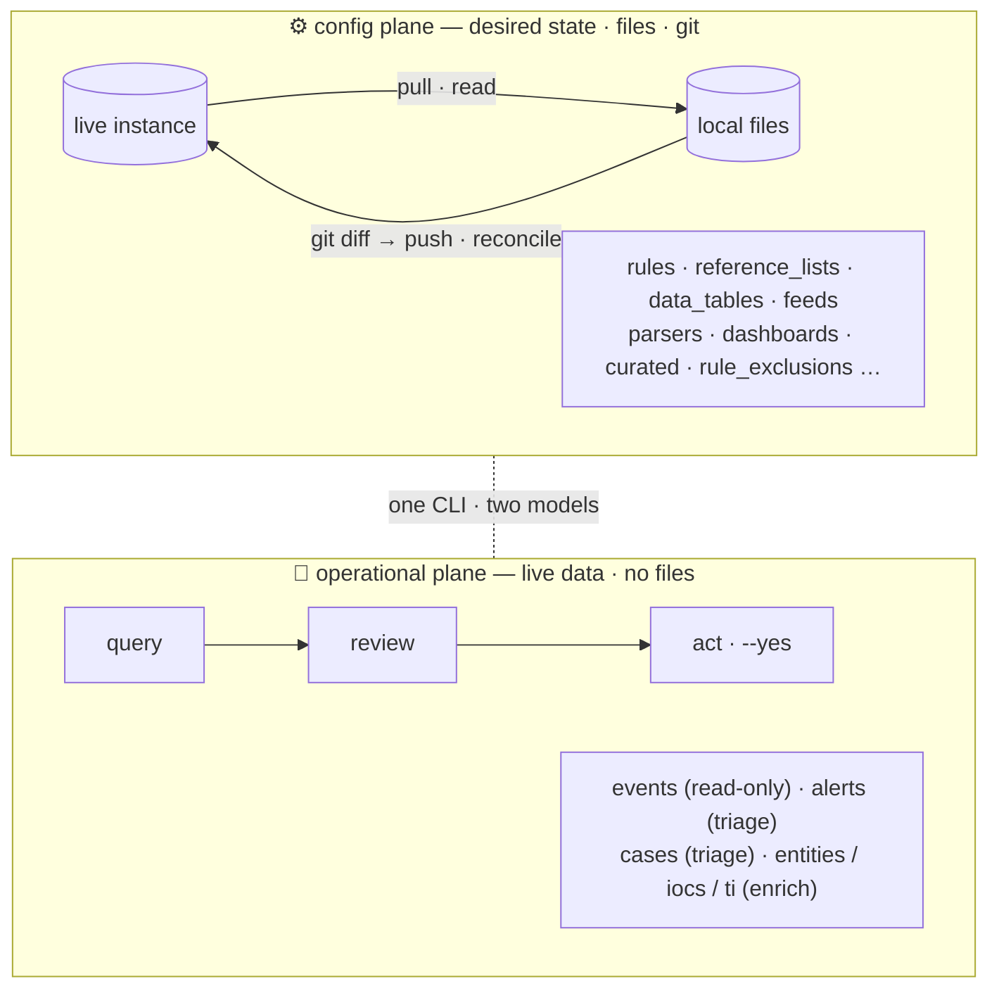
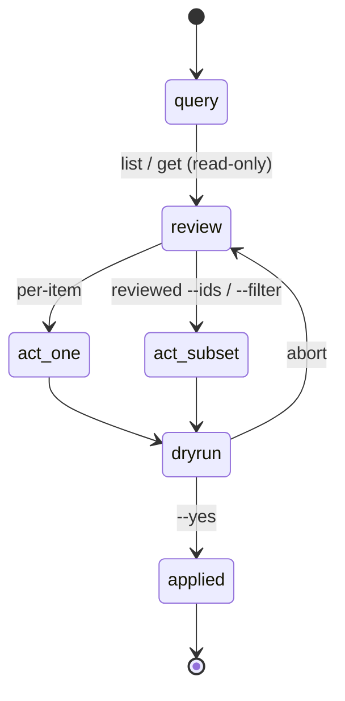

# SIEM design — two planes: config-as-code + operational query/act

Design for the Google SecOps **SIEM** surface of `secopsctl`. SIEM splits into two
planes that need different models: config is *desired state* (reconciled from
files), operational is *live data* (queried and acted on). Per-surface status is in
[catalog.md](catalog.md); the engine and version model are in
[architecture.md](architecture.md); terms are defined in [GLOSSARY.md](../GLOSSARY.md).

> **The split.** **Config** is *desired state* — rules, lists, tables, parsers,
> feeds, dashboards. It's detection-as-code: **pull → review in `git diff` →
> push**, reconciled. **Operational** is *live data* — events, alerts, cases.
> You don't reconcile a case from a file; you **query a subset and act on it**,
> the way a SOC analyst triages. Two planes, two models, one CLI.



Auth: the SIEM API is served by `{region}-chronicle.googleapis.com` and needs ADC /
`SECOPS_ACCESS_TOKEN` (the SOAR AppKey does **not** work here). The Chronicle REST
surface can **HTTP-500 intermittently**; secopsctl surfaces a clean error on 500 and
never retries a mutation (risk of double-apply). See `CLAUDE.md`.

---

## Plane 1 — config as code (reconcile)

Rules, curated rules, dashboards, etc. are similar things. This plane **reuses the
product-neutral reconcile engine** (`internal/mirror/reconcile`, shared with SOAR):
identity + canonical diff + redaction + additive/`--prune` guard. The SIEM surfaces
are registered in `internal/mirror/registry_siem.go`; each lives in its own
`*_surface.go`. Status per surface is the source of truth in [catalog.md](catalog.md).

| Surface | Shape | Plan |
|---|---|---|
| `rules` (YARA-L) | source `.yaral` + deployment state machine | **done** (bespoke two-resource, not a single canonical body): `push rules-create` · `rules-update` (etag-guarded YARA-L text update of changed `.yaral`, validated first) · `rules-deploy` (reconcile each companion's deployment — enabled/alerting/runFrequency — the deployment state machine as code) · `rules-disable`. Plus operational `rules detections/errors/alerts <id>` and `rules retrohunt list/get/create`. Read live-validated; lifecycle write smoke (create→update→deploy→delete, self-cleaning) |
| `reference_lists` | typed, `.txt`+`.yaml` | **done + live-validated** (engine, NoDelete): resource-name **normalization** in the SDK — create echoes the project NUMBER in the returned name while list echoes the project ID, so both are rewritten to the id form (otherwise the engine, which keys identity on the name, sees a freshly-created list and the same listed list as two objects). Gated write smoke `TestLiveReconcileReferenceListWriteSmoke`: since there is no delete API it can't be a throwaway-and-delete, so it reuses one fixed, clearly-labeled inert list and drives a create-or-reuse + one update each run (fresh description + entries → always-present update, rerunnable, no accumulation; the list is left in place by design) |
| `data_tables` | `.csv`+`.yaml`, rows via a separate API | **done + live-validated** (engine, `push data_tables`): columns immutable after create (update rejects a column change); rows = wholesale `ReplaceDataTableRows`; not prune-eligible (whole-table delete is high-blast). Gated write smoke `TestLiveReconcileDataTableWriteSmoke` (create→update→replace rows→delete) |
| `feeds` | typed, secrets in `settings` | **done** (engine, `push feeds`): redact on pull + DeepMerge-overlay on update (real secret preserved, create refuses a masked body); `details` replaced wholesale on PATCH (WholeBodyWrite). The `assetNamespace`(read) vs `namespace`(write) mismatch is **resolved** — a live read confirmed the API uses `assetNamespace`; the write side now emits the same key. Server/migration keys stripped from canonical; feed state left as a runtime `:enable`/`:disable` toggle (out of desired state). Short `logType` is expanded to the full resource name on write (the API rejects a bare id). Read + write live-validated, incl. GCS **V2** feeds (`GOOGLE_CLOUD_STORAGE_V2` / `gcsV2Settings`, Storage-Transfer-Service-backed — grant the SA from `FetchFeedServiceAccount` read access to the bucket first) |
| `parsers` | versioned/immutable (create new, no update) | **done** (engine, `push parsers`): immutable → the Update closure is create-new-version + **activate** (the load-bearing step), old version left inactive for rollback; canonical = `{log_type, cbn}` (volatile parser id excluded, carried as ServerID + written back on refresh); live set derived from feeds; not prune-eligible. Read + write live-validated: gated write smoke `TestLiveReconcileParserWriteSmoke` runs `RunParser` (pure inert validation — no server state created or activated) then creates a new **INACTIVE** version from a real active parser's source (a unique trailing comment makes it a distinct version), asserts it never becomes ACTIVE (so live ingestion is untouched) and the borrowed log type's active parser is unchanged, then deletes the throwaway. The `RunParser` response struct was corrected — `parsedEvents` is an object `{events:[{event:…}]}`, not a bare array |
| `dashboards` (native) | typed, charts as JSON | **done** (engine, `pull`/`push dashboards`): CUSTOM only (CURATED excluded as read-only); one `<slug>.json` (config + `_server`), charts inline under `definition.charts` replaced wholesale on update; `access` immutable after create. Canonical strips `createUserId`/`updateUserId`/`dashboardUserData` + the root resource `name` (identity in ServerID); nested chart/filter ids are stable across reads so they need no stripping. `pull` re-pointed from export-envelope → config. Read live-validated; gated write smoke. NB: the full-view List can rate-limit (429) on instances with many dashboards — the write smoke drives the surface closures directly rather than repeatedly listing |
| `curated` / `curated_rules` | Google-managed (read-mostly) | **done**: `pull curated` writes `curated/deployments.yaml`, and `push curated` reconciles changed `enabled`/`alerting` tuples through the batch update API. `curated list`/`set` remain the imperative read and one-off toggle lane. There is still no create/delete for Google-managed rule sets. Live-validated via a guarded enable→disable toggle that restores prior state. Rule **exclusions** are their own `rule_exclusions` reconcile surface (findingsRefinements, full CUD) — separate from curated |
| `rule_exclusions` (findings refinements) | typed: display_name + type + UDM query | **done** (engine, `pull`/`push rule_exclusions`): Create + Update (PATCH/updateMask); NoDelete (no delete API), NoEtag; deployment toggle out of the diff basis. Read + write live-validated (create→update→archive); no hard delete exists — **archive** (deployment `archived=true`) is the documented teardown. This is the "exclusions" the curated row points to |
| `forwarders` | typed `.yaml` (config block) | **done** (engine, `pull`/`push`/`drift forwarders`): config replaced wholesale on PATCH; NoEtag, **prune-eligible**; pinned **v1beta** (v1 404s). Write smoke `TestLiveReconcileForwarderWriteSmoke` (create→update→delete, self-cleaning). Collectors are a separate nested resource. `internal/mirror/forwarders_surface.go` |
| `watchlists`, `log_pipelines` | typed | future engine surfaces where per-object CUD fits |
| `metric_definitions` (custom SOC metrics) | typed: id + state + YARA-L `text_definition` | **built** (engine, `pull`/`push metric_definitions`): additive — create + state-only patch (textDefinition **immutable**, a text edit is refused → change = new id), **no delete API** (NoDelete). Offline-tested; **feature-gated 403 on the tenant** (not enabled/GA), so not live-validated. `chronicle/metrics.go` |
| `scheduled_reports` (`dashboardScheduledReports`) | JSON body + `_server` id/etag | **built** (engine, `pull`/`push scheduled_reports`): full CRUD with etag, prune-eligible; the embedded `dashboard` is reduced to its `{name}` reference (managed separately); imperative `trigger`/`duplicate`/`fetchHistory` in the SDK. **Reads live-validated**; create-report backend **500s** server-side (the ref shape is accepted). `chronicle/scheduled_reports.go` |
| `datataps` (`dataTaps`) | typed: display_name + filter + serialization_format + topic | **write-validated** (engine, `pull`/`push datataps`): stream UDM → Cloud Pub/Sub; prune-eligible, NoEtag. PATCH is **501 UNIMPLEMENTED** → update = **delete-old + create-new**. Supersedes the legacy Backstory endpoint (same chronicle host). Live tap needs a Pub/Sub topic + publisher grant. `chronicle/datataps.go` |
| `error_notifications` (`errorNotificationConfigs`) | JSON body + `_server` id | **built** (engine, `pull`/`push error_notifications`): ingestion-health alerts → Cloud Monitoring channels; full CRUD, prune-eligible, NoEtag; updateMask derived from present keys. Offline-tested; **feature-gated 403**. `chronicle/error_notifications.go` |
| `enrichment_controls` (`enrichmentControls`) | imperative (no patch) | **built** (SDK only): disable a UDM enrichment per log type / enrichment type. Create appends a record, `:disable` closes the latest — so imperative, not reconcile. **Feature-gated 403**. `chronicle/enrichment_controls.go` |
| `federation_groups` (data-federation groups) | typed: display_name + member tenants | **built** (engine, `pull`/`push federation_groups`): full CUD — Create + Update (PATCH), delete is **prune-eligible**, NoEtag. Meaningful only on MSSP / multi-tenant instances; offline-tested. `internal/mirror/federation_surface.go` |

**Discipline (same as SOAR, proven):** workflow-spec the shape → verify SDK
signatures by hand → wire as a `reconcile.Surface` → **live read-validate** →
**gated write-smoke** on an inert throwaway. The SIEM write-smoke harness lives in
`internal/mirror/reconcile_smoke_siem_test.go`, gated by `SECOPS_SIEM_SMOKE` (read
round-trip of every SIEM surface) and `SECOPS_SIEM_SMOKE_WRITE` (the
create/update/delete cycle). No surface is trusted for `--yes` until its write loop
is live-validated.

---

## Plane 2 — operational query/act (the SOC workflow)

Events/alerts/cases are **live security data**, not desired state. The loop is
**query → review → act on each or a subset** — how an analyst triages. The SDK is
built; this plane is the *operator model* and *safety*, not new API code.



### The act surfaces (and the read-only ones)

| Surface | Query (read) | Act (mutate) | Mutability |
|---|---|---|---|
| **events (UDM)** | `SearchUDM` / `NLSearch` / `GetStats` / `FindUDMFieldValues` | — | immutable telemetry — **read-only, never mutate** |
| **alerts** | `GetAlerts` (`alerts list`) · `GetAlert` (`alerts get`) — read-validated | `UpdateAlert` · `BulkUpdateAlerts` (status / verdict / priority / reason / comment) — built + gated, not run | per-item + subset |
| **cases** (one case; operated via `soar case`, see below) | `soar.ListCases` (siemplify v1alpha) · Legacy `GetCaseFullDetails` (case + its alerts) | Legacy verbs: assign · rename · stage · tag/untag · describe · importance · close · merge | per-item + subset |
| **entities / IoCs** | `SummarizeEntity` · `ListIoCs` · `FetchAssociatedInvestigations` | — | enrichment — read-only |
| **threat intel** | `ListThreatCollections` · `GetThreatCollection` (`ti collections`/`collection`) | — | Mandiant-sourced — **read-only** (no write path) |

> **Threat Intelligence** (`threatCollections`) is a read-only operational surface:
> the Google/Mandiant campaigns, reports, actors, malware and vulnerabilities the
> tenant is matched against. The list takes a `collection_type:` filter
> (campaign/report/…), an `orderBy`, and is `--limit`-capped; get is by short id
> (e.g. `report--26-10031441`). It uses the regional host and the project **number**
> in the resource name. There is no TI write path — custom intel is ingested as
> normal logs + reference lists, and Applied-TI detections ship as curated rule sets.

> **There is ONE case, reached on multiple paths — not multiple case systems.**
> Google SecOps = Chronicle (SIEM) + Siemplify (SOAR) merged, so a case is a
> **single record** reachable several ways. It carries two ids and
> `legacyBatchGetCases` returns `soarPlatformInfo.caseId` linking them. The cases
> function is **live-validated**: `soar case list` defaults to the modern **New API
> on the siemplify domain (v1alpha)** and auto-falls back to the broad, reliable
> **Legacy** external API (`/api/external/v1`, AppKey) on error; `soar case <verb>`
> and `get` run on Legacy. The **only** dead path is the chronicle-host UUID cases
> collection (`chronicle.googleapis.com`, ADC), which 500s at every version — an
> alternate, unused route to the same case, not the function's status.
>
> | | New API · siemplify *(default for `list`)* | Legacy external · siemplify *(reliable; verbs + fallback)* | chronicle-host UUID *(alternate, unused)* |
> |---|---|---|---|
> | id | integer (e.g. `234`) | integer (e.g. `234`) | UUID (resource name) |
> | api · auth · version | modern `cases` · AppKey · **v1alpha** | `/api/external/v1/cases` · AppKey | v1/v1beta/v1alpha `cases` · ADC |
> | today | **live-validated** | mature, **reliable**, complete | 500s at every version |
> | CLI | `soar case list` (default) | `soar case list`/`get` · `soar case <verb>` | `cases list`/`get`/`search` (alternate, 500s) |
>
> Same case, two ids — `soarPlatformInfo.caseId` bridges them when you need to
> correlate across paths. Use `soar case` for all case work; the chronicle-host
> UUID route is the same case via a path that does not currently answer.

### The query model

Every list/search command shares: a **filter**, a **time window**, a **limit**,
**pagination**, and an **output format**.

```
secopsctl query udm '<udm filter>' [--hours N | --from TS --to TS] [--limit N] [--json]   # events (built)
secopsctl alerts list [--query EXPR] [--hours N | --from TS --to TS] [--limit N] [--json]  # alerts snapshot (built, read)
secopsctl alerts get  <alert-id> [--detections] [--json]                                   # one alert (built, read)
secopsctl soar case list [--status open|closed|all] [--limit N] [--json]                   # cases (built, default open)
secopsctl iocs find <value> [value…] [--type md5|sha1|sha256|domain|ip] [--json]           # IoC lookup (built, read)
secopsctl iocs get  <ioc-id> [--json]                                                      # one IoC (built, read)
secopsctl ti collections [--types campaign,report,…] [--limit N] [--json]                  # threat intel (built, read)
secopsctl query nl '<question>'    [--hours N] [--limit N] [--translate-only] [--json]     # NL → UDM → search (built, read)
secopsctl stats     '<query>'      [--hours N]                                             # aggregations (planned)
secopsctl entity summarize <type> <value> [--hours N] [--json]                             # built, read
```

- **Default output is a compact table** (id, key fields, status/time) for humans;
  `--json` emits the raw objects for scripting and **piping into an act command**.
- **`--limit` is mandatory-with-a-default** (e.g. 100 for alerts/cases; 10000 for
  `query udm`) so a query never pulls the whole tenant by accident; large pulls
  require an explicit large `--limit`.

### The act model — single + subset, **safe by construction**

Two ways to act, mirroring how SOC consoles work (open one, or select rows →
bulk action). Both are **guarded exactly like `push`**: LIVE banner, **dry-run by
default**, real apply needs `--yes`.

**1. Per-item** — unambiguous, low blast radius. Case verbs are **built today**
under `soar case` (Legacy AppKey, live-validated); `alerts` is the planned model:

```
secopsctl alerts update <id> --verdict FALSE_POSITIVE --priority LOW [--comment "…"]   # planned
secopsctl soar case describe --id N --description "triaged: benign"                    # built
secopsctl soar case assign   --id N --user <analyst>                                   # built
secopsctl soar case close    --id N --reason "<…>" --root-cause "…"                    # built
```

**2. Subset (bulk)** — the dangerous one; two selection paths, **safest first**:

- **Reviewed-ids (preferred).** Query → eyeball → act on the *explicit* set:

  ```
  secopsctl alerts list --filter '…' --json | jq -r '.[].id' > ids.txt   # review the set
  secopsctl alerts bulk close --ids @ids.txt --reason FALSE_POSITIVE --yes
  ```
  The operator reviewed exactly what they're acting on. `--ids` accepts
  `1,2,3` or `@file`.

- **Filter-in-one-shot (convenient, gated harder).** `--filter` on a bulk verb is
  **dry-run-first, always**: it prints the **match count + a sample** and refuses
  to mutate until re-run with `--yes`, and a **`--limit` caps the blast radius**
  (refuse if the match set exceeds it unless `--limit` is raised explicitly):

  ```
  secopsctl <bulk verb> --filter 'rule="<noisy>" AND priority=LOW' --reason FALSE_POSITIVE --dry-run
    → "MATCHES 412 cases (cap 100). Sample: …. Re-run with --yes --limit 500 to apply."
  ```
  Queue bulk-close is built today as `soar push bulk-close` (a fixed reason enum);
  the generalized `--filter`/`--limit`-capped bulk model above is the planned shape.

Guard summary (one rule): **no operational mutation runs without an explicit
`--yes`; any `--filter`-driven bulk shows the count + sample first and is
`--limit`-capped.** A live-data mutation is treated as a production deploy, same
as a config `push`.

### Command tree

*Designed shape, mixing built and planned. **Built today:** `query udm`, `alerts
list`/`get`, `iocs find`/`get`, `ti collections`/`collection`, the full `soar case`
lifecycle (`list`/`get` + the mutate verbs), and `soar push bulk-close`. The `alerts`
**act** verbs (`update`/`bulk`) and the generalized SIEM bulk model are planned. The
bare `cases list/get/search` command reaches the chronicle-host UUID path, which 500s
today — prefer `soar case`. Authoritative per-command status is in
[catalog.md](catalog.md).*

```
secopsctl query udm | alerts list/get | iocs find/get | ti collections | entity summarize   # read
secopsctl query udm '<filter>' --raw [--limit N]                                             # raw log line per matched event (UDM-scoped) -> parsers run --logs -
secopsctl query raw '<regex>' [--unparsed] [--limit N]                                        # content-based raw log search (reaches no-parser logs) -> parsers run --logs -
secopsctl alerts    update | bulk <close|verdict|priority|comment>                           # act (planned)
secopsctl soar case list | get | assign | rename | stage | tag | untag | describe | importance | close | merge
secopsctl soar push bulk-close                                                   # queue bulk-close (fixed reason)
```

---

## Cross-cutting

- **Optimistic concurrency where the API offers it.** Surfaces that carry an etag
  (the config plane, and the planned chronicle-host alert/case updates) round-trip
  the stored etag and surface a clean conflict on mismatch — never silently
  overwrite a teammate's edit. The Legacy case verbs are last-write-wins (no etag),
  so the audit trail below is how concurrent edits stay reviewable.
- **Idempotent reads, audited writes.** Reads are free; every mutation prints
  what it touched (ids + the change) so the action is reviewable after the fact.
- **Output for pipelines.** `--json` is the contract between query and act:
  `list --json | jq | bulk --ids @-`. Tables are for humans only.
- **Reliability.** On a v1alpha 500, fail the command cleanly with the request id;
  do not retry a mutation (risk of double-apply). Reads may retry idempotently.
- **No reconcile for live data.** Events/alerts/cases are not snapshotted to files
  for `git diff`; that would imply a desired state they don't have. (A read-only
  *export* of a query result to JSON is fine — it's a report, not a mirror.)

## Case management — built and live-validated (`soar case`)

The full case triage lifecycle is **done**. It runs on the **siemplify** domain, not
the chronicle host: `soar case list` defaults to the modern New API (v1alpha,
`soar.ListCases`) and auto-falls back to the broad, reliable Legacy external API;
`soar case get` and the mutate verbs run on Legacy. `get` uses `GetCaseFullDetails`,
which returns the case **and its alerts** (each alert carries the `--alert` id the
verbs take). Cases key on an **integer** id (`--id N`), not a UUID.

```
# query
secopsctl soar case list  [--status open|closed|all] [--limit N] [--json] # New API, Legacy fallback (default open)
secopsctl soar case get <id>                                              # case + its alerts (Legacy)

# per-item act (guarded: dry-run default, --yes to apply)
secopsctl soar case assign     --id N --user <userId>
secopsctl soar case rename     --id N --title "<…>"
secopsctl soar case stage      --id N --stage "<…>"
secopsctl soar case tag        --id N --tag "<…>"        # untag to remove
secopsctl soar case describe   --id N --description "<…>"
secopsctl soar case importance --id N [--important=false]
secopsctl soar case close      --id N --reason "<…>" [--root-cause "<…>"] [--comment "<…>"]
secopsctl soar case merge      --ids 1,2,3 --into N

# queue bulk-close (fixed reason enum: malicious|not-malicious|maintenance|inconclusive|unknown)
secopsctl soar push bulk-close … --dry-run → review → --yes
```

The mutate verbs and `merge` run through the Legacy case methods (`AssignUserToCase`,
`RenameCase`, `CloseCase`, `MergeCases`, …) on a typed `CreateManualCase` foundation;
they reuse the same LIVE banner + dry-run/`--yes` guard as `push`. The whole lifecycle
is live-validated end-to-end (`TestLiveSOARCaseVerbsWriteSmoke`: create two throwaway
cases → run every verb → merge → close). Status detail is in
[soar.md](soar.md) and [catalog.md](catalog.md).

### Still planned — alert act verbs and the generalized bulk model

The `alerts` **read** namespace is wired (`alerts list`/`get`, read-validated;
operators can also read alerts as a **field of the case** via `soar case get`). Two
pieces of the operator model above are **not yet wired**: the alert **act** verbs
(`alerts update`/`bulk` — `UpdateAlert`/`BulkUpdateAlerts` exist in the SDK, gated,
not run), and the generalized subset-act model on a SIEM-native namespace
(reviewed-`--ids` preferred, `--filter` gated dry-run-first and `--limit`-capped —
beyond today's fixed-reason `soar push bulk-close`). Both follow the same guard: read
+ `--dry-run` previews ship first, and no `--yes` bulk mutation is trusted until a
gated live smoke runs against an inert throwaway.

## Non-goals

- No mutation of events (immutable telemetry) and no bulk **delete** of live data.
- No mixing planes: config stays reconcile (files/git), operational stays
  query/act (live).
- No `--yes`-by-default anywhere; `--filter` bulk is always dry-run-first.
