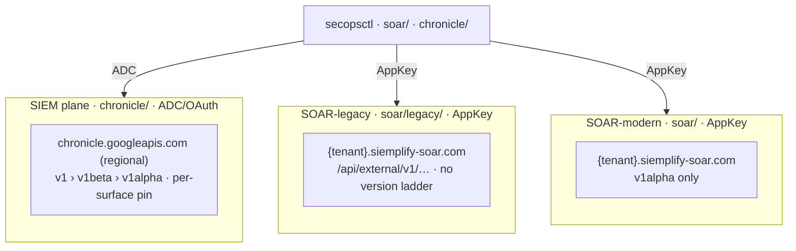

# Surface map

The authoritative map of **which API does what**, split by plane: every API
family has exactly one home (plane + host + auth + version) and one lane.
[architecture.md](architecture.md) explains the model; [catalog.md](catalog.md)
tracks per-command build status; this file is the inventory and the SIEM-vs-SOAR
split.

## Planes

A **plane** is a `(host, auth)` pair — the *product + transport* axis (orthogonal
to the control-vs-operational planes in [architecture.md](architecture.md) §1,
the *config-vs-data* axis; a surface has both — SIEM reference lists are
SIEM-plane **and** control-plane). SecOps exposes three:



| Plane | Host | Auth | Base path | SDK package | Reliability |
|---|---|---|---|---|---|
| **SIEM** | `chronicle.googleapis.com` (regional) | ADC / OAuth | `{v}/projects/{p}/locations/{l}/instances/{i}/…` | `chronicle/` | mostly stable |
| **SOAR — legacy** | `{tenant}.siemplify-soar.com` | AppKey | `/api/external/v1/…` | `soar/legacy/` | **the reliable path** |
| **SOAR — modern** | `{tenant}.siemplify-soar.com` | AppKey | `v1alpha/…/instances/{i}/…` | `soar/` | reads reliable; writes validated per surface |

The chronicle host serves **v1 / v1beta / v1alpha**; we prefer **v1 > v1beta >
v1alpha** and pin the highest version that answers **per surface** (`{v}` above —
e.g. Threat Intel / watchlists / governance = v1, forwarders = v1beta,
curatedRules = v1alpha; full map in [architecture.md](architecture.md) §6). The
SOAR host serves **v1alpha only** (v1/v1beta 404), so the version ladder is a
chronicle-host concern.

Two rules keep the split honest:

1. **A surface is placed by its host+auth, not by how it "feels."** Threat
   Intelligence reads like an external enrichment add-on, but `threatCollections`
   answers on `chronicle.googleapis.com` with ADC, so it is **SIEM-plane**. The
   Content Hub is the mirror-image trap: it uses the modern v1alpha resource shape,
   so it *looks* SIEM — but `marketplaceIntegrations`/`contentPacks` answer on
   `*.siemplify-soar.com` with the AppKey (the chronicle host 500s for them), so
   they are **SOAR-modern plane**. Verify the host before placing.
2. **Some resources exist on two hosts.** For tenants migrated to a customer-managed
   project, `integrations` / `connectors` / `jobs` answer on **both** the SOAR
   AppKey host and `chronicle.googleapis.com` v1alpha. We deliberately operate
   connectors/jobs config-as-code on the **legacy AppKey** lane (reliable) and use
   the modern path only for what the legacy API lacks (e.g. per-connector-definition
   delete). Each such family names the host it uses and why.

Status legend: ✅ built + validated · 🔨 partial / built-not-validated · ⬜ planned (gap) · ⛔ blocked (endpoint flaky/unavailable).

---

## SIEM plane — `chronicle/` (ADC)

### Detection engine

| Family | Lane | Status | Gaps |
|---|---|---|---|
| custom rules (CRUD + revisions) | reconcile | ✅ | `rules:modifyRules` batch update SDK-built (`ModifyRules`), gated — reconcile stays per-rule PATCH until the batch path passes an approved smoke |
| rule deployments (enable/alerting/freq/archived) | reconcile | ✅ | — (`archived` + `ArchiveRule`) |
| rule validation (`verifyRuleText`) + dry-run (`legacyRunTestRule`) | imperative | ✅ `RunTestRule` | validation pending approval |
| detections / errors | operational | ✅ incl. `legacySearchCuratedDetections` (`curated detections`, W54) | — |
| rule tuning reads — trends · counts · detection events | operational (read) | ✅ `rules trends`/`counts`/`events` + `curated trends`/`events` (W54, verified; trends windows must be bucket-aligned — the SDK aligns) | `legacySearchRuleDetectionCountBuckets` SDK-only |
| retrohunts | imperative | ✅ | — |
| rule exclusions (`findingsRefinements`) | reconcile | ✅ | — |
| curated rule sets / categories / deployments | reconcile + imperative | ✅ `pull curated` / `push curated` over `deployments.yaml` + per-deployment patch (`curated set`) · `:batchUpdate` (self-restoring toggle write-smoke validated) | single GETs ⬜ (low) |
| curated rules (`curatedRules`) | operational (read) | ✅ list/get (`curated rules`) | — |

### Data, lists & ingestion

| Family | Lane | Status | Gaps |
|---|---|---|---|
| reference lists | reconcile | ✅ | (API has no delete) |
| data tables (+ rows) | reconcile | ✅ | async bulk-row ops, single-row reads ⬜ (low) |
| feeds (+ service account) | reconcile | ✅ | `feedSourceTypeSchemas`/`logTypeSchemas` discovery ✅ read-validated (`chronicle/schemas.go`) · examples + `secret_ref` env/Secret Manager support ✅ offline-tested · `importPushLogs` ⬜ (low) |
| parsers / parser extensions | reconcile + imperative | ✅ | — |
| log types | read | ✅ list · `GetLogTypeSetting` read-validated · `GetLogType` wired (documented v1alpha) | per-log-type `logTypes.get` is a documented method but 404s "Method not found" on instances that don't enable it (verified across v1/v1beta/v1alpha and both hosts) — enumerate with `ListLogTypes` · `updateLogTypeSetting` ⬜ (med) · event-type suggestions ⬜ (low) |
| forwarders / collectors | reconcile | ✅ **reconcile surface wired + engine write-smoke** (`TestLiveReconcileForwarderWriteSmoke`, create→update→delete); collectors list/get | per-collector CUD ⬜ (collectors are a nested resource) |
| `metricDefinitions` (custom SOC metrics) | reconcile (additive) | 🔨 surface wired + offline-tested; **feature-gated 403** where not enabled/GA, so not yet verified | textDefinition is YARA-L 2.0, immutable; patch is state-only; no delete API |
| `dashboardScheduledReports` | reconcile (full CRUD) | 🔨 surface wired + offline-tested; **reads verified** (list 200), create-report backend **500s** server-side | imperative `trigger`/`duplicate`/`fetchHistory` in the SDK; dashboard reduced to a `{name}` ref |
| `dataTaps` (UDM → Pub/Sub) | reconcile | ✅ **write-validated** (`TestLiveReconcileDataTapWriteSmoke`, create→update→delete) | PATCH 501 → update = delete+recreate; supersedes the Backstory endpoint (same chronicle host); needs a Pub/Sub topic + publisher grant for a live tap |
| `errorNotificationConfigs` | reconcile (full CRUD) | 🔨 surface wired + offline-tested; **feature-gated 403** | zero-ingest / size-threshold / normalization-delay → Cloud Monitoring channels |
| `enrichmentControls` | imperative | 🔨 SDK wired + read-attempted; **feature-gated 403** | no patch (records accumulate) + `:disable` verb → imperative, not reconcile |
| `federationGroups` · `tenants` · `multitenantDirectory` (MSSP) | reconcile · read | 🔨 federationGroups reconcile + tenants/directory reads; multitenantDirectory **read-validated**, federationGroups/tenants **403** on a single tenant | multi-tenant only; `chronicle/federation.go` |
| ingestion (`logs`/`events`/`entities:import`) | imperative | ✅ | — |

### Entities, Threat Intel & investigation

| Family | Lane | Status | Gaps |
|---|---|---|---|
| entities (`:summarizeEntity`) | operational | ✅ | `:searchEntities` / `:findEntity*` graph RPCs ⬜ (med — partially superseded by `findingsGraph`) |
| **findings graph** (`findingsGraph`) | operational (read) | ✅ initialize read-verified (detection-seeded); `exploreNode` wired (params verbatim) | SDK-only (`chronicle/findings_graph.go`); CLI ⬜ |
| **alert enrichment** (`alerts enrich`) | operational (read) | ✅ `legacy:legacyBatchGetCollections` (chronicle/ADC) — the console's own path | full per-alert detection collection; the `enrichmentAgent:*` path is a dead 500 (action verbs withheld, SDK kept importable) |
| **Gemini chat** (`users.conversations`) | operational (read) | ✅ `query gemini` verified (HTML blocks rendered as prose) | multi-turn threading SDK-supported (conversation id), CLI single-shot |
| **watchlist membership** (`watchlists.entities`) | imperative | 🔨 `add-entity` guarded — request shape verified (the UDM Entity envelope: `{entity:{entity:<Noun>}}`); `RemoveWatchlistEntity` (by entity resource name) + `batchRemove` SDK | the ops can be 501 UNIMPLEMENTED per instance (watchlist CRUD itself write-validated); smoke: `TestLiveWatchlistEntityWriteSmoke` |
| IoC enterprise search (`legacySearchEnterpriseWideIoCs`) | operational | ✅ read-validated (50 matches); association `regionCode` is an object, decoded either way | — |
| **Threat Intelligence** (`threatCollections`) | operational (read) | ✅ list/get (`chronicle/ti.go`, `ti collections`/`collection`); 🔨 related pivots (`iocs related`, `ti related`) | `:fetchEntityMetadata` ⬜ (med) |
| **IoCs** modern (`iocs`) | operational (read) | ✅ `iocs find`/`get` CLI verified (`FindIoCs` typed `fieldAndValue` lookup · `GetIoC`/`BatchGetIoCs`); 🔨 SDK `FetchRelatedIoCs` | `getIocState`/`updateIocState` ⬜ |
| `iocAssociations` | operational (read) | ⬜ | get/batchGet/fetchRelated ⬜ (low) |
| UDM search (`:udmSearch`, `:translateUdmQuery`, `:validateQuery`, `:findUdmFieldValues`, NL) | operational | ✅ read-validated; `validateQuery` derives validity from errorType/errorText (no `isValid` field); raw-log search decodes the streamed chunk array (`matches[]`, nested `logType`) | — |
| investigations | operational | ✅ | — |
| alerts (legacy get/fetch/update/bulk) | operational | ✅ `alerts list`/`get` read CLI verified; decode tolerant of both legacy-API shapes (array/object, wrapped/bare) | act (update/bulk feedback) built, gated |
| data exports | imperative | ✅ | `:fetchServiceAccountForDataExport` ⬜ (med) |

> **Threat Intelligence is read-only.** `threatCollections` (campaigns / reports /
> actors / malware / vulnerabilities) is Google/Mandiant-sourced — there is no TI
> *write* path. "Applied Threat Intelligence" / "Emerging Threats" detections are
> delivered as **curated rule sets** (above), not a separate API. Custom TI is
> ingested through normal logs + reference lists.

### Admin, governance & Content Hub

| Family | Lane | Status | Gaps |
|---|---|---|---|
| dashboards (native) | reconcile + imperative | ✅ | `definition.charts[].dashboardChart` is a scalar ref — the YARA-L lives in separate `dashboardCharts`→`dashboardQueries`. Default pull is reference-only; **`pull dashboards --with-charts` derefs charts inline** (query-bearing) and `push`/`drift` reconcile them (`:addChart`/`:editChart`; W72, verified). Chart-query authoring also via SDK `AddChart`/`EditChart` + CLI `dashboards add-chart`/`edit-chart`/`remove-chart`/`charts` (W70/W71). **W79:** chart layout/filters/reorder reconcile via a `definition.charts` PATCH when the chart SET is unchanged (a membership change defers it — the wholesale-replace PATCH must never drop a chart); chart REMOVAL stays UI / `remove-chart` (no `--prune` for sub-resources); a `Surface.Validate` hook schema-checks the body in dry-run |
| **data-access labels** (`dataAccessLabels`) | imperative | ✅ SDK CRUD; create→get→delete write-validated (self-cleaning smoke) | imperative, NOT reconcile: create→list lags + create-despite-error break diffing; CLI ⬜ |
| **data-access scopes** (`dataAccessScopes`) | imperative | ✅ SDK CRUD; create→get→delete write-validated (throwaway unassigned scope) | imperative (same quirks as labels); CLI ⬜ |
| **risk config** (`{instance}/riskConfig`) | imperative | ✅ `GetRiskConfig` + idempotent `UpdateRiskConfig` write-validated (singleton sub-resource) | path is the singleton `{instance}/riskConfig` (GET/PATCH), not a colon verb; CLI ⬜ |
| **BigQuery export** (`{instance}/bigQueryExport`) | imperative (read) | ✅ `GetBigQueryExport` wired (pinned **v1**); returns a clean typed error when not provisioned (Enterprise Plus / Pre-GA) | `provision`/`update` ⬜ (gated writes) |
| **entity risk scores** (`entityRiskScores:query`) | operational (read) | ✅ `QueryEntityRiskScores` (filter/orderBy), read-validated (301) | behavioral risk (0–1000); v1alpha |
| **investigations / TIN** (+ `investigationSteps`/`investigationComments` · `notebooks`) | operational | ✅ list/get/steps read-validated (250 / steps); `investigations:trigger` + the filtered list (`alert_id='…' AND latest_in_alert=true`) + `notebooks/<id>` **verified (W57)** — CLI `alerts investigate [--latest]`; `investigationComments` returns 501 where not provisioned (Pre-GA) | the Gemini Triage & Investigation Agent; `chronicle/investigations.go` + `analytics.go`. The `notebooks` resource (the agent's working document, referenced from the investigation record) is absent from the public REST index — confirmed against the web UI |
| **coverage details** (`coverageDetails`) | operational (read) | ✅ `ListCoverageDetails` read-validated (MITRE ATT&CK per rule × threat-collection), pinned **v1** | the API view of "emerging threats" coverage |
| Content Hub — featured content rules | read | ✅ | on the chronicle ADC host (distinct from the SOAR-host marketplace below) |
| Content Hub — featured native dashboards | imperative | ⬜ | `list`/`install` ⬜ (med) |
| `instances.get` | read | ⬜ | (low) |

> **The installable Content Hub (`marketplaceIntegrations`, `contentHub/contentPacks`)
> is on the SOAR host, not chronicle.** It answers on `*.siemplify-soar.com` (AppKey)
> using the v1alpha resource shape — the chronicle ADC host returns HTTP 500 for it.
> So it lives on the **SOAR-modern plane** (`soar/marketplace.go`); it is the durable
> twin of the legacy `/store` install path and the only place an integration
> **uninstall** exists. See that table below and the "Other features" rows in
> [catalog.md](catalog.md). The SIEM-host *featured content* rows above are a
> separate, chronicle-side surface. (See the CLAUDE.md rule on host placement.)

---

## SOAR — legacy plane — `soar/legacy/` (AppKey)  ·  the reliable lane

~99.8% of the external API (`third_party/siemplify-swagger.json`) is wrapped: cases
(+ the 9 mutate verbs, bulk), playbooks/workflows, connectors, jobs, environments,
soc-roles, SLA/case-stages/tags/close-root-causes, networks/tracking-lists/block-lists,
ontology, webhooks, store/Content-Hub install, settings singletons, agents, reports,
homepage, permissions, federation, **API-key metadata** (`GetApiKeys` — typed
read-only, no secret; swagger-absent, read-validated). Lanes: reconcile (per-object
config), raw (batch/bundle/selector via `soar legacy call`), imperative (case verbs,
settings, store).

`connector-allowlist` is a derived reconcile target on this lane: it projects the
connector instance `allowList` field into sanitized files, drift-checks only that
field, and guarded push writes it back through the existing connector save path
after a fresh full connector read. Its write path is verified by an
idempotent same-value save and before/after pull comparison.

| Status | Detail |
|---|---|
| ✅ | the whole reliable SOAR surface — see [catalog.md](catalog.md) for per-command rows |
| ⬜ | `getExternalProviders` (SSO provider catalog) — on the non-standard `/api/1p/external/v1/` base the transport can't reach; low priority |

Playbooks/workflows and the SOAR case mutate-verbs exist **only** here — there is no
v1alpha equivalent we rely on.

---

## SOAR — modern plane — `soar/` (AppKey, v1alpha)  ·  preferred per validated surface

Modern v1alpha on the SOAR host, used where it has earned its place. A surface
goes modern-by-default only after it holds up live; until then config-as-code
stays on the legacy lane, which is reliable. So far that means:

- **`soar case list`** is modern-by-default — it calls the v1alpha cases API and
  **auto-falls back to legacy** on error; the global **`--legacy`** flag forces the
  legacy path. The labeled New-vs-Legacy dispatch is the `preferModern` helper.
- **Content Hub** (`marketplaceIntegrations`, `contentPacks`) and **integration /
  connector-definition** delete live here because the legacy API has no equivalent
  (uninstall, per-definition delete).
- **Integration runtime health** (`info soar-integrations`) joins the modern
  installed-pack catalog with legacy connector/job runtime cards. It is read-only
  and flags config-only installs, runtime without an installed pack, disabled
  runtime, and explicit unconfigured runtime markers.
- **Scheduler-reference manifest** (`info cron`) is an offline local scan, not an
  API surface. It walks scheduler-like files such as GitHub Actions workflows,
  `cron/`, crontabs, and systemd units, then reports which known `drift`, SIEM
  `push`, and SOAR `soar push` commands have file:line references without echoing
  raw scheduler lines. It also scans pulled `soar/jobs/` and `soar/playbooks/`
  JSON for non-empty `cronSchedule` values, so local SOAR schedules show up in
  the same report. `--host` adds current-user crontab/user-systemd inspection,
  and `--heartbeat-status <label>=<url>` HEAD-checks explicit read-only heartbeat
  status endpoints without printing endpoint URLs.
- The reconcile config surfaces are read on modern where validated; their v1alpha
  **writes are also validated** — create→get→delete on customLists / socRoles /
  caseTagDefinitions, environments create reachable (license-capped) — they do
  **not** 500 (`TestLiveConfigSurfaceWriteSmoke`). The reconcile *engine* still
  runs on the reliable legacy lane; pointing it at the validated modern writes is
  the per-surface flip tracked below. (Per-surface, test before assuming a write
  500s — the official v1alpha REST docs document create/patch/delete for all of
  these, and a past 500 was usually a null-collection or wrong-host shape issue.)

| Family | Status | Gaps (modern) |
|---|---|---|
| integrations catalog (list/get/delete) | ✅ | `updateCustomIntegration`, `:export`/`:download` ⬜ (low) |
| **wildcard component catalogs** (`integrations/-/{actions,transformers,logicalOperators}`) | ✅ (W58) | the `-` wildcard lists definitions across ALL integrations in one call — the designer's Step Selection palette. `ListAllActions` (596-entry scale, field-masked summary columns + the numeric id the playbook-usage index keys on), `ListTransformers` + `ListLogicalOperators` (the Flow functions/operators; the logical-operators envelope key stays snake_case under `format=camel`). CLI: `components actions` (no flag = whole palette), `components flow`, `components triggers` (offline trigger vocabulary: ALL / CASE_DATA / GET_INPUTS), `components blocks`. Siblings `integrations/-/{jobs,connectors,managers}` answer too — wired per-integration today, wildcard wiring on demand |
| playbook interaction helpers (`soar playbook`) | 🔨 legacy operational | SecOps-backed list/validate/components/test-cases/run/debug/summary/results/result/python-logs/debug-step-data/simulation-enrichment/pending/step get/rerun/rerun-block/step execute/**step skip** plus offline mold apply and trigger set built; **W55 adds** versions/restore, stats, export/import, `trigger tags` (the Tag-Name vocabulary), `components usage` (**W58:** by `--action-id` or by `--action <name>` resolved through the wildcard catalog). Still open from Wave 39: typed new-step insertion, full trigger condition presets/live value resolution, and broader step-body validation. **Python action/job authoring (W60)** is served by the modern actions/jobs collections and wired end to end: `soar integration action template/create/update/delete` (+ `job-def` siblings) over `actions:fetchTemplate` → `POST integrations/{key}/actions` (create) → `PATCH actions/{id}?updateMask=<fields>` (sparse update — a POST collides on displayName) → `DELETE actions/{id}` (`soar/authoring.go`; templates read-verified, the create→update→delete loop (actions; jobs do create→delete) is **verified** by the gated `TestLiveAuthoringWriteSmoke`); the legacy `/ide/*` ops exist live but are absent from the swagger snapshot. The **Playbook Assistant** RPCs (`legacyPlaybooks:legacyAiGenerate`/`legacyAiUpdate`, synchronous; persist = the normal save) can be restricted to interactive auth server-side — the generate verb surfaces that restriction plainly |
| job operational helpers (`soar job`) | 🔨 legacy operational | installed job, job-template, and job-instance lists, Python execution logs, guarded `run` commands, and **W55 instance management** (`instance set --enable/--disable` · `create --file` · `delete` — the schedule-maintenance verbs over the wrapped /jobs/instances CRUD); deeper job execution status helpers still Wave 39 |
| scheduled playbook builder (`soar build-playbook`, `soar playbook mold`, `soar playbook trigger set`) | 🔨 offline utility | exported base playbook + exported integration-action step molds + reviewable trigger edits only; no API call, no tenant validation |
| custom integration scaffold/package (`soar integration scaffold`, `soar package-integration`) | 🔨 offline utility | local Python action/job scaffold + deterministic ZIP builder for an IDE integration directory; no API call, no tenant validation |
| scheduler references (`info cron`) | 🔨 offline utility | local scheduler-file scan plus pulled SOAR job/playbook `cronSchedule` scan; optional current-user host scheduler scan and heartbeat status HEAD checks; no raw command/URL echo |
| connector **definitions** (list/get/delete) | ✅ | create/patch ⬜ (med) |
| connector **instances** (list/get/patch + `:runOnDemand`) | ✅ list+get read-validated (instance GET decodes the `parameters` descriptor array) | create/delete + `:runOnDemand` SDK-built, live-write pending |
| job **definitions** (list) | 🔨 | get/create/patch/delete ⬜ (med) |
| job **instances** (list/get/patch + `:runOnDemand`) | ✅ list read-validated | create/delete + `:runOnDemand` SDK-built, live-write pending |
| alert grouping rules (list/get/patch + create/delete) | ✅ **full lifecycle write-validated** — create→get→delete on a self-cleaning inert throwaway (`TestLiveAlertGroupingRuleWriteSmoke`); numeric `id` decoded | — |
| alert grouping General/Overflow settings | ✅ read · ✅ write — **W80/W107** — `soar settings grouping get` reads the full `moduleSettings/AlertGroupingSettings/properties` bag (Timeframe, max-alerts, overflow timeframe/max, grouping algorithm, source-grouping fallback) plus the legacy max-alerts-per-case value; guarded `set --property <ShortName>=<value>` via `BatchUpdateModuleSettingProperties` (the legacy max-alerts-per-case singleton is read-only — no API SET) | — |
| module settings | ✅ | — |
| **Content Hub — `marketplaceIntegrations`** | ✅ list/get + install/uninstall (install→uninstall round-trip verified, self-cleaning) | `soar/marketplace.go` — the durable twin of legacy `/store`, the only place uninstall exists; modern path is cleanly reversible |
| **Content Hub — `contentHub/contentPacks`** | ✅ list (reads validated) | add/delete/deploy ⬜ |
| cases (list) | ✅ **modern by default** (`soar case list`, auto-fallback to legacy; `--legacy` forces legacy); `ListCasesOpts` sends server-side `filter`/`orderBy`/`expand` (web-UI params). **W59 filter grammar pinned** (the UI's own): enum/string scalars (`status`/`priority`/`assignee`/`environment`/`stage`/`displayName`), epoch-ms int64 ranges (`createTime`/`updateTime`), variadic collection membership `any(tags.displayName, …)` / `any(alertNames.alertName, …)` / `any(products.displayName, …)`; zero-match = HTTP 204 empty (transport maps to empty result); over-long filters auto-switch to the UI's method-override POST. **Counts** come from the list's `totalSize` at `pageSize=1` (`CountCases`/`CountCasesByPriority` → `soar case counts`); the `cases:countPriorities` RPC is unused by the UI and unserved (404 SOAR / 500 chronicle) | verbs/writes stay legacy until modern verbs pass a write-smoke |
| environments · socRoles · customLists · caseStage/Close/Tag definitions | ✅ modern read + **write** coverage (`soar/config_surfaces.go`): create/get/update/delete wired; create→get→delete **verified** for customLists/socRoles/caseTagDefinitions, environments create reachable (license-capped) — **v1alpha writes do not 500** (`TestLiveConfigSurfaceWriteSmoke`) | reconcile lane still runs on legacy (works); flipping it to the validated modern writes is per-surface |
| SLA · networks · block-lists · ontology · remote agents | ✅ `slaDefinitions` + `soarNetworks` **write-validated** (create→get→delete, `TestLiveDataSurfaceWriteSmoke`) · 🔨 `entitiesBlocklists` read + write-endpoint reachable (HTTP 400, **not** 500) but `action`(`ActionScope`)/`entityType` are undocumented server enums · `ontologyRecords` (2.3 MB) + `remoteAgents` read-confirmed. CRUD wired in `soar/data_surfaces.go` (+`export`/`import`, `deleteAll`, ontology `visualFamilies`/`mappingRules`) | reconcile/raw still on legacy; flip per surface. `slaDefinitions` uses **string** enums (not the legacy ints) |
| `caseQueueFilters` | 🔨 read-validated (siemplify-soar v1alpha) | the case-queue resource is `caseQueueFilters`, not `caseQueueDefinitions` (which 404s); SDK not built |
| cases — **modern verbs** (`patch`/`merge`/`addTag`/`executeBulk*`/`pauseSla`…) | 🔨 documented on the `cases` collection; not yet write-validated | the 9 legacy mutate-verbs are the proven path; modern verbs need a gated write-smoke before flipping |
| case data — `customFields` · `calculatedFieldDefinitions` · `propertySchemaDefinitions` | ✅ **full CRUD write-validated** (create→get→delete, `TestLiveCaseDataWriteSmoke`); `soar/case_data_surfaces.go` | customFields `scopes`="Case"/"Alert" (FREE_TEXT needs no options; "All" 500s); calc `SET_VALUE`/`TEXT`/`targetField=CaseCustom.<field>`/`formulaExpression="…"` and depends on a Free-Text custom field |
| `legacySoarIdpMappingGroups` (IdP → roles/perms/envs) | ✅ **read-validated** (mapping groups + external providers); full CRUD SDK in `soar/idp_mappings.go` | **two-host surface** — the docs file it under the chronicle instance path, but it **500s on chronicle**, answers on the SOAR host (AppKey). Writes touch live access |
| data-access (scopes/labels) · **federationGroups** | — | **SIEM-plane** (chronicle ADC host): data-access 404s on SOAR; `federationGroups` carries no "migrated-SOAR" marker and 404s on the SOAR host → it lives on chronicle/ADC, see SIEM table |

---

## How a family earns a home

When adding any surface, fill one **registry entry** in
`internal/mirror/surface_families.go` (see [architecture.md](architecture.md) §7)
before writing code:

```go
SurfaceFamily{ Name, Area, Plane, Host, Auth, Generation, APIVersion, Lane, Status, SDKLocation }
```

The registry is the single source of truth that the [catalog.md](catalog.md)
status matrix and the [architecture.md](architecture.md) §6 version table derive
from. SIEM `APIVersion` is sourced from
`chronicle.APIVersions` (`chronicle/versions.go`), and a drift-guard test
(`surface_families_test.go`) asserts the registry, that map, and the §6 table all
agree — so the map, the docs, and the code can never silently drift.
