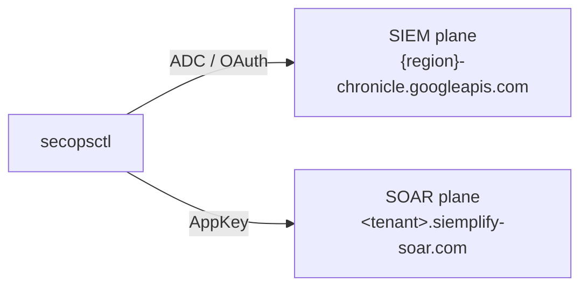

# Configure & auth

One config file, two auth planes. Get both right and every other command just
works. Previous: [install.md](install.md). Next: [the-loop.md](the-loop.md).

> **You'll need:** access to the SecOps web console (for the customer UUID
> and, for SOAR, the tenant host + an AppKey) and a `gcloud`-authenticated
> shell for the SIEM plane. No console access yet? Ask your SecOps admin
> for the four identifiers below.

## The config file

`secopsctl config` (alias `init`) writes `~/.secopsctl/instance.yaml` at mode
`0600`. The file is git-ignored and **never committed** — your tenant identifiers
and the SOAR AppKey stay local.

```bash
secopsctl config
```

Opens a single-screen form: every field on one screen, `↑`/`↓` or `Tab` to move,
edit in place, then **Save** (or **Cancel**). The SOAR AppKey field is hidden as
you type.

Set values directly with flags instead — and `--non-interactive` (or a
non-terminal stdin) skips the form and writes the flags plus current values:

```bash
secopsctl config \
  --project-id your-project-id \
  --project-number 000000000000 \
  --region us \
  --customer-id 00000000-0000-0000-0000-000000000000 \
  --soar-url https://<tenant>.siemplify-soar.com \
  --non-interactive
```

The `config` flags:

| Flag | Sets | Notes |
|---|---|---|
| `--project-id` | GCP project ID | string form |
| `--project-number` | GCP project number | numeric form — keep both set |
| `--region` | SecOps region | e.g. `us`, `asia-southeast1` |
| `--customer-id` | SecOps customer ID | GUID |
| `--soar-url` | SOAR host URL | see *Find your SOAR host* below |
| `--soar-app-key` | SOAR AppKey | avoid on shared shells — prefer the hidden prompt |
| `--force-ipv4` | pin dialer to IPv4 | corporate-VPN / broken-IPv6 fix |

The mintable OAuth/ADC SIEM token is **never** written to disk — `gcloud` handles
that. The AppKey is the only secret the file may hold.

A few optional keys are **hand-edit only** (no `config` flag): `ui_url` (Chronicle
web-UI host, used to build human-facing links), `base_url` (override the derived
API endpoint), `domain` (your org's primary domain, used by some example queries),
and `org_id`. Set them by editing `instance.yaml` directly — see the annotated
[`config/instance.example.yaml`](https://github.com/dannyota/secops/blob/master/config/instance.example.yaml)
and the example below.

## Two auth planes

secopsctl talks to two backends with two different credentials. This is the core
concept.



| Plane | Backend | Credential | How |
|---|---|---|---|
| **SIEM** (Chronicle) | `{region}-chronicle.googleapis.com` | ADC / OAuth | `gcloud auth application-default login` |
| **SOAR** (Siemplify) | `<tenant>.siemplify-soar.com` | long-lived AppKey (no ADC) | `soar_app_key` in config, or `$SECOPS_SOAR_APP_KEY` |

The two-host split is the central design constraint — see
[../design/soar.md](../design/soar.md) for why a 500 on one host usually means
"wrong host," not "unavailable."

### SIEM auth (ADC / OAuth)

Sign in once so ADC can mint tokens in-process, and set the quota/billing project
(a common first-run Chronicle failure is a missing quota project):

```bash
gcloud auth application-default login
gcloud auth application-default set-quota-project your-project-id
```

Or mint a token explicitly and export it **in the same shell as the run** (env set
in a separate shell does not carry over):

```bash
export SECOPS_ACCESS_TOKEN=$(gcloud auth print-access-token)
secopsctl pull rules
```

### SOAR auth (AppKey)

The AppKey is long-lived and not mintable. Generate it once in the SOAR UI
(**Settings → Advanced → API Keys**), then put it in the config file (hidden
prompt) or override at run time:

```bash
export SECOPS_SOAR_APP_KEY=your-soar-app-key
secopsctl soar case list
```

## Find your SecOps identifiers

The four required keys identify your Chronicle/SecOps instance. Where to find each:

| Key | Where |
|---|---|
| `project_id` | The GCP project that hosts SecOps — the project picker in the [Cloud Console](https://console.cloud.google.com), or `gcloud config get-value project`. |
| `project_number` | The numeric form of that project — the project Dashboard in the Cloud Console, or `gcloud projects describe <project-id> --format='value(projectNumber)'`. |
| `region` | Your SecOps tenant's region — e.g. `us`, `europe`, `asia-southeast1`. It is the prefix of your SecOps API host (`{region}-chronicle.googleapis.com`). |
| `customer_id` | The Chronicle customer/instance UUID — in the SecOps console under **Settings → SIEM Settings** (instance/profile details). |

Keep `project_id` **and** `project_number` both set — some endpoints want the
string form, others the numeric form (see [Project number vs ID](#project-number-vs-id)).

## Find your SOAR host

The SOAR host (`soar_url`) is tenant-specific and is **not** in the public docs.
To discover yours:

1. Sign in to the **SecOps Web UI** in a browser.
2. Open **dev-tools → Network** tab.
3. Drive any SOAR-flavored view (a case, the response/SOAR area) and inspect the
   captured requests.

The SOAR-flavored calls go to `https://<tenant>.siemplify-soar.com`. That base URL
is the value for `soar_url` (or `$SECOPS_SOAR_URL`).

```bash
secopsctl config --soar-url https://<tenant>.siemplify-soar.com --non-interactive
```

## Config resolution order

Highest priority first. A set env var **overlays** the matching file value.
secopsctl does **not** read `.env`.

1. real `SECOPS_*` env vars — `SECOPS_PROJECT_ID`, `SECOPS_REGION`,
   `SECOPS_CUSTOMER_ID`, `SECOPS_SOAR_URL`, `SECOPS_SOAR_APP_KEY`
2. the file at `--config` / `$SECOPSCTL_CONFIG`
3. `~/.secopsctl/instance.yaml` (the default)
4. `./config/instance.yaml`
5. `~/.config/secopsctl/instance.yaml`

An explicit `--config` / `$SECOPSCTL_CONFIG` path that does **not** exist is an
**error** — secopsctl refuses to fall through to a different (possibly
wrong-tenant) file. Discovery (steps 3–5) only applies when no explicit path is
given. To confirm which file actually loaded, run `secopsctl info` (it prints a
`config_source` line) or `secopsctl config --show-path`.

## Project number vs ID

Keep **both** set. Some SecOps endpoints want the project *number*, others the
project *ID* — secopsctl picks the right form per endpoint. Both `project_id` and
`project_number` are **required keys**: `config.Load()` fails loudly at startup for
*any* command if either is absent (`config <path> is missing required key(s):
project_number`), so set both.

## force_ipv4

Opt-in network workaround for corporate VPNs or broken IPv6 — pins the dialer to
IPv4. Off by default; turn it on only if connections hang or time out:

```bash
secopsctl config --force-ipv4 --non-interactive
```

## Example instance.yaml

Placeholders only — replace with your tenant's values. The file lives at
`~/.secopsctl/instance.yaml` (`0600`).

```yaml
# Required
project_id: your-project-id
project_number: "000000000000"
region: us
customer_id: 00000000-0000-0000-0000-000000000000

# Optional — SOAR plane
soar_url: https://<tenant>.siemplify-soar.com
# soar_app_key: prefer the hidden prompt or $SECOPS_SOAR_APP_KEY

# Optional — hand-edit only (no `config` flag)
# ui_url: https://your-tenant.backstory.chronicle.security  # builds human-facing links
# base_url: https://us-chronicle.googleapis.com/v1alpha     # override the derived endpoint
# domain: example.com                                       # used by some example queries
# org_id: "000000000000"

# Optional — network workaround
# force_ipv4: true
```

## Verify

Two read-only checks confirm the config and the live reach:

```bash
secopsctl info
```

Prints the resolved config with the AppKey redacted — no API call. Use it to see
exactly which file/env values won.

```bash
secopsctl doctor
```

Live smoke test: loads config, acquires a token, makes one read-only SIEM call
(list rules) and — if `soar_url` is set — one read-only SOAR call (list
integrations). It never mutates anything. A clean `doctor` means both planes are
wired correctly. Then start [the loop](the-loop.md).
