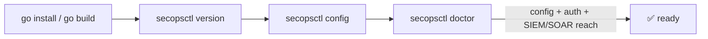

# Install

Get the `secopsctl` binary onto a machine, then verify it can reach your tenant.
`secopsctl` is a single Go binary (module `danny.vn/secops`); the same code is an
importable SDK (see [sdk.md](sdk.md)).

## Prerequisites

| Prereq | Why |
|---|---|
| Go 1.26+ (toolchain pinned `go1.26.4`) | `go install` / `go build` the binary from source |
| [Google Cloud SDK (`gcloud`)](https://cloud.google.com/sdk/docs/install) | SIEM auth via ADC (OAuth) — the chronicle plane needs it |
| SOAR AppKey | SOAR plane auth (key-based, no `gcloud`); only needed for `soar` commands |

The two planes are independent: SOAR works with just an AppKey, no `gcloud`. See
[configure.md](configure.md) for how each is wired.

## Install

```bash
go install danny.vn/secops/cmd/secopsctl@latest
```

If the `danny.vn/secops` vanity path can't be resolved (no network reach to
`danny.vn`, proxy restrictions), build from source instead — see [Build from
source](#build-from-source) below. The module path is `danny.vn/secops`, so the
GitHub URL is not a `go install` substitute; the `git clone` route is the
fallback.

Installs the `secopsctl` binary to `$(go env GOPATH)/bin` — make sure that's on
your `PATH`. For example:

```bash
export PATH="$(go env GOPATH)/bin:$PATH"
```

Add that line to your shell profile (`~/.bashrc`, `~/.zshrc`, …) to make it
persistent.

## Build from source

```bash
git clone https://github.com/dannyota/secops.git
cd secops
go build -o secopsctl ./cmd/secopsctl
```

Produces a `secopsctl` binary in the repo root. For one-off runs without
building, use `go run ./cmd/secopsctl <command>`.

## Release binaries (signed)

Prebuilt binaries (linux/macOS/windows · amd64/arm64) are attached to each
[GitHub release](https://github.com/dannyota/secops/releases), alongside a
`checksums.txt` signed keylessly with [cosign](https://github.com/sigstore/cosign).
Verify the checksums signature, then check your download against it:

```bash
cosign verify-blob --certificate checksums.txt.pem --signature checksums.txt.sig \
  --certificate-identity-regexp 'https://github.com/dannyota/secops/.github/workflows/release.yml@.*' \
  --certificate-oidc-issuer https://token.actions.githubusercontent.com checksums.txt

sha256sum -c checksums.txt --ignore-missing   # then verify the downloaded binary
```

## Verify

```bash
secopsctl version
```

Prints the version, commit, and build info — confirms the binary runs. A binary
built from source (`go install` / `go build`) reports version `dev` / commit
`unknown` by design; the signed [release binaries](#release-binaries-signed) carry
the real tag and commit (stamped at build time).

```bash
secopsctl doctor
```

Read-only end-to-end check: loads config, acquires a token, makes one read-only
SIEM call (list rules) and, if `soar_url` is set, one SOAR call (list
integrations). It never mutates anything. A clean `doctor` means config, auth,
and SIEM/SOAR reach all work.



To get oriented before wiring auth, `secopsctl surfaces` (fully offline, no
config or credentials) lists every API family with its plane, host, auth, and
whether it is reconcilable.

## Next

- [configure.md](configure.md) — set up the config file and wire SIEM + SOAR auth.
- [the-loop.md](the-loop.md) — the core pull → `git diff` → push workflow.
- [../design/catalog.md](../design/catalog.md) — live status of every surface and command.
