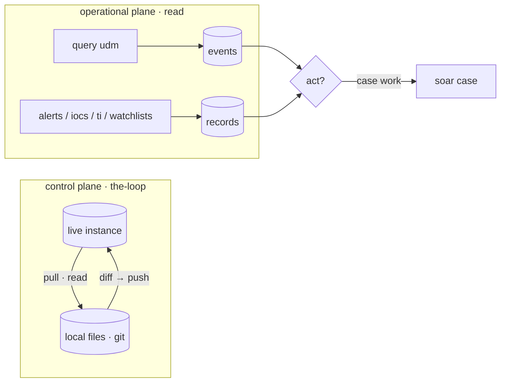

# 🧭 Query & read

The operational read plane: **search live events and look up entities**, with no
deploy attached. Reads are free — nothing here mutates the tenant. Use these to
pull a subset of live state, then decide whether to act on it through the
[control-plane loop](the-loop.md) or [case triage](soar-cases.md).

> 🔒 Everything on this page is **read-only**. No `--dry-run`, no `--yes`, no
> `LIVE DEPLOY` banner — those belong to `push`.

## 🗺️ Two planes

The control plane manages **detection-as-code** (rules, lists, configs) via
pull → diff → push. The operational plane is the day-job: **query a window of
data, resolve an indicator, read an alert** — then act.



## 🔎 UDM search

```bash
secopsctl query udm '<filter>'
```

A point-in-time UDM event search over `[start, end]`. The window defaults to the
last `--hours`; `--from` / `--to` override it.

| Flag | Default | Purpose |
|---|---|---|
| `--hours int` | `24` | look-back window in hours (when `--from` is not given) |
| `--from string` | — | explicit start (RFC3339 / ISO-8601); overrides `--hours` |
| `--to string` | now | explicit end (RFC3339 / ISO-8601) |
| `--limit int` | `10000` | maximum events to return |
| `--json` | off | emit machine-readable JSON |

Examples (tenant-neutral filters — substitute your own fields and values):

```bash
# Process launches in the last 24h (default window).
secopsctl query udm 'metadata.event_type = "PROCESS_LAUNCH"'

# Network connections to one host over an explicit window, capped, as JSON.
secopsctl query udm 'metadata.event_type = "NETWORK_CONNECTION" AND target.hostname = "host.example.com"' \
  --from 2026-01-01T00:00:00Z --to 2026-01-02T00:00:00Z --limit 500 --json
```

For filter syntax, fields, and query craft see the
[UDM query tip](../tips/07-udm-queries.md).

## 📋 Other read surfaces

All read-only. Each fetches live records over a window or by id; none deploy.

| Command | Reads |
|---|---|
| `secopsctl alerts list` · `alerts get` | SIEM detection alerts over a window, or one by id (snapshot view) |
| `secopsctl iocs find` · `iocs get` | resolve an indicator value (hash / domain / IP) to its IoC record, or fetch one by resource id |
| `secopsctl ti collections` · `ti collection` | Google/Mandiant threat collections (campaigns, reports, actors, malware, vulns) |
| `secopsctl watchlists list` · `watchlists get` | SIEM entity watchlists |
| `secopsctl cases list` · `cases get` · `cases search` | a case on the **Chronicle** host by UUID — alternate path; see note below |

Global flags apply to all: `--json` for machine-readable output, `--config` to
point at a specific instance file.

```bash
# Detection alerts over the last day.
secopsctl alerts list

# Resolve an indicator to its IoC match record.
secopsctl iocs find <value>

# Browse threat collections, then open one by id.
secopsctl ti collections
secopsctl ti collection <collection-id>

# List entity watchlists.
secopsctl watchlists list
```

> ⚠️ **`cases` reaches the Chronicle host (ADC) — that case collection 500s at
> every API version today.** For all case work use [`soar case`](soar-cases.md):
> the same case on the SOAR host, where it works. `cases` stays as a read-only
> alternate path only.

## 🔗 See also

- [The loop](the-loop.md) — the control plane: pull → diff → push.
- [Case triage](soar-cases.md) — read and act on SOAR cases.
- [UDM query craft](../tips/07-udm-queries.md) — filter syntax and patterns.
- [Catalog](../design/catalog.md) — per-surface status (designed / built / validated).
- [Surfaces](../design/surfaces.md) — the full API surface map by plane.
