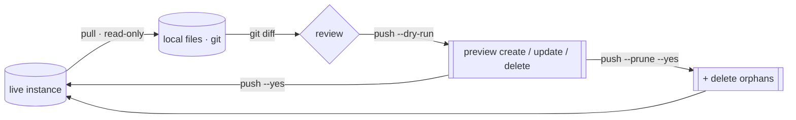

# Reconcile surfaces

Config-as-code for the many engine surfaces: snapshot live objects to files, review
in `git diff`, push back. One redacted, diff-friendly file per object. Additive by
default; deletes only with `--prune`.

This is the same [pull → diff → push loop](the-loop.md) the whole tool runs on, applied
to the long tail of SIEM and SOAR config surfaces. For per-surface status (designed /
built / validated) see [the catalog](../design/catalog.md). For the engine internals
(identity, canonical diff, lanes, capabilities) see
[the architecture](../design/architecture.md).

## The pattern

```bash
secopsctl soar pull connectors --out .          # snapshot live → files
git diff                                         # review the change
secopsctl soar push connectors --dry-run        # preview the deploy
secopsctl soar push connectors --yes            # apply (LIVE)
```

SIEM surfaces use the top-level `pull` / `push`, same shape:

```bash
secopsctl pull reference_lists --out .
git diff
secopsctl push reference_lists --dry-run
secopsctl push reference_lists --yes
```

- `pull` is read-only — it never mutates the instance.
- `push` defaults to a **dry run**; `--yes` applies for real and prints a `LIVE DEPLOY`
  banner. Always preview, review, then confirm.
- A push is **additive**: it creates new files and updates edited ones. It will not
  delete anything unless you pass `--prune`.

## Surfaces

Each surface snapshots one file per object, keyed by server id, with secrets redacted.

| Plane | Pull / push | Surfaces |
|---|---|---|
| SOAR | `secopsctl soar pull\|push <surface>` | `blacklists` · `case-stages` · `case-tags` · `close-root-causes` · `connectors` · `environments` · `idp` · `jobs` · `networks` · `playbook-categories` · `playbooks` · `sla-definitions` · `soc-roles` · `tracking-lists` · `visual-families` · `webhooks` |
| SIEM | `secopsctl pull <s>` / `secopsctl push <s>` | `reference_lists` · `data_tables` · `parsers` · `feeds` · `forwarders` · `dashboards` · `rule_exclusions` · `metric_definitions` · `scheduled_reports` · `datataps` · `error_notifications` · `federation_groups` |

`secopsctl soar pull all` snapshots grouping and cases plus every SOAR engine surface,
in order. Status per surface lives in [the catalog](../design/catalog.md) — don't infer
it here.

### On-disk layout

A pull writes one file per object into a per-surface directory under the data root
(`--out`, default cwd), and the matching push reads back from that same directory:

- `secopsctl soar pull <surface>` → `<out>/soar/<surface>/` (e.g.
  `<out>/soar/connectors/`, `<out>/soar/webhooks/`); `secopsctl soar push <surface>`
  reads from there.
- `secopsctl pull <surface>` (SIEM) → `<out>/<surface>/` (e.g. `<out>/reference_lists/`,
  `<out>/feeds/`); `secopsctl push <surface>` reads from there.

Edit the files in that directory between pull and push — the diff you commit is exactly
what push deploys.

> **Not every pull target is a reconcile surface.** `curated` and `curated_rules` are
> **pull-only**: the rule sets are Google-managed, so there is no `push curated`. To
> change a curated deployment, toggle its `enabled`/`alerting` state with
> `secopsctl curated set` (a guarded live toggle), not a push. See
> [curated rule sets](../tips/05-curated-rules.md).

## Prune: deleting server-only objects

By default a push never deletes. Objects that exist live but have **no local file**
(orphans) are left alone. To reconcile deletions, pass `--prune`:

```bash
secopsctl soar push webhooks --prune --dry-run   # preview what would be deleted
secopsctl soar push webhooks --prune --yes       # apply deletions (LIVE)
```

- `--prune` deletes every live object with no matching local file — review the dry-run
  carefully.
- It is **gated on a complete pull**: prune refuses to run against a partial snapshot,
  so a half-finished pull can't be read as "delete the rest."

Only **prune-eligible** surfaces honor `--prune`; everywhere else it is a no-op.
Run `secopsctl surfaces` for the live list (the `PRUNE` column). The split:

| Honors `--prune` (prune-eligible) | Ignores `--prune` (NoDelete) |
|---|---|
| SOAR: `webhooks` · `connectors` · `visual-families` · `networks` | every other SOAR reconcile surface (e.g. `environments`, `soc-roles`, `idp`, `playbooks`, `jobs`, `sla-definitions`, `case-stages`, `case-tags`, `blacklists`) |
| SIEM: `forwarders` · `datataps` · `scheduled_reports` · `error_notifications` · `federation_groups` | SIEM: `feeds` · `parsers` · `reference_lists` · `metric_definitions` · `rule_exclusions` |

On a **NoDelete** surface, `--prune` does nothing: orphans (live objects with no local
file) are **reported, never deleted**. Those surfaces opt out because their delete is
high-blast (removing a `feed` or `parser` stops ingestion; dropping an `environment`
orphans its cases/alerts), RBAC/SSO-sensitive (`soc-roles`, `idp`), or takes a body
selector rather than a clean by-id delete. To remove a NoDelete object, do it in the
UI or via the raw lane below — not through `push --prune`.



## Redaction guard

Pulled files mask secrets with a marker (`***REDACTED***`) so the snapshot is safe to
commit. The push side **refuses to deploy a body that still carries the marker** —
create and update both error out rather than write a masked placeholder over a real
secret.

```
refusing to create "<name>": body still contains a redaction marker
(***REDACTED***); supply the real value first
```

To change a secret, replace the marker with the real value before pushing. To keep an
existing secret untouched, leave the field as it is — the update overlays your edits
onto the live body, so a field you didn't touch keeps its server value.

## When an op isn't reconcilable: the raw lane

Reconcile and the per-entity imperative verbs (`soar case`, `soar integration`,
`soar settings`) cover the modeled surfaces. For anything else — a batch upsert, an
export/import bundle, a selector-bodied read, or any external-API op without a typed
command — the **raw lane** keeps the same config-as-code loop: `secopsctl soar legacy
call <op> --read --out file.json` pulls the live JSON, you edit it, then
`secopsctl soar legacy call <op> --method POST --body file.json --write --yes` posts
it back. The legacy API uses POST for both reads and writes, so a POST must declare
`--read` or `--write`; `--write` (and any PUT/DELETE) prints the LIVE banner and
requires `--yes`. See the three lanes in [the SOAR design](../design/soar.md).

## Drift: read-only divergence (CI gate)

`secopsctl drift` compares committed local files to live state and reports divergence
without mutating anything. It exits non-zero when any surface has drifted — run it after
`pull` in CI to fail the build on out-of-band live edits.

```bash
secopsctl drift                          # every engine surface
secopsctl drift connectors webhooks      # only the named ones
secopsctl drift --out .                  # data root (default: cwd)
```

Output marks each object: `+` local-only (would create), `~` changed, `-` live-only
(would delete). It covers the same SIEM and SOAR engine surfaces as `push` — see
`secopsctl drift --help` for the full target list.

One thing to plan for in CI:

- **A no-argument `drift` spans both planes.** It checks every SIEM *and* SOAR engine
  surface, so it needs both sets of credentials: SIEM (ADC/OAuth) and SOAR (AppKey).
  To gate one plane only, pass `--siem` or `--soar` (e.g. a SIEM-only runner with
  just ADC runs `secopsctl drift --siem`).

(`forwarders` is a full `pull`/`push`/`drift` target, so `pull all` mirrors it and
the gate stays clean.)

## See also

- [The loop](the-loop.md) — the pull / diff / push model end to end.
- [Configure](configure.md) — set `soar_url` + AppKey before any SOAR command.
- [Architecture](../design/architecture.md) — identity, canonical diff, lanes, capabilities.
- [Surfaces](../design/surfaces.md) · [Catalog](../design/catalog.md) — surface map and live status.
