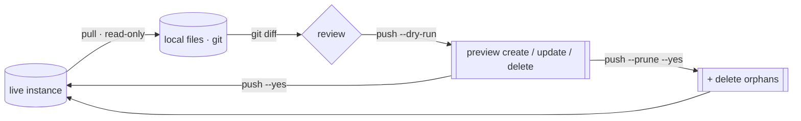

# 🧭 Reconcile surfaces

Config-as-code for the many engine surfaces: snapshot live objects to files, review
in `git diff`, push back. One redacted, diff-friendly file per object. Additive by
default; deletes only with `--prune`.

This is the same [pull → diff → push loop](the-loop.md) the whole tool runs on, applied
to the long tail of SIEM and SOAR config surfaces. For per-surface status (designed /
built / validated) see [the catalog](../design/catalog.md). For the engine internals
(identity, canonical diff, lanes, capabilities) see
[the architecture](../design/architecture.md).

## The pattern

```bash
secopsctl soar pull connectors --out .          # snapshot live → files
git diff                                         # review the change
secopsctl soar push connectors --dry-run        # preview the deploy
secopsctl soar push connectors --yes            # apply (LIVE)
```

SIEM surfaces use the top-level `pull` / `push`, same shape:

```bash
secopsctl pull reference_lists --out .
git diff
secopsctl push reference_lists --dry-run
secopsctl push reference_lists --yes
```

- `pull` is read-only — it never mutates the instance.
- `push` defaults to a **dry run**; `--yes` applies for real and prints a `LIVE DEPLOY`
  banner. Always preview, review, then confirm.
- A push is **additive**: it creates new files and updates edited ones. It will not
  delete anything unless you pass `--prune`.

## Surfaces

Each surface snapshots one file per object, keyed by server id, with secrets redacted.

| Plane | Pull / push | Surfaces |
|---|---|---|
| SOAR | `secopsctl soar pull\|push <surface>` | `blacklists` · `case-stages` · `case-tags` · `close-root-causes` · `connectors` · `environments` · `idp` · `jobs` · `networks` · `playbook-categories` · `playbooks` · `sla-definitions` · `soc-roles` · `tracking-lists` · `visual-families` · `webhooks` |
| SIEM | `secopsctl pull <s>` / `secopsctl push <s>` | `reference_lists` · `data_tables` · `parsers` · `feeds` · `forwarders` · `dashboards` · `rule_exclusions` · `metric_definitions` · `scheduled_reports` · `datataps` · `error_notifications` · `federation_groups` |

`secopsctl soar pull all` snapshots grouping and cases plus every SOAR engine surface,
in order. Status per surface lives in [the catalog](../design/catalog.md) — don't infer
it here.

## Prune: deleting server-only objects

By default a push never deletes. Objects that exist live but have **no local file**
(orphans) are left alone. To reconcile deletions, pass `--prune`:

```bash
secopsctl soar push webhooks --prune --dry-run   # preview what would be deleted
secopsctl soar push webhooks --prune --yes       # apply deletions (LIVE)
```

- `--prune` deletes every live object with no matching local file — review the dry-run
  carefully.
- It is **gated on a complete pull**: prune refuses to run against a partial snapshot,
  so a half-finished pull can't be read as "delete the rest."



## Redaction guard

Pulled files mask secrets with a marker (`***REDACTED***`) so the snapshot is safe to
commit. The push side **refuses to deploy a body that still carries the marker** —
create and update both error out rather than write a masked placeholder over a real
secret.

```
refusing to create "<name>": body still contains a redaction marker
(***REDACTED***); supply the real value first
```

To change a secret, replace the marker with the real value before pushing. To keep an
existing secret untouched, leave the field as it is — the update overlays your edits
onto the live body, so a field you didn't touch keeps its server value.

## Drift: read-only divergence (CI gate)

`secopsctl drift` compares committed local files to live state and reports divergence
without mutating anything. It exits non-zero when any surface has drifted — run it after
`pull` in CI to fail the build on out-of-band live edits.

```bash
secopsctl drift                          # every engine surface
secopsctl drift connectors webhooks      # only the named ones
secopsctl drift --out .                  # data root (default: cwd)
```

Output marks each object: `+` local-only (would create), `~` changed, `-` live-only
(would delete). It covers the same SIEM and SOAR engine surfaces as `push` — see
`secopsctl drift --help` for the full target list.

## See also

- [The loop](the-loop.md) — the pull / diff / push model end to end.
- [Configure](configure.md) — set `soar_url` + AppKey before any SOAR command.
- [Architecture](../design/architecture.md) — identity, canonical diff, lanes, capabilities.
- [Surfaces](../design/surfaces.md) · [Catalog](../design/catalog.md) — surface map and live status.
