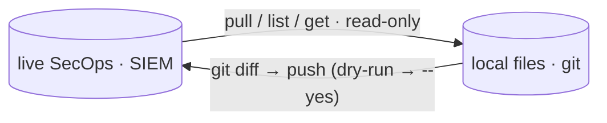

# Command reference — SIEM

Every SIEM-plane `secopsctl` command at a glance — what it does, and whether it
only **reads** or performs a **guarded mutation** (live deploy, dry-run by
default). The SOAR plane (cases, playbooks, integrations, Content Hub) lives in
the companion [SIEM/SOAR command reference — SOAR](reference-soar.md). For the
step-by-step how-to, follow the per-area guides linked below.

Core loop: pull live state → review in `git diff` → push back. **Every push is a
live production deploy and defaults to a dry run.**



## 🌐 Global flags

Set on any command (SIEM or SOAR):

| Flag | Effect |
|---|---|
| `--config <path>` | Use this instance config YAML. An explicit path that does not exist is an error (no silent fall-through). |
| `--json` | Emit machine-readable JSON where supported (shape is per-command). |
| `--timeout <dur>` | Per-**request** HTTP timeout for API calls (default `60s`; `0` disables). A slow or blocked endpoint fails fast instead of hanging. It bounds each individual request, so it never spans a confirm prompt and never caps a multi-call command (`pull all`, paginated reads) in aggregate; raise it only for a single very large request, e.g. `--timeout 5m`. |
| `--legacy` | Force the legacy AppKey path on dual-generation surfaces (currently `cases list`); ignored where a command has no modern/legacy split. Reach for it when a New-API call 500s — the tool already auto-falls back to legacy on error, so a feature is never lost when one generation is down. |
| `--non-interactive` | Never prompt; a guarded mutation without `--yes` is refused rather than asking. For CI/agents. |
| `--read-only` | Hard read-only session: every guarded mutation degrades to a dry-run preview even with `--yes`. Also enabled by `SECOPS_READONLY=1` — set it in the environment that launches an autonomous agent. Confirmed mutations and read-only refusals are appended to `$SECOPSCTL_HOME/audit.jsonl` (default `~/.secopsctl/audit.jsonl`, `0600`). |
| `-v, --version` | Print version and exit. |
| `-h, --help` | Help for any command. `<cmd> <target> --help` (e.g. `push feeds --help`) adds a per-target note: the surface's plane/version, whether `--prune` can delete it, and its write gotchas. |

**Exit codes** (git-style): `0` success / in sync · `2` divergence — `drift`
detected a difference (act) · `1` any error. A typo'd subcommand also exits
non-zero. Confirm the active config with `secopsctl info` (`config_source` line)
or `secopsctl config --show-path`.

The authoritative, per-command answer to "does this honor `--json`?" is
`secopsctl commands --json` — each row carries a `json` boolean (the human
`secopsctl commands` table shows it as the `JSON` column, `y`/`-`). It is built
from the code, so it stays correct as commands are added; prefer it over any
hand-maintained list.

A few special cases worth knowing: `pull` is text-only — its output is the files
it writes (review with `git diff`); `rules alerts` always emits raw JSON, with or
without the flag; and `doctor`, `drift`, `push`, and the guarded mutating verbs
emit structured JSON under `--json` too (dry-run/apply metadata, plus
request/response fields where the command has them).

## 🧰 Platform & utility

Offline or cross-plane helpers — no surface mutation.

| Command | What it does |
|---|---|
| `info` | Show the resolved instance config (no API call; AppKey redacted). |
| `info cron [--root <dir>] [--host] [--heartbeat-status <label>=<url>]` | Scheduler ownership/orphan report. Scans local scheduler-like files for `secopsctl drift`, `push`, and `soar push` references, plus pulled `soar/jobs/` and `soar/playbooks/` cron schedules. `--host` also inspects the current user's crontab and user systemd unit files. Reports file:line references and labels only; raw lines and URLs are not printed. |
| `commands [--json]` | List every command with its kind — `read` vs `guarded-mutation` (the `--dry-run`/`--yes` gate) — offline, no credentials. With `--json`, the input for agent tool lists and per-command allowlists. |
| `status capabilities [--json]` | Session bootstrap in one call: tool version + auth health + surface status + active read-only state. |
| `status coverage [--limit N]` | MITRE ATT&CK detection coverage (threat-collection × rule) — the platform's coverage-posture view. JSON. |
| `status surfaces [--json]` | List every API surface family — plane (host + auth), API version, lane (reconcile/imperative/raw/operational), status, and whether `--prune` can delete it. Reads nothing live; the map of reconcilable vs read-only. |
| `skill` | Print the agent operating guide embedded in the binary (`--json` for `{name, description, body}`); `skill install [--dir <skills-dir>]` writes it into an agent skills directory (default `$CLAUDE_CONFIG_DIR/skills` or `~/.claude/skills`) so a harness detects it. Offline. |
| `doctor` | Live smoke test: config + auth + SIEM/SOAR reachability. |
| `config` (alias `init`) | Set up / edit the config (`~/.secopsctl/instance.yaml`, `0600`). Single-screen form, or flags + `--non-interactive`. `config --show-path` prints the active config file. See [configure](configure.md). |
| `completion` | Generate the shell autocompletion script. |
| `version` | Print version, commit, and build info. |
| `help` | Help about any command. |

## 🔁 The config-as-code loop

ADC/OAuth auth (`gcloud auth application-default login`). See
[the loop](the-loop.md), [rules](rules.md), and [reconcile](reconcile.md).

| Command | What it does |
|---|---|
| `pull <target>` | Snapshot live state to local files. Targets: `rules`, `reference_lists`, `data_tables`, `dashboards`, `curated`, `curated_rules`, `feeds`, `parsers`, `forwarders`, `rule_exclusions`, `metric_definitions`, `scheduled_reports`, `datataps`, `error_notifications`, `federation_groups`, `all`. `--filter` applies to `curated_rules` only. `--with-charts` (dashboards) derefs each chart into its inline YARA-L query — heavier, but the mirror then round-trips with its queries; default keeps charts as references. |
| `drift [target...]` | Report how live state has drifted from local files (CI gate; exit 2 on drift). No target = every engine surface; `--siem`/`--soar` scope to one plane. |
| `push <target>` | Reconcile local files to live — see **SIEM guarded mutations** below for the full target list. Dry-run by default. |

Targets stay snake_case (they mirror the on-disk directory tree); only the
standalone command groups carry the renamed names.

## 🔒 Search & AI search

| Command | What it does |
|---|---|
| `search udm <filter>` | Point-in-time UDM event search over `--hours` / `--from` / `--to` (default last 24h), capped by `--limit`. `--raw` prints each matched event's FULL raw ingested log line (for `ingest parsers run --logs -`) instead of the summary. |
| `search raw <pattern>` | Content-based raw-log search (`searchRawLogs raw = /<pattern>/`) — prints each match's FULL raw ingested log line. Reaches logs with no parser; complements `search udm --raw`. `--unparsed` / `--hours` / `--from`,`--to` / `--limit`. |
| `search stats <aggregation>` | Run an AGGREGATION query — one with a `match:`/`outcome:` projection (which `search udm` rejects with a 400) — and print the computed columns/rows. The way to validate a dashboard chart's stats query before authoring it. The `match:` section takes a field reference (`target.hostname`); the `outcome:` declares the value (`$c = count(metadata.id)`). |
| `search event <id>` | Inspect one event by id: enriched UDM (default), `--udm` for the bare UDM record, or `--raw` for the original log line. |
| `search export <filter>` | Export ALL matching events to CSV (server-side; not capped at `--limit`). `--fields` chooses the CSV columns (defaults to the console's timestamp/user/hostname/process-name set); `--out <file>` writes the CSV. |
| `search validate <query>` | Validate a UDM query's syntax without running it (no mutation; non-zero exit if invalid). |
| `search run --file <path>` / `-` | Run a UDM predicate from a file (or stdin with `-`); blank/`#`-comment lines ignored — so a tracked `.udm` file is a runnable query. Same window/`--limit`/output flags as `search udm`. |
| `search saved` / `saved list` / `saved get <id>` / `saved run <id>` | Server-side saved & shared searches (Search Manager): `list` enumerates personal + org-shared searches, `get` shows one (query, type, sharing), `run` executes a saved search by id with the same output flags. |
| `gemini generate <text>` | Translate a natural-language request to a UDM query with SecOps Gemini and print it **without running it** — review before executing. Honors the model's suggested time window. `--opt-in` once per account. |
| `gemini search <text>` | Translate a natural-language request to UDM **and run it** — same output flags as `search udm`; honors the model's suggested time window. |
| `gemini ask <question>` | Ask the SecOps Gemini assistant a question (YARA-L authoring help, UDM fields, environment-grounded answers). Read-only. `--opt-in` once per account. |

**Output contract (search + `gemini search`/`search saved run`):** `--format
jsonl\|json\|csv\|table` picks the shape (`table` default for a TTY, machine
formats otherwise); `--fields <dotted.udm.path,…>` projects selected UDM fields
into columns; `--out <file>` writes the result to a file; `--all` fetches the
COMPLETE result set (not just `--limit`) and reports the total match count. See
[search](search.md) for the full story.

## 🔒 Rules & detections

| Command | What it does |
|---|---|
| `rules list` | List detection rules (rule id · display name · slug · type). The inspect verbs accept any of these forms directly. |
| `rules validate <file.yaral>` | Validate a YARA-L file against the API (no mutation); non-zero exit if invalid. |
| `rules test <file.yaral> [--hours N] [--max-results N]` | Dry-run a YARA-L rule against the last `--hours` of historical data and report the detections it WOULD produce — preview coverage/FP load before deploying. Read-only (nothing stored); compile errors are surfaced. |
| `rules versions <rule> [--show N]` | List a rule's saved revisions (history); `--show N` prints the Nth revision's YARA-L (diff externally / roll back). |
| `rules detections <rule>` | List detections a deployed rule produced in a time window. `<rule>` is a rule id, display name, or slug (resolved against the live rule list). |
| `rules errors <rule>` | List execution errors a rule produced, including structured error payloads. An unknown rule gives a clean client-side `no rule matches` error instead of an opaque API `400`. |
| `rules alerts <rule>` | Search alerts a rule generated (raw, rule-dependent shape). Accepts a rule id, display name, or slug. |
| `rules events <rule> <detection-id>` | The UDM events behind one detection — the evidence pivot (summary per event variable; `--json` for full payloads). |
| `rules trends` | Per-rule detection counts (day buckets) + last detection over `--hours` (default 7d), noisiest first — which rules are noisy or silent. No `--rule` = every rule. |
| `rules counts` | Rule count and quota statistics for the instance. |
| `rules retrohunt list <rule>` / `get <rule> <id>` | List a rule's retrohunts, or get one retrohunt's status (rule accepts id, display name, or slug). |
| `curated list` | List curated (Google-managed) rule-set deployments + enable/alerting state. |
| `curated rule-sets [--category ID]` | List curated rule SETS (id · severity · precisions · name) — the groupings `curated set` toggles. |
| `curated rules [--search Q] [--set ID] [--category ID] [--tactic T] [--severity S]` | List/search individual curated rules; filter by name/description, parent set, category, MITRE tactic, or severity. |
| `curated rule <ur_id>` | View one curated rule's detail: severity, type, precision, MITRE tactics/techniques, parent set, description (Google-managed — no source code). |
| `curated detections <ur_id>` | Detections a CURATED rule produced; the curated twin of `rules detections`. |
| `curated events <detection-id>` | Event + rationale behind one curated detection. |
| `curated trends (--rule ur_a,… \| --all)` | Per-curated-rule detection counts + last detection; `--all` sweeps every curated rule. |
| `exclusions list` / `get <id>` | List/inspect rule exclusions (findings refinements) — id, type, query, deployment state. |

## 🔒 Threat intel & entities

| Command | What it does |
|---|---|
| `ti collections` | List threat collections (campaigns/reports/…). |
| `ti collection <id>` | Show one threat collection by id. |
| `ti collection-matches <alt-name-or-id>...` | Show IoC match counts for threat collections (alt names such as `CAMP.00.001`; resource ids are resolved to alt names first). |
| `ti find [value...]` | Resolve indicator value(s) to IoC records (`--type` to force md5/sha1/sha256/domain/ip; `--from-file <path>`/`-` for a list or stdin). |
| `ti get <ioc-id>` | Get one IoC by its resource id (from `ti find --json`). |
| `ti related <ioc-id>` | List campaigns/reports related to an IoC resource id (`--collection-type campaign\|report\|all`). |
| `entities summarize <type> <value>` | Summarize an entity (alerts by rule, related entities, prevalence) over `--hours` (default 7d). |
| `entities graph <detection-id> [--hours N]` | Seed the findings-graph pivot from a detection: root node + connected entities/edges (lateral movement). Read-only, JSON. |
| `entities graph explore --param k=v …` | Expand a node of an initialized findings graph. |
| `entities risk-scores [--filter EXPR] [--order-by FIELD] [--limit N]` | Per-entity behavioral risk scores (normalized) — prioritize which hosts/users to look at first. JSON. |

## 🔒 Ingestion

| Command | What it does |
|---|---|
| `ingest feeds list` / `get <id>` | Live read of the instance's feeds with runtime state (SUCCEEDED/failed + failure note) — quick imperative view vs the `pull feeds` snapshot. |
| `ingest feeds schemas [--source-type <type>]` | List feed source types (or one source type's log types) — the field reference for authoring a feed. Templates are in `examples/feed-templates/`; use `secret_ref` for credentials. |
| `ingest feeds service-account` | Print the Chronicle-managed service-account email a push/PubSub/GCS feed source must be IAM-granted. |
| `ingest forwarders list` / `get <id>` / `collectors list <fwd>` / `collectors get <fwd> <id>` | List on-prem forwarders and their collectors (read-only). |
| `ingest health` | The error-notification configs that watch for delayed/zero-ingesting/erroring log sources. |
| `ingest log-types list [--search] [--limit N]` / `get <type>` | List the instance's log types (id + display name; `--search` filters the scanned set) or print one's description. |
| `ingest parsers sample-logs <log-type>` | Fetch a sample of a log type's RAW logs directly (`logTypes/<type>/logs`) — full bytes, one per line, to develop a parser against (`--limit` / `--since`). |
| `ingest parsers validate <log-type>` | Show the parsing errors from the most recently submitted parser's validation report — the detail behind a `push parsers` / `parsers activate` `FAILED_PRECONDITION` (`--show-logs` for the full sample). |
| `ingest parsers versions <log-type>` | List a log type's parser versions (id · state · created). |
| `ingest parsers run <log-type> --cbn <file> --logs <file>` | Validate a CBN parser against sample logs; no server change. |
| `ingest parsers extension list <log-type>` / `get <log-type> <id>` | List / get parser extensions for a log type (read-only). |
| `ingest pipeline list` / `get <id>` | List / show log processing pipelines (read-only). |

## 🔒 Lists, dashboards, data-access & alerts

| Command | What it does |
|---|---|
| `lists watchlists list` / `get <id>` | List SIEM entity watchlists, or get one by id. |
| `data-access labels list\|get <id>` / `scopes list\|get <id>` | List/get data-access RBAC labels (tag data) and scopes (grant access). |
| `dashboards list` | List every native dashboard (id · type · title). `--json` for the full objects. |
| `dashboards get <id>` | Dashboard summary: name, description, type, access (public/private), chart count, time filter, etag, timestamps. |
| `dashboards charts list <id>` | List a dashboard's charts with their resolved YARA-L queries (read-only; derefs each chart → query). Also how to recover a `--chart-id`. |
| `dashboards charts get <chart-id>` | Single chart detail: visualization, query body, input, layout. |
| `dashboards charts run <id> --chart-id <c>` | Execute a chart's query (`dashboardQueries:execute`) and print the VALUES it renders — rows/series (`--json`, `--clear-cache`, `--filter`). |
| `dashboards export <id>` | Export a dashboard with its charts + queries to one self-contained JSON document (`--out <file>` or stdout); read-only. Re-create it anywhere with `import`. |
| `dashboards layout show <id>` | Show all widgets' positions on the 96-column grid: id, type (CHART/MARKDOWN/BUTTON), X, Y, width, height, title. Sorted top-to-bottom, left-to-right. |
| `dashboards filters show <id>` | Show a dashboard's filters: global time range and any advanced token filters. |
| `dashboards verify [<id>]` | Execute every chart and flag the ones returning 0 rows or an error — a headless/CI dashboard health check (exit 2 if any chart needs attention). `--all` health-checks every CUSTOM dashboard in one fleet rollup (`--include-curated` to add the Google-managed ones). |
| `alerts list … --sort priority\|created` | List Chronicle detection alerts over a time window (snapshot); client-side sort by `priority` (worst first) or `created` (newest first). |
| `alerts get <id>` | Get one alert by id; when the alert is cased, also prints the SIEM case uuid **and its SOAR integer case id** (the `cases` pivot). |
| `alerts enrich <id>` | A SIEM alert's full context — rule detection, mapped UDM events, entities/indicators, MITRE tags, triage verdict, and the SOAR case bridge — via `legacy:legacyBatchGetCollections` (the surface the console uses). |
| `alerts investigate <id> --latest` | Read the alert's most recent AI (Gemini) investigation: verdict, confidence, summary, suggested next steps (`--json` adds the agent's per-step UDM queries). Without `--latest` it **starts** a new investigation (a generation; refused in read-only mode) and polls to completion. |

## ⚠️ SIEM — guarded mutations

Dry-run by default; pass `--yes` (or confirm interactively) to deploy. Each
prints a `LIVE DEPLOY` banner. See [rules](rules.md) and [reconcile](reconcile.md).

| Command | What it does |
|---|---|
| `push rules-create` | Create live rules from `*.yaral` files that have no companion `*.yaml`; `--enabled`, `--alerting`, and `--run-frequency` set the initial deployment. |
| `push rules-update` | Update live YARA-L text where a tracked `*.yaral` changed (etag-guarded). |
| `push rules-deploy` | Reconcile each tracked rule's deployment (enabled/alerting/frequency); `--rule` scopes one rule, and archived rules are reported as non-deployable. |
| `push rules-disable` | Disable locally-tracked rules with `deployment.enabled=true`. |
| `push curated` | Reconcile `curated/deployments.yaml` to live curated deployment state (enabled/alerting only). |
| `push <reconcile-target>` | Reconcile local files to live (create/update; `--prune` deletes on prune-eligible surfaces only — `push <target> --help` says which). Targets: `reference_lists`, `data_tables`, `parsers`, `feeds`, `forwarders`, `dashboards`, `rule_exclusions`, `metric_definitions`, `scheduled_reports`, `datataps`, `error_notifications`, `federation_groups`. |
| `rules promote <file.yaral>` | Create a new rule from a file and deploy it in one step (create + enable). |
| `rules retrohunt create <rule> [--wait]` | Start a retrohunt over historical data and (with `--wait`) poll until it finishes; then point at `rules detections` for the matches. |
| `curated set` | Toggle a curated deployment's `enabled`/`alerting` per precision (`--category`, `--ruleset`, `--precision precise\|broad`). |
| `exclusions deploy <id>` | Enable, disable, or archive one findings refinement with `--enable`, `--disable`, or `--archive`. Resolves the target and previews current → desired deployment state before acting. |
| `alerts update <id>...` | Set alert triage feedback: `--status new\|reviewed\|closed\|open`, `--verdict true-positive\|false-positive`, `--priority`, `--reason`, `--reputation`, scores, `--comment`, `--root-cause`. Several ids fan out the same update; `--where <filter>` / `--stdin-ids` resolve target ids from a snapshot or a pipeline. |
| `lists empty <name>` | Clear all entries from one no-delete reference list. Resolves the target and previews entry count only before acting. |
| `lists watchlists create\|delete\|add-entity\|remove-entity` | Manage tracking/hunting watchlists: `create --name X --display-name Y [--factor f]`, `delete <id> [--force]`, `add-entity <id> (--ip\|--mac\|--hostname\|--user\|--email)` (exactly one selector), `remove-entity <entity-name>`. |
| `data-access labels create\|delete` / `scopes create\|delete` | Create (`create --id X --file def.json`) or delete (`delete <id>`) a data-access label or scope. |
| `ingest feeds delete <id>` | Delete one feed by id (UUID or full resource name). Stops that feed's ingestion — the explicit one-off, since feeds aren't `--prune`-eligible. Resolves and names the feed before acting. |
| `ingest parsers activate <log-type> <id>` | Make a parser version ACTIVE (live ingestion switches; use `ingest parsers versions` to find a prior id to roll back to). |
| `ingest parsers extension create\|activate\|delete` | Manage parser extensions: `create --log-type <type> --cbn <file>`, `activate <log-type> <id>`, `delete <log-type> <id>`. |
| `ingest pipeline delete <id>` | Delete a log processing pipeline. |
| `dashboards create` | Create an empty CUSTOM dashboard: `--name`, `--access public\|private`, `--description`. Add charts/markdown/buttons afterwards. |
| `dashboards edit <id>` | Edit a dashboard's name (`--name`), description (`--description`), or access type (`--access public\|private`). |
| `dashboards charts add <id>` | Add a chart with a YARA-L `--query` (or `--query-file`) via `:addChart`. `--chart-type area\|bar\|gauge\|line\|map\|metrics\|pie\|scatter\|table --x <var> --y <var> [--series-by <var>]` GENERATES the visualization. `--if-absent` skips when a chart with the title exists. |
| `dashboards charts batch <id> --file <charts.json>` | Batch-author charts from a JSON array — validated up front, idempotent (existing titles skipped), `--pace`d under the chart quota. |
| `dashboards charts edit <id> --chart-id <c>` | Edit a chart IN PLACE: `--query`/`--query-file`, `--visualization`/`--chart-type`, and/or `--layout` (grid position) — no remove+re-add churn. |
| `dashboards charts remove <id> --chart-id <c>` | Remove a chart from a dashboard via `:removeChart`. |
| `dashboards markdown add <id>` | Add a markdown tile: `--title`, `--text`/`--text-file`, `--background-color`, `--layout`. No query or datasource. |
| `dashboards markdown edit <id> --chart-id <c>` | Edit a markdown tile's content, background color, or layout. |
| `dashboards markdown remove <id> --chart-id <c>` | Remove a markdown tile. |
| `dashboards button add <id>` | Add a button tile: `--title`, `--label`, `--url`, `--style filled\|outlined\|transparent`, `--color`, `--new-tab`, `--layout`. |
| `dashboards button edit <id> --chart-id <c>` | Edit a button tile's label, url, style, color, or layout. |
| `dashboards button remove <id> --chart-id <c>` | Remove a button tile. |
| `dashboards layout move <id> --widget-id <c>` | Move or resize any widget (chart/markdown/button) on the 96-column grid: `--x`, `--y`, `--span-x`, `--span-y` (partial — only the flags you pass are changed). |
| `dashboards filters set <id>` | Set the global time range filter: `--time <N> --unit HOUR\|DAY\|WEEK\|MONTH`. Replaces the existing time filter; preserves advanced filters. |
| `dashboards duplicate <id>` | Copy a dashboard to a new independent one (new `--name`/`--access`) via the server `:duplicate` verb — the copy gets its own charts and queries in one call. `--deep-copy` rebuilds it client-side instead (fallback). |
| `dashboards delete <id>` | Delete a whole dashboard, e.g. a stale duplicate. A corrupt dashboard whose charts are dangling/non-owned references can't be deleted by the API or the web console — the error says so. |
| `dashboards import <file>` | Create a dashboard from an export JSON document in ONE call (dashboard + charts + queries together; server mints fresh ids). |
| `cleanup smoke-artifacts` | Delete or neutralize only secopsctl-owned smoke-test artifacts. Dry-run prints the exact plan; apply requires `--yes`. |

## 🧪 Cookbook (SIEM)

End-to-end recipes. The deeper how-to lives in the per-area guides.

**Prove the setup before touching anything** ([install](install.md),
[configure](configure.md)):

```bash
secopsctl config     # write ~/.secopsctl/instance.yaml (git-ignored, 0600)
secopsctl doctor     # read-only reachability check: SIEM + SOAR
secopsctl info       # show resolved config (AppKey redacted; no API call)
```

**The golden rule** — reads are free; every write is dry-run first
([the loop](the-loop.md)):

```bash
secopsctl push <target>          # dry-run by default — read the preview
secopsctl push <target> --yes    # apply for real
```

**Edit a detection rule** ([rules](rules.md)):

```bash
secopsctl pull rules                       # always pull before you edit
# edit ./rules/<slug>.yaral, then: git diff rules/
secopsctl push rules-update --dry-run      # etag-guarded preview
secopsctl push rules-update --yes
secopsctl pull rules                        # re-pull so local matches live
```

**Ad-hoc UDM search and shape the output** ([search](search.md)):

```bash
secopsctl search udm 'metadata.event_type = "USER_LOGIN"' --hours 48 --limit 500 --json
secopsctl search udm 'metadata.event_type = "USER_LOGIN"' \
    --fields principal.user.userid,target.hostname --format csv --out logins.csv --all
```

**Let Gemini draft a query, then run it** ([gemini](gemini.md)):

```bash
secopsctl gemini generate 'failed logins for admin in the last day'  # review the UDM first
secopsctl gemini search   'failed logins for admin in the last day'  # translate + run
```

## 🔗 See also

- [Install](install.md) · [Configure](configure.md) · [The loop](the-loop.md)
- [Rules](rules.md) · [Search](search.md) · [Gemini](gemini.md) · [Reconcile](reconcile.md) · [SDK](sdk.md)
- [SIEM/SOAR command reference — SOAR](reference-soar.md)
- [Architecture](../design/architecture.md) · [Surfaces](../design/surfaces.md) · [Catalog](../design/catalog.md) (surface status — source of truth)
- [SIEM design](../design/siem.md) · [SOAR design](../design/soar.md) · [Glossary](../GLOSSARY.md)
