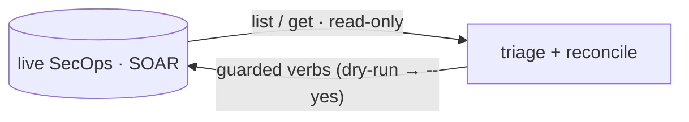

# Command reference — SOAR & cases

Every SOAR-plane `secopsctl` command at a glance — cases, playbooks,
integrations, jobs, the Content Hub, and the SOAR config-as-code surfaces — with
whether each only **reads** or performs a **guarded mutation** (live deploy,
dry-run by default). The SIEM plane (search, rules, dashboards, ingestion) and
the **global flags / exit codes / output contract** live in the companion
[SIEM/SOAR command reference — SIEM](reference-siem.md).

SOAR commands use AppKey auth (`soar_url` + `$SECOPS_SOAR_APP_KEY`; no ADC). See
[SOAR cases](soar-cases.md), [triage](triage.md), and [reconcile](reconcile.md).



## Cases: read-only

A case is one record: `cases …` is the canonical command. The `--id` is the SOAR
integer id from `cases list`.

| Command | What it does |
|---|---|
| `cases list` | List SOAR cases (default open; `--status open\|closed\|all`, `--limit`). Triage filters: `--assignee` (substring), `--priority`, `--tag` (modern lane), `--since` (duration/timestamp), and a verbatim modern server-side `--filter` expression (grammar below). `--sort priority\|created\|updated` sorts the table and shows an SLA-status column. |
| `cases counts [--filter <expr>]` | Per-priority case counts for a filter set (default open cases) — one cheap exact count per priority via the list's `totalSize`. |
| `cases get <id>` | Get one case + its alerts (SOAR integer id). Each alert shows its `--alert` identifier, its firing rule (name + `ru_` id) with a `rules detections` pivot hint, and — when a playbook is attached — a **▸ playbook(s) attached** marker with the exact `cases wall` / `soar playbooks summary` pivot commands. |
| `cases workload [--filter]` | Open-case count per analyst (queue load distribution). |
| `cases aging [--limit N]` | Open cases oldest-first by age (hours) with priority + SLA status — spot stale cases. |
| `cases stats [--filter]` | Queue stats: open/closed counts, open-age p50/p90, and closed resolution-time p50/p90 (create→close proxy). |
| `cases wall --case-id N` | Render the case's **timeline** (oldest first: time · kind · activity) — playbook attachments, action results, alert grouping, status/stage changes. `--json` for the full records. |
| `cases comment list --id N` | List a case's comments (the case-wall record; `--alert` scopes to one alert). |
| `cases summarize --id N [--refresh]` | The structured AI summary of a case — narrative, reasons, next steps (`--refresh` forces a new generation). |
| `cases overview --id N [--widgets]` | The data behind the console's case Overview tab: the case's entities with their enrichment by default, or the overview widget template with `--widgets`. Read-only, JSON. |
| `cases task list --id N` | List the checklist tasks on a case. |
| `cases evidence get <evidence-id>` | Read one piece of case evidence back. |
| `cases chat list --case-id N` / `chat unread-count --case-id N` | List a case's chat messages, or show its unread count. |
| `cases context list --case-id N` | List the context properties set on a case. |
| `cases custom-fields --case-id N` | List the custom field values on a case. |
| `cases values <tags\|stages\|root-causes>` | List the live configured values for `--tag` / `--stage` / `--root-cause`. |
| `cases alert recommend --id N --alert <ident>` | Generate + fetch the AI recommendation for one alert in a case (the alert must be open at alert level; each run starts a generation server-side — refused in read-only mode). |
| `cases simulation list` / `get --name <sim>` | List custom (simulated) test-case names for playbook development, or read one simulation's alert/event field config. |
| `cases soar-id <uuid>...` | Resolve SIEM case uuid(s) (an alert's `caseName`) to SOAR integer case id(s) — the bridge from `alerts get` into every `cases` verb. |

### Case `--filter` grammar (modern cases list)

`--filter` on `cases list` / `cases counts` passes a server-side expression
through verbatim — the same grammar the web UI's Case Queue Filter generates:

| Field | Type | Example |
|---|---|---|
| `status`, `priority` | enum token | `status = 'OPENED'`, `priority = 'PRIORITY_HIGH'` (`PRIORITY_INFO`/`LOW`/`MEDIUM`/`HIGH`/`CRITICAL`) |
| `assignee` | string | `assignee = '@Tier1'` (at-prefixed role name) or a user UUID |
| `environment`, `stage`, `displayName` | string | `stage = 'Triage'` (stages: Triage, Assessment, Investigation, Incident, Improvement, Research) |
| `createTime`, `updateTime` | int64 (epoch ms) | `updateTime >= 1700000000000` |
| `id` | int64 | `id >= 4000` |
| `tags`, `alertNames`, `products` | collection | `any(tags.displayName, 'tag-a', 'tag-b')` · `any(alertNames.alertName, 'RULE NAME')` · `any(products.displayName, 'RULE')` |

Terms compose with `and` / `or` and parentheses. A zero-match query returns an
empty result (HTTP 204), not an error. Very long filters are sent automatically
via the method-override POST the UI uses, so URL length is not a practical limit.

## Cases: guarded mutations

Dry-run by default; pass `--yes` to apply. See [SOAR cases](soar-cases.md) and
[triage](triage.md).

| Command | What it does |
|---|---|
| `cases close` | Close one case (`--id`, `--reason` = the fixed enum `malicious\|not-malicious\|maintenance\|inconclusive\|unknown`; `--root-cause`, `--comment` optional). |
| `cases reopen` | Reopen closed case(s) — the inverse of close (`--id` single or `--ids 1,2,3` bulk; `--comment` optional). |
| `cases assign` | Assign a case (or many) to a user (`--id`/`--ids`, `--user` — a username from `soar users list`, or `@RoleName`). |
| `cases tag` / `untag` | Tag / untag a case (`--tag`; bulk `--ids` for `tag`). |
| `cases stage` | Change a case's (or many cases') stage (`--id`/`--ids`, `--stage`). |
| `cases priority` | Change a case's priority (`--priority informative\|low\|medium\|high\|critical`). |
| `cases rename` / `describe` / `importance` | Rename, re-describe, or flag-important a case. |
| `cases merge` | Merge source cases into a target (`--ids 1,2,3 --into N`). |
| `cases comment add` | Add a comment to a case (`--id`, `--text`; `--alert` scopes to one alert). |
| `cases run-action --id N --action <name> --instance <uuid> [--integration <id>]` | Execute an integration action on a case (ad-hoc). For a marketplace integration's action pass `--integration <id>` so it is sent qualified as `<id>_<action>`; built-in Scripts actions (HTTP_Ping) need no `--integration`. `--param key=value` (secrets via `env:VAR`); with `--integration`, params are pre-flight-validated against the action's schema (`--skip-validate` bypasses). |
| `cases evidence add --id N --file F --name X` | Attach a file as case evidence (the API has no delete). |
| `cases task add\|done\|delete` | Case checklist tasks: `add --id N --title T`, `done --task-id N`, `delete --task-id N`. |
| `cases chat send --case-id N --message <text>` | Send a chat message to a case. |
| `cases context set --id N --key <k> --value <v>` | Set a context property on a case. |
| `cases alert close` | Close ONE alert in a case — the case stays open (`--id`, `--alert`, `--reason malicious\|not-malicious\|maintenance\|inconclusive`; optional `--root-cause`, `--comment`, `--usefulness`). |
| `cases alert priority` | Change one alert's priority (`--id`, `--alert`, `--priority`); the alert's name + current priority are resolved from the case, so a wrong `--alert` fails before any mutation. |
| `cases alert move` | Move one alert out of a case (`--id`, `--alert`; `--to M` for an existing case, omit for a new one) — the inverse of `merge`. |
| `cases alert reopen` | Reopen one closed alert in a case (`--id`, `--alert`). |
| `cases simulation create\|generate\|alert\|delete` | Create a custom simulated test case from alert/event field specs, generate test case(s) from named simulation(s), simulate an alert inside a case, or delete a custom simulation — playbook testing. |

## SOAR engine and config: read-only

| Command | What it does |
|---|---|
| `soar pull <target>` | Snapshot SOAR state to local files. Targets: `grouping`, `cases`, `blacklists`, `case-stages`, `case-tags`, `close-root-causes`, `connector-allowlist`, `connectors`, `environments`, `idp`, `jobs`, `networks`, `playbook-categories`, `playbooks`, `sla-definitions`, `soc-roles`, `tracking-lists`, `visual-families`, `webhooks`, `all`. |
| `info soar-integrations` | Report installed SOAR integration packs, connector/job runtime counts, bound environments, and gaps such as `config_without_runtime` or `runtime_disabled`. |
| `info soar-system` | SOAR platform version, license, and data-retention settings. |
| `soar integrations list [--custom]` | List installed integration packs (`--custom` for clones). |
| `soar integrations instances --integration <id>` | List an integration's configured instances (id · environment · name) — the fields `integrations delete` needs. |
| `soar integrations connector list --integration <key>` | List connector definitions inside an integration (read-only). |
| `soar integrations action template --integration <key>` | Fetch the new-action definition skeleton (Python scaffold included; `--async` for the asynchronous variant). `job-def template` mirrors it for jobs. |
| `soar connector stat <identifier>` | Runtime statistics for one connector instance (events, errors, connectivity, last run) — confirm health after a config change. |
| `soar jobs list` / `template list` / `instance list` | List installed SOAR jobs and last-run status, job templates, or configured job instances (no job script bodies). |
| `soar jobs logs` | Read Python execution logs for SOAR jobs/actions (filters such as `labels.job_name=~"^."`). Can 500 on some instances; for failed-run triage prefer `soar playbooks summary`. |
| `soar settings api-keys list` | List SOAR API keys (metadata only; the secret is never shown after creation). |
| `soar settings grouping get` | Read the alert-grouping settings (max-alerts-per-case + module properties). |
| `soar settings case-assignment get` / `move-case-policy get` | Read the case auto-assignment policy / cross-environment case-move policy. |
| `soar audit list` | List recent SOAR audit log entries. |
| `soar audit notifications list` / `unread` | List the current user's notifications, or show the unread count. |
| `soar audit report-templates` | List SOAR report templates. |
| `soar users list [--grep] [--all]` | List SOAR users (the USERNAME column is the value for `cases assign --user`). |
| `soar legacy list [--grep] [--tag] [--method M]` | List external-API ops available to `soar legacy call` (offline, from the bundled index). |

### SOAR playbooks: read-only

| Command | What it does |
|---|---|
| `soar playbooks list` | List live SOAR playbooks (`--enabled-only`, `--type regular\|nested`). |
| `soar playbooks validate --file <playbook.json>` | Preflight an exported playbook JSON before save (same local checks as `soar push playbook --dry-run`). |
| `soar playbooks export (--name \| --identifier)` | Export a playbook: definition+blocks JSON, or `--zip --out <f>` for the platform bundle `import` takes. |
| `soar playbooks versions (--name \| --identifier)` | List a playbook's saved version log (each save/deploy mints one); the identifiers feed `restore`. |
| `soar playbooks stats (--name \| --identifier) [--hours N]` | Aggregate run statistics for one playbook across all cases over a window. |
| `soar playbooks summary --case-id N --playbook <name>` | Triage a playbook run: surfaces FAULTED steps (action · error · Cloud Logging deep-link; `--show-errors` for the traceback, `--steps` for the full per-step trace). Prefers the v1alpha path, falls back to legacy. |
| `soar playbooks results --workflow-instance-id N` / `result --case-id N --action-result-id <id>` | Read action results for a workflow instance, or one case action-result id. |
| `soar playbooks components integrations\|actions\|flow\|triggers\|blocks\|jobs\|connectors` | The component palette: installed integrations, the whole action catalog (`--integration <key>` for detail), Flow transformers/operators, trigger vocabulary, reusable blocks, and per-integration job/connector definitions. |
| `soar playbooks components usage (--action-id N \| --action <name>)` | Which playbooks use an integration action (impact analysis). |
| `soar playbooks pending count\|list\|get` | Read pending playbook steps assigned to the current user (`get --case-id N`). |
| `soar playbooks step get` | Fetch one workflow step instance by case, workflow, and step identifiers (`--json` to save the body for guarded `step execute`). |
| `soar playbooks test-cases` / `debug-step-data` / `simulation-enrichment` | List SecOps debug test cases, read simulated case data for a debug step, or read simulation enrichment for a test case/step/workflow. |
| `soar playbooks trigger tags [--grep]` | List the live tag values a Tag-Name trigger condition can reference. |
| `soar playbooks generate-status --case-id N --alert <id>` | Poll the status of a by-alert AI playbook generation. |
| `soar playbooks python-logs` | Read Python execution logs (`--filter`, `--page-size`, `--page-token`). Can 500 on some instances; prefer `soar playbooks summary` for failed-run triage. |

### Content Hub: read-only

| Command | What it does |
|---|---|
| `content-hub browse` | Content Hub overview: integration + content-pack catalog totals and installed-integration count. |
| `content-hub list [--installed]` | List Content Hub marketplace integrations. |
| `content-hub get <identifier>` | Show one marketplace integration (human summary; `--json` for the full record). |
| `content-hub diff <integration-id>` | Show the diff between the installed and marketplace version of an integration. |
| `content-hub contentpacks` / `contentpacks get <id>` | List Content Hub content packs, or inspect one. |
| `content-hub featured list` | List featured playbooks from the Content Hub. |

## SOAR: guarded mutations

Dry-run by default; pass `--yes` to apply. Each prints a `LIVE DEPLOY` banner.

| Command | What it does |
|---|---|
| `soar push <surface>` | Reconcile local files to live (create/update; `--prune` deletes on prune-eligible surfaces only — `soar push <surface> --help` says which). Surfaces: `blacklists`, `case-stages`, `case-tags`, `close-root-causes`, `connector-allowlist`, `connectors`, `environments`, `grouping`, `idp`, `jobs`, `networks`, `playbook-categories`, `playbooks`, `sla-definitions`, `soc-roles`, `tracking-lists`, `visual-families`, `webhooks`. Prune-eligible: `connectors`, `grouping`, `networks`, `visual-families`, `webhooks`. |
| `soar push playbooks` (plural) | Reconcile the **whole** playbooks directory: create/update every changed playbook (one of the reconcile surfaces above). |
| `soar push playbook` (singular) | Imperative whole-body save of **one** playbook from `--file <playbook.json>`; mints a new version. Not a directory reconcile — use `playbooks` for the loop. |
| `soar push bulk-close` | Bulk-close cases by id or filter (`--ids`, `--reason` ∈ malicious\|not-malicious\|maintenance\|inconclusive\|unknown). |
| `content-hub install --identifier <id>` | Install a Content Hub marketplace integration (`marketplaceIntegrations:install`). |
| `content-hub uninstall --identifier <id>` | Uninstall a marketplace integration — the reversible inverse of `install`. |
| `content-hub featured install --name <resource-name>` | Install a featured playbook from the Content Hub. |
| `soar connector run --integration X --connector Y --instance Z` | Trigger a connector instance to pull on demand — verify it pulls without waiting for its schedule. |
| `soar integrations install --identifier <id>` | Install a Content Hub marketplace integration pack (pairs with `content-hub uninstall`). |
| `soar integrations create --integration <id> --environment <env>` | Create a new, unconfigured (inert) integration instance. |
| `soar integrations configure --integration <id> --param k=v` | Set an instance's parameters. Reads current settings, overlays `--param` values (matched on `propertyName` or display name), and saves. `--param 'key=env:VAR'` resolves secrets from env vars. |
| `soar integrations delete --integration <id>` | Delete an integration instance (warns if playbooks use it). `--id`/`--environment` are resolved from the integration's instances. |
| `soar integrations uninstall --key <integration-key>` | Delete a custom integration pack (clone) by its key. |
| `soar integrations action create\|update\|delete` | Manage custom Python action definitions: `create --integration <key> (--file <def.json> \| --name <n> --script <f.py>)`, `update --id N`, `delete --id N`. `soar integrations job-def {create,update,delete}` mirror for jobs. |
| `soar integrations connector delete --integration <key> --id <connector-id>` | Delete a custom connector definition (e.g. a `Copy of …` duplicate). |
| `soar jobs run --job <id\|uniqueIdentifier\|name>` | Run one installed SOAR job now (fetches the live job, previews the target, requires `--yes`). |
| `soar jobs instance create\|delete\|run\|set` | Manage scheduled job instances: `create --file <json>`, `delete --instance <sel>`, `run --instance <sel>`, `set --instance <sel> --enable\|--disable`. |
| `soar playbooks deploy (--name \| --identifier) --enable\|--disable` | Toggle a playbook's `isEnabled` (reads the full definition, flips the flag, saves a new version). |
| `soar playbooks delete (--name \| --identifier \| --from-file)` | Delete one or more playbooks permanently. Irreversible — deleting stops any attached case execution. |
| `soar playbooks run` / `rerun` / `rerun-block` | Attach/run a live playbook on an explicit case/alert; `rerun`/`rerun-block` re-execute a playbook or nested block (`rerun-block --inputs <file>`). |
| `soar playbooks debug --file <playbook.json> --test-case-id N` | Run a playbook definition in SecOps debug mode against an explicit test case. |
| `soar playbooks step execute` / `step skip` | Execute one fetched workflow step instance (`--file <step-instance.json>`), or skip a pending step — the reject half of an approval (`--comment` records why). |
| `soar playbooks restore --version <id>` | Roll a playbook back to a version from `versions` (`--override` replaces outright). |
| `soar playbooks import --file <bundle.zip>` | Import a playbook bundle (the zip `export --zip` produces) — cross-tenant promotion / backup restore. |
| `soar playbooks generate (--description <s> \| --case-id N --alert <id>)` | Draft a playbook with AI. The description form returns the draft definition **without persisting it** — review, then save with `soar push playbook --file`. Poll the by-alert form with `generate-status`. |
| `soar settings api-keys create\|revoke` | Create an API key (secret minted locally — crypto/rand — and printed ONCE) or revoke one by name/id. |
| `soar settings grouping set --property <name>=<value>` | Set alert-grouping settings properties. |
| `soar settings case-assignment set <value>` / `move-case-policy set <value>` | Set the case-routing policy (integer enum). |
| `soar audit notifications close [--id N \| --all]` | Close (dismiss) the current user's notifications. |
| `soar legacy call <op>` | Escape hatch: call any Siemplify external-API op (`/api/external/v1`). The legacy API uses POST for **both** reads and writes, so a POST must declare intent — `--read` for a read, `--write --yes` for a mutation (prints a live external-API banner). `--dry-run` previews the composed request; `--out <file>` writes the response `0600`. |

`soar pull cases` is a **snapshot-only** read target: there is no matching
`soar push cases` and it is not part of `drift`, so the pull → diff → push loop
does not close for it — use it to capture state for review, not to reconcile it.

## SOAR IDE and offline tooling

Offline composers and scaffolds — no API call until you save through the guarded
loop above.

| Command | What it does |
|---|---|
| `soar ide build-playbook --base <playbook.json> --cron <expr> --out <playbook.json>` | Compose a scheduled playbook from a full exported base, setting `trigger.cronSchedule` and (via repeated `--replace-step <step>=<step.json>`) swapping placeholder steps for exported, already-wired integration-action molds. |
| `soar ide package-integration <dir>` | ZIP builder for an already-shaped SOAR custom integration directory. Defaults to `<dir>.zip`; `--out <file>` / `--force` to overwrite. |
| `soar integrations scaffold --name <integration> --out <dir> [--action <name>] [--job <name>]` | Scaffold a Python-backed custom integration directory (actions/jobs). Package with `soar ide package-integration`; SecOps validates it on import. |
| `soar playbooks mold extract --file <playbook.json> --step <name\|id> --out <step.json>` | Extract one exported action step as a reusable mold for `soar ide build-playbook`. |
| `soar playbooks mold apply --file <playbook.json> --replace-step <step=step.json> --out <playbook.json>` | Replace placeholder steps in an exported playbook with reusable action-step molds, preserving the base step graph identity. |
| `soar playbooks step insert --file <pb.json> --mold <step.json> --after <step> --out <f>` | Splice a NEW action step into a playbook definition after an anchor step — fresh graph identity, rewired relations (`--branch` picks a condition branch). |
| `soar playbooks trigger set --file <playbook.json> --out <playbook.json>` | Edit trigger fields in exported playbook JSON (`--enabled`, `--trigger-enabled`, `--type`, `--execution-mode`, `--cron`, `--conditions`, `--reaction-conditions`) before validation and guarded save. |

## Cookbook (SOAR)

**Triage a case** — `--id` is the SOAR integer id from `cases list`
([SOAR cases](soar-cases.md), [triage](triage.md)):

```bash
secopsctl cases list
secopsctl cases get 1234
secopsctl cases summarize --id 1234
secopsctl cases close --id 1234 --reason malicious --yes
```

**Check SOAR integration runtime coverage**:

```bash
secopsctl info soar-integrations
secopsctl --json info soar-integrations
```

**Install content from the Content Hub** ([content hub](content-hub.md)):

```bash
secopsctl content-hub browse                       # catalog + installed counts
secopsctl content-hub list --installed             # what is already in
secopsctl content-hub install --identifier <id> --dry-run
secopsctl content-hub install --identifier <id> --yes
```

**Reconcile a SOAR surface** ([reconcile](reconcile.md)):

```bash
secopsctl soar pull webhooks               # snapshot the whole surface
# edit ./soar/webhooks/, then: git diff soar/webhooks/
secopsctl soar push webhooks --dry-run     # additive preview
secopsctl soar push webhooks --yes
secopsctl soar push webhooks --prune --yes # delete server-only objects (gated on a full pull)
```

**Develop a SOAR playbook with SecOps-backed tests** ([playbooks](playbooks.md)):

```bash
secopsctl soar playbooks components actions --integration Example --grep lookup
secopsctl soar playbooks mold extract --file exported-playbook.json --step "Lookup" --out molds/lookup.json
secopsctl soar ide build-playbook --base base-playbook.json --cron "0 8 * * *" \
    --replace-step "Lookup=molds/lookup.json" --out playbook.json
secopsctl soar playbooks validate --file playbook.json
secopsctl soar playbooks debug --file playbook.json --test-case-id 123 --dry-run
secopsctl soar playbooks summary --case-id 456 --playbook "My Playbook"
```

**Escape hatch — call a legacy external-API op directly.** When a Siemplify
`/api/external/v1` op has no first-class command, `soar legacy call` reaches it
raw. GET is read-only; the legacy API uses POST for **both** reads and writes, so
a POST must declare intent. Op names and body shapes come from the SecOps Web UI
Network tab (browser dev-tools). Many legacy reads expect an offset-paging body,
`{"requestedPage": 0, "pageSize": 100}`.

```bash
# Read (GET): list installed integrations
secopsctl soar legacy call integrations/GetInstalledIntegrations --read

# Read (POST) with an offset-paging body
printf '{"requestedPage": 0, "pageSize": 100}' > page.json
secopsctl soar legacy call <list-op> --method POST --read --body page.json

# Guarded write (POST): refused without --yes; --yes deploys live
printf '{"caseId": 1234, "tag": "triaged"}' > req.json
secopsctl soar legacy call <write-op> --method POST --write --body req.json --dry-run  # preview, sends nothing
secopsctl soar legacy call <write-op> --method POST --write --body req.json --yes      # deploy live
```

## See also

- [SOAR cases](soar-cases.md) · [Triage](triage.md) · [Playbooks](playbooks.md) · [Content Hub](content-hub.md) · [Reconcile](reconcile.md)
- [SIEM/SOAR command reference — SIEM](reference-siem.md) (global flags · exit codes · output contract)
- [Architecture](../design/architecture.md) · [Surfaces](../design/surfaces.md) · [Catalog](../design/catalog.md) (surface status — source of truth)
- [SOAR design](../design/soar.md) · [Glossary](../GLOSSARY.md)
