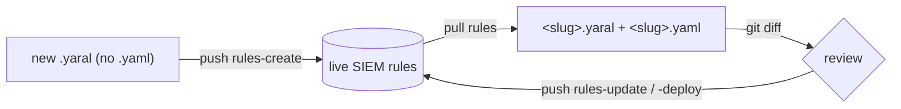

# Detection rules

YARA-L detection rules as code: `pull` live rules to files, edit the `.yaral`
text in git, `push` the change back. Inspect detections, errors, alerts, and
retrohunts read-only. Toggle Google-managed curated rule sets without owning
their content.

For the shared pull → diff → push mechanics see [the-loop.md](the-loop.md).
For YARA-L authoring craft see [../tips/03-yara-l-rules.md](../tips/03-yara-l-rules.md).
For surface status see [../design/catalog.md](../design/catalog.md).

## What lands on disk

Each rule pulls to a pair of files under `<dataRoot>/rules/`. `<dataRoot>` is the
current working directory by default: `pull rules` writes `./rules/` there (override
with `--out`) and `push rules-*` reads `./rules/` from there (override with
`--rules-dir`).

| File | Holds | Edit it? |
|---|---|---|
| `<slug>.yaral` | the YARA-L source text | yes — this is what you author |
| `<slug>.yaml` | authoritative `rule_id`, `etag`, and `deployment` (enabled / alerting / archived / runFrequency) | rarely by hand — `pull` rewrites it |

The filename `<slug>` is the slugified `displayName`. The server id lives in the
companion `.yaml`, never in the filename.



> ⚠️ Don't rename a slug file casually. The filename is the slugified
> `displayName`; the authoritative id is in the companion `.yaml`. A rename on
> `push` can read as delete-then-recreate of the live rule. Rename in the SIEM,
> then `pull`.

## Pull

```bash
secopsctl pull rules
secopsctl pull rules --out ./snapshot
```

Read-only. Mirrors every live rule to `<slug>.yaral` + `<slug>.yaml`. `--out`
sets the output root (default: cwd). Commit the result; the git history is the
review surface.

## Push paths

`push` is a live deploy and defaults to a dry run. Always preview with
`--dry-run`, review the plan, then re-run with `--yes`.

| Target | Does | Guard |
|---|---|---|
| `rules-create` | create live rules from `*.yaral` that have **no** companion `*.yaml` | initial deployment flags |
| `rules-update` | update live YARA-L text where a tracked `*.yaral` changed | etag |
| `rules-deploy` | reconcile each tracked rule's deployment (enabled / alerting / frequency) from its `*.yaml`; `--rule` scopes one rule | — |
| `rules-disable` | disable locally-tracked rules whose `deployment.enabled=true` | — |

`rules-deploy` reads `deployment.enabled`, `deployment.alerting`, and
`deployment.runFrequency` from each rule's companion `.yaml`. The valid frequency
values are `LIVE`, `HOURLY`, and `DAILY`; the companion's
`allowed_run_frequencies` list shows which of these the rule permits. Pulled
`deployment.archived` is mirror state: dry-runs report archived rules as
non-deployable instead of attempting a deployment PATCH.

```bash
secopsctl push rules-create --dry-run
secopsctl push rules-create --yes
secopsctl push rules-create --enabled=false --dry-run
secopsctl push rules-create --alerting=false --run-frequency=HOURLY --dry-run

secopsctl push rules-update --dry-run
secopsctl push rules-update --yes

secopsctl push rules-deploy --dry-run
secopsctl push rules-deploy --rule <rule-id-or-slug> --dry-run
secopsctl push rules-deploy --yes

secopsctl push rules-disable --dry-run
secopsctl push rules-disable --yes
```

For `rules-create`, `--enabled=false` creates rules disabled, while
`--alerting=false` creates monitor-only rules. `--run-frequency` accepts `LIVE`,
`HOURLY`, or `DAILY`, and the dry-run preview prints the exact initial deployment
state.

`--rules-dir` overrides where the local rule files are read from (default:
`<dataRoot>/rules`):

```bash
secopsctl push rules-update --rules-dir ./snapshot/rules --dry-run
```

> ✅ After any live push, re-`pull rules` so the companion `.yaml` (new
> `rule_id`, fresh `etag`, current deployment) matches the instance.

## etag concurrency

`rules-update` round-trips the stored `etag` for optimistic concurrency on the
YARA-L text update. If the live rule changed since your last `pull`, the `etag`
no longer matches and the push fails with a clean error — never a silent
overwrite of someone's out-of-band edit. Recover by `pull rules` to refresh,
re-applying your change, then pushing again.

`rules-deploy` and `rules-disable` patch the deployment subresource (enabled /
alerting / runFrequency) and carry **no** concurrency token, so they are not
etag-guarded. `rules-deploy` refuses archived rules before applying.

## Inspect and operate

Read-only operational commands over deployed rules. All accept a rule id,
display name, or slug (resolved via the companion `.yaml`'s `rule_id`).

| Command | Does |
|---|---|
| `rules list` | list all detection rules (id, name, slug) |
| `rules get <rule>` | show a rule's state (enabled/alerting/archived, compile, severity, MITRE, revision); `--text` for raw YARA-L |
| `rules validate <file.yaral>` | syntax-check a YARA-L file against the API without deploying |
| `rules detections <rule>` | detections the rule produced |
| `rules errors <rule>` | execution errors the rule produced |
| `rules alerts <rule>` | alerts the rule generated (raw shape) |
| `rules health` | per-rule health roll-up (failing/erroring/silent/healthy); `--only`, `--format`, `--out` |
| `rules trends` | per-rule detection counts + last detection (noisy vs silent) |
| `rules counts` | rule count and quota statistics for the instance |
| `rules events <rule> <detection-id>` | UDM events behind one detection — the evidence pivot |

```bash
secopsctl rules get my-rule --text                     # print the YARA-L
secopsctl rules validate ./new_rule.yaral              # syntax check only
secopsctl rules detections <rule> --hours 24 --limit 100 --state ALERTING
secopsctl rules errors <rule> --hours 24
secopsctl rules alerts <rule> --hours 24
secopsctl rules health --hours 168 --only failing
secopsctl rules trends --hours 168
```

### Versioning

Each rule revision is tracked server-side. List, diff, and restore:

```bash
secopsctl rules versions <rule>                        # list saved revisions
secopsctl rules versions diff <rule> <a> <b>           # line-by-line diff of two revisions
secopsctl rules versions restore <rule> <version> --yes  # guarded: re-apply a prior revision
```

### Retrohunts

Run a rule over historical data, then read its status.

```bash
secopsctl rules retrohunt create <rule> --hours 168 --dry-run
secopsctl rules retrohunt create <rule> --hours 168 --yes --wait  # poll until done
secopsctl rules retrohunt list <rule>
secopsctl rules retrohunt get <rule> <retrohunt-id>
```

`create` is guarded (dry-run by default, `--yes` to start); `--hours` sets the
look-back (default 168 = 7d); `--wait` polls until completion. `list` and `get`
are read-only.

### Promote and duplicate

```bash
secopsctl rules promote ./new_rule.yaral --dry-run     # one-step create + deploy from a .yaral
secopsctl rules duplicate <rule> --name "Copy of X" --yes  # clone disabled under a new name
```

`promote` is a shortcut that creates and deploys in one step (guarded).
`duplicate` clones the YARA-L under a new name, created disabled.

### MITRE coverage

ATT&CK coverage across custom + curated rules (top-level, not under `rules`):

```bash
secopsctl mitre                                        # technique × rule matrix
secopsctl mitre --type custom --enabled --alerting     # filter to active custom rules
secopsctl coverage                                     # threat-collection × rule coverage
```

## Curated (Google-managed) rule sets

Curated content is authored by Google. You cannot create, edit, or delete it —
only `pull` it for visibility and toggle each deployment's `enabled` /
`alerting` per precision (`precise` | `broad`).

```bash
secopsctl pull curated          # rule-set deployments + their state
secopsctl pull curated_rules    # the individual curated rules (--filter EXPR)

secopsctl push curated --dry-run  # reconcile curated/deployments.yaml
secopsctl push curated --yes

secopsctl curated categories                     # 12-row overview
secopsctl curated rule-sets                      # enabled (installed) sets
secopsctl curated rule-sets --all --search azure # search the full catalog
secopsctl curated search powershell              # unified search (sets + rules)
secopsctl curated rules --set <id>               # rules in one set
secopsctl curated rule <ur_id>                   # one rule's detail
```

Toggle a deployment (guarded — dry-run by default):

```bash
secopsctl curated set --category <category-id> --ruleset <ruleset-id> \
  --precision precise --enabled --alerting --dry-run

secopsctl curated set --category <category-id> --ruleset <ruleset-id> \
  --precision precise --enabled --alerting --yes
```

Use `push curated` when the desired state lives in `curated/deployments.yaml`.
Use `curated set` for a one-off toggle. `--category`, `--ruleset`, and
`--precision` are required; `--enabled` / `--alerting` apply only when present,
so you can flip one without disturbing the other. Get the ids from
`curated rule-sets --json`.

## See also

- [the-loop.md](the-loop.md) — the pull → diff → push core loop
- [search.md](search.md) — UDM search to develop and validate rule logic
- [../tips/03-yara-l-rules.md](../tips/03-yara-l-rules.md) — YARA-L authoring craft
- [../design/catalog.md](../design/catalog.md) — surface status (source of truth)
- [../design/siem.md](../design/siem.md) — SIEM plane design
