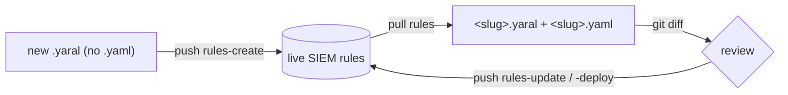

# Detection rules

YARA-L detection rules as code: `pull` live rules to files, edit the `.yaral`
text in git, `push` the change back. Inspect detections, errors, alerts, and
retrohunts read-only. Toggle Google-managed curated rule sets without owning
their content.

For the shared pull → diff → push mechanics see [the-loop.md](the-loop.md).
For YARA-L authoring craft see [../tips/03-yara-l-rules.md](../tips/03-yara-l-rules.md).
For surface status see [../design/catalog.md](../design/catalog.md).

## 📁 What lands on disk

Each rule pulls to a pair of files under `<dataRoot>/rules/`. `<dataRoot>` is the
current working directory by default: `pull rules` writes `./rules/` there (override
with `--out`) and `push rules-*` reads `./rules/` from there (override with
`--rules-dir`).

| File | Holds | Edit it? |
|---|---|---|
| `<slug>.yaral` | the YARA-L source text | yes — this is what you author |
| `<slug>.yaml` | authoritative `rule_id`, `etag`, and `deployment` (enabled / alerting / runFrequency) | rarely by hand — `pull` rewrites it |

The filename `<slug>` is the slugified `displayName`. The server id lives in the
companion `.yaml`, never in the filename.



> ⚠️ Don't rename a slug file casually. The filename is the slugified
> `displayName`; the authoritative id is in the companion `.yaml`. A rename on
> `push` can read as delete-then-recreate of the live rule. Rename in the SIEM,
> then `pull`.

## 🔒 Pull

```bash
secopsctl pull rules
secopsctl pull rules --out ./snapshot
```

Read-only. Mirrors every live rule to `<slug>.yaral` + `<slug>.yaml`. `--out`
sets the output root (default: cwd). Commit the result; the git history is the
review surface.

## 🚀 The four push paths

`push` is a live deploy and defaults to a dry run. Always preview with
`--dry-run`, review the plan, then re-run with `--yes`.

| Target | Does | Guard |
|---|---|---|
| `rules-create` | create live rules from `*.yaral` that have **no** companion `*.yaml` | — |
| `rules-update` | update live YARA-L text where a tracked `*.yaral` changed | etag |
| `rules-deploy` | reconcile each tracked rule's deployment (enabled / alerting / frequency) from its `*.yaml` | — |
| `rules-disable` | disable locally-tracked rules whose `deployment.enabled=true` | — |

`rules-deploy` reads `deployment.runFrequency` from each rule's companion `.yaml`.
The valid values are `LIVE`, `HOURLY`, and `DAILY`; the companion's
`allowed_run_frequencies` list shows which of these the rule permits.

```bash
secopsctl push rules-create --dry-run
secopsctl push rules-create --yes

secopsctl push rules-update --dry-run
secopsctl push rules-update --yes

secopsctl push rules-deploy --dry-run
secopsctl push rules-deploy --yes

secopsctl push rules-disable --dry-run
secopsctl push rules-disable --yes
```

`--rules-dir` overrides where the local rule files are read from (default:
`<dataRoot>/rules`):

```bash
secopsctl push rules-update --rules-dir ./snapshot/rules --dry-run
```

> ✅ After any live push, re-`pull rules` so the companion `.yaml` (new
> `rule_id`, fresh `etag`, current deployment) matches the instance.

## 🔁 etag concurrency

`rules-update` round-trips the stored `etag` for optimistic concurrency on the
YARA-L text update. If the live rule changed since your last `pull`, the `etag`
no longer matches and the push fails with a clean error — never a silent
overwrite of someone's out-of-band edit. Recover by `pull rules` to refresh,
re-applying your change, then pushing again.

`rules-deploy` and `rules-disable` patch the deployment subresource (enabled /
alerting / runFrequency) and carry **no** concurrency token, so they are not
etag-guarded.

## 🔎 Inspect a rule

Operational reads over an already-deployed rule. All take a `<rule-id>` (from
the companion `.yaml`'s `rule_id`).

| Command | Reads |
|---|---|
| `secopsctl rules detections <rule-id>` | detections the rule produced |
| `secopsctl rules errors <rule-id>` | execution errors the rule produced |
| `secopsctl rules alerts <rule-id>` | alerts the rule generated (raw shape) |
| `secopsctl rules retrohunt list <rule-id>` | the rule's retrohunts |

```bash
secopsctl rules detections <rule-id> --hours 24 --limit 100 --state ALERTING
secopsctl rules errors <rule-id> --hours 24
secopsctl rules alerts <rule-id> --hours 24
```

`detections` filters by alert `--state` (e.g. `ALERTING`) and pages with
`--limit`; both `detections` and `errors` take a `--hours` look-back window
(default 24). Add `--json` for raw output.

### Retrohunts

Run a rule over historical data, then read its status.

```bash
secopsctl rules retrohunt create <rule-id> --hours 168 --dry-run
secopsctl rules retrohunt create <rule-id> --hours 168 --yes
secopsctl rules retrohunt list <rule-id>
secopsctl rules retrohunt get <rule-id> <retrohunt-id>
```

`create` is guarded (dry-run by default, `--yes` to start); `--hours` sets the
look-back (default 168 = 7d). `list` and `get` are read-only.

## 🛡️ Curated (Google-managed) rule sets

Curated content is authored by Google. You cannot create, edit, or delete it —
only `pull` it for visibility and toggle each deployment's `enabled` /
`alerting` per precision (`precise` | `broad`).

```bash
secopsctl pull curated          # rule-set deployments + their state
secopsctl pull curated_rules    # the individual curated rules (--filter EXPR)

secopsctl curated list          # deployments with enable/alerting state (--filter)
secopsctl curated rules         # the individual Google-managed rules
```

Toggle a deployment (guarded — dry-run by default):

```bash
secopsctl curated set --category <category-id> --ruleset <ruleset-id> \
  --precision precise --enabled --alerting --dry-run

secopsctl curated set --category <category-id> --ruleset <ruleset-id> \
  --precision precise --enabled --alerting --yes
```

`--category`, `--ruleset`, and `--precision` are required. `--enabled` /
`--alerting` apply only when present, so you can flip one without disturbing the
other. Get the ids from `curated list --json`.

## See also

- [the-loop.md](the-loop.md) — the pull → diff → push core loop
- [query.md](query.md) — UDM search to develop and validate rule logic
- [../tips/03-yara-l-rules.md](../tips/03-yara-l-rules.md) — YARA-L authoring craft
- [../design/catalog.md](../design/catalog.md) — surface status (source of truth)
- [../design/siem.md](../design/siem.md) — SIEM plane design
