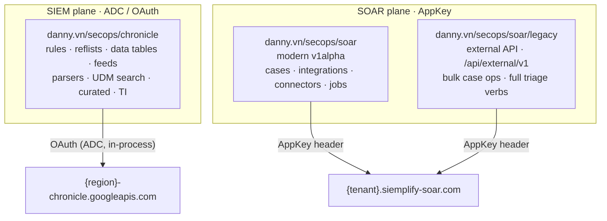

# Go SDK

`secopsctl` is also an importable Go SDK (module `danny.vn/secops`). There are
**three clients**, split by surface and credential. Each is a standalone package,
and constructing one never touches the network — auth resolves lazily on the first
call.



| Package | Surface | Host | Auth |
|---|---|---|---|
| `danny.vn/secops/chronicle` | Chronicle **SIEM** modern REST (rules, reference lists, data tables, feeds, parsers, UDM search, …); serves v1 / v1beta / v1alpha, pinned per surface (prefer v1 > v1beta > v1alpha) | `https://<region>-chronicle.googleapis.com` | OAuth / ADC (`auth.OAuth`) |
| `danny.vn/secops/soar` | Modern **SOAR** REST (integrations, connectors, jobs, alert grouping, module settings, cases); **v1alpha only** (v1/v1beta 404) | your tenant SOAR host (`<tenant>.siemplify-soar.com`) | AppKey (`auth.SOARAppKey`) |
| `danny.vn/secops/soar/legacy` | Siemplify external API (`/api/external/v1`) — the broad, reliable AppKey path; bulk case ops + the full case-triage verbs | your tenant SOAR host (`<tenant>.siemplify-soar.com`) | AppKey (`auth.SOARAppKey`) |

Auth is deliberately split: the SIEM API needs a Google OAuth2 token (minted
in-process from ADC — nothing written to disk), while SOAR uses a long-lived
AppKey header and never touches ADC. See `danny.vn/secops/auth`.

> The `config` package can build the `Settings` for you from a resolved instance
> file (`config.Load(...).Settings()`), but the SDK has no dependency on it —
> populate `Settings` however you like.

## ⚙️ Settings & hosts

Get the hosts and project forms right or surfaces 404 / hit the wrong host.

- **`chronicle.Settings`** — `Region` and `CustomerID` are **required**. Populate
  **both** `ProjectID` and `ProjectNumber`: most endpoints use the string project
  ID, but curated rule-sets and parsers need the project **number**, so a client
  with only one set will 404 on those surfaces. `BaseURL` is optional and defaults
  to `https://<Region>-chronicle.googleapis.com/v1alpha`. Each surface family is
  pinned to the newest API version that answers it (v1 > v1beta > v1alpha); the SDK
  applies the pin internally. The pins are exported as `chronicle.APIVersions`
  (a `map[string]string` keyed by family) and `chronicle.APIVersionFor(family)` if
  you need them programmatically.
- **`soar.Settings`** — `BaseURL` is **required** and is your *tenant* SOAR host
  (e.g. `https://<tenant>.siemplify-soar.com`); there is no default. It also takes
  `ProjectNumber`, `Region`, and `CustomerID` for the v1alpha resource path.
  `soar.Settings` and `legacy.Settings` are the same type.

## 🔒 Chronicle (SIEM)

```go
package main

import (
	"context"
	"errors"
	"fmt"
	"log"
	"time"

	"danny.vn/secops/auth"
	"danny.vn/secops/chronicle"
)

func main() {
	ctx := context.Background()

	// Construction never hits the network — ADC is resolved on the first call.
	c, err := chronicle.NewClient(chronicle.Settings{
		ProjectID:     "your-project-id",
		ProjectNumber: "000000000000", // also set: curated rules & parsers need it
		Region:        "us",
		CustomerID:    "00000000-0000-0000-0000-000000000000",
	}, auth.OAuth()) // ADC; or auth.OAuth(auth.WithForceIPv4(true)) on a VPN
	if err != nil {
		log.Fatal(err)
	}

	// Reads return the FULLY-PAGINATED result — you don't manage page tokens.
	rules, err := c.ListRules(ctx)
	if err != nil {
		// Auth / connectivity / API errors all surface here, on the first call.
		var apiErr *chronicle.APIError
		if errors.As(err, &apiErr) {
			log.Fatalf("Chronicle HTTP %d: %s", apiErr.Status, apiErr.Body)
		}
		log.Fatal(err)
	}
	fmt.Printf("%d rules\n", len(rules))

	// A UDM event search over a time window.
	end := time.Now()
	start := end.Add(-24 * time.Hour)
	events, err := c.SearchUDM(ctx,
		`metadata.event_type = "USER_LOGIN"`, start, end, 100)
	if err != nil {
		log.Fatal(err)
	}
	fmt.Printf("%d events\n", len(events)) // []json.RawMessage
}
```

**Errors & not-found.** Every non-2xx becomes a `*chronicle.APIError` (`Method`,
`URL`, `Status`, `Body`). The typed value retains `URL` for diagnostics, but the
rendered error string redacts raw request URLs; do not log `URL` in shared output.
For genuine missing-resource fallbacks use the helper:

```go
r, err := c.GetRule(ctx, "ru_00000000-0000-0000-0000-000000000000")
if chronicle.IsNotFound(err) {
	// create it, or skip
}
```

**Writes round-trip the etag** (optimistic concurrency) — read first, then pass the
etag back; a stale etag is rejected rather than silently overwriting a concurrent
edit:

```go
r, err := c.GetRule(ctx, ruleID)
if err != nil {
	log.Fatal(err)
}
updated, err := c.UpdateRule(ctx, r.RuleID(), newYaralText, r.Etag)
```

> The retrying HTTP transport is built in, with capped exponential backoff. Both
> the Chronicle and SOAR transports are **method-aware** and behave identically:
> they retry 429 for any method but a 5xx (500/502/503/504) **only** for idempotent
> verbs (GET/HEAD/PUT/DELETE), never for a mutating POST/PATCH (a write that 500s may
> already have applied server-side; see the SOAR sections below).

## 🔒 SOAR (modern v1alpha)

```go
package main

import (
	"context"
	"fmt"
	"log"

	"danny.vn/secops/auth"
	"danny.vn/secops/soar"
)

func main() {
	ctx := context.Background()

	c, err := soar.NewClient(soar.Settings{
		BaseURL:       "https://your-tenant.siemplify-soar.com", // required
		ProjectNumber: "000000000000",
		Region:        "us",
		CustomerID:    "00000000-0000-0000-0000-000000000000",
	}, auth.SOARAppKey("YOUR_APP_KEY")) // never ADC
	if err != nil {
		log.Fatal(err)
	}

	cases, err := c.ListCases(ctx, 50) // returns []json.RawMessage
	if err != nil {
		log.Fatal(err) // see the error note below
	}
	fmt.Printf("%d cases\n", len(cases))

	// ListCasesOpts is the richer entry point: server-side filter/orderBy,
	// field expansion, and a cap on total records. ListCases wraps it.
	open, err := c.ListCasesOpts(ctx, soar.CaseListOptions{
		PageSize: 50,
		Filter:   "status = 'OPENED'",
		OrderBy:  "updateTime desc",
		Expand:   "products,tags,sla",
		MaxItems: 200,
	})
	if err != nil {
		log.Fatal(err)
	}
	fmt.Printf("%d open cases\n", len(open))
}
```

> **Cases work on this path.** `soar.ListCases` reads the case queue on the
> siemplify host (v1alpha). A separate chronicle-host cases path exists but is
> unused (it 500s at every version — see [`catalog.md`](../design/catalog.md)).
> For full case details and the triage verbs, use the `soar/legacy` client below.

## 🔒 SOAR (legacy external API)

The `soar/legacy` package speaks the Siemplify external API (`/api/external/v1`),
the broad and reliable AppKey path for SOAR. It is a permanent part of the design —
the reconcile engine and the case-triage verbs run on it, and it is the fallback
when a modern v1alpha surface returns a 500. Its methods take a free-form request
body (`any`) and return raw JSON; the request shapes come from the Siemplify
external API (`third_party/siemplify-swagger.json`). Prefer the typed `soar`
(v1alpha) client where an equivalent method exists and is validated; reach for
`legacy` for bulk case ops and the full triage verbs.

```go
import (
	"context"

	"danny.vn/secops/auth"
	"danny.vn/secops/soar/legacy"
)

// legacy.Settings is the same type as soar.Settings (the tenant SOAR host + path).
c := legacy.NewClient(legacy.Settings{
	BaseURL:       "https://your-tenant.siemplify-soar.com", // required
	ProjectNumber: "000000000000",
	Region:        "us",
	CustomerID:    "00000000-0000-0000-0000-000000000000",
}, auth.SOARAppKey("YOUR_APP_KEY"), nil) // nil = default *http.Client

raw, err := c.CloseCase(ctx, map[string]any{
	"caseId":    12345,
	"rootCause": "Maintenance",
	// CloseReason is an integer enum (the server's coding, not alphabetical);
	// use the named constants from soar/legacy, e.g. legacy.CloseMaintenance.
	"reason":  int(legacy.CloseMaintenance),
	"comment": "handled out of band",
})
```

> **SOAR error handling.** A SOAR call returns a typed `soar.Error` (and
> `legacy.Error`) carrying the HTTP method/URL/status/body/request-id. The typed
> value keeps `URL` for diagnostics, but rendered errors redact raw request URLs.
> `errors.As` it, or use the `soar.IsNotFound` / `legacy.IsNotFound` helpers,
> exactly as you would with `chronicle.APIError` / `chronicle.IsNotFound`:

```go
// soar.IsNotFound / soar.Error work on the modern soar.Client. Build one the
// same way as the legacy client above (soar.Settings == legacy.Settings):
sc, err := soar.NewClient(soar.Settings{
	BaseURL:       "https://your-tenant.siemplify-soar.com",
	ProjectNumber: "000000000000",
	Region:        "us",
	CustomerID:    "00000000-0000-0000-0000-000000000000",
}, auth.SOARAppKey("YOUR_APP_KEY"))
if err != nil {
	log.Fatal(err)
}

_, err = sc.GetCustomField(ctx, "does-not-exist")
if soar.IsNotFound(err) {
	// not found — create it, or skip
}
var apiErr *soar.Error
if errors.As(err, &apiErr) {
	log.Printf("SOAR %d: %s", apiErr.Status, apiErr.Body)
}
```

## 📌 Notes

- **Construction is offline.** `NewClient` never calls the network, gcloud, or the
  AppKey — credentials and connectivity errors surface on the **first** API call,
  so handle errors there.
- **Pagination is automatic.** `List*` methods return the complete slice across all
  pages; there is no page token to thread.
- **IPv4 pinning** (broken IPv6 on some corporate VPNs) is opt-in via
  `Settings.ForceIPv4` / `auth.WithForceIPv4(true)` / the `SECOPS_FORCE_IPV4` env
  var.
- Per-surface method coverage and maturity is in
  [`catalog.md`](../design/catalog.md); the host/auth/version map is in
  [`surfaces.md`](../design/surfaces.md); the design rationale is in
  [`architecture.md`](../design/architecture.md).
