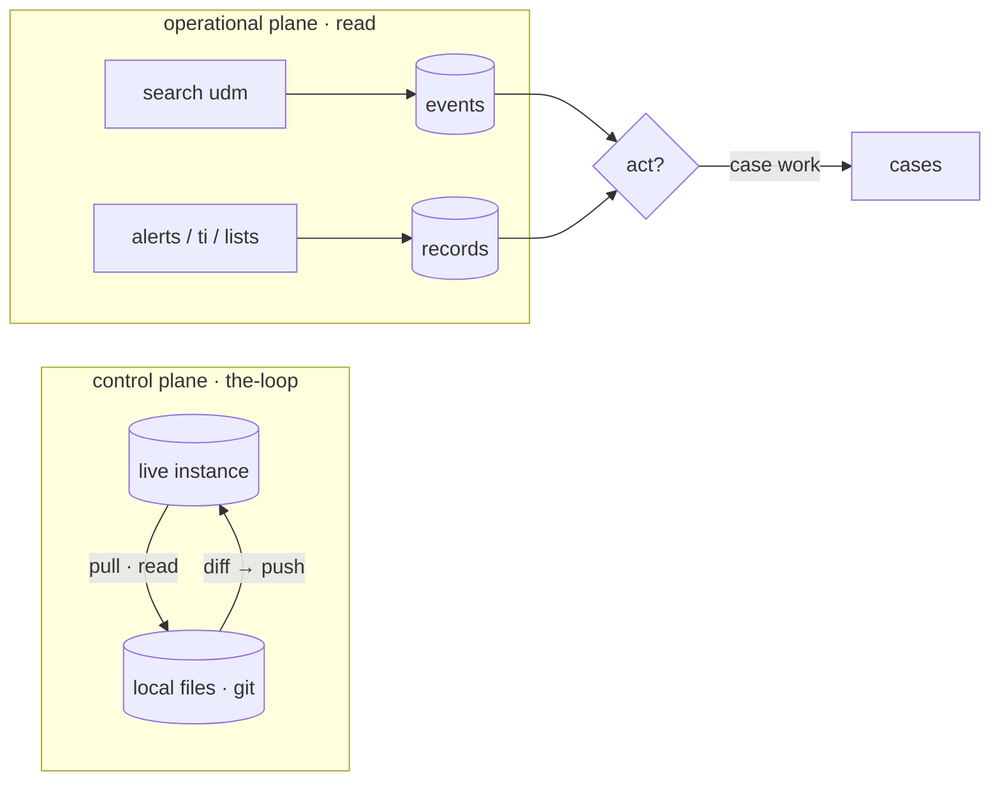

# Search

The operational read plane: **search live events** with no deploy attached.
Reads are free — nothing on this page mutates the tenant (the one exception, the
guarded `search saved` writes, is called out where it appears). Use search to
pull a window of live state, then decide whether to act on it through the
[control-plane loop](the-loop.md) or [case triage](triage.md).

> 🔒 The query verbs are **read-only**. No `--dry-run`, no `--yes`, no
> `LIVE DEPLOY` banner — those belong to `push`. Only the saved-search write
> verbs (`save` / `share` / `unshare` / `delete`) are guarded mutations.

Natural-language ("ask it in English") search lives under a separate group,
[`gemini`](gemini.md) — it turns a sentence into a UDM query and (optionally)
runs it through the same engine documented here.

## Two planes

The control plane manages **detection-as-code** (rules, lists, configs) via
pull → diff → push. The operational plane is the day job: **query a window of
data, resolve an indicator, read an alert** — then act.



## Subcommands

Every verb is `secopsctl search <verb>`. All are read-only except the guarded
`saved` write verbs.

| Command | Does |
|---|---|
| `search udm <filter>` | point-in-time UDM event search over a time window |
| `search raw <pattern>` | content-based raw-log search (regex over the raw bytes) |
| `search stats <query>` | aggregation query (`match:` / `outcome:` / `order:`) |
| `search event <id>` | drill into one event: enriched UDM (default), `--udm`, or `--raw` log |
| `search export <filter>` | export **all** matching events to CSV (server-side; not capped) |
| `search validate <query>` | check a query's syntax without running it |
| `search run --file <path>` | run a UDM query loaded from a file or stdin |
| `search saved …` | server-side saved & shared searches (Search Manager) |

## UDM event search

```bash
secopsctl search udm '<filter>'
```

A point-in-time UDM event search over `[start, end]`. The window defaults to the
last `--hours`; `--from` / `--to` override it.

| Flag | Default | Purpose |
|---|---|---|
| `--hours int` | `24` | look-back window in hours (when `--from` is not given) |
| `--from string` | — | explicit start (RFC3339 / ISO-8601); overrides `--hours` |
| `--to string` | now | explicit end (RFC3339 / ISO-8601) |
| `--limit int` | `10000` | maximum events to return |
| `--all` | off | fetch the **complete** result set and report the total match count |
| `--raw` | off | print each matched event's full raw log line instead of the summary |
| `--format string` | auto | output format — see [output contract](#output-shape-the-result) |
| `--fields string` | — | comma-separated dotted UDM paths to project |
| `--out string` | stdout | write results to a file instead of stdout |

Examples (tenant-neutral filters — substitute your own fields and values):

```bash
# Process launches in the last 24h (default window).
secopsctl search udm 'metadata.event_type = "PROCESS_LAUNCH"'

# Network connections to one host over an explicit window, capped, as JSON.
secopsctl search udm 'metadata.event_type = "NETWORK_CONNECTION" AND target.hostname = "host.example.com"' \
  --from 2026-01-01T00:00:00Z --to 2026-01-02T00:00:00Z --limit 500 --format json
```

The default table output is a **one-line-per-event summary** — index, event
timestamp, and event type. The output flags below turn it into machine-readable
records and let you project just the fields you want.

For filter syntax, fields, and query craft see the
[Search & UDM queries tip](../tips/07-udm-queries.md).

## Output: shape the result

`search udm`, `search run`, `search saved run`, and `gemini search` share one
**agent-first output contract**: pick a format, project the fields you want,
stream to a file, and pull the complete set when a sample is not enough.

| Flag | Effect |
|---|---|
| `--format table` | aligned columns — the default on a terminal |
| `--format jsonl` | one JSON event per line — the default when output is piped |
| `--format json` | a single JSON array of events |
| `--format csv` | CSV with a header row |
| `--fields a.b,c.d` | project only these **dotted UDM paths** as the columns / keys |
| `--out FILE` | write results to `FILE` instead of stdout |
| `--all` | fetch the **complete** result set via the search-view engine and report the total match count (overrides `--limit`) |

`--format jsonl` is the stream-friendly default under a pipe, so a piped command
emits one event per line without extra flags. The global `--json` flag is
equivalent to `--format json` on these commands; prefer `--format` for search so
you can pick `jsonl` / `csv` too.

```bash
# Project three fields as JSONL, one event per line — ideal for a pipe.
secopsctl search udm 'metadata.event_type = "NETWORK_DNS"' \
  --fields metadata.event_type,principal.hostname,network.dns.questions.name --format jsonl

# Complete result set (not capped at --limit) written to a CSV file.
secopsctl search udm 'metadata.event_type = "USER_LOGIN" AND security_result.action = "BLOCK"' \
  --all --format csv --out blocked-logins.csv
```

`--all` reports the **total match count** so you know whether a capped run
truncated. Without it, a run returns at most `--limit` events (default `10000`).

## Raw-log search

```bash
secopsctl search raw '<regex>'
```

A content-based search that prints the **full raw log lines** matching a regex
over the raw bytes — for logs that did not parse, or to read the original text
behind a UDM event.

| Flag | Default | Purpose |
|---|---|---|
| `--hours int` | `24` | look-back window in hours (when `--from` is not given) |
| `--from` / `--to` | — / now | explicit window (RFC3339 / ISO-8601) |
| `--limit int` | `100` | max raw lines to fetch |
| `--unparsed` | off | restrict to truly-unparsed logs (`parsed = false`) |

```bash
# Raw lines mentioning a value in the last 6h.
secopsctl search raw 'admin@example.com' --hours 6

# Only the logs that failed to parse — a parser-coverage check.
secopsctl search raw 'login' --unparsed --limit 50
```

## Stats and aggregations

```bash
secopsctl search stats '<aggregation-query>'
```

Runs a stats (aggregation) UDM query — `match:` group keys, `outcome:`
aggregates, `order:` sort — and prints the result table.

| Flag | Default | Purpose |
|---|---|---|
| `--hours int` | `24` | look-back window in hours (when `--from` is not given) |
| `--from` / `--to` | — / now | explicit window (RFC3339 / ISO-8601) |
| `--limit int` | `0` | max rows to print (`0` = all) |
| `--clear-cache` | off | bypass the query cache (read from the database) |

```bash
secopsctl search stats --hours 24 'metadata.log_type != ""
  match: metadata.log_type
  outcome: $c = count(metadata.id)
  order: $c desc'
```

Validate a chart's aggregation here before wiring it into a dashboard — see the
[dashboards tip](../tips/06-dashboards.md).

## Inspect one event

```bash
secopsctl search event '<id>'
```

Drill into a single event by id. By default it prints the **enriched** UDM event.

| Flag | Effect |
|---|---|
| `--udm` | print the **unenriched** UDM event(s) |
| `--raw` | print the original raw log line(s) for the event |
| `--token` | treat the argument as a search token instead of an event id (with `--udm`) |

```bash
secopsctl search event 'AAAA…=' --json   # enriched UDM
secopsctl search event 'AAAA…=' --raw     # the original raw log
```

## Export all events

```bash
secopsctl search export '<filter>' --out events.csv
```

Server-side CSV export of **all** matching events — not capped at `--limit`,
unlike `search udm`. Use it to pull a full window for offline analysis.

| Flag | Default | Purpose |
|---|---|---|
| `--hours int` | `24` | look-back window in hours (when `--from` is not given) |
| `--from` / `--to` | — / now | explicit window (RFC3339 / ISO-8601) |
| `--fields string` | `timestamp,user,hostname,"process name"` | comma-separated column labels |
| `--case-sensitive` | off | case-sensitive matching (default matches the console: case-insensitive) |
| `--out string` | stdout | write the CSV to a file instead of stdout |

```bash
secopsctl search export 'metadata.event_type = "NETWORK_DNS"' --hours 24 --out dns.csv
secopsctl search export 'principal.hostname = "host-01"' --fields timestamp,user,hostname
```

## Validate

```bash
secopsctl search validate 'metadata.event_type = "NETWORK_DNS"'
```

Checks a UDM query's syntax **without running it** — no window, no events, no
quota spent. Use it in a pre-commit / CI step over your saved `*.udm` files.

## Run a query from a file

```bash
secopsctl search run --file detections/failed-logins.udm --hours 24
echo 'metadata.event_type = "NETWORK_CONNECTION"' | secopsctl search run --file -
```

Loads the UDM query from a file (or `-` for stdin) and runs it over a window.
It honors the full [output contract](#output-shape-the-result)
(`--format` / `--fields` / `--out` / `--all`) plus the window flags
(`--hours` / `--from` / `--to` / `--limit`). Keep hunting queries as files in
git and replay them with `search run` so the query text is reviewable.

## Saved and shared searches

The Search Manager stores named searches server-side. They are **private** by
default and can be **shared** org-wide. List and run verbs are read-only; the
write verbs (`save` / `share` / `unshare` / `delete`) are **guarded mutations**
— dry-run by default, `--yes` to apply.

| Verb | Kind | Does |
|---|---|---|
| `search saved list` | read | list saved & shared searches |
| `search saved get <id>` | read | show one saved search (query, type, sharing) |
| `search saved run <id>` | read | run a saved search by id (honors the output contract) |
| `search saved save` | guarded | create a saved search |
| `search saved share <id>` | guarded | share a saved search org-wide |
| `search saved unshare <id>` | guarded | make a shared saved search private |
| `search saved delete <id>` | guarded | delete a saved search |

```bash
secopsctl search saved list
secopsctl search saved run <id> --format jsonl

# Create one (dry-run preview first, then apply). --share publishes it org-wide.
secopsctl search saved save --name "Blocked logins" \
  --query 'metadata.event_type = "USER_LOGIN" AND security_result.action = "BLOCK"' --dry-run
secopsctl search saved save --name "Blocked logins" --file detections/blocked-logins.udm --share --yes

secopsctl search saved share <id> --yes      # publish an existing private search
secopsctl search saved unshare <id> --yes    # make it private again
secopsctl search saved delete <id> --yes     # remove it
```

`save` takes `--query <udm>` **or** `--file <path>` (`-` for stdin), an optional
`--description`, and `--share` to publish org-wide at creation. Run any guarded
verb without `--yes` first, read the preview, then re-run with `--yes`.

## Hunt walkthrough

A read-only chain across surfaces: search a window, pull an indicator out of an
event, resolve it to threat intel, then read the collection behind it. Nothing
here mutates the tenant.

```bash
# 1. Search a window and emit full events, so the indicator fields are present.
secopsctl search udm '<filter>' --hours 48 --format json

# 2. From an event, take a file hash or domain of interest, e.g.
#    principal.process.file.sha256 or network.dns.questions.name.

# 3. Resolve that value to its IOC record; --json carries the resource id.
secopsctl ti find <value> --json

# 4. Pivot from the IOC resource id to related campaigns/reports.
secopsctl ti related <ioc-id> --collection-type all --json

# 5. Show tenant match counts for a related collection alt name.
secopsctl ti related CAMP.00.001
```

Each step is independent — run any one on its own, or chain them to go from a
raw event to the threat intelligence behind an indicator. Threat-intel verbs
live under [`ti`](../commands/ti.md) (`ti find` / `ti get` / `ti related`
/ `ti collections` / `ti collection`).

## See also

- [Gemini](gemini.md) — natural-language → UDM, run it, ask the assistant.
- [The loop](the-loop.md) — the control plane: pull → diff → push.
- [Triage](triage.md) — read and act on alerts and SOAR cases.
- [Search & UDM queries](../tips/07-udm-queries.md) — filter syntax and patterns.
- [Catalog](../design/catalog.md) — per-surface status (designed / built / verified).
- [Surfaces](../design/surfaces.md) — the full API surface map by plane.
