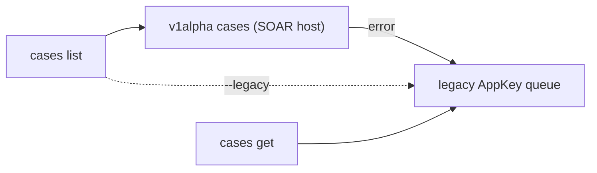

# SOAR cases

Per-case SOAR triage from the CLI: read a case and its alerts, then run guarded
mutations (assign, tag, close, merge, …). Every mutating verb is **dry-run by
default** — pass `--yes` to apply. This page is the per-verb reference; the
end-to-end alert → case → rule walkthrough is [Triage](triage.md).

`caseId` is the **SOAR integer id**, not the SIEM UUID. Get it from `cases list`.
A SIEM case UUID resolves to its SOAR id via `cases soar-id <uuid>` — see
[the loop](the-loop.md).

SOAR auth is the **AppKey** (no ADC) and needs `soar_url` set. See
[configure](configure.md).

## Read

```bash
secopsctl cases list                       # default: open cases
secopsctl cases list --status all --limit 50
secopsctl cases list --priority high --assignee tier1 --since 24h   # triage filters
secopsctl cases get 12345                   # case header + its alerts
secopsctl cases get 12345 --json            # raw GetCaseFullDetails
secopsctl cases comment list --id 12345     # the case-wall comments
```

- `list` shows a compact table (or `--json` for the raw queue); `--status` is
  `open|closed|all`, `--limit` caps the first page (0 = up to 100).
- Triage filters narrow the fetched page: `--assignee` (substring,
  case-insensitive), `--priority informative|low|medium|high|critical`,
  `--tag` (modern lane only), `--since` (a duration like `24h`, RFC3339, or
  `YYYY-MM-DD`). `--filter` passes a verbatim server-side expression to the
  modern cases API (e.g. `"priority = 'PRIORITY_HIGH'"`).
- `get <case-id>` takes the integer id from `list` and prints the case plus its
  alerts — each with its `--alert` identifier (for the per-alert verbs) and its
  **firing rule** (name + `ru_` id), ready to paste into `rules detections`.
- Coming from the SIEM side? `alerts get <alert-id>` prints the alert's SOAR
  case id, and `cases soar-id <uuid>` bulk-resolves SIEM case uuids to SOAR ids.
- Reads only — no `LIVE DEPLOY` banner.

## Mutating verbs

Each verb is `secopsctl cases <verb> --id N <verb-flags>`. Most verbs share
`--id` (required) and the `--dry-run` (default) / `--yes` apply gate; many also
take an optional `--alert` (scope the action to one alert) — see the table's
`--alert` column. The exception is `merge`, which takes
`--ids` + `--into` instead of `--id`.

| Verb | Required flag(s) | `--alert` scope | Does |
|---|---|---|---|
| `assign` | `--user <id>` | ✓ | Assign the case to a user |
| `tag` | `--tag <s>` | ✓ | Add a tag |
| `untag` | `--tag <s>` | ✓ | Remove a tag |
| `rename` | `--title <s>` | — | Rename the case |
| `describe` | `--description <s>` | — | Set the description |
| `stage` | `--stage <s>` | ✓ | Move the case to a stage |
| `importance` | `--important[=false]` | ✓ | Mark important (default true; `=false` clears) |
| `priority` | `--priority <level>` | ✓ | Change the case priority (`informative\|low\|medium\|high\|critical`) |
| `merge` | `--ids 1,2,3 --into N` | — | Merge source cases into a target (takes `--ids`/`--into`, not `--id`) |
| `close` | `--reason <enum>` | ✓ | Close one case (also `--comment`, `--root-cause`) |
| `reopen` | `--id N` or `--ids 1,2,3` | — | Reopen closed case(s) — the inverse of close (`--comment` optional) |
| `comment add` | `--text <s>` | — | Add a case comment (the case-wall triage-rationale record) |

### Per-alert verbs

A case groups several alerts; `cases alert <verb>` acts on **one alert**
inside it. Every verb takes `--id N` (the case) plus `--alert <identifier>`
(printed per alert by `cases get`):

| Verb | Extra flag(s) | Does |
|---|---|---|
| `alert close` | `--reason <enum>` | Close one alert — the case stays open (`malicious\|not-malicious\|maintenance\|inconclusive`; optional `--root-cause`, `--comment`, `--usefulness`) |
| `alert priority` | `--priority <level>` | Re-prioritize one alert (its name and current priority are resolved from the case at apply time) |
| `alert move` | `[--to M]` | Move the alert to case M, or to a **new** case when `--to` is omitted — the inverse of `merge` |
| `alert reopen` | — | Reopen one closed alert |

```bash
secopsctl cases tag --id 12345 --tag triaged          # dry run (preview)
secopsctl cases tag --id 12345 --tag triaged --yes    # apply

secopsctl cases close --id 12345 --reason not-malicious \
  --root-cause "Normal behavior" --comment "verified benign" --yes

secopsctl cases alert close --id 12345 --reason not-malicious \
  --alert "SUSPICIOUS LOGIN_00000000-0000-0000-0000-000000000000__RULE_DETECTION" --yes

secopsctl cases merge --ids 12346,12347 --into 12345 --yes
```

Run any verb without `--yes` first, read the preview, then re-run with `--yes`.

### Discovering valid values

`--tag`, `--stage`, and `--root-cause` expect values the tenant already defines.
List them first so you pass an existing one:

```bash
secopsctl cases values tags         # valid --tag values
secopsctl cases values stages       # valid --stage values
secopsctl cases values root-causes  # valid --root-cause values
```

(The same values are also mirrored to files by `soar pull case-tags` /
`case-stages` / `close-root-causes`.)

`--user` on `assign` is a SOAR **user id**, not a name. List the user directory
with `soar users list` to find the id (a role is passed as `@RoleName`).

### Other case verbs

| Verb | Does |
|---|---|
| `incident --id N` | Mark (or `--unset`) a case as an incident |
| `report --id N` | Generate + download a case report (`--format pdf\|doc\|xlsx\|csv`, `--out`) |
| `run-action --id N --action <name> --instance <uuid>` | Execute a manual integration action on a case |
| `chat list --id N` | List case chat messages |
| `chat send --id N --text <s>` | Send a chat message |
| `custom-fields --case-id N` | List custom field values |
| `wall --case-id N` | List case wall timeline records |
| `context list --id N` | List context properties |
| `context set --id N --key <k> --value <v>` | Set a context property |
| `task list --id N` | List case checklist tasks |
| `task add --id N --title <s>` | Add a task |
| `evidence add --id N --file <path>` | Attach evidence |
| `overview --id N` | Case overview (entities, widgets) |
| `counts` | Case counts by priority (queue-level) |
| `workload` | Open-case load per analyst |
| `aging` | Open cases by age with SLA status |
| `stats` | Queue statistics (open/closed, percentiles) |

## Bulk-close a queue

`cases close` closes one case. To close **many** cases at once, use the
queue verb:

```bash
secopsctl soar push bulk-close --ids 12345,12346 --reason maintenance --dry-run   # preview
secopsctl soar push bulk-close --ids 12345,12346 --reason maintenance --yes       # apply
```

The reason is one of `malicious | not-malicious | maintenance | inconclusive |
unknown` (typed enum, not free text). This is a guarded `soar push` surface — see
[reconcile](reconcile.md) for the dry-run → review → `--yes` model.

Both verbs take the **same fixed enum**: single-case `cases close --reason`
and `soar push bulk-close --reason` each accept `malicious | not-malicious |
maintenance | inconclusive | unknown`, so single and bulk closes aggregate
consistently in metrics. Put a custom root-cause in `--root-cause` and a free-text
note in `--comment`. (List your tags / stages / root-causes with `soar pull
case-tags` / `case-stages` / `close-root-causes`; find an assignee id for
`assign --user` with `soar users list`.)

## One case, two APIs

`list` defaults to the modern **v1alpha cases API** on the SOAR host and
**auto-falls back** to the reliable **legacy AppKey queue** on error; force the
legacy lane with the global `--legacy` flag. `get` always uses the legacy AppKey
path (`GetCaseFullDetails`) — no modern call, no fallback, and `--legacy` is a
no-op for it.



Both lanes are the **SOAR host** (`<tenant>.siemplify-soar.com`, AppKey) — never
the Chronicle host. The two-host rule and per-surface preference are in the
[SOAR design](../design/soar.md).

## See also

- [Configure](configure.md) — set `soar_url` + the AppKey.
- [Reconcile](reconcile.md) — the guarded `soar pull`/`push` config loop.
- [SOAR operations](../tips/09-soar-operations.md) — the craft of SOAR triage.
- [Catalog](../design/catalog.md) — live per-surface status (source of truth).
