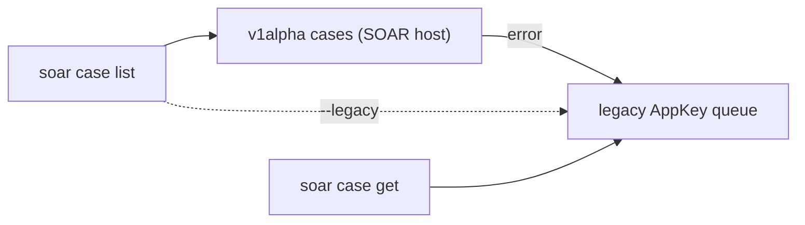

# 🧭 SOAR cases

Per-case SOAR triage from the CLI: read a case and its alerts, then run guarded
mutations (assign, tag, close, merge, …). Every mutating verb is **dry-run by
default** — pass `--yes` to apply.

`caseId` is the **SOAR integer id**, not the SIEM UUID. Get it from `soar case
list`; the Chronicle-host UUID path (`secopsctl cases`) is a separate, read-only
surface — see [the loop](the-loop.md).

SOAR auth is the **AppKey** (no ADC) and needs `soar_url` set. See
[configure](configure.md).

## 🔒 Read

```bash
secopsctl soar case list                       # default: open cases
secopsctl soar case list --status all --limit 50
secopsctl soar case get 12345                   # case header + its alerts
secopsctl soar case get 12345 --json            # raw GetCaseFullDetails
```

- `list` shows a compact table (or `--json` for the raw queue); `--status` is
  `open|closed|all`, `--limit` caps the first page (0 = up to 100).
- `get <case-id>` takes the integer id from `list` and prints the case plus its
  alerts.
- Reads only — no `LIVE DEPLOY` banner.

## 🧭 Mutating verbs

Each verb is `secopsctl soar case <verb> --id N <verb-flags>`. Most verbs share
`--id` (required) and the `--dry-run` (default) / `--yes` apply gate; many also
take an optional `--alert` (scope the action to one alert) — `assign`, `stage`,
`tag`, `untag`, `importance`, and `close`. The exception is `merge`, which takes
`--ids` + `--into` instead of `--id`.

| Verb | Required flag(s) | Does |
|---|---|---|
| `assign` | `--user <id>` | Assign the case to a user |
| `tag` | `--tag <s>` | Add a tag |
| `untag` | `--tag <s>` | Remove a tag |
| `rename` | `--title <s>` | Rename the case |
| `describe` | `--description <s>` | Set the description |
| `stage` | `--stage <s>` | Move the case to a stage |
| `importance` | `--important[=false]` | Mark important (default true; `=false` clears) |
| `merge` | `--ids 1,2,3 --into N` | Merge source cases into a target |
| `close` | `--reason <s>` | Close one case (also `--comment`, `--root-cause`) |

```bash
secopsctl soar case tag --id 12345 --tag triaged          # dry run (preview)
secopsctl soar case tag --id 12345 --tag triaged --yes    # apply

secopsctl soar case close --id 12345 --reason "false positive" \
  --root-cause "Normal behavior" --comment "verified benign" --yes

secopsctl soar case merge --ids 12346,12347 --into 12345 --yes
```

Run any verb without `--yes` first, read the preview, then re-run with `--yes`.

### Discovering valid values

`--tag`, `--stage`, and `--root-cause` expect values the tenant already defines.
List them first so you pass an existing one:

```bash
secopsctl soar pull case-tags           # valid --tag values
secopsctl soar pull case-stages         # valid --stage values
secopsctl soar pull close-root-causes   # valid --root-cause values
```

`--user` on `assign` is a SOAR **user id**, not a name. `soar case get` prints the
assignee's display name (not the id), and there is no in-CLI user directory — get
the id from the SOAR UI.

## 🧹 Bulk-close a queue

`soar case close` closes one case with a free-text reason. To close **many**
cases at once with a typed reason, use the queue verb:

```bash
secopsctl soar push bulk-close --ids 12345,12346 --reason maintenance --dry-run   # preview
secopsctl soar push bulk-close --ids 12345,12346 --reason maintenance --yes       # apply
```

The reason is one of `malicious | not-malicious | maintenance | inconclusive |
unknown` (typed enum, not free text). This is a guarded `soar push` surface — see
[reconcile](reconcile.md) for the dry-run → review → `--yes` model.

Note the close-reason difference between the two verbs: single-case `soar case
close --reason` is **free text**, while `soar push bulk-close --reason` is the
**fixed enum** above. For consistent reporting, prefer the enum vocabulary
(`malicious`, `not-malicious`, …) even in the free-text single-case reason.

## 🔀 One case, two APIs

`list` defaults to the modern **v1alpha cases API** on the SOAR host and
**auto-falls back** to the reliable **legacy AppKey queue** on error; force the
legacy lane with the global `--legacy` flag. `get` always uses the legacy AppKey
path (`GetCaseFullDetails`) — no modern call, no fallback, and `--legacy` is a
no-op for it.



Both lanes are the **SOAR host** (`<tenant>.siemplify-soar.com`, AppKey) — never
the Chronicle host. The two-host rule and per-surface preference are in the
[SOAR design](../design/soar.md).

## See also

- [Configure](configure.md) — set `soar_url` + the AppKey.
- [Reconcile](reconcile.md) — the guarded `soar pull`/`push` config loop.
- [SOAR operations](../tips/09-soar-operations.md) — the craft of SOAR triage.
- [Catalog](../design/catalog.md) — live per-surface status (source of truth).
