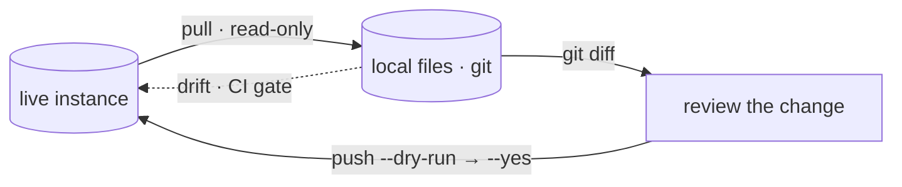
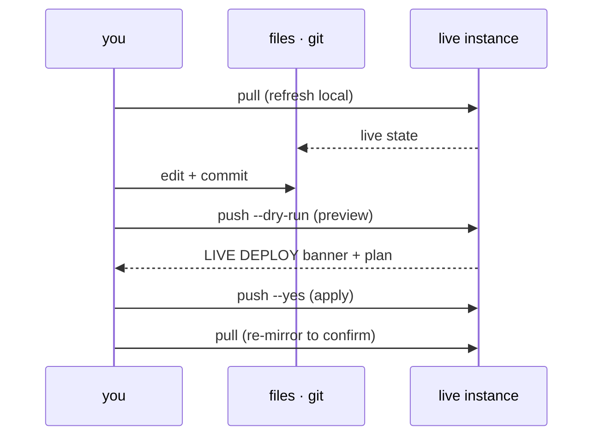

# The loop

Detection-as-code: live state is mirrored to files under git, reviewed in a diff,
and pushed back. The git history is the source of truth and the review surface.



Prerequisite: a resolved config and working auth — see [configure.md](configure.md),
then `secopsctl doctor`.

## 🔒 Pull (read-only)

Mirror live state into files. `pull` never mutates the instance.

```bash
secopsctl pull rules
secopsctl pull all
```

`all` snapshots every target in order. Headline SIEM targets:

| Target | What it mirrors |
|---|---|
| `rules` | YARA-L rules + deployment state |
| `reference_lists` | reference lists |
| `data_tables` | data tables |
| `feeds`, `parsers` | ingestion feeds, log parsers |
| `dashboards` | native dashboards |
| `curated` | Google-managed rule-set deployments |
| `curated_rules` | the individual Google-managed rules |

SOAR has its own mirror under `secopsctl soar pull <target>` (connectors, jobs,
playbooks, grouping, cases, and the engine surfaces). See
[reconcile.md](reconcile.md) for the full target set on both planes, and
[rules.md](rules.md) for rule-specific paths.

## ⚠️ Review, then push

Every `push` is a **production deploy to a live SIEM**. The dry run is the
default and prints a `LIVE DEPLOY` banner; `--yes` applies (or confirm
interactively).

```bash
git diff                                 # review what changed
secopsctl push reference_lists --dry-run # preview the deploy (default)
secopsctl push reference_lists --yes     # apply for real
```

Pull → `git diff` → push is the whole loop. Never skip the diff.

Headline push targets (full set in [reconcile.md](reconcile.md), rule paths in
[rules.md](rules.md)):

| Target | Effect |
|---|---|
| `rules-create` | create live rules from `*.yaral` with no companion YAML |
| `rules-update` | update YARA-L text where a tracked `*.yaral` changed (etag-guarded) |
| `rules-deploy` | reconcile each rule's deployment (enabled / alerting / frequency) |
| `rules-disable` | disable locally-tracked rules with `enabled=true` |
| `reference_lists`, `data_tables`, `parsers`, `feeds`, `dashboards`, … | reconcile local files to live |

## Reconcile is additive by default

The reconcile targets create new objects and update changed ones from local
files. They do **not** delete by default. Pass `--prune` to also delete live
objects that have no local file (guarded; gated on a complete pull).

```bash
secopsctl push data_tables --dry-run          # additive preview
secopsctl push data_tables --prune --dry-run  # also previews deletions
secopsctl push data_tables --prune --yes      # apply, including deletes
```

Full reconcile model and the per-surface target list: [reconcile.md](reconcile.md).

## ✅ Drift — the CI gate

`drift` is read-only. It compares committed local files to live state and exits
non-zero on any divergence (or when a surface cannot be verified) — run it after
`pull` in CI.

```bash
secopsctl pull all                # refresh local files
secopsctl drift                   # all engine surfaces; non-zero = drifted
secopsctl drift reference_lists data_tables
```

It reports local-only `+`, changed `~`, and live-only `-`, and never mutates.
With no target it checks every engine surface; otherwise the named ones.

### In CI

The realistic gate authenticates both planes, refreshes the mirror, commits, and
runs `drift` to fail the build on divergence.

```bash
# auth: SIEM via ADC, SOAR via AppKey (see configure.md)
secopsctl pull all                      # SIEM mirror
secopsctl soar pull all                 # SOAR mirror
git add -A && git commit -m "snapshot live state"

# fail the build on any non-zero exit
secopsctl drift reference_lists data_tables parsers feeds dashboards
```

Exit-code contract (git-style): `drift` exits **0** when local matches live,
**2** when drift is detected (the actionable signal — reconcile), and **1** on an
error or when a surface could not be verified (an incomplete live list — retry).
A CI gate fails the build on any non-zero; a smarter pipeline can branch on `2`
(act) vs `1` (fix/retry).

`forwarders` is a drift surface but has no `pull forwarders` target, so `pull all`
never writes local forwarder files — a bare `secopsctl drift` then flags
`forwarders` as live-only drift. Name the surfaces you mirror explicitly (as above)
to keep `forwarders` out of the drift set.

## Pull before edit

Live UI edits happen out-of-band. Stale local state silently clobbers them on
push. Always `pull` the surface before editing it (unless it was already pulled
this session), review the `git diff`, then push.



After any live mutation, re-`pull` the affected surface so the local mirror
matches the instance. A committed-but-undeployed change is not done.

## See also

- [configure.md](configure.md) — config + auth (do this first)
- [rules.md](rules.md) — rule pull/create/update/deploy/disable paths
- [reconcile.md](reconcile.md) — full reconcile model, every target, `--prune`
- [query.md](query.md) — ad-hoc UDM search (read-only)
- [../design/architecture.md](../design/architecture.md) — how the loop is built
- [../design/catalog.md](../design/catalog.md) — per-surface status (source of truth)
