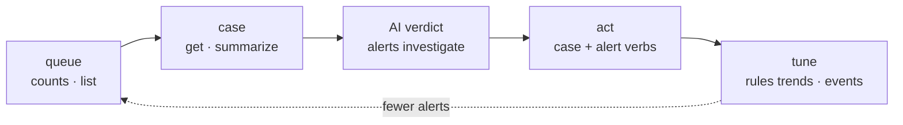

# Triage: from alert to verdict

The operational loop for a SOC analyst (or an LLM agent): see the queue, pick
up a case, let the AI read it first, act, and feed what you learned back into
the rules. Reads are free; every act is guarded (`--dry-run` default, `--yes`
to apply). This page is the end-to-end walkthrough — the per-verb reference is
[SOAR cases](soar-cases.md), and every flag lives in the
[command reference](reference-soar.md).



Prerequisite: a resolved config and working auth (`secopsctl doctor`). SIEM
verbs use ADC; `soar …` verbs use the AppKey — see [configure](configure.md).

## 1 · See the queue

```bash
secopsctl cases counts                                  # open cases by priority
secopsctl cases counts --filter "assignee = '@Tier1'"   # ...for one queue
secopsctl cases list --priority high --since 24h        # the work itself
```

`counts` is one cheap exact count per priority; `--filter` composes with the
per-priority term and takes the same server-side grammar as `cases list
--filter` (scalars, `any()` collections, epoch-ms time ranges — the grammar
table is in the [command reference](reference-soar.md#case---filter-grammar-modern-cases-list)).

## 2 · Pick up a case

```bash
secopsctl cases get 12345            # the case + its alerts
secopsctl cases summarize --id 12345 # the structured AI case summary
```

`get` prints each alert with its `--alert` identifier (for the per-alert
verbs) and its **firing rule** (name + `ru_` id) — the pivot into rule tuning.
`summarize` returns Gemini's pre-digest of the case: narrative, reasons, next
steps — far cheaper to read than the full case payload. The first request for
a case generates the summary (it polls to completion, like `investigate`
below); afterwards the cached digest returns instantly, and `--refresh`
regenerates it.

Coming from the SIEM side instead? `alerts list` / `alerts get <id>` show the
Chronicle alert snapshot, and `alerts get` prints the alert's **SOAR case id**
(`cases soar-id <uuid>` bulk-resolves them) — the bridge into every `cases` verb.

## 3 · Ask the AI for a verdict

```bash
secopsctl alerts investigate de_00000000-0000-0000-0000-000000000000 --latest
secopsctl alerts investigate de_00000000-0000-0000-0000-000000000000
```

The per-alert Gemini investigation: verdict (`FALSE_POSITIVE`, …), confidence,
a markdown summary, and suggested next steps (searchable ones carry real UDM
queries — `--json` includes them). `--latest` is **read-only** — it reports
the most recent investigation without starting one, the safe default for
automation. Without `--latest` a new investigation is generated (a minute or
two; refused in read-only mode).

The `de_…` id here is the **SIEM detection-alert id** from `alerts list` /
`alerts get` — a different identifier from the SOAR `--alert` string the
`cases` verbs use (step 2's `cases get` shows the SOAR form;
`alerts get` bridges between the two).

## 4 · Act

Case-level and alert-level verbs are all guarded — dry-run first, then `--yes`:

```bash
secopsctl cases assign --id 12345 --user '@Tier1' --yes
secopsctl cases priority --id 12345 --priority high --yes
secopsctl cases comment add --id 12345 --text "triage: benign automation" --yes
secopsctl cases alert close --id 12345 --alert <identifier> --reason not-malicious --yes
secopsctl cases close --id 12345 --reason not-malicious --root-cause "Normal behavior" --yes
```

The full verb table (stage, tag, merge, reopen, move, bulk-close, …) is in
[SOAR cases](soar-cases.md). On the SIEM side, `alerts update <id> --status
closed --verdict false-positive` records the disposition on the Chronicle
alert itself.

## 5 · Tune the rule

Close the loop — make the queue smaller tomorrow than it was today:

```bash
secopsctl rules trends --hours 168          # noisiest rules first
secopsctl rules detections <ru_id>          # what it actually fired on
secopsctl rules events <ru_id> <detection>  # the UDM evidence behind one detection
```

Then change the rule through the [control-plane loop](the-loop.md): `pull
rules` → edit → `git diff` → `push`. Curated (Google-managed) rules have the
same reads under `curated trends` / `curated detections` /
`curated events`.

## When something goes wrong

An empty queue returns no rows, not an error. A wrong `--alert` identifier or
case id fails **before** anything mutates (guards validate first). When a
modern SOAR call 500s, `cases list` auto-falls back to the legacy AppKey
lane (`--legacy` forces it) — see
[SOAR cases](soar-cases.md) for the two-API story. Exit codes are git-style:
`0` success, `2` divergence (`drift`), `1` any error.

## 🤖 Running this from an agent

Three guardrails make the triage loop safe to hand to automation:

- **Read-only mode** — launch with `SECOPS_READONLY=1` (or `--read-only`):
  every guarded mutation degrades to a dry-run preview, and AI generations
  (which create server-side artifacts) are refused outright. `--latest`-style
  read variants keep working.
- **The command catalog** — `secopsctl commands --json` lists every verb with
  its kind (`read` vs `guarded-mutation`), offline: the input for building a
  per-command allowlist.
- **The audit log** — every confirmed mutation appends one JSONL record
  (action + decision) to `$SECOPSCTL_HOME/audit.jsonl` (default
  `~/.secopsctl/audit.jsonl`).

Read-only mode refuses any verb that would *start* an AI generation —
`alerts investigate` without `--latest`, `cases summarize` when no summary
exists yet (or with `--refresh`), `cases alert recommend` — while polling
existing results stays free. The complete agent recipe (allowlists, prompts,
review patterns) is
[LLM-driven automation](../tips/10-llm-and-automation.md).
