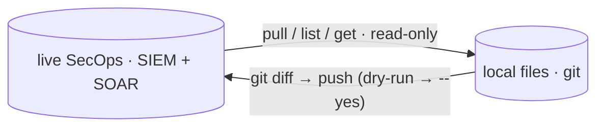

# Command reference

Every `secopsctl` command at a glance — what it does, and whether it only
**reads** or performs a **guarded mutation** (live deploy, dry-run by default).
For the step-by-step how-to, follow the per-area guides linked below.

Core loop: pull live state → review in `git diff` → push back. **Every push is a
live production deploy and defaults to a dry run.**



## 🌐 Global flags

Set on any command:

| Flag | Effect |
|---|---|
| `--config <path>` | Use this instance config YAML. An explicit path that does not exist is an error (no silent fall-through). |
| `--json` | Emit machine-readable JSON where supported (shape is per-command). |
| `--timeout <dur>` | Per-**request** HTTP timeout for API calls (default `60s`; `0` disables). A slow or blocked endpoint fails fast instead of hanging. It bounds each individual request, so it never spans a confirm prompt and never caps a multi-call command (`pull all`, paginated reads) in aggregate; raise it only for a single very large request, e.g. `--timeout 5m`. |
| `--legacy` | Force the legacy AppKey path on dual-generation surfaces (currently `cases list`); ignored where a command has no modern/legacy split. Reach for it when a New-API call 500s — the tool already auto-falls back to legacy on error, so a feature is never lost when one generation is down. |
| `--non-interactive` | Never prompt; a guarded mutation without `--yes` is refused rather than asking. For CI/agents. |
| `--read-only` | Hard read-only session: every guarded mutation degrades to a dry-run preview even with `--yes`. Also enabled by `SECOPS_READONLY=1` — set it in the environment that launches an autonomous agent. Confirmed mutations and read-only refusals are appended to `$SECOPSCTL_HOME/audit.jsonl` (default `~/.secopsctl/audit.jsonl`, `0600`). |
| `-v, --version` | Print version and exit. |
| `-h, --help` | Help for any command. `<cmd> <target> --help` (e.g. `push feeds --help`) adds a per-target note: the surface's plane/version, whether `--prune` can delete it, and its write gotchas. |

**Exit codes** (git-style): `0` success / in sync · `2` divergence — `drift`
detected a difference (act) · `1` any error. A typo'd subcommand also exits
non-zero. Confirm the active config with `secopsctl info` (`config_source` line)
or `secopsctl config --show-path`.

The authoritative, per-command answer to "does this honor `--json`?" is
`secopsctl commands --json` — each row carries a `json` boolean (the human
`secopsctl commands` table shows it as the `JSON` column, `y`/`-`). It is built
from the code, so it stays correct as commands are added; prefer it over any
hand-maintained list.

A few special cases worth knowing: `pull` is text-only — its output is the files
it writes (review with `git diff`); `rules alerts` always emits raw JSON, with or
without the flag; and `doctor`, `drift`, `push`, and the guarded mutating verbs
(e.g. `alerts update`, the `soar case` / `soar playbook` / `soar job` verbs) emit
structured JSON under `--json` too (dry-run/apply metadata, plus request/response
fields where the command has them).

## 🔒 SIEM — read-only

ADC/OAuth auth (`gcloud auth application-default login`). See
[the loop](the-loop.md), [rules](rules.md), and [query](query.md).

| Command | What it does |
|---|---|
| `info` | Show the resolved instance config (no API call; AppKey redacted). |
| `commands` | List every command with its kind — `read` vs `guarded-mutation` (the `--dry-run`/`--yes` gate) — offline, no credentials. The verb-level companion to `surfaces`; with `--json`, the input for agent tool lists and per-command allowlists. |
| `skill` | Print the agent operating guide embedded in the binary (`--json` for `{name, description, body}`); `skill install [--dir <skills-dir>]` writes it into an agent skills directory (default `$CLAUDE_CONFIG_DIR/skills` or `~/.claude/skills`) so a harness detects it. Offline — how an install-only agent (`go install …/cmd/secopsctl@latest`) obtains the guide without the repo. |
| `doctor` | Live smoke test: config + auth + SIEM/SOAR reachability. |
| `pull <target>` | Snapshot live state to local files. Targets: `rules`, `reference_lists`, `data_tables`, `dashboards`, `curated`, `curated_rules`, `feeds`, `parsers`, `rule_exclusions`, `metric_definitions`, `scheduled_reports`, `datataps`, `error_notifications`, `federation_groups`, `all`. `--filter` applies to `curated_rules` only. `--with-charts` (dashboards) derefs each chart into its inline YARA-L query — heavier, but the mirror then round-trips with its queries; default keeps charts as references. |
| `drift [target...]` | Report how live state has drifted from local files (CI gate; exit 2 on drift). No target = every engine surface; `--siem`/`--soar` scope to one plane. |
| `query udm <filter>` | Point-in-time UDM event search over `--hours` / `--from` / `--to` (default last 24h), capped by `--limit`. `--raw` prints each matched event's FULL raw ingested log line (for `parsers run --logs -`) instead of the summary — e.g. `query udm 'metadata.log_type = "KONG_GATEWAY" AND metadata.event_type = "GENERIC_EVENT"' --raw --limit 50`. |
| `query nl <text>` | Translate a natural-language query to UDM and search (`--translate-only` to just print the UDM). |
| `query gemini <question>` | Ask SecOps Gemini a question (YARA-L authoring help, UDM fields, environment-grounded answers). `--opt-in` once per account. |
| `query raw <pattern>` | Content-based raw-log search (`searchRawLogs raw = /<pattern>/`) — prints each match's FULL raw ingested log line (for `parsers run --logs -`). Reaches logs with no parser; complements `query udm --raw`. `--unparsed` / `--hours` / `--from`,`--to` / `--limit`. |
| `query stats <aggregation>` | Run an AGGREGATION query — one with a `match:`/`outcome:` projection (which `query udm` rejects with a 400) — and print the computed columns/rows (`--json` raw). The way to validate a dashboard chart's stats query before authoring it. Syntax: the `match:` section takes a field reference (`target.hostname`), the `outcome:` declares the value (`$c = count(metadata.id)`). Example below. |
| `query run --file <path>` / `-` | Run a UDM predicate from a file (or stdin with `-`); blank/`#`-comment lines ignored — so a tracked `.udm` file is a runnable query. Same window/`--limit`/`--raw`/`--json` as `query udm`. |
| `query saved [<name>]` | Run a saved query by name from the tracked `<dataRoot>/saved_queries/<name>.udm` pack, or list the pack with no name. |
| `entities summarize <type> <value>` | Summarize an entity (alerts by rule, related entities, prevalence) over `--hours` (default 7d). (alias `entity`) |
| `curated list` | List curated (Google-managed) rule-set deployments + enable/alerting state. |
| `curated rules` | List the individual curated rules. |
| `rules list` | List detection rules (rule id · display name · slug · type). The inspect verbs (`detections`/`errors`/`alerts`) accept any of these forms directly. |
| `rules validate <file.yaral>` | Validate a YARA-L file against the API (no mutation); non-zero exit if invalid. |
| `rules test <file.yaral> [--hours N] [--max-results N]` | Dry-run a YARA-L rule against the last `--hours` of historical data and report the detections it WOULD produce — preview coverage/FP load before deploying. Read-only (nothing stored); compile errors are surfaced. |
| `rules versions <rule> [--show N]` | List a rule's saved revisions (history); `--show N` prints the Nth revision's YARA-L (diff externally / roll back). |
| `rules retrohunt create <rule> --wait` | Start a retrohunt and poll until it finishes, then point at `rules detections` for the matches (guarded). |
| `rule-exclusions list` / `get <id>` | List/inspect rule exclusions (findings refinements) — id, type, query, deployment state. |
| `entities graph <detection-id> [--hours N]` | Seed the findings-graph pivot from a detection: root node + connected entities/edges (lateral movement). `entities graph explore --param k=v …` expands a node. Read-only, JSON. |
| `data-access labels\|scopes list\|get <id>` | List/get data-access RBAC labels (tag data) and scopes (grant access). Create/delete are guarded (`create --id X --file def.json`, `delete <id>`). |
| `entities risk-scores [--filter EXPR] [--order-by FIELD] [--limit N]` | Per-entity behavioral risk scores (normalized) — prioritize which hosts/users to look at first. JSON. |
| `coverage [--limit N]` | MITRE ATT&CK detection coverage (threat-collection × rule) — the platform's coverage-posture view. JSON. |
| `log-types list [--search] / get <type>` | List the instance's log types (id + display name; `--search` filters the scanned set) or print one's description. |
| `forwarders list / get <id> / collectors list <fwd>` | List on-prem forwarders and their collectors (read-only). |
| `feeds list` / `get <id>` | Live read of the instance's feeds with runtime state (SUCCEEDED/failed + failure note) — quick imperative view vs the `pull feeds` snapshot. |
| `feeds service-account` | Print the Chronicle-managed service-account email a push/PubSub/GCS feed source must be IAM-granted. |
| `ingestion health` | The error-notification configs that watch for delayed/zero-ingesting/erroring log sources. |
| `alerts list … --sort priority\|created` | Client-side sort of the alert queue: `priority` (worst first) or `created` (newest first), for fast triage. |
| `soar case list … --sort priority\|created\|updated` | Sort the case table (modern lane) and show an SLA-status column — surface the worst/oldest first. |
| `soar case workload [--filter]` | Open-case count per analyst (queue load distribution). |
| `soar case aging [--limit N]` | Open cases oldest-first by age (hours) with priority + SLA status — spot stale cases. |
| `soar case stats [--filter]` | Queue stats: open/closed counts, open-age p50/p90, and closed resolution-time p50/p90 (create→close proxy). |
| `soar case task list\|add\|done\|delete` | Case checklist tasks: `list --id N` (read); guarded `add --id N --title T`, `done --task-id N`, `delete --task-id N`. |
| `soar case evidence add\|get` | Attach a file as case evidence (guarded `add --id N --file F --name X`; the API has no delete) or read one back (`get <evidence-id>`). |
| `soar connector stat <identifier>` | Runtime statistics for one connector instance (events, errors, connectivity, last run) — confirm health after a config change. |
| `soar connector run --integration X --connector Y --instance Z` | Trigger a connector instance to pull on demand (guarded) — verify it pulls without waiting for its schedule. |
| `watchlists create\|delete\|remove-entity` | Manage tracking/hunting watchlists: `create --name X --display-name Y [--factor f]`, `delete <id> [--force]`, `remove-entity <entity-name>` (guarded). |
| `parsers sample-logs <log-type>` | Fetch a sample of a log type's RAW logs directly (`logTypes/<type>/logs`) — full bytes, one per line, to develop a parser against (`--limit` / `--since`). Logs are ordered by resource name (not time), so this is a sample — pass `--since` to bound by time. |
| `parsers validate <log-type>` | Show the parsing errors from the most recently submitted parser's validation report — the detail behind a `push parsers` / `parsers activate` `FAILED_PRECONDITION` (per-log error + a failing-log preview; `--show-logs` for the full sample). |
| `parsers versions <log-type>` | List a log type's parser versions (id · state · created). |
| `parsers run <log-type>` | Validate a CBN parser against sample logs (`--cbn`, `--logs`); no server change. |
| `feeds schemas` | List feed source types (or one source type's log types with `--source-type`) — the field reference for authoring a feed. Templates are in `examples/feed-templates/`; use `secret_ref` for credentials. |
| `rules detections <rule>` | List detections a deployed rule produced in a time window. `<rule>` is a rule id, display name, or slug (resolved against the live rule list). |
| `rules errors <rule>` | List execution errors a rule produced, including structured error payloads. Accepts a rule id, display name, or slug; an unknown rule gives a clean client-side `no rule matches` error instead of an opaque API `400 invalid rule name`. |
| `rules alerts <rule>` | Search alerts a rule generated (raw, rule-dependent shape). Accepts a rule id, display name, or slug. |
| `rules trends` | Per-rule detection counts (day buckets) + last detection over `--hours` (default 7d), noisiest first — which rules are noisy or silent. No `--rule` = every rule. |
| `rules counts` | Rule count and quota statistics for the instance. |
| `rules events <rule> <detection-id>` | The UDM events behind one detection — the evidence pivot (summary per event variable; `--json` for full payloads). |
| `curated detections <ur_id>` | Detections a CURATED rule produced (`ur_…` ids from `curated rules`); the curated twin of `rules detections`. |
| `curated trends (--rule ur_a,… \| --all)` | Per-curated-rule detection counts + last detection; `--all` sweeps every curated rule. |
| `curated events <detection-id>` | Event + rationale behind one curated detection. |
| `pipeline list` / `get <id>` | List / show log processing pipelines (read-only). |
| `alerts list` | List Chronicle detection alerts over a time window (snapshot). |
| `alerts get` | Get one alert by id; when the alert is cased, also prints the SIEM case uuid **and its SOAR integer case id** (the `soar case` pivot). |
| `alerts investigate <id> --latest` | Read the alert's most recent AI (Gemini) investigation: verdict, confidence, summary, suggested next steps (`--json` adds the agent's per-step UDM queries). Without `--latest` it **starts** a new investigation (a generation; refused in read-only mode) and polls to completion. |
| `cases soar-id <uuid>...` | Resolve SIEM case uuid(s) (an alert's `caseName`) to SOAR integer case id(s) — the bridge into every `cases` verb. |
| `threat-intel collections` | List Mandiant threat collections (campaigns/reports/…). (alias `ti`) |
| `threat-intel collection <id>` | Show one threat collection by id. |
| `threat-intel related <collection-alt-name-or-id>` | Show IoC match counts for threat collection alt names such as `CAMP.00.001`; resource ids are resolved to alt names first. |
| `indicators find <value>` | Resolve indicator value(s) to IoC records (`--type` to force md5/sha1/sha256/domain/ip; `--from-file <path>`/`-` for a list or stdin). (alias `iocs`) |
| `indicators get <id>` | Get one IoC by its resource id (from `indicators find --json`). |
| `indicators related <ioc-id>` | List campaigns/reports related to an IoC resource id (`--collection-type campaign|report|all`). |
| `watchlists list` | List SIEM entity watchlists. |
| `watchlists get` | Get one watchlist by id. |
| `cases get` / `cases list` / `cases search` | Reach a case on the Chronicle host by UUID — alternate path that 500s today; prefer `soar case`. |
| `version` | Print version, commit, and build info. |

## ⚠️ SIEM — guarded mutations

Dry-run by default; pass `--yes` (or confirm interactively) to deploy. Each
prints a `LIVE DEPLOY` banner. See [rules](rules.md).

| Command | What it does |
|---|---|
| `push rules-create` | Create live rules from `*.yaral` files that have no companion `*.yaml`; `--enabled`, `--alerting`, and `--run-frequency` set the initial deployment. |
| `push rules-update` | Update live YARA-L text where a tracked `*.yaral` changed (etag-guarded). |
| `push rules-deploy` | Reconcile each tracked rule's deployment (enabled/alerting/frequency); `--rule` scopes one rule, and archived rules are reported as non-deployable. |
| `push rules-disable` | Disable locally-tracked rules with `deployment.enabled=true`. |
| `alerts update <id>...` | Set alert triage feedback: `--status new\|reviewed\|closed\|open`, `--verdict true-positive\|false-positive`, `--priority`, `--reason`, `--reputation`, scores, `--comment`, `--root-cause`. Several ids fan out the same update. |
| `watchlists add-entity <id> (--ip\|--mac\|--hostname\|--user\|--email)` | Put one entity on a watchlist — containment/tracking (exactly one selector). |
| `push curated` | Reconcile `curated/deployments.yaml` to live curated deployment state (enabled/alerting only). |
| `push <reconcile-target>` | Reconcile local files to live (create/update; `--prune` deletes on prune-eligible surfaces only — `push <target> --help` says which). Targets: `reference_lists`, `data_tables`, `parsers`, `feeds`, `forwarders`, `dashboards`, `rule_exclusions`, `metric_definitions`, `scheduled_reports`, `datataps`, `error_notifications`, `federation_groups`. |
| `curated set` | Toggle a curated deployment's `enabled`/`alerting` per precision (`--category`, `--ruleset`, `--precision`). |
| `feeds delete <id>` | Delete one feed by id (the feed UUID or full resource name). Stops that feed's ingestion — the explicit one-off, since feeds aren't `--prune`-eligible. Resolves and names the feed before acting. |
| `reference-lists empty <name>` | Clear all entries from one no-delete reference list. Resolves the target and previews entry count only before acting. (alias `reference_lists`) |
| `rule-exclusions deploy <id>` | Enable, disable, or archive one findings refinement with `--enable`, `--disable`, or `--archive`. Resolves the target and previews current → desired deployment state before acting. (alias `rule_exclusions`) |
| `cleanup smoke-artifacts` | Delete or neutralize only secopsctl-owned smoke-test artifacts. Dry-run prints the exact plan; apply requires `--yes`. |
| `rules retrohunt` | Manage retrohunts (run a rule over historical data). |
| `parsers activate <log-type> <id>` | Make a parser version ACTIVE (live ingestion switches; use `parsers versions` to find a prior id to roll back to). |
| `dashboards duplicate <id>` | Copy a dashboard to a new independent one (new `--name`/`--access`) via the server `:duplicate` verb — the copy gets its own charts and queries in one call (the same path the web console takes). `--deep-copy` rebuilds it client-side instead (fallback). Also the supported way to change the immutable `access`. Guarded. |
| `dashboards delete <id>` | Delete a whole dashboard (guarded), e.g. a stale duplicate. A corrupt dashboard whose charts are dangling/non-owned references (owned by another dashboard or already gone) can't be deleted by the API or the web console — the error says so. |
| `dashboards export <id>` | Export a dashboard with its charts + queries to one self-contained JSON document (`--out <file>` or stdout); read-only. Re-create it anywhere with `import`. |
| `dashboards import <file>` | Create a dashboard from an export JSON document in ONE call (dashboard + charts + queries together; server mints fresh ids). Guarded (`--dry-run`/`--yes`). |
| `dashboards add-chart <id>` | Add a chart with a YARA-L `--query` (or `--query-file`) via `:addChart` — the only way to author a chart query (the dashboard body is reference-only). `--chart-type bar\|line\|pie\|table --x <var> --y <var> [--series-by <var>]` GENERATES the visualization and validates the encode vars against the query's columns (vs hand-writing `--visualization`). `--if-absent` skips when a chart with the title exists. Guarded (`--dry-run`/`--yes`). The `<id>` is the server id in the pulled `<slug>.json` `_server` block (or from `dashboards charts`). |
| `dashboards add-charts <id> --file <charts.json>` | Batch-author a whole dashboard's charts from a JSON array — validated up front, idempotent (existing titles skipped), `--pace`d under the chart quota. Guarded. |
| `dashboards edit-chart <id> --chart-id <c>` | Edit a chart IN PLACE: `--query`/`--query-file` (the YARA-L), `--visualization`/`--chart-type` (the type), and/or `--layout` (grid position) — no remove+re-add churn. Guarded. |
| `dashboards remove-chart <id> --chart-id <c>` | Remove a chart from a dashboard via `:removeChart`. Guarded. |
| `dashboards list` | List every native dashboard (id · type · title) — so you get an id directly instead of digging it out of a pulled file's `_server.id`. `--json` for the full objects. |
| `dashboards charts <id>` | List a dashboard's charts with their resolved YARA-L queries (read-only; derefs each chart → query). `--json` for the full list — also how to recover a `--chart-id`. |
| `dashboards run-chart <id> --chart-id <c>` | (alias `values`) Execute a chart's query (`dashboardQueries:execute`) and print the VALUES it renders — rows/series (`--json`, `--clear-cache`, `--filter`). The verify half of authoring. |
| `dashboards verify [<id>]` | Execute every chart and flag the ones returning 0 rows or an error — a headless/CI dashboard health check (exit 2 if any chart needs attention). Charts run in parallel (`--concurrency`, default 8); a transient 5xx/429 is retried and reported as inconclusive, never as broken (only a 404 dangling ref is "broken"). **`--all`** health-checks every CUSTOM dashboard in one fleet rollup (`--include-curated` to add the Google-managed ones). |

## 🔒 SOAR — read-only

AppKey auth (`soar_url` + `$SECOPS_SOAR_APP_KEY`; no ADC). See
[SOAR cases](soar-cases.md) and [reconcile](reconcile.md).

| Command | What it does |
|---|---|
| `soar pull <target>` | Snapshot SOAR state to local files. Targets: `grouping`, `cases`, `blacklists`, `case-stages`, `case-tags`, `close-root-causes`, `connector-allowlist`, `connectors`, `environments`, `idp`, `jobs`, `networks`, `playbook-categories`, `playbooks`, `sla-definitions`, `soc-roles`, `tracking-lists`, `visual-families`, `webhooks`, `all`. |
| `soar playbook list` | List live SOAR playbooks for discovery before editing, saving, or debugging. `--enabled-only` filters to enabled playbooks; `--type regular\|nested` scopes the menu-card query. |
| `soar playbook validate --file <playbook.json>` | Preflight an exported playbook JSON file before save. Runs the same local save-shape checks as `soar push playbook --dry-run` and reports trigger, step, action, block, relation, automatic/manual counts, and graph warnings. |
| `soar playbook components integrations` | List installed integration packs that can supply playbook actions, connector definitions, and job definitions. |
| `soar playbook components actions` | The WHOLE action palette in one call — every action across every integration with its numeric id (the id `components usage` keys on). Add `--integration <key>` for one integration in detail (parameter counts, mandatory parameters, JSON/script-result flags, async state). Neither prints Python script bodies. |
| `soar playbook components flow` | The Flow palette: transformers (value functions, e.g. `trimChars`) and logical operators (condition predicates, e.g. `Not Empty`), with usage examples. `--kind functions\|operators`. |
| `soar playbook components triggers` | The playbook trigger vocabulary (offline): the designer's trigger kinds and the `type` tokens saved on playbook definitions (`ALL`, `CASE_DATA`, `GET_INPUTS`). |
| `soar playbook components blocks` | List playbook BLOCKS — reusable nested playbooks callable as steps. |
| `soar playbook components jobs --integration <key>` | List job definitions inside one integration for workflow planning. |
| `soar playbook components connectors --integration <key>` | List connector definitions inside one integration for workflow planning. |
| `soar playbook test-cases` | List SecOps debug test cases (`--search`, `--environment`, `--page-size`) before a debug run. |
| `soar playbook debug-step-data` | Read simulated case data for one debug step by original step identifier. |
| `soar playbook simulation-enrichment` | Read simulation enrichment for one test case, step, and workflow identifier. |
| `soar playbook pending count` / `list` / `get` | Read pending playbook steps assigned to the current user. `get --case-id N` can be scoped with `--alert-group` and `--workflow-identifier`. |
| `soar playbook step get` | Fetch one workflow step instance by case, workflow, and step identifiers. Use `--json` to save the raw body for guarded `step execute`. |
| `soar playbook summary --case-id N --playbook <name>` | Triage a playbook run: surfaces **FAULTED** steps (action · error · Cloud Logging deep-link; `--show-errors` for the full traceback). `--playbook` resolves to the definition id via `soar playbook list`, and the alert identifier is read from the case — so no opaque GUIDs (override with `--alert`/`--definition`). A multi-alert case auto-resolves to the single playbook-bearing alert; if still ambiguous it lists the actual `--alert` ids (not names). **`--steps`** prints the full per-step execution trace (every completed step · status · action · result), for debugging a run that finished but did the wrong thing. Prefers the v1alpha path, falls back to legacy. |
| `soar playbook results` / `result` | Read action results for a workflow instance or one case action-result id; human output summarizes status/presence only, `--json` emits the raw payload. |
| `soar playbook versions` | List a playbook's saved version log (each save/deploy mints one); the identifiers feed `restore`. |
| `soar playbook stats` | Aggregate run statistics for one playbook across all cases over `--hours` (default 7d); `summary` stays the single-run view. |
| `soar playbook export` | Export one playbook: definition+blocks JSON (the `mold`/`build-playbook` input), or `--zip --out <f>` for the platform bundle `import` takes. |
| `soar playbook trigger tags` | List the live tag values a Tag-Name trigger condition can reference (`--grep` for a server-side search). |
| `soar playbook components usage (--action-id N \| --action <name>)` | Which playbooks use an integration action (impact analysis). Address it by numeric id (from `components actions`) or by display name, `--integration`-scoped when ambiguous. |
| `soar playbook python-logs` | Read Python execution logs (`--filter`, `--page-size`, `--page-token`). **Note:** this proxies Cloud Logging and can return a server-side 500 on some instances regardless of filter — use `soar playbook summary --case-id N --playbook "<name>"` to triage failed runs instead (it surfaces each faulted step's error + a per-step Logs Explorer link). |
| `soar job list` | List installed SOAR jobs and last-run status without printing job script bodies. |
| `soar job template list` | List SOAR job templates for component planning without printing job script bodies. |
| `soar job instance list` | List configured SOAR job instances. |
| `soar job logs` | Read Python execution logs for SOAR jobs/actions. Use documented filters such as `labels.job_name=~"^."` or `labels.action_name=~"^."`. **Same Cloud Logging caveat as `python-logs`:** can 500 on some instances; for failed playbook/job triage, prefer `soar playbook summary`. |
| `soar case list` | List SOAR cases (default open; `--status open\|closed\|all`, `--limit`). Triage filters: `--assignee` (substring), `--priority`, `--tag` (modern lane), `--since` (duration/timestamp), and a verbatim modern server-side `--filter` expression (grammar below). **A case is one record:** `cases …` is the canonical command and `soar case …` is a hidden back-compat alias — every `soar case <verb>` below also runs as `cases <verb>`. |
| `soar case counts [--filter <expr>]` | Per-priority case counts for a filter set (default open cases) — one cheap exact count per priority via the list's `totalSize`. |
| `soar case get <id>` | Get one case + its alerts (SOAR integer id). Each alert shows its `--alert` identifier, its **firing rule** (name + `ru_` id) with a `rules detections` pivot hint, and — when a playbook is attached — a **▸ playbook(s) attached** marker with the exact `cases wall` / `soar playbook summary` pivot commands. |
| `cases wall --case-id N` | Render the case's **timeline** (oldest first: time · kind · activity) — playbook attachments, action results, alert grouping, status/stage changes. The automation+analyst story of the case, headless. `--json` for the full records. |
| `soar case comment list --id N` | List a case's comments (the case-wall record; `--alert` scopes to one alert). |
| `soar case summarize --id N` | The structured AI summary of a case — narrative, reasons, next steps (polls until generation settles). |
| `soar case overview --id N [--widgets]` | The data behind the console's case Overview tab: the case's entities with their enrichment by default, or the overview widget template with `--widgets`. Read-only, JSON. |
| `soar case alert recommend --id N --alert <ident>` | Generate + fetch the AI recommendation for one alert in a case (the alert must be open at alert level; each run starts a generation server-side — refused in read-only mode). |
| `alerts enrich <id>` | A SIEM alert's full context — rule detection, mapped UDM events, entities/indicators (hosts, users, process+sha256, domains), MITRE tags, triage verdict, and the SOAR case bridge — via `legacy:legacyBatchGetCollections` (the surface the console uses). The AI agent's investigation is `alerts investigate <id> --latest`. |
| `info soar-integrations` | Report installed SOAR integration packs, connector/job runtime counts, bound environments, and gaps such as `config_without_runtime` or `runtime_disabled`. |
| `soar integration list` | List installed integration packs. |
| `soar integration instances --integration <id>` | List an integration's configured instances (id · environment · name) — the fields `integration delete` needs, which `list` (packs only) does not expose. |
| `soar integration connector list` | List connector definitions inside an integration (`--integration <key>`; read-only). Sibling `soar integration connector delete` removes a custom definition. |
| `soar marketplace list` | List Content Hub marketplace integrations (`--installed` to filter). |
| `soar marketplace get` | Show one marketplace integration (human summary; `--json` for the full record). |
| `soar marketplace contentpacks` | List Content Hub content packs. |
| `soar settings api-keys` | List SOAR API keys (metadata only; the secret is never shown after creation). Guarded siblings: `create --name <n> --permission-group N` (mints the key value locally — crypto/rand — and prints it ONCE) and `revoke (--name\|--id)`. |
| `soar integration action template --integration <key>` | Fetch the new-action definition skeleton (Python scaffold included; `--async` for the asynchronous variant). Sibling `soar integration job-def template` for jobs. |
| `soar settings case-assignment` | Read the case auto-assignment policy. |
| `soar settings move-case-policy` | Read the cross-environment case-move policy. |
| `soar case simulation list` | List custom (simulated) test-case names for playbook development. |
| `soar case simulation get --name <sim>` | Read one simulation's alert/event field config. |
| `soar legacy call <op> --read` | Escape hatch: call any Siemplify external-API op read-only (`/api/external/v1`). |

`soar pull grouping` and `soar pull cases` are **snapshot-only** read targets:
there is no matching `soar push grouping`/`push cases` and they are not part of
`drift`, so the pull → diff → push loop does not close for them — use them to
capture state for review, not to reconcile it.

### Case `--filter` grammar (modern cases list)

`--filter` on `soar case list` / `soar case counts` passes a server-side
expression through verbatim — the same grammar the web UI's Case Queue Filter
generates:

| Field | Type | Example |
|---|---|---|
| `status`, `priority` | enum token | `status = 'OPENED'`, `priority = 'PRIORITY_HIGH'` (`PRIORITY_INFO`/`LOW`/`MEDIUM`/`HIGH`/`CRITICAL`) |
| `assignee` | string | `assignee = '@Tier1'` (at-prefixed role name) or a user UUID |
| `environment`, `stage`, `displayName` | string | `stage = 'Triage'` (stages: Triage, Assessment, Investigation, Incident, Improvement, Research) |
| `createTime`, `updateTime` | int64 (epoch ms) | `updateTime >= 1700000000000` |
| `id` | int64 | `id >= 4000` |
| `tags`, `alertNames`, `products` | collection | `any(tags.displayName, 'tag-a', 'tag-b')` · `any(alertNames.alertName, 'RULE NAME')` · `any(products.displayName, 'RULE')` |

Terms compose with `and` / `or` and parentheses. A zero-match query returns an
empty result (HTTP 204), not an error. Very long filters are sent
automatically via the method-override POST the UI uses, so URL length is not a
practical limit.

## ⚠️ SOAR — guarded mutations

Dry-run by default; pass `--yes` to apply. See [SOAR cases](soar-cases.md) and
[reconcile](reconcile.md).

| Command | What it does |
|---|---|
| `soar push <surface>` | Reconcile local files to live (create/update; `--prune` deletes on prune-eligible surfaces only — `soar push <surface> --help` says which). Surfaces: `blacklists`, `case-stages`, `case-tags`, `close-root-causes`, `connector-allowlist`, `connectors`, `environments`, `idp`, `jobs`, `networks`, `playbook-categories`, `playbooks`, `sla-definitions`, `soc-roles`, `tracking-lists`, `visual-families`, `webhooks`. |
| `soar push playbooks` (plural) | Reconcile the **whole** playbooks directory: create/update every changed playbook, `--prune` to delete server-only ones. (One of the reconcile surfaces above.) |
| `soar push playbook` (singular) | Imperative whole-body save of **one** playbook from `--file <playbook.json>`; mints a new version. Dry-run validates JSON and the playbook-name charset offline. Not a directory reconcile — use `playbooks` for the loop. |
| `soar playbook deploy (--name \| --identifier) --enable\|--disable` | Toggle a playbook's `isEnabled`. Reads the full definition, flips the flag, and saves (mints a new version — the only API path). `--name` resolves via the live list. |
| `soar playbook delete (--name \| --identifier)` | Delete a playbook permanently. `--name` resolves via the live list. Irreversible — deleting stops any attached case execution. |
| `soar playbook run` / `debug` | Attach/run a live playbook on an explicit case/alert, or start SecOps debug mode from an exported playbook and explicit test case. Dry-run is default; `--yes` executes in SecOps. |
| `soar playbook rerun` / `rerun-block` | Rerun a playbook or nested block on an explicit case/alert. `rerun-block --inputs <file>` accepts a JSON array of block input parameters. |
| `soar playbook step execute --file <step-instance.json>` | Execute one fetched workflow step instance. Dry-run prints a sanitized summary only; `--yes` sends the exact file body to SecOps. |
| `soar playbook step skip --file <step-instance.json>` | Skip one pending workflow step — the reject half of an approval (`step execute` continues it). `--comment` records why. |
| `soar playbook restore --version <id>` | Roll a playbook back to a version from `versions` (the restore mints a new version; `--override` replaces outright). |
| `soar playbook import --file <bundle.zip>` | Import a playbook bundle (the zip `export --zip` produces) — cross-tenant promotion / backup restore. |
| `soar playbook generate (--description <s> \| --case-id N --alert <id>)` | Draft a playbook with AI. The description form is synchronous and returns the draft definition **without persisting it** — review, then save with `soar push playbook --file`. Poll the by-alert form with `generate-status`. Servers may restrict the Playbook Assistant to interactive auth; the error says so plainly. |
| `soar integration action create --integration <key> (--file <def.json> \| --name <n> --script <f.py>)` | Create a custom Python action definition (the IDE's create flow: template → fill → POST). Siblings: `update --file <def.json>` (save edits to an existing definition) and `delete --id N`; `soar integration job-def {create,update,delete}` mirror for jobs. |
| `soar settings api-keys create / revoke` | Create an API key (secret minted locally, printed once) or revoke one by name/id. |
| `soar job instance set --instance <sel> --enable\|--disable` | Enable/disable a scheduled job instance (fresh read, flag flipped, whole body saved). |
| `soar job instance create --file <json>` / `delete --instance <sel>` | Create a scheduled job instance from a JSON body / delete one by id. |
| `soar job run --job <id\|uniqueIdentifier\|name>` | Run one installed SOAR job now. Fetches the live job first, previews the target, and requires `--yes` to execute. |
| `soar job instance run --instance <id\|uniqueIdentifier\|name>` | Run one configured SOAR job instance now. Fetches the live instance first, previews the target, and requires `--yes` to execute. |
| `soar push bulk-close` | Bulk-close cases by id (`--ids`, `--reason` ∈ malicious\|not-malicious\|maintenance\|inconclusive\|unknown). |
| `soar case assign` | Assign a case to a user (`--user`). |
| `soar case tag` / `untag` | Tag / untag a case. |
| `soar case stage` | Change a case's stage (`--stage`). |
| `soar case close` | Close one case (`--id`, `--reason` = the fixed enum `malicious\|not-malicious\|maintenance\|inconclusive\|unknown`, same as `bulk-close`; `--root-cause`, `--comment` optional). |
| `soar case reopen` | Reopen closed case(s) — the inverse of close (`--id` single or `--ids 1,2,3` bulk; `--comment` optional). |
| `soar case priority` | Change a case's priority (`--priority informative\|low\|medium\|high\|critical`; distinct from the `importance` flag). |
| `soar case comment add` | Add a comment to a case (`--id`, `--text`; `--alert` scopes to one alert) — the case-wall triage-rationale record. |
| `soar case alert close` | Close ONE alert in a case — the case stays open (`--id`, `--alert`, `--reason malicious\|not-malicious\|maintenance\|inconclusive`; optional `--root-cause`, `--comment`, `--usefulness none\|useful\|not-useful`). |
| `soar case alert priority` | Change one alert's priority (`--id`, `--alert`, `--priority`); at apply time the alert's name and current priority are resolved from the case, so a wrong `--alert` fails before any mutation. |
| `soar case alert move` | Move one alert out of a case (`--id`, `--alert`; `--to M` for an existing case, omit for a new one) — the inverse of `merge`. |
| `soar case alert reopen` | Reopen one closed alert in a case (`--id`, `--alert`). |
| `soar case rename` / `describe` / `importance` / `merge` | Rename / re-describe / flag-important / merge cases. |
| `soar case run-action --id N --action <name> --instance <uuid>` | Execute an integration action on a case (ad-hoc — any installed action). Script params via `--param key=value` (secrets via `env:VAR`). Returns the action result (resultCode, message); `--json` emits the full payload. (`--case-id` stays as a hidden alias of `--id`.) |
| `soar case simulation create` | Create a custom simulated test case from alert/event field specs — appears in the SOAR queue for playbook testing. |
| `soar case simulation generate --name <sim>` | Generate a test case from a custom simulation name into the case queue. |
| `soar case simulation alert --case-id N --alert <id>` | Simulate an alert inside a case for playbook testing. |
| `soar case simulation delete --name <sim>` | Delete a custom simulation. |
| `soar case values <tags\|stages\|root-causes>` | List the live configured values for `--tag` / `--stage` / `--root-cause`. |
| `soar users list` | List SOAR users (the USERNAME column is the value for `soar case assign --user`); `--grep` / `--all`. |
| `soar integration install --identifier <id>` | Install a Content Hub marketplace integration pack (from `soar marketplace list`); pairs with `uninstall`. |
| `soar integration create` | Create a new, unconfigured (inert) integration instance. |
| `soar integration configure --integration <id> --param k=v` | MUTATING (guarded): set an instance's parameters. Reads current settings, overlays `--param` values (matched on `propertyName` or display name), and saves. `--param 'key=env:VAR'` resolves secrets from env vars. Instance auto-resolved. |
| `soar integration delete --integration <id>` | Delete an integration instance (warns if playbooks use it). `--id`/`--environment` are resolved from the integration's instances — a single instance is auto-selected; several list themselves with copy-paste flags to narrow. |
| `soar integration uninstall --key <integration-key>` | Delete a custom integration pack (clone) by its key. (`--name` stays as a hidden alias of `--key`.) |
| `soar settings case-assignment` / `move-case-policy` set | Set the case-routing policy (set form is guarded). |
| `soar legacy call <op> --write --yes` | Escape hatch: call any Siemplify external-API mutation. Add `--dry-run` to preview the composed request (method + op + body) without sending; `--out <file>` writes the response `0600`. |

## 🛠️ Utility

| Command | What it does |
|---|---|
| `config` (alias `init`) | Set up / edit the config (`~/.secopsctl/instance.yaml`, `0600`). Single-screen form, or flags + `--non-interactive`. See [configure](configure.md). `config --show-path` prints the active config file. |
| `surfaces [--json]` | List every API surface family — plane (host + auth), API version, lane (reconcile/imperative/raw/operational), status, and whether `--prune` can delete it. Reads nothing live; the map of reconcilable vs read-only. |
| `info cron [--root <dir>] [--host] [--heartbeat-status <label>=<url>]` | Scheduler ownership/orphan report. Scans local scheduler-like files for `secopsctl drift`, `push`, and `soar push` references, plus pulled `soar/jobs/` and `soar/playbooks/` cron schedules. `--host` also inspects the current user's crontab and user systemd unit files. `--heartbeat-status` performs a HEAD check against a read-only status endpoint. Reports file:line references and labels only; raw lines and URLs are not printed. |
| `soar build-playbook --base <playbook.json> --cron <expr> --out <playbook.json>` | Offline SOAR playbook composer. Starts from a full exported base playbook, sets `trigger.cronSchedule`, and can replace placeholder steps with exported, already-wired integration-action step molds via repeated `--replace-step <step>=<step.json>`. |
| `soar playbook mold extract --file <playbook.json> --step <name\|id> --out <step.json>` | Extract one exported action step as a reusable mold for `soar build-playbook`. |
| `soar playbook step insert --file <pb.json> --mold <step.json> --after <step> --out <f>` | Offline: splice a NEW action step into a playbook definition after an anchor step — fresh graph identity, rewired relations (`--branch` picks a condition branch). Review with `validate`, save through the guarded loop. |
| `soar playbook mold apply --file <playbook.json> --replace-step <step=step.json> --out <playbook.json>` | Replace placeholder steps in an exported playbook with reusable action-step molds, preserving the base step graph identity. |
| `soar playbook trigger set --file <playbook.json> --out <playbook.json>` | Edit trigger fields in exported playbook JSON (`--enabled`, `--trigger-enabled`, `--type`, `--execution-mode`, `--cron`, `--conditions`, `--reaction-conditions`) before validation and guarded save. |
| `soar integration scaffold --name <integration> --out <dir> --action <name> --job <name>` | Offline custom integration scaffold for Python-backed actions/jobs. Package the result with `soar package-integration`; SecOps validates it on import. |
| `soar package-integration <dir>` | Offline ZIP builder for an already-shaped SOAR custom integration directory. Defaults to `<dir>.zip`; use `--out <file>` and `--force` to overwrite. |
| `completion` | Generate the shell autocompletion script. |
| `help` | Help about any command. |

## 🧪 Cookbook

End-to-end recipes. The deeper how-to lives in the per-area guides.

**Prove the setup before touching anything** ([install](install.md),
[configure](configure.md)):

```bash
secopsctl config     # write ~/.secopsctl/instance.yaml (git-ignored, 0600)
secopsctl doctor     # read-only reachability check: SIEM + SOAR
secopsctl info       # show resolved config (AppKey redacted; no API call)
```

**The golden rule** — reads are free; every write is dry-run first
([the loop](the-loop.md)):

```bash
secopsctl push <target>          # dry-run by default — read the preview
secopsctl push <target> --yes    # apply for real
```

**Edit a detection rule** ([rules](rules.md)):

```bash
secopsctl pull rules                       # always pull before you edit
# edit ./rules/<slug>.yaral, then: git diff rules/
secopsctl push rules-update --dry-run      # etag-guarded preview
secopsctl push rules-update --yes
secopsctl pull rules                        # re-pull so local matches live
```

**Triage a case** — `--id` is the SOAR integer id from `soar case list`
([SOAR cases](soar-cases.md)):

```bash
secopsctl soar case list
secopsctl soar case get 1234
secopsctl soar case close --id 1234 --reason malicious --yes
```

**Check SOAR integration runtime coverage**:

```bash
secopsctl info soar-integrations
secopsctl --json info soar-integrations
```

**Check scheduled automation references**:

```bash
secopsctl info cron
secopsctl --json info cron --root .
secopsctl info cron --host --heartbeat-status nightly=https://example.com/secopsctl/nightly/status
```

**Develop a SOAR playbook with SecOps-backed tests**:

```bash
secopsctl soar playbook components integrations --grep example
secopsctl soar playbook components actions --integration Example --grep lookup
secopsctl soar playbook mold extract --file exported-playbook.json --step "Lookup" --out molds/lookup.json
secopsctl soar playbook mold apply --file base-playbook.json --replace-step "Lookup=molds/lookup.json" --out playbook.json
secopsctl soar playbook trigger set --file playbook.json --enabled true --type 8 --execution-mode Automatic --cron "0 8 * * *" --out playbook-triggered.json
secopsctl soar playbook validate --file playbook-triggered.json
secopsctl soar playbook test-cases --search smoke --page-size 10
secopsctl soar playbook debug --file playbook.json --test-case-id 123 --dry-run
secopsctl soar playbook debug --file playbook.json --test-case-id 123 --yes
secopsctl soar playbook pending list
secopsctl --json soar playbook step get --case-id 456 --workflow-identifier <workflow-id> --step-identifier <step-id> > step.json
secopsctl soar playbook step execute --file step.json --dry-run
secopsctl soar playbook summary --case-id 456 --playbook "My Playbook"
secopsctl soar playbook results --workflow-instance-id 789
secopsctl soar job logs --filter 'labels.job_name=~"^."' --page-size 20
```

**Scaffold and package a Python-backed SOAR component**:

```bash
secopsctl soar integration scaffold --name ExampleIntegration --action "Lookup Entity" --job "Nightly Sync" --out integrations/ExampleIntegration
secopsctl soar package-integration integrations/ExampleIntegration --out ExampleIntegration.zip
```

**Reconcile a SOAR surface** ([reconcile](reconcile.md)):

```bash
secopsctl soar pull webhooks               # snapshot the whole surface
# edit ./soar/webhooks/, then: git diff soar/webhooks/
secopsctl soar push webhooks --dry-run     # additive preview
secopsctl soar push webhooks --yes
secopsctl soar push webhooks --prune --yes # delete server-only objects (gated on a full pull)
```

**Ad-hoc UDM search** ([query](query.md)):

```bash
secopsctl query udm 'metadata.event_type = "USER_LOGIN"' --hours 48 --limit 500 --json
```

**Escape hatch — call a legacy external-API op directly.** When a Siemplify
`/api/external/v1` op has no first-class command, `soar legacy call` reaches it
raw. GET is read-only; the legacy API uses POST for **both** reads and writes, so
a POST must declare intent — `--read` for a read, or `--write --yes` for a
mutation (which prints a live external-API banner; PUT/DELETE are treated as
writes too). Op names and body shapes come
from the SecOps Web UI Network tab (browser dev-tools); the bundled swagger under
`third_party/` is git-ignored and not shipped. Many legacy reads expect an
offset-paging body, `{"requestedPage": 0, "pageSize": 100}`.

```bash
# Read (GET): list installed integrations
secopsctl soar legacy call integrations/GetInstalledIntegrations --read

# Read (POST) with an offset-paging body
printf '{"requestedPage": 0, "pageSize": 100}' > page.json
secopsctl soar legacy call <list-op> --method POST --read --body page.json

# Guarded write (POST): mutation — refused without --yes; --yes deploys live
printf '{"caseId": 1234, "tag": "triaged"}' > req.json
secopsctl soar legacy call <write-op> --method POST --write --body req.json --dry-run  # preview, sends nothing
secopsctl soar legacy call <write-op> --method POST --write --body req.json --yes      # deploy live
```

## 🔗 See also

- [Install](install.md) · [Configure](configure.md) · [The loop](the-loop.md)
- [Rules](rules.md) · [Query](query.md) · [SOAR cases](soar-cases.md) · [Reconcile](reconcile.md) · [SDK](sdk.md)
- [Architecture](../design/architecture.md) · [Surfaces](../design/surfaces.md) · [Catalog](../design/catalog.md) (surface status — source of truth)
- [SIEM design](../design/siem.md) · [SOAR design](../design/soar.md)
- [Glossary](../GLOSSARY.md)
