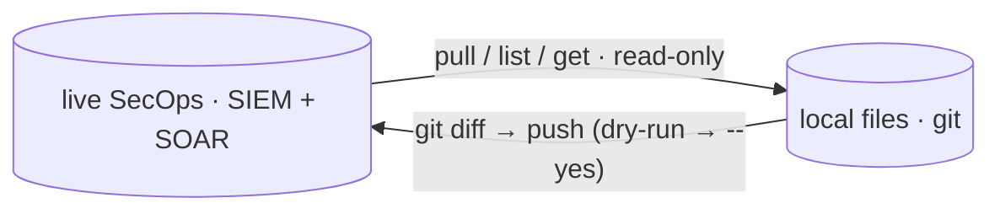

# Command reference

Every `secopsctl` command at a glance — what it does, and whether it only
**reads** or performs a **guarded mutation** (live deploy, dry-run by default).
For the step-by-step how-to, follow the per-area guides linked below.

Core loop: pull live state → review in `git diff` → push back. **Every push is a
live production deploy and defaults to a dry run.**



## 🌐 Global flags

Set on any command:

| Flag | Effect |
|---|---|
| `--config <path>` | Use this instance config YAML. An explicit path that does not exist is an error (no silent fall-through). |
| `--json` | Emit machine-readable JSON where supported (shape is per-command). |
| `--legacy` | Force the legacy AppKey path on dual-generation surfaces (currently `soar case list`); ignored where a command has no modern/legacy split. Reach for it when a New-API call 500s. |
| `--non-interactive` | Never prompt; a guarded mutation without `--yes` is refused rather than asking. For CI/agents. |
| `-v, --version` | Print version and exit. |
| `-h, --help` | Help for any command. `<cmd> <target> --help` (e.g. `push feeds --help`) adds a per-target note: the surface's plane/version, whether `--prune` can delete it, and its write gotchas. |

**Exit codes** (git-style): `0` success / in sync · `2` divergence — `drift`
detected a difference (act) · `1` any error. A typo'd subcommand also exits
non-zero. Confirm the active config with `secopsctl info` (`config_source` line)
or `secopsctl config --show-path`.

`--json` is honored by the read commands: `info`, `query udm`, `query nl`,
`logs raw`, `entity summarize`, `alerts list`, `alerts get`, `iocs find`, `iocs get`,
`ti collections`, `ti collection`, `watchlists list`, `watchlists get`,
`curated list`, `curated rules`, `rules detections`, `rules errors`,
`rules retrohunt list`, `rules retrohunt get`, `soar case list`, `soar case get`,
`soar integration list`, `soar settings api-keys`, and `version`. It is **also**
emitted by `doctor` (`{ok, version, checks[]}`), `drift` (per-surface report +
`drifted_surfaces`), `push` (the reconcile plan/result + `would_change`), and the
`soar case` mutating verbs (`{action, dry_run, applied}`). Only `pull` is
text-only — its output is the files it writes (review with `git diff`). (`rules
alerts` always emits raw JSON, with or without the flag.)

## 🔒 SIEM — read-only

ADC/OAuth auth (`gcloud auth application-default login`). See
[the loop](the-loop.md), [rules](rules.md), and [query](query.md).

| Command | What it does |
|---|---|
| `info` | Show the resolved instance config (no API call; AppKey redacted). |
| `doctor` | Live smoke test: config + auth + SIEM/SOAR reachability. |
| `pull <target>` | Snapshot live state to local files. Targets: `rules`, `reference_lists`, `data_tables`, `dashboards`, `curated`, `curated_rules`, `feeds`, `parsers`, `rule_exclusions`, `metric_definitions`, `scheduled_reports`, `datataps`, `error_notifications`, `federation_groups`, `all`. `--filter` applies to `curated_rules` only. |
| `drift [target...]` | Report how live state has drifted from local files (CI gate; exit 2 on drift). No target = every engine surface; `--siem`/`--soar` scope to one plane. |
| `query udm <filter>` | Point-in-time UDM event search over `--hours` / `--from` / `--to` (default last 24h), capped by `--limit`. |
| `query nl <text>` | Translate a natural-language query to UDM and search (`--translate-only` to just print the UDM). |
| `logs raw <LOG_TYPE>` | Fetch recent FULL raw (unparsed) log lines for a log type — one per line, to pipe into `parsers run --logs -`. `--since` / `--limit` / `--unparsed` (logs not normalizing) / `--query`. |
| `entity summarize <type> <value>` | Summarize an entity (alerts by rule, related entities, prevalence) over `--hours` (default 7d). |
| `curated list` | List curated (Google-managed) rule-set deployments + enable/alerting state. |
| `curated rules` | List the individual curated rules. |
| `rules list` | List detection rules (rule id · display name · slug · type) — maps a name/slug to the `ru_` id the inspect verbs need. |
| `rules validate <file.yaral>` | Validate a YARA-L file against the API (no mutation); non-zero exit if invalid. |
| `parsers versions <log-type>` | List a log type's parser versions (id · state · created). |
| `parsers run <log-type>` | Validate a CBN parser against sample logs (`--cbn`, `--logs`); no server change. |
| `feeds schemas` | List feed source types (or one source type's log types with `--source-type`) — the field reference for authoring a feed. |
| `rules detections` | List detections a deployed rule produced in a time window. |
| `rules errors` | List execution errors a rule produced. |
| `rules alerts` | Search alerts a rule generated (raw, rule-dependent shape). |
| `alerts list` | List Chronicle detection alerts over a time window (snapshot). |
| `alerts get` | Get one alert by id. |
| `ti collections` | List Mandiant threat collections (campaigns/reports/…). |
| `ti collection <id>` | Show one threat collection by id. |
| `iocs find <value>` | Resolve indicator value(s) to IoC records (`--type` to force md5/sha1/sha256/domain/ip; `--from-file <path>`/`-` for a list or stdin). |
| `iocs get <id>` | Get one IoC by its resource id (from `iocs find --json`). |
| `watchlists list` | List SIEM entity watchlists. |
| `watchlists get` | Get one watchlist by id. |
| `cases get` / `cases list` / `cases search` | Reach a case on the Chronicle host by UUID — alternate path that 500s today; prefer `soar case`. |
| `version` | Print version, commit, and build info. |

## ⚠️ SIEM — guarded mutations

Dry-run by default; pass `--yes` (or confirm interactively) to deploy. Each
prints a `LIVE DEPLOY` banner. See [rules](rules.md).

| Command | What it does |
|---|---|
| `push rules-create` | Create live rules from `*.yaral` files that have no companion `*.yaml`. |
| `push rules-update` | Update live YARA-L text where a tracked `*.yaral` changed (etag-guarded). |
| `push rules-deploy` | Reconcile each tracked rule's deployment (enabled/alerting/frequency). |
| `push rules-disable` | Disable locally-tracked rules with `deployment.enabled=true`. |
| `push <reconcile-target>` | Reconcile local files to live (create/update; `--prune` deletes on prune-eligible surfaces only — `push <target> --help` says which). Targets: `reference_lists`, `data_tables`, `parsers`, `feeds`, `forwarders`, `dashboards`, `rule_exclusions`, `metric_definitions`, `scheduled_reports`, `datataps`, `error_notifications`, `federation_groups`. |
| `curated set` | Toggle a curated deployment's `enabled`/`alerting` per precision (`--category`, `--ruleset`, `--precision`). |
| `rules retrohunt` | Manage retrohunts (run a rule over historical data). |
| `parsers activate <log-type> <id>` | Make a parser version ACTIVE (live ingestion switches; use `parsers versions` to find a prior id to roll back to). |
| `dashboards duplicate <id>` | Copy a dashboard with a new `--name`/`--access` — the supported way to change the immutable `access`. |

## 🔒 SOAR — read-only

AppKey auth (`soar_url` + `$SECOPS_SOAR_APP_KEY`; no ADC). See
[SOAR cases](soar-cases.md) and [reconcile](reconcile.md).

| Command | What it does |
|---|---|
| `soar pull <target>` | Snapshot SOAR state to local files. Targets: `grouping`, `cases`, `blacklists`, `case-stages`, `case-tags`, `close-root-causes`, `connectors`, `environments`, `idp`, `jobs`, `networks`, `playbook-categories`, `playbooks`, `sla-definitions`, `soc-roles`, `tracking-lists`, `visual-families`, `webhooks`, `all`. |
| `soar case list` | List SOAR cases (default open; `--status open\|closed\|all`, `--limit`). |
| `soar case get <id>` | Get one case + its alerts (SOAR integer id). |
| `soar integration list` | List installed integration packs. |
| `soar integration connector list` | List connector definitions inside an integration (`--integration <key>`; read-only). Sibling `soar integration connector delete` removes a custom definition. |
| `soar marketplace list` | List Content Hub marketplace integrations (`--installed` to filter). |
| `soar marketplace get` | Show one marketplace integration (human summary; `--json` for the full record). |
| `soar marketplace contentpacks` | List Content Hub content packs. |
| `soar settings api-keys` | List SOAR API keys (metadata only; no secret). |
| `soar settings case-assignment` | Read the case auto-assignment policy. |
| `soar settings move-case-policy` | Read the cross-environment case-move policy. |
| `soar legacy call <op> --read` | Escape hatch: call any Siemplify external-API op read-only (`/api/external/v1`). |

`soar pull grouping` and `soar pull cases` are **snapshot-only** read targets:
there is no matching `soar push grouping`/`push cases` and they are not part of
`drift`, so the pull → diff → push loop does not close for them — use them to
capture state for review, not to reconcile it.

## ⚠️ SOAR — guarded mutations

Dry-run by default; pass `--yes` to apply. See [SOAR cases](soar-cases.md) and
[reconcile](reconcile.md).

| Command | What it does |
|---|---|
| `soar push <surface>` | Reconcile local files to live (create/update; `--prune` deletes on prune-eligible surfaces only — `soar push <surface> --help` says which). Surfaces: `blacklists`, `case-stages`, `case-tags`, `close-root-causes`, `connectors`, `environments`, `idp`, `jobs`, `networks`, `playbook-categories`, `playbooks`, `sla-definitions`, `soc-roles`, `tracking-lists`, `visual-families`, `webhooks`. |
| `soar push playbooks` (plural) | Reconcile the **whole** playbooks directory: create/update every changed playbook, `--prune` to delete server-only ones. (One of the reconcile surfaces above.) |
| `soar push playbook` (singular) | Imperative whole-body save of **one** playbook from `--file <playbook.json>`; mints a new version. Not a directory reconcile — use `playbooks` for the loop. |
| `soar push bulk-close` | Bulk-close cases by id (`--ids`, `--reason` ∈ malicious\|not-malicious\|maintenance\|inconclusive\|unknown). |
| `soar case assign` | Assign a case to a user (`--user`). |
| `soar case tag` / `untag` | Tag / untag a case. |
| `soar case stage` | Change a case's stage (`--stage`). |
| `soar case close` | Close one case (`--id`, `--reason` string; `--root-cause`, `--comment` optional). |
| `soar case rename` / `describe` / `importance` / `merge` | Rename / re-describe / flag-important / merge cases. |
| `soar integration install --identifier <id>` | Install a Content Hub marketplace integration pack (from `soar marketplace list`); pairs with `uninstall`. |
| `soar integration create` | Create a new, unconfigured (inert) integration instance. |
| `soar integration delete` | Delete an integration instance (warns if playbooks use it). |
| `soar integration uninstall` | Delete a custom integration pack (clone) by its key. |
| `soar settings case-assignment` / `move-case-policy` set | Set the case-routing policy (set form is guarded). |
| `soar legacy call <op> --write --yes` | Escape hatch: call any Siemplify external-API mutation. Add `--dry-run` to preview the composed request (method + op + body) without sending; `--out <file>` writes the response `0600`. |

## 🛠️ Utility

| Command | What it does |
|---|---|
| `config` (alias `init`) | Set up / edit the config (`~/.secopsctl/instance.yaml`, `0600`). Single-screen form, or flags + `--non-interactive`. See [configure](configure.md). `config --show-path` prints the active config file. |
| `surfaces [--json]` | List every API surface family — plane (host + auth), API version, lane (reconcile/imperative/raw/operational), status, and whether `--prune` can delete it. Reads nothing live; the map of reconcilable vs read-only. |
| `completion` | Generate the shell autocompletion script. |
| `help` | Help about any command. |

## 🧪 Cookbook

End-to-end recipes. The deeper how-to lives in the per-area guides.

**Prove the setup before touching anything** ([install](install.md),
[configure](configure.md)):

```bash
secopsctl config     # write ~/.secopsctl/instance.yaml (git-ignored, 0600)
secopsctl doctor     # read-only reachability check: SIEM + SOAR
secopsctl info       # show resolved config (AppKey redacted; no API call)
```

**The golden rule** — reads are free; every write is dry-run first
([the loop](the-loop.md)):

```bash
secopsctl push <target>          # dry-run by default — read the preview
secopsctl push <target> --yes    # apply for real
```

**Edit a detection rule** ([rules](rules.md)):

```bash
secopsctl pull rules                       # always pull before you edit
# edit ./rules/<slug>.yaral, then: git diff rules/
secopsctl push rules-update --dry-run      # etag-guarded preview
secopsctl push rules-update --yes
secopsctl pull rules                        # re-pull so local matches live
```

**Triage a case** — `--id` is the SOAR integer id from `soar case list`
([SOAR cases](soar-cases.md)):

```bash
secopsctl soar case list
secopsctl soar case get 1234
secopsctl soar case close --id 1234 --reason "Malicious" --yes
```

**Reconcile a SOAR surface** ([reconcile](reconcile.md)):

```bash
secopsctl soar pull webhooks               # snapshot the whole surface
# edit ./soar/webhooks/, then: git diff soar/webhooks/
secopsctl soar push webhooks --dry-run     # additive preview
secopsctl soar push webhooks --yes
secopsctl soar push webhooks --prune --yes # delete server-only objects (gated on a full pull)
```

**Ad-hoc UDM search** ([query](query.md)):

```bash
secopsctl query udm 'metadata.event_type = "USER_LOGIN"' --hours 48 --limit 500 --json
```

**Escape hatch — call a legacy external-API op directly.** When a Siemplify
`/api/external/v1` op has no first-class command, `soar legacy call` reaches it
raw. GET is read-only; the legacy API uses POST for **both** reads and writes, so
a POST must declare intent — `--read` for a read, or `--write --yes` for a
mutation (which prints a live external-API banner; PUT/DELETE are treated as
writes too). Op names and body shapes come
from the SecOps Web UI Network tab (browser dev-tools); the bundled swagger under
`third_party/` is git-ignored and not shipped. Many legacy reads expect an
offset-paging body, `{"requestedPage": 0, "pageSize": 100}`.

```bash
# Read (GET): list installed integrations
secopsctl soar legacy call integrations/GetInstalledIntegrations --read

# Read (POST) with an offset-paging body
printf '{"requestedPage": 0, "pageSize": 100}' > page.json
secopsctl soar legacy call <list-op> --method POST --read --body page.json

# Guarded write (POST): mutation — refused without --yes; --yes deploys live
printf '{"caseId": 1234, "tag": "triaged"}' > req.json
secopsctl soar legacy call <write-op> --method POST --write --body req.json --dry-run  # preview, sends nothing
secopsctl soar legacy call <write-op> --method POST --write --body req.json --yes      # deploy live
```

## 🔗 See also

- [Install](install.md) · [Configure](configure.md) · [The loop](the-loop.md)
- [Rules](rules.md) · [Query](query.md) · [SOAR cases](soar-cases.md) · [Reconcile](reconcile.md) · [SDK](sdk.md)
- [Architecture](../design/architecture.md) · [Surfaces](../design/surfaces.md) · [Catalog](../design/catalog.md) (surface status — source of truth)
- [SIEM design](../design/siem.md) · [SOAR design](../design/soar.md) · [Roadmap](../design/roadmap.md)
- [Glossary](../GLOSSARY.md)
