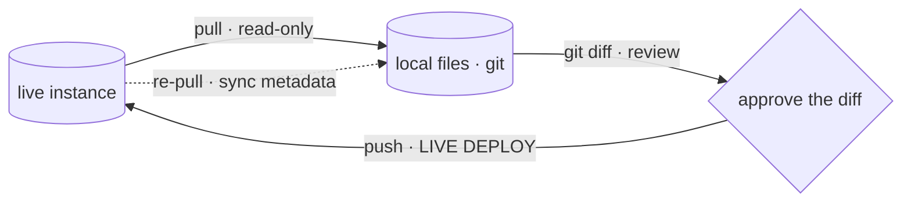

# 01 · SecOps as code

Operating Google SecOps (Chronicle SIEM) **as code** means the live instance is
not the source of truth your team edits by hand — a git repository is. Detection
rules, reference lists, data tables, dashboards, curated-rule-set deployment
state, feeds, and parsers all live as plain files under version control. You
change the files, review the change as a diff, and deploy the diff. The UI
becomes a viewer and an emergency console, not the primary editor.

`secopsctl` is the CLI that implements this loop for **any** tenant. It is
config-driven (see [02-architecture-client.md](02-architecture-client.md)) and
has no tenant identifiers baked in.

## The core loop

| Step | What it does | Side effect |
|---|---|---|
| **pull** | read the live instance, write local files | read-only against the instance; **overwrites local files** — commit WIP first |
| **review** | `git diff` shows live-vs-edit; the audit trail and the gate | none — a reviewer approves a diff, not a vibe |
| **push** | apply the reviewed change to the live instance | **every `push` is a production deploy to a live SIEM** |
| **re-pull** | pull the affected entity again after a mutation | syncs companion metadata (server IDs, `etag`, deployment state) to live |

See [03-yara-l-rules.md](03-yara-l-rules.md) for what `push rules-create` /
`push rules-disable` actually mutate.

### `pull` is read-only; `push` is a deploy

This asymmetry drives every safety decision in the tool:

- **Reads parallelize freely.** Multiple operators (or agents) can `pull` and
  analyze concurrently — no read ever touches tenant state.
- **Writes must be serialized.** Never run two `push` operations against the same
  instance at once, and never let two people edit the same entity area without a
  fresh `pull` each. Concurrency on rules is guarded by `etag`
  ([02-architecture-client.md](02-architecture-client.md)); other entities are
  not, so coordinate.
- **`push` defaults to `--dry-run`.** Mutating subcommands print a `LIVE DEPLOY`
  banner and a dry-run preview first; nothing changes until you pass `--yes` (or
  confirm an interactive prompt). Run the preview, read it, then deploy.

## Pull before edit

Always refresh local state with the relevant `pull` *before* editing an entity,
unless you already pulled it this session. The UI is a live system: someone may
have edited a rule, toggled a curated rule set, or added a reference-list entry
out-of-band. Editing stale local files and pushing them silently clobbers that
work. `pull` → edit → `push` → re-`pull`; never edit blind.

## Done = deployed (and local mirrors live)

A change is not finished when the file is edited, and not finished when it is
committed. **Done means it landed in the live instance** — and the local files
were re-pulled so they mirror live. A committed-but-undeployed rule (whether the
change is rule *text* or deployment *state* like `enabled`/`alerting`) is not
done. When someone asks "is X live?", verify against the instance; do not infer
from git history. Approval still gates each push — "done = deployed" governs
*finishing* the work, never bypassing the review gate.

## What lives in the repo

| Entity | Local form | Deeper doc |
|---|---|---|
| Custom detection rules | `rules/<slug>.yaral` + `<slug>.yaml` | [03-yara-l-rules.md](03-yara-l-rules.md) |
| Reference lists | `reference_lists/<slug>.txt` + `<slug>.yaml` | [04-reference-lists-data-tables.md](04-reference-lists-data-tables.md) |
| Data tables | `data_tables/<slug>.csv` + `<slug>.yaml` | [04-reference-lists-data-tables.md](04-reference-lists-data-tables.md) |
| Dashboards | `dashboards/<slug>.json` | [06-dashboards.md](06-dashboards.md) |
| Curated rule-set state | `curated/deployments.yaml` | [05-curated-rules.md](05-curated-rules.md) |
| Full curated catalog | `curated/rules/<cat>/<set>/<rule>.{yaral,yaml}` | [05-curated-rules.md](05-curated-rules.md) |
| Feeds / parsers | `feeds/<slug>.yaml`, `parsers/<LOG_TYPE>.conf` | [08-feeds-parsers.md](08-feeds-parsers.md) |

Filenames are slugified display names; the authoritative server ID lives in the
companion YAML/JSON, not the filename. Why this matters for round-tripping and
renames is covered in [02-architecture-client.md](02-architecture-client.md).

> The standalone command groups carry product names (`search`, `curated`,
> `ti`, `lists`, `ingest`, `content-hub`, …), but the **mirror directory names and
> `pull`/`push` target args are unchanged** — `pull reference_lists`,
> `pull data_tables`, `pull curated`, `push feeds`, `push parsers`, and the rest
> still match the on-disk tree (`reference_lists/`, `data_tables/`, `curated/`,
> `feeds/`, `parsers/`).

## Operating discipline (the short version)

- **No push without review.** Always `--dry-run` first, show the preview, get a
  go, then `--yes`.
- **No secrets in the repo.** Auth comes from `gcloud` ADC or an env token; secret
  scalar fields are redacted on `pull`. See
  [08-feeds-parsers.md](08-feeds-parsers.md).
- **No hard-coded instance identifiers.** Everything tenant-specific is read from
  config ([02-architecture-client.md](02-architecture-client.md)).
- **Commit before you pull.** `pull` overwrites local files; an uncommitted edit
  is lost without warning.

For ad-hoc investigation that is *not* managed state — one-off UDM queries and
audit reports — see [07-udm-queries.md](07-udm-queries.md). The repo is for
state you intend to keep and deploy; queries are for looking around.
