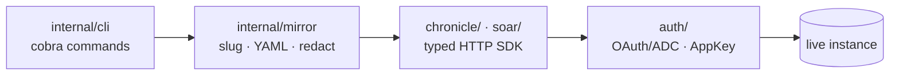
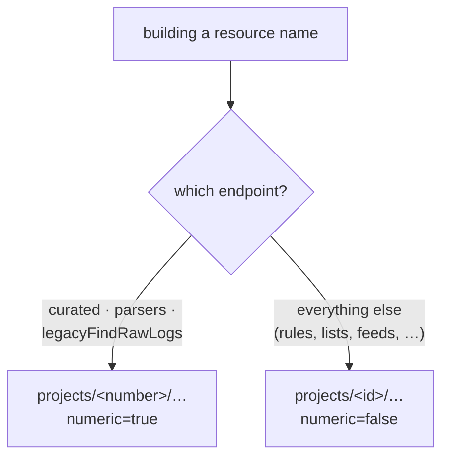
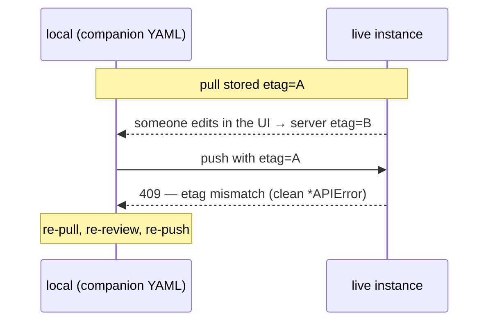

# 02 · Architecture & the client

`secopsctl` talks to one Chronicle (Google SecOps) instance, identified entirely
by a config file — no tenant data is compiled in. This doc covers how the SDK
client is built, the gotchas it works around, and how local files map back to
live resources. For the workflow these mechanics serve, see
[01-secops-as-code.md](01-secops-as-code.md); for the engine that drives the
loop, see the [architecture design doc](../design/architecture.md).

## Configuration is the only source of identity

The instance is described by a small YAML config with four required keys:

```yaml
project_id:      your-project-id
project_number: "000000000000"
region:          us
customer_id:     00000000-0000-0000-0000-000000000000
```

`base_url` defaults from `region` if omitted
(`https://<region>-chronicle.googleapis.com/v1alpha`). Config resolves in a fixed
order, highest priority first (a set env var overlays the file):

| # | Source |
|---|---|
| 1 | real `SECOPS_*` env vars (`SECOPS_PROJECT_ID`, `SECOPS_REGION`, …) — no `.env` is read |
| 2 | the file at `--config` / `$SECOPSCTL_CONFIG` |
| 3 | `~/.secopsctl/instance.yaml` (the default `secopsctl config` writes, `0600`) |
| 4 | `./config/instance.yaml` (legacy) |
| 5 | `~/.config/secopsctl/instance.yaml` |

Nothing reads identifiers from anywhere else — there are no hard-coded project
numbers or customer IDs in the code (`config.Load` → `chronicle.Settings` is the
only path). Copy `config/instance.example.yaml` (placeholders only) to start.

## The SDK is pure; the CLI does the file I/O

Two layers, kept apart on purpose:

| Layer | Package | Responsibility |
|---|---|---|
| **SDK** | `chronicle/` (SIEM), `soar/` (SOAR) | HTTP only — typed structs in/out, auth, pagination, retries, etag. **No disk I/O.** |
| **Mirror / CLI** | `internal/mirror`, `internal/cli` | slugging, deterministic YAML, redaction, the cobra command tree |

The SDK is importable on its own (module `danny.vn/secops`). All on-disk layout,
filename slugging, YAML formatting, and secret redaction live in `internal/mirror`
— never in the SDK.



## Auth is split and lazy

Two credential kinds, resolved on the **first request** — never at construction,
so `--help`, `info`, and offline tests never touch the network or `gcloud`:

| Plane | Host | Auth | Source |
|---|---|---|---|
| **SIEM** | `<region>-chronicle.googleapis.com` | OAuth2 / ADC | `SECOPS_ACCESS_TOKEN`, else ADC (`GOOGLE_APPLICATION_CREDENTIALS` or `gcloud auth application-default login`) |
| **SOAR** | `<tenant>.siemplify-soar.com` | AppKey | `soar_app_key` in the `0600` config, or `$SECOPS_SOAR_APP_KEY` |

The SIEM token is **minted in-process** by the Google auth library and
auto-refreshed — there is no `gcloud` shell-out and the OAuth token is **never
written to disk**. `SECOPS_ACCESS_TOKEN` overrides everything (CI / break-glass).
No service-account JSON in the repo, ever.

## The numeric-vs-string project gotcha

The single most surprising thing about the Chronicle REST API: different
endpoints build the resource `name:` with either the project **ID** (a string
like `your-project-id`) or the project **number** (digits like `"000000000000"`).
There is no way to know which from the docs alone — it is learned per endpoint
and encoded explicitly in the SDK.

| Project form | Endpoint families |
|---|---|
| **number** (`numeric=true`) | curated rule-set categories · curated rule sets · parsers (`logTypes/*/parsers`) · legacy raw-log lookup (`legacyFindRawLogs`) |
| **ID** (`numeric=false`) | rules · reference lists · data tables · feeds · native dashboards · curated rule-set deployments · featured content rules · UDM search |

`instancePath(numeric)` / `resourcePath(sub, numeric)` in
`chronicle/resource.go` make the required form **explicit per endpoint** — the
caller passes the correct bool; the SDK never guesses.



**Deviation from the official Python wrapper:** it often discovers the right form
by issuing a call, catching a `404`, and retrying the other form. This SDK does
**not** 404-then-retry — it pins the form per endpoint and exposes
`chronicle.IsNotFound` for the rare genuine fallback. If you add an endpoint,
verify the form against the upstream rather than guessing.

## etag — optimistic concurrency

Chronicle returns an `etag` on every mutable resource. `pull` stores it in the
companion YAML; every `push` round-trips the stored `etag` back to the server.



That rejection is a *feature* — surfaced as a clean typed `*APIError`, never a
silent overwrite of a concurrent edit. Honoring `etag` is how the
pull-before-edit rule in [01-secops-as-code.md](01-secops-as-code.md) is enforced
at the API level. Not every entity carries a local `etag` (cases and playbooks,
for instance — see [09-soar-operations.md](09-soar-operations.md)); for those,
coordination is manual.

## Slug filenames vs. server IDs

The server identity for a rule is a UUID-ish string (e.g. `ru_<uuid>`); for a
human the obvious handle is the display name. `secopsctl` writes files named with
the **slugified display name** and stashes the real server ID (`rule_id`,
dashboard name, etc.) plus the `etag` in the companion YAML/JSON.

- **Pro:** filenames diff cleanly in git and are easy to find by name.
- **Con:** renaming a rule's display name changes its slug, which on push looks
  like *delete the old + create the new*. So **don't rename slug files casually**
  — rename only when you genuinely intend to rename the live entity, and expect a
  delete-and-recreate. Never rely on the filename alone to round-trip a resource;
  the companion YAML holds the truth. (Slugifying lowercases, replaces
  non-alphanumerics with hyphens, and collapses runs.)

Matching local↔live is by **server ID, never by slug**, so non-unique display
names and rotating UUIDs are handled. Entity-specific conventions build on this:
rules in [03-yara-l-rules.md](03-yara-l-rules.md), reference lists and data tables
in [04-reference-lists-data-tables.md](04-reference-lists-data-tables.md), curated
rules in [05-curated-rules.md](05-curated-rules.md).

## Optional: forcing IPv4 on broken-IPv6 VPNs

Some corporate VPNs and Context-Aware-Access setups have unreliable IPv6 routing
to `*.googleapis.com`, which shows up as intermittent ADC reauth prompts and
connection resets. `secopsctl` ships an opt-in workaround: `IPv4DialContext`
(`auth/net.go`) installs a dialer that rewrites `tcp`/`tcp6` to `tcp4`, applied to
the API transports **and** the in-process token-minting calls.

It is **off by default.** It activates when either the config `force_ipv4: true`
or `SECOPS_FORCE_IPV4` is truthy (`1`, `true`, or `yes`). On a healthy network you
never need it — IPv6 is correct and preferable; on a VPN where googleapis.com over
IPv6 hangs, turn it on and the problem disappears.
