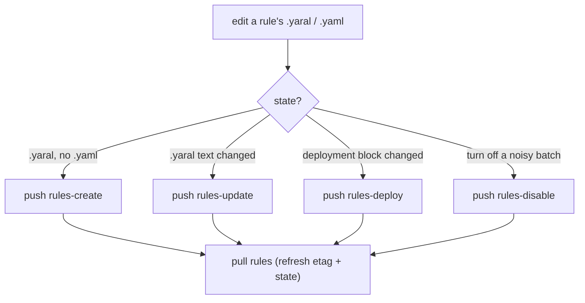

# 03 · YARA-L detection rules

Custom detections are written in **YARA-L 2.0** and tracked as code. This doc
covers the file layout, the read-only metadata contract, conventions for writing
rules, and the four guarded push paths.

For the surrounding loop see [01-secops-as-code.md](01-secops-as-code.md); for how
`etag` and slugs work see [02-architecture-client.md](02-architecture-client.md).

## One `.yaral` + one companion `.yaml`

Each rule is two files sharing a slug stem:

```
rules/<slug>.yaral   # the YARA-L 2.0 rule text — this is what you edit
rules/<slug>.yaml    # metadata + deployment state — mostly written by pull
```

The `.yaral` is the source of truth for detection *logic*. The companion `.yaml`
carries metadata and live deployment state:

```yaml
display_name: My Suspicious Login Rule
rule_id:      ru_xxxxxxxx-...            # server identity — READ-ONLY (set by pull)
name:         projects/.../rules/ru_...  # full resource path — READ-ONLY
etag:         "..."                      # optimistic-concurrency token — READ-ONLY
type:         SINGLE_EVENT
severity:     High
allowed_run_frequencies: [LIVE, HOURLY, DAILY]
time_window_duration: 3600s
deployment:                              # live deployment state
  enabled:   true
  alerting:  true
  runFrequency: LIVE
```

The read-only fields are populated by `pull` and you never hand-write them:

| Field | Why read-only |
|---|---|
| `rule_id` | server identity; touching it breaks round-tripping |
| `name` | full resource path derived from `rule_id` |
| `etag` | optimistic-concurrency token; guards concurrent edits |

Edit detection logic in the `.yaral`. Leave the companion `.yaml` alone except
where you deliberately intend a deployment-state change a push subcommand reads
(`deployment.enabled` / `alerting` / `runFrequency`).

## Writing a rule: conventions

- **Naming.** Adopt one house convention for rule display names (a consistent
  prefix or PascalCase scheme) so custom rules read as distinct from curated ones
  in the UI. Be consistent across the whole `rules/` directory.
- **Severity lives in `meta`.** Set severity in the YARA-L `meta` block, *not* in
  the companion YAML. The YAML `severity` is a pull-time reflection of what the
  server parsed from the rule; the rule text is authoritative.
- **A useful `meta` block** typically carries `author`, `severity`, `priority`,
  `rule_owner`, `data_source`, and MITRE `mitre_tactic` / `mitre_technique`. These
  travel with the rule and surface in the UI and in alerts.
- **Match identity on a full, normalized field** such as
  `principal.user.email_addresses` (a complete email) rather than a bare `userid`
  substring — fewer false matches, fewer surprises.
- **Filter on the field that actually carries the signal**, verified against live
  data. A rule that filters on a vendor tag, log type, or field your events don't
  populate compiles cleanly and then *silently never fires*. Validate the field
  shape with a UDM query first — see [07-udm-queries.md](07-udm-queries.md). A
  vendor-emitted severity level is usually a poor sole filter; the event-type /
  category field generally gives far better signal-to-noise.

### Single-event vs. aggregation rules

| Kind | `match` section | Runs `LIVE`? |
|---|---|---|
| Single-event | none — evaluates one event at a time | yes (immediate) |
| Aggregation | present — threshold/correlation over a window | no — API downgrades to `HOURLY` |

Pick the run frequency the rule actually supports; `allowed_run_frequencies` in
the companion YAML tells you what the server will accept.

Aggregation (`N events from one source in M minutes`) is the tool for taming
bursty, low-value-per-event streams: a "fire on every CRITICAL vendor event" rule
drowns in background-scan noise, whereas splitting by event-type category — alert
only on true threat categories, demote informational ones to dashboards — turns
the same data into actionable signal.

## The four push paths

`pull rules` writes the local mirror; four guarded `push` targets deploy it back.
All default to dry-run and require `--yes` (or an interactive `y/N`) to mutate.



| Target | Acts on | Live call | Notes |
|---|---|---|---|
| `rules-create` | a `.yaral` with **no** companion `.yaml` | `CreateRule(text)` then optional deployment | the new-rule path |
| `rules-update` | tracked rules whose `.yaral` text drifted from live | `UpdateRule(id, text, etag)` | etag-guarded; validates first |
| `rules-deploy` | tracked rules whose `deployment` block drifted from live | `UpdateRuleDeployment(id, …)` | deployment state as code; `--rule` scopes one rule |
| `rules-disable` | tracked rules with `deployment.enabled: true` | `UpdateRuleDeployment(id, enabled=false)` | fast "turn off this batch"; alerting + frequency preserved |

Common flags: `--dry-run` (preview only — the effective default), `--yes` (apply
for real), `--rules-dir DIR` (override the default `<dataRoot>/rules`).

```
secopsctl push rules-create  [--dry-run | --yes]   # new .yaral → live rule
secopsctl push rules-update  [--dry-run | --yes]   # changed text → new version
secopsctl push rules-deploy  [--dry-run | --yes]   # reconcile enabled/alerting/freq
secopsctl push rules-deploy --rule <rule-id-or-slug> --dry-run
secopsctl push rules-disable [--dry-run | --yes]   # disable enabled tracked rules
```

A rule is "new" when its `.yaral` exists with no companion `.yaml` — no `rule_id`
yet, so it cannot already exist server-side. So to add a rule, write only the
`.yaral` and `push rules-create`; the companion `.yaml` materializes on the next
`pull`. `rules-update` and `rules-deploy` are the steady-state paths for changing
text and deployment, respectively; `rules-disable` is the blunt batch-off.

## Every push path is guarded

`push` is dry-run unless `--yes` is given (and `--dry-run` always wins over
`--yes`). Each mutating subcommand prints a `LIVE DEPLOY` banner plus a preview of
exactly what it will create, update, deploy, or disable, and refuses to mutate
without `--yes` (or an interactive `y/N`). `rules-update` also validates the new
YARA-L (`ValidateRule`) before any mutation and aborts the whole batch if one rule
fails. Read the preview, confirm it is what you intend, then deploy.

The `etag` in the companion YAML guards `rules-update` against clobbering a
concurrent UI edit — an out-of-band live change since the last pull is rejected on
etag mismatch rather than overwritten (see
[02-architecture-client.md](02-architecture-client.md)). After any mutation,
re-`pull rules` so the companion YAML reflects the new `etag` and deployment
state — done = deployed *and* local mirrors live
([01-secops-as-code.md](01-secops-as-code.md)).

## Custom rules vs. curated rules

The rules in `rules/` are *your* detections, fully editable. Google also ships a
large catalog of **curated** rules you cannot edit and that toggle only at the
rule-set level. When the curated catalog has a gap, or a curated rule won't fire
on your data shape, write a custom rule here to cover it.

That relationship — and why tracking the full curated catalog is worth it — is in
[05-curated-rules.md](05-curated-rules.md). Custom rules also lean on reference
lists and data tables for their lookups; see
[04-reference-lists-data-tables.md](04-reference-lists-data-tables.md).
