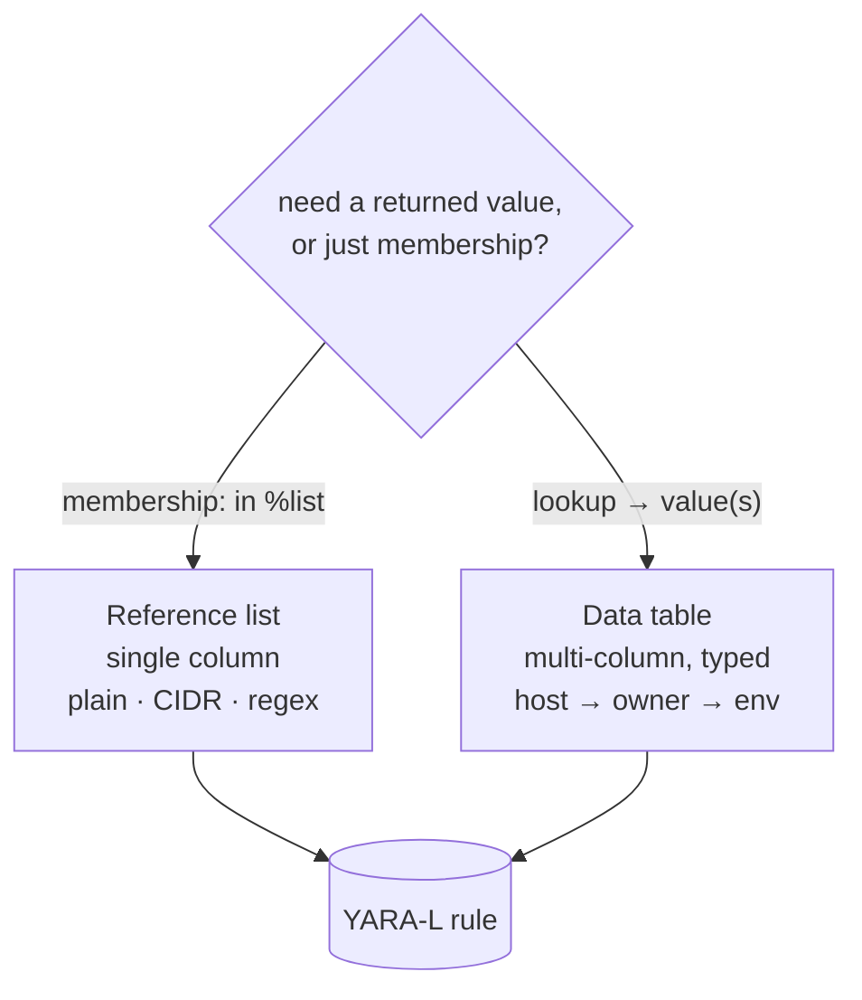

# 04 · Reference lists & data tables

Lookup structures your YARA-L rules ([03-yara-l-rules.md](03-yara-l-rules.md)) and
UDM queries ([07-udm-queries.md](07-udm-queries.md)) read against — allowlists,
known-IP ranges, asset inventories, enrichment tables. Both are tracked as code on
the same slug-file convention as everything else
([02-architecture-client.md](02-architecture-client.md)).

| | Shape | On disk | Rule uses it for |
|---|---|---|---|
| **Reference list** | one column of values | `<slug>.txt` + `<slug>.yaml` | membership test (`$ip in %list`) |
| **Data table** | multi-column, typed | `<slug>.csv` + `<slug>.yaml` | typed lookup / join (host → owner) |

## Reference lists

An ordered set of single-value entries referenced from a rule (e.g.
`$ip in %trusted_ranges`). Each list is two files:

```text
reference_lists/<slug>.txt    # one entry per line — the source of truth
reference_lists/<slug>.yaml   # metadata
```

The `.txt` is authoritative: **one entry per line, no commas, no quotes** — a plain
list, not CSV. The companion YAML records the metadata:

```yaml
display_name: Trusted Source Ranges
name:         projects/<project>/locations/<region>/instances/<instance>/referenceLists/<id>
description:  Internal egress CIDR ranges
syntax_type:  REFERENCE_LIST_SYNTAX_TYPE_CIDR
scope_info:   ...
entry_count:  12
```

### `syntax_type` must match the entries

The syntax type tells Chronicle how to interpret each line; entries must conform or
the list is invalid:

| `syntax_type` | Entry shape | Used for |
|---|---|---|
| `..._PLAIN_TEXT_STRING` | literal strings, one per line | exact-match allow/deny of names, IDs, hashes |
| `..._CIDR` | CIDR blocks (e.g. `10.0.0.0/8`) | IP-range membership tests in rules |
| `..._REGEX` | regular expressions, one per line | pattern matching against fields |

Pick the type for how the rule consumes the list — a CIDR list lets a rule test IP
membership directly, a regex list matches patterns, a plain list does exact string
membership. Mixing shapes (a hostname in a CIDR list) makes the list unusable.

### Editing a reference list

`pull reference_lists` writes the `.txt` (one line per entry) and the `.yaml` (with
the server-resolved `syntax_type` and `entry_count`). To change membership: edit the
`.txt`, keep one entry per line, push through your deploy flow. Pull-before-edit
applies as everywhere — a list someone grew in the UI is clobbered if you push stale
local lines ([01-secops-as-code.md](01-secops-as-code.md)).

Reference lists have no delete API. To neutralize a list without removing the
object, use the guarded helper:

```bash
secopsctl reference_lists empty <name> --dry-run
secopsctl reference_lists empty <name> --yes
```

The preview resolves the target and prints only the entry count. Re-pull
`reference_lists` after applying so the local `.txt` is empty too.

## Data tables

A multi-column, typed table — a small reference database a rule can join against.
Each table is two files:

```text
data_tables/<slug>.csv    # rows, with a header row from the column names
data_tables/<slug>.yaml   # column types + metadata
```

The CSV holds the rows; the YAML holds the schema:

```yaml
display_name: Asset Owners
name:         projects/<project>/locations/<region>/instances/<instance>/dataTables/<id>
description:  Host → owning team mapping
columns:
  - originalColumn: hostname
    columnType: STRING
  - originalColumn: owner
    columnType: STRING
row_count: 240
```

### Column types come from the YAML, not the CSV

Do **not** infer column types from CSV contents — the YAML `columns` block is
authoritative. The CSV header is written from the column names, but the *types* are
fixed in the YAML.

**Columns are immutable after create.** A `push` that changes the column structure
(type, name, or set of columns) does **not** silently rebuild the table — it
**errors**:

```text
data_tables: column structure of "<id>" changed; columns are immutable after
create (delete and recreate the table to change columns)
```

To change types, delete and recreate the table deliberately. Description and rows
update in place; only the column structure is locked.

### Keep row order stable

`pull data_tables` writes rows in the server-side order. **Preserve that order** when
you edit so `git diff` shows only the rows you actually changed, not a spurious
whole-table reshuffle — a clean diff is the entire point of reviewing before deploy.
The puller caps each table at **100,000 rows** to keep a runaway table from producing
an unbounded file; larger tables write the first 100,000 rows.

## When to use which



- **Reference list** — a single column of values you test membership against
  (`in %list`). Simple, fast, the right tool for allowlists and known-range sets.
- **Data table** — you need multiple correlated columns (a lookup that returns a
  value, e.g. host → owner → environment) and typed columns.

Both are referenced from rule logic; design the lookup structure alongside the rule
that consumes it ([03-yara-l-rules.md](03-yara-l-rules.md)). For lookups against
Google's managed detection content rather than your own, see
[05-curated-rules.md](05-curated-rules.md).
