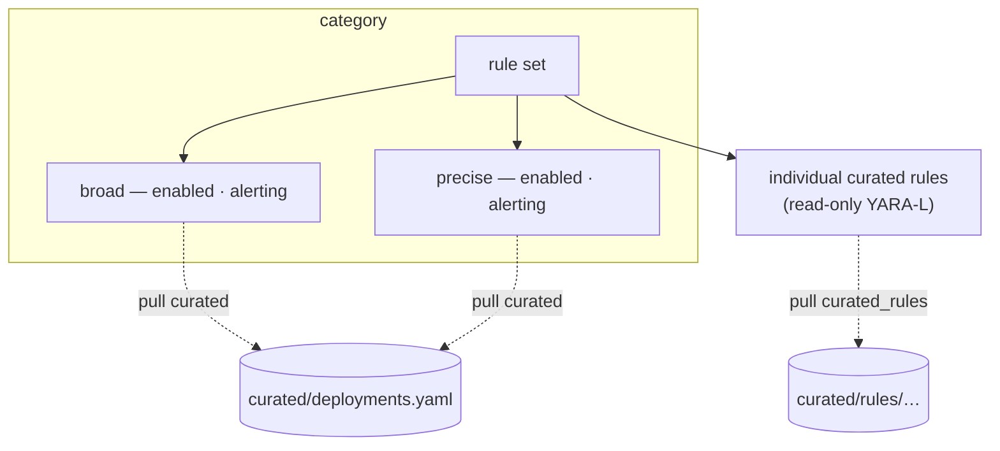

# 05 · Curated rules

Google ships a large catalog of **curated** detection content — rules authored and
maintained by Google/Mandiant that you **deploy but cannot edit**. They are a
different object from the custom rules you write
([03-yara-l-rules.md](03-yara-l-rules.md)), and `secopsctl` tracks them with **two
distinct pullers** because there are two distinct objects:

| Object | Puller | On disk |
|---|---|---|
| Rule-**set** deployment state (per-precision `enabled`/`alerting`) | `pull curated` | `curated/deployments.yaml` |
| The individual **rules** (YARA-L source + metadata) | `pull curated_rules` | `curated/rules/<category>/<rule_set>/<rule>.yaral` + `.yaml` |



## Two objects, two pullers

### 1. Rule-set deployment state — `pull curated`

Curated rules are organized into **rule sets**, grouped under **categories**. You do
not toggle individual curated rules; you toggle a **rule set**, and each rule set has
a per-**precision** switch — typically a `broad` pool and a `precise` pool — each with
its own `enabled` and `alerting` flags.

`pull curated` writes a single flat snapshot:

```
curated/deployments.yaml
```

shaped as categories → rule sets → per-precision `enabled` / `alerting`. It is built
from two calls:

- list the categories and their rule sets (`ListCuratedRuleSetCategories`, **numeric
  project** — see [02-architecture-client.md](02-architecture-client.md));
- list *all* deployments in one batched call (`ListCuratedRuleSetDeployments`).

The deployment resource name encodes the path
`.../curatedRuleSetCategories/<cat>/curatedRuleSets/<set>/curatedRuleSetDeployments/<precision>`,
parsed back into the category / set / precision keys.

### 2. The individual rules — `pull curated_rules`

This pulls the **full catalog** of curated rules — every rule's YARA-L source plus
metadata — laid out by category and rule set:

```
curated/rules/<category_slug>/<rule_set_slug>/<rule_slug>.yaral
curated/rules/<category_slug>/<rule_set_slug>/<rule_slug>.yaml
curated/rules/_index.yaml      # lookup + counts
```

## The Content Hub endpoint exposes `ruleText`

The key mechanic: the individual-rule source comes from the **Content Hub** featured
content rules endpoint (`ListFeaturedContentRules`, `contentHub/featuredContentRules`),
**not** a plain `/curatedRules` list. The plain list returns metadata only — no rule
logic. The Content Hub response gives you the goods:

| Field | What it carries |
|---|---|
| `ruleText` | the actual YARA-L source for most rules |
| `ruleTextHidden` | vendor-confidential rules arrive flagged with no text → the puller writes a **stub `.yaral`** noting the source is hidden, so the catalog is complete and diffable even where the logic is withheld |
| `liveStatusEnabled` / `alertingStatusEnabled` | per-rule status, so you can see what is actually firing |
| `ruleSet` + `categoryId` | rule-set / category linkage — how files bucket into `<category>/<rule_set>/` dirs |
| MITRE `tactics` / `techniques` | ATT&CK mapping (techniques kept as id + name) |
| `nonUpgradable` / `privateRule` | per-rule flags carried into the `.yaml` companion |

The endpoint paginates; **slug collisions** within a rule set (two rules sharing a
display name) are disambiguated by appending a short slice of the rule ID to the
filename.

### Filtering the pull

The full catalog is large. `pull curated_rules --filter EXPR` passes a filter
expression **straight through to the API**. Common forms (combine with `AND`):

```
category_name:"Cloud Threats"
policy_name:"<rule set display name>"
rule_precision:"Precise"
rule_id:"ur_..."
search_rule_name_or_description=~"<substring>"
```

Use a filter to pull just the slice you are evaluating instead of the whole catalog
every time. (`--filter` is only meaningful for `curated_rules`; other `pull` targets
ignore it.)

## Why track the whole catalog

It is verbose, but the value is real: **the diff between Google's detection logic and
your own coverage is exactly what you need when planning custom rules.** With the full
catalog in git you can:

- read what a curated rule actually filters on, and discover when it keys off a vendor
  tag / log type / field that *your* events do not populate — meaning it compiles but
  silently never fires. That gap is your cue to write a CI-native custom rule
  ([03-yara-l-rules.md](03-yara-l-rules.md)) that matches your real data shape,
  verified with a UDM query ([07-udm-queries.md](07-udm-queries.md)).
- decide, per threat, *rebuild vs. rely-on-curated*: if an enabled, compatible curated
  rule already covers a scenario, skip the custom; if the only match is incompatible or
  absent, build.
- diff the catalog over time to see what Google added, changed, or deprecated.

Don't trim the tracked catalog without a reason — the comparison is the point.

## Curated rules toggle only at the rule-set level

You **cannot edit a curated rule**, and there is **no per-rule on/off** — control is
at the rule set. Read and toggle from the CLI:

| Command | Effect |
|---|---|
| `curated list [--filter SUBSTR] [--json]` | 🔒 read — list deployments with `enabled`/`alerting` (filter is a case-insensitive substring on the rule-set display name) |
| `curated rules [--json]` | 🔒 read — list the individual Google-managed rules |
| `push curated [--dry-run\|--yes]` | ⚠️ guarded mutation — reconcile `curated/deployments.yaml` to live deployment flags |
| `curated set --category C --ruleset R --precision precise\|broad [--enabled[=bool]] [--alerting[=bool]]` | ⚠️ guarded mutation — flip one deployment's flags (`--dry-run` → review → `--yes`) |

Under the hood `set` calls `UpdateCuratedRuleSetDeployment`; `push curated` uses
`BatchUpdateCuratedRuleSetDeployments`, the atomic multi-deployment write primitive.
The individual-rule `.yaral` files are read-only reference material: read them to
understand and to plan, never to edit.

A practical consequence: when a curated rule set is noise-dominated for your
environment (e.g. rules with no principal-type filter firing on routine automation, or
an OS-specific rule matching the wrong platform), your options are to disable the rule
set at the precision level and, where the threat still matters, replace it with a
tightly-scoped custom rule. The deployment snapshot in `curated/deployments.yaml` is
your record of those decisions, reviewed as a diff like any other change
([01-secops-as-code.md](01-secops-as-code.md)).
