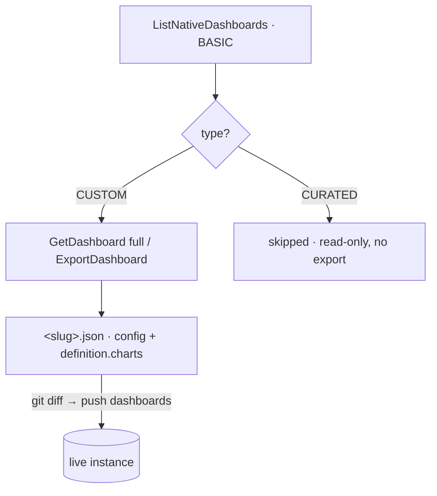

# 💡 06 · Native dashboards

Chronicle **native dashboards** (visualizations built on UDM/YARA-L data in the
SecOps UI) are tracked as JSON. Two things trip people up: *listing* a dashboard
is not *exporting* it, and **curated** content has no editable definition. For the
pull→review→push loop see [01-secops-as-code.md](01-secops-as-code.md); for client
mechanics see [02-architecture-client.md](02-architecture-client.md).

## Listing vs. full export

Two SDK operations, two very different costs:

| Operation | SDK | View | Returns |
|---|---|---|---|
| **List** | `ListNativeDashboards` | `BASIC` | Inventory only — server `name`, `displayName`, `type`. Fast, light. **No chart definitions.** |
| **Full export** | `ExportDashboard` / `GetDashboard(…, full=true)` | `FULL` | The complete definition — every chart, its UDM/YARA-L query, layout, filters. Heavier; per dashboard. |

A full export of every dashboard is large and slow, so the listing exists for the
common case: "what dashboards exist and who owns them." Export the specific
dashboards whose internals you need.

`secopsctl pull dashboards` does **not** stop at the listing — it pulls each
**CUSTOM** dashboard in `FULL` view so the snapshot round-trips back through
`secopsctl push dashboards`. **CURATED** dashboards are Google-managed with no
create/update path, so the reconcile surface **skips them entirely** (not pulled,
never planned for write). Reach for `ListNativeDashboards` directly when you want
the lightweight inventory including curated entries.

## Curated vs. custom

Dashboards come in two flavors, mirroring the rule story in
[05-curated-rules.md](05-curated-rules.md):

| Type | Origin | What you can do |
|---|---|---|
| **CURATED** | Google-managed, shipped with the product | View only. No export form; excluded from the managed surface. Treat as read-only reference. |
| **CUSTOM** (private / shared) | Built in your tenant | Real definition you can pull, version, and rebuild. The only flavor `pull`/`push dashboards` manages. |

Custom dashboards encode your team's operational views — track them closely.

## On-disk shape and push

`pull dashboards` writes one `<slug>.json` per CUSTOM dashboard: the canonical
config (`displayName`, `description`, `access`, `definition.{filters,charts}`)
plus a reserved `_server` identity block. Two things matter on push:

- **Charts replace wholesale.** `definition.charts` is sent as a unit on update,
  not merged — a dropped chart in the JSON drops it live. Review the dry-run.
- **`access` is immutable after create.** Changing `DASHBOARD_PRIVATE` ↔
  `DASHBOARD_PUBLIC` in the JSON is rejected; recreate to change visibility.

Volatile keys (`createUserId`, `updateUserId`, `dashboardUserData`) are stripped
from the diff basis, so per-user view state never shows up as a spurious change.

## Don't hand-edit the JSON

An export is large and noisy — nested chart specs, query strings, layout
coordinates, style blocks. **Don't hand-edit it unless you understand the
schema.** A malformed edit can break the dashboard on import or silently drop a
chart. Prefer one of:

- Build/adjust in the UI, then re-pull.
- Make narrow, well-understood programmatic edits.

Either way, review the `git diff` before any push — the JSON diff is the audit
trail. Always `--dry-run` first.

## Naming AI-built artifacts

If an automated agent **creates** a dashboard (or any entity) in the live
instance, give it a distinguishing display-name prefix — e.g. a bracketed tag
like `[Automation]` — so humans can tell agent-built from human-built at a
glance. Pick a convention and keep it consistent; this is operational hygiene,
not a tool requirement.

A rename is a display-name change. Remember from
[02-architecture-client.md](02-architecture-client.md): changing the display name
moves the slug, so treat a rename as an intentional act.
