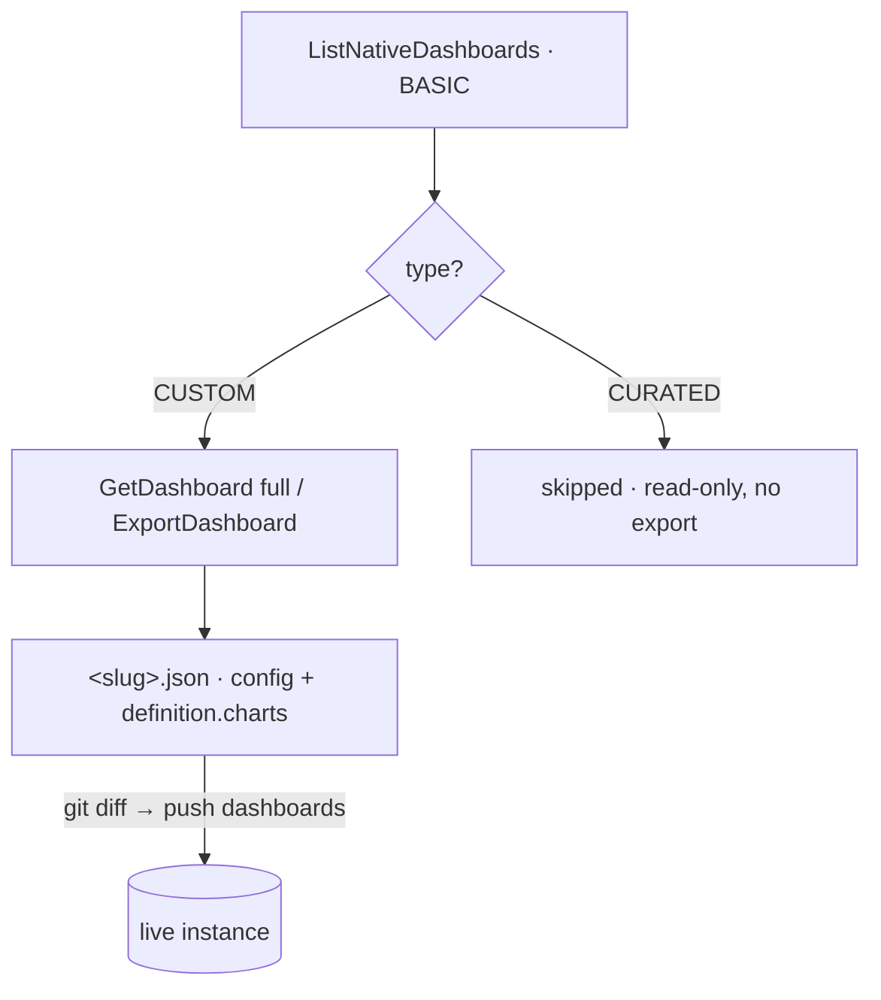

# 06 · Native dashboards

Chronicle **native dashboards** (visualizations built on UDM/YARA-L data in the
SecOps UI) are tracked as JSON. Two things trip people up: *listing* a dashboard
is not *exporting* it, and **curated** content has no editable definition. For the
pull→review→push loop see [01-secops-as-code.md](01-secops-as-code.md); for client
mechanics see [02-architecture-client.md](02-architecture-client.md).

## Listing vs. full export

Two SDK operations, two very different costs:

| Operation | SDK | View | Returns |
|---|---|---|---|
| **List** | `ListNativeDashboards` | `BASIC` | Inventory only — server `name`, `displayName`, `type`. Fast, light. **No chart definitions.** |
| **Full export** | `ExportDashboard` / `GetDashboard(…, full=true)` | `FULL` | The complete definition — chart references, layout, filters. Heavier; per dashboard. **The chart query bodies are not inlined:** each `definition.charts[]` entry references a separate chart resource (whose UDM/YARA-L query is a further `dashboardQuery` reference). Dereference with `GetChart`/`GetQuery` or `dashboards charts <id>`. |

A full export of every dashboard is large and slow, so the listing exists for the
common case: "what dashboards exist and who owns them." Export the specific
dashboards whose internals you need.

`secopsctl pull dashboards` does **not** stop at the listing — it pulls each
**CUSTOM** dashboard in `FULL` view so the snapshot round-trips back through
`secopsctl push dashboards`. **CURATED** dashboards are Google-managed with no
create/update path, so the reconcile surface **skips them entirely** (not pulled,
never planned for write). Reach for `ListNativeDashboards` directly when you want
the lightweight inventory including curated entries.

### Two pull modes: reference-only (default) vs `--with-charts`

A dashboard's `FULL` view returns its charts as **references** — `definition.charts[]`
names each chart's resource, but the YARA-L query is one hop further, in a separate
`dashboardQuery` resource. So there are two ways to pull:

- **`pull dashboards` (default)** keeps charts as references: each chart is its
  layout + filters + a reserved `_server.chart` id. Cheap (a handful of requests for
  the whole instance) and `drift`-deterministic. Use it for the everyday review loop.
- **`pull dashboards --with-charts`** dereferences every chart into its inline query
  (`title`, `query`, `interval`, `visualization`, …) so the dashboard round-trips with
  its YARA-L intact. Heavier — a `GetChart` + `GetQuery` per chart — and on a large
  instance it can hit the per-minute API quota; a chart that can't be fetched
  standalone (some `404`) or that hits the quota (`429`) **degrades to a reference**,
  so a pull never loses a dashboard. Re-pull to pick up a transiently-skipped chart.

`push` and `drift` adapt to whichever shape is on disk — an inline mirror has its live
side dereferenced to match, a reference-only mirror compares references — so you never
phantom-diff one shape against the other.



## Curated vs. custom

Dashboards come in two flavors, mirroring the rule story in
[05-curated-rules.md](05-curated-rules.md):

| Type | Origin | What you can do |
|---|---|---|
| **CURATED** | Google-managed, shipped with the product | View only. No export form; excluded from the managed surface. Treat as read-only reference. |
| **CUSTOM** (private / shared) | Built in your tenant | Real definition you can pull, version, and rebuild. The only flavor `pull`/`push dashboards` manages. |

Custom dashboards encode your team's operational views — track them closely.

## On-disk shape and push

`pull dashboards` writes one `<slug>.json` per CUSTOM dashboard: the canonical
config (`displayName`, `description`, `access`, `definition.{filters,charts}`)
plus a reserved `_server` identity block. Two things matter on push:

- **Charts replace wholesale, but reference-only.** `definition.charts` is sent
  as a unit on update, not merged — a dropped chart in the JSON drops it live —
  but each entry only *references* a chart by resource name; the YARA-L query is
  not in the dashboard body. So `push dashboards` re-points and re-lays-out
  existing charts; it **cannot author a chart's query**. Author queries with
  `dashboards add-chart` / `edit-chart` (below). Review the dry-run either way.
- **`access` is immutable after create.** Changing `DASHBOARD_PRIVATE` ↔
  `DASHBOARD_PUBLIC` in the JSON is rejected. To change visibility, copy the
  dashboard into a new one with the desired access:
  `secopsctl dashboards duplicate <id> --name <new> --access DASHBOARD_PUBLIC`
  (guarded; re-pull afterwards). By default this uses the server **`:duplicate`**
  verb (`DuplicateDashboard`) — the same path the web console's Duplicate action
  takes — which mints the copy its **own independent charts and queries** in a
  single call (the copy shares no chart or query id with the source).
  `--deep-copy` selects a client-side fallback that recreates each chart fresh via
  `AddChart` (also fully independent) for when the server-side copy is unavailable.
- **No dashboard-level etag.** A dashboard carries no top-level `etag`, so a
  `push dashboards` cannot detect a concurrent live edit of dashboard-level fields
  (`displayName`, `description`, `definition.{filters,charts}`) — it overwrites
  with whatever is on disk. The only dashboard-level guard is `--dry-run` plus a
  fresh `pull dashboards` immediately before you edit. (Individual chart and query
  updates *do* round-trip per-element etags; the dashboard envelope does not.)

Volatile keys (`createUserId`, `updateUserId`, `dashboardUserData`) are stripped
from the diff basis, so per-user view state never shows up as a spurious change.

## Authoring charts and queries

A chart spans three resources: the dashboard references a **chart**, and the
chart references a **query** (the YARA-L). Because the query never lives in the
dashboard body, it is authored with dedicated chart verbs, not `push dashboards`:

- `dashboards add-chart <id> --title <t> --query <yaral>` (or `--query-file <f>`)
  adds a chart and its query in one call (`:addChart`). Layout, datasource,
  interval, and tile type default sensibly; override with `--layout` /
  `--datasource` / `--interval` / `--tile-type`. **Layout is a 96-column grid** —
  `chartLayout` is `{startX, spanX, startY, spanY}` where `startX`/`spanX` range
  over `0–96` (full width is `spanX: 96`, half is `48`); `add-chart` defaults to a
  full-width chart at the standard row height.
- `dashboards edit-chart <id> --chart-id <c>` edits a chart **in place** —
  `--query`/`--query-file` (the YARA-L), `--visualization`/`--chart-type` (the
  chart type), and/or `--layout` (the grid position) — so changing a chart's type
  or position no longer needs a remove + re-add that churns its id and order. The
  query and visualization edits go through `:editChart` (etag-guarded); `--layout`
  goes through the dashboard's `definition.charts` (chart layout is not an
  `:editChart` field), preserving every other chart.
- `dashboards remove-chart <id> --chart-id <c>` removes a chart (`:removeChart`).
- `dashboards charts <id>` lists every chart with its resolved query (read-only;
  `--json` for the full list) — the way to recover a `--chart-id` or review what
  a dashboard actually runs.

The mutating verbs are guarded: dry-run by default, `--yes` to apply. Re-`pull
dashboards` afterwards so the local mirror matches live.

### Typed charts without hand-writing the visualization

`--visualization` is a raw passthrough to the chart's echarts-style object, where
the `encode` variable names must match the query's `match:`/`outcome:` variables
(without `$`) — a mismatch renders a silent blank chart. Instead of hand-authoring
it, pass `--chart-type`:

- `add-chart`/`edit-chart --chart-type bar|line|pie|table --x <var> --y <var>
  [--series-by <var>]` **generates** the visualization and **validates** the encode
  variables against the query's columns — both `outcome:` `$vars` AND bare `match:`
  field references — so a typo fails clean up front, not as a blank chart. A pie uses
  `itemName`/`value`; `--series-by` produces a stacked bar/line; `table` carries no
  visualization.

A chart query is an AGGREGATION (stats) query: the `match:` section groups by a
field, the `outcome:` computes the value. Check the syntax with `search validate`,
confirm it returns data with `search stats` (`search udm` rejects an aggregation),
then map `--x`/`--y` to those columns:

```bash
# 1. validate the aggregation returns data
secopsctl search stats --hours 24 'metadata.event_type = "USER_LOGIN"
match:
  principal.hostname
outcome:
  $count = count(metadata.id)
order:
  $count desc'

# 2. author a bar chart — --x is the match field, --y the outcome var (no $)
secopsctl dashboards add-chart <dashboard-id> --title "Logins by host" \
  --chart-type bar --x principal.hostname --y count \
  --query 'metadata.event_type = "USER_LOGIN"
match:
  principal.hostname
outcome:
  $count = count(metadata.id)
order:
  $count desc' --yes

# 3. confirm it renders data
secopsctl dashboards run-chart <dashboard-id> --chart-id <chart-id>
```

### Building many charts at once

- `dashboards add-charts <id> --file <charts.json>` authors a whole dashboard's
  charts from a JSON array in one guarded run. It is validated up front, **paced**
  (`--pace`, default 1s) to stay under the per-minute chart quota, and **idempotent**
  — a chart whose title already exists is skipped, so a re-run after a partial
  failure converges instead of duplicating. `add-chart --if-absent` is the
  single-chart equivalent.

### Verifying what a chart renders

Authoring is only half the loop — these read back the **values** a chart produces
(`dashboardQueries:execute`), so a blank or errored chart is caught from the CLI/CI
instead of the UI:

- `dashboards run-chart <id> --chart-id <c>` (alias `values`) executes the chart's
  query and prints the computed rows/series (`--json` raw, `--clear-cache`,
  `--filter`).
- `dashboards verify <id>` executes **every** chart and flags the ones returning an
  error or 0 rows — a headless dashboard health check that exits non-zero when any
  chart needs attention.
- `search stats '<aggregation YARA-L>'` runs a `match:`/`outcome:` aggregation
  (which `search udm` rejects) and prints the result table — validate a chart's
  stats query before authoring it ([07-udm-queries.md](07-udm-queries.md)).

## Don't hand-edit the JSON

An export is large and noisy — nested chart specs, query strings, layout
coordinates, style blocks. **Don't hand-edit it unless you understand the
schema.** A malformed edit can break the dashboard on import or silently drop a
chart. Prefer one of:

- Build/adjust in the UI, then re-pull.
- Make narrow, well-understood programmatic edits.

Either way, review the `git diff` before any push — the JSON diff is the audit
trail. Always `--dry-run` first.

## Naming AI-built artifacts

If an automated agent **creates** a dashboard (or any entity) in the live
instance, give it a distinguishing display-name prefix — e.g. a bracketed tag
like `[Automation]` — so humans can tell agent-built from human-built at a
glance. Pick a convention and keep it consistent; this is operational hygiene,
not a tool requirement.

A rename is a display-name change. Remember from
[02-architecture-client.md](02-architecture-client.md): changing the display name
moves the slug, so treat a rename as an intentional act.
