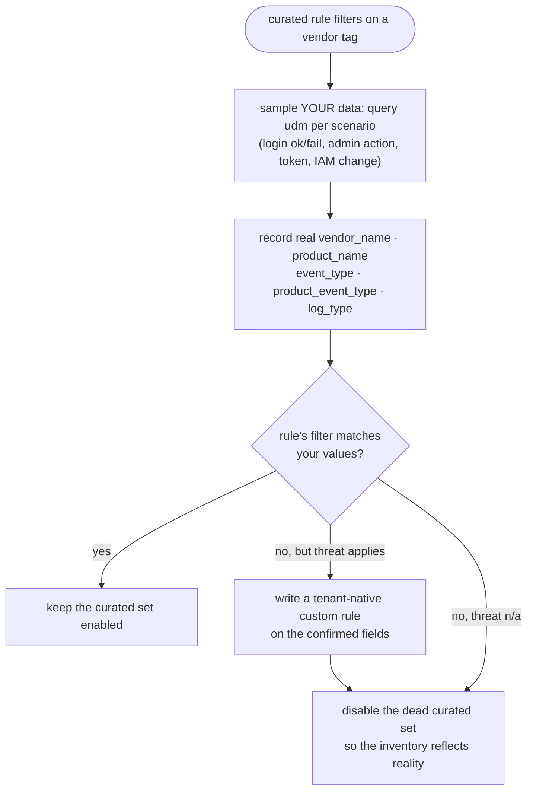

# 07 · UDM queries

UDM (Unified Data Model) is Chronicle's normalized event schema. A UDM query is a
filter expression over normalized fields like `metadata.event_type`,
`principal.user.userid`, and `target.application`. `secopsctl` runs ad-hoc UDM
searches via `query udm`.

Ad-hoc queries are for *looking around* — they are **not** managed state. For the
repo-as-source-of-truth loop see [01-secops-as-code.md](01-secops-as-code.md). The
one lesson that matters most here: before you trust any rule that filters on a
vendor tag, **verify those field values in your own data** (below).

## Running a query

```bash
secopsctl query udm 'metadata.event_type = "USER_LOGIN"' --hours 24
secopsctl query udm "$(cat examples/queries/login-failure.udm)" --hours 48 --json
secopsctl query udm '<filter>' --from 2026-01-01T00:00:00Z --to 2026-01-02T00:00:00Z
```

| Flag | Default | Effect |
|---|---|---|
| `--hours N` | `24` | Relative look-back window ending now (used only when `--from` is unset). |
| `--from` / `--to` | now − hours / now | Absolute window (RFC3339 / ISO-8601); `--from` overrides `--hours`. |
| `--limit N` | `10000` | Caps results; a truncation warning goes to **stderr** so `--json` stays pipe-clean. |
| `--json` | off | Machine-readable output — handy for agents (see [10-llm-and-automation.md](10-llm-and-automation.md)). |

`.udm` files in [`examples/queries/`](../../examples/queries/) hold one filter each,
with `#`-prefixed comment lines. The loader strips the comments, so documentation
can live inline with the filter.

## Useful field anchors

A few fields do most of the work in detection and triage queries.

| Field | What it holds |
|---|---|
| `metadata.event_type` | Normalized event class (`USER_LOGIN`, `USER_CHANGE_PERMISSIONS`, `USER_CREATION`, `USER_RESOURCE_UPDATE_PERMISSIONS`, …). |
| `metadata.product_event_type` | The **vendor's** native operation name (e.g. `SetIamPolicy`, a token-issuance op). More precise than `event_type`. |
| `metadata.vendor_name` / `metadata.product_name` | Source product tags. **The dangerous ones to assume — see the warning below.** |
| `metadata.log_type` | Ingestion log type (which parser/feed produced the event). Often the most reliable discriminator. |
| `security_result.action` | `ALLOW` / `BLOCK` — pairs with `event_type` to split success vs. failure. |
| `principal.user.userid`, `principal.ip`, `target.application` | The actor, source IP, and acted-on app. |

Common shapes (tenant-neutral; see the examples directory for the full files):

```text
# Successful logins
metadata.event_type = "USER_LOGIN" AND security_result.action = "ALLOW"

# Failed logins (group by principal.user.userid in the UI to spot spray)
metadata.event_type = "USER_LOGIN" AND security_result.action = "BLOCK"

# IAM policy change
metadata.event_type = "USER_RESOURCE_UPDATE_PERMISSIONS"
AND metadata.product_event_type = "SetIamPolicy"
```

## ⚠️ The important lesson: verify vendor/log tags in YOUR data

> **Before trusting any curated (or third-party) rule that filters on a vendor tag
> like `metadata.vendor_name = "<Some Product>"`, confirm your events actually carry
> that exact value.** Sample your own data with a UDM query. A rule whose vendor
> filter never matches **silently never fires** — no error, no alert, no log line.
> It looks enabled and does nothing.

This is easy to hit: you enable a vendor's curated rule set whose display names
describe exactly the threat you care about, while every rule in it filters on a
`vendor_name`/`product_name` your ingestion never emits — because you license a
*different but adjacent* product, or your logs arrive through a connector that
normalizes to a different tag.

### A worked, generalized example

An org enables a curated rule set built for **Product A** (a full
productivity/collaboration suite) but actually runs only the **identity tier** of
that vendor's stack. The identity events flow in through the cloud-audit-log
pipeline and normalize with:

- `metadata.vendor_name = "<Cloud Platform vendor>"`
- `metadata.log_type   = "<CLOUD_AUDIT log type>"`

They are **never** tagged `metadata.vendor_name = "<Product A>"`. So every curated
rule that begins `metadata.vendor_name = "<Product A>"` matches zero events. The
dashboard shows the rules enabled; detection coverage for that surface is nil.

The remedy, end to end:



1. **Discover the true shape.** Run UDM queries per scenario (login success, login
   failure, admin action, token issuance, IAM change) and record the actual
   `vendor_name`, `product_name`, `event_type`, `product_event_type`, and `log_type`
   your events carry. Trap: a `product_name` can be a *legacy* label for one event
   class and a different label for another, so it is a poor discriminator — prefer
   `product_event_type` and `log_type`.
2. **Build a compatibility view.** For each curated rule you rely on, check whether
   its filters align with your real values:

   | Filter the curated rule uses | Fires on your data? |
   |---|---|
   | `vendor_name = "<a vendor you actually emit>"` | Yes |
   | `vendor_name = "<a vendor you never emit>"` | **No — silent** |
   | `log_type = "<a log type you ingest>"` | Yes |
   | `product_name = "<an app/service you don't license>"` | **No** |

   Where a rule won't fire but the *threat scenario still applies to events you do
   have*, write a tenant-native custom rule on the fields you confirmed (see
   [03-yara-l-rules.md](03-yara-l-rules.md)), then disable the dead curated set.

### Don't hand-edit curated rules to fix this

You cannot edit curated rules to swap the vendor filter — they are Google-managed
and only *toggleable* at the rule-set level ([05-curated-rules.md](05-curated-rules.md)).
The remedy is always: confirm with UDM, replace with a custom rule on the real
fields, disable the dead set.

## Saving reusable queries

Keep proven filters as `.udm` files (one filter + a `#` docstring) so they are
diffable and re-runnable. A small library — "who logged in, from where," "failed
logins by user," "admin actions," "IAM changes," "token issuance" — pays for itself
every investigation and doubles as the verification toolkit for the lesson above.
Treat these as ad-hoc tooling, distinct from the managed rule/list/table state the
repo deploys.
