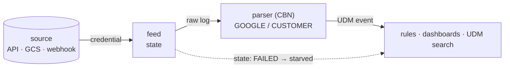

# 💡 08 · Feeds & parsers

Detection is only as good as ingestion. **Feeds** bring raw logs into SecOps;
**parsers** normalize those raw logs into UDM. This doc covers tracking both as
code: the ingest-health check that catches most "why isn't this alerting?"
problems, the rule that secrets never enter the repo, and the practical notes on
parser files.

For the overall loop see [01-secops-as-code.md](01-secops-as-code.md); for how a
broken vendor tag silently kills detection *downstream* of ingestion, see
[07-udm-queries.md](07-udm-queries.md).



## Feeds

A feed is one ingestion source: an API poller, a cloud-storage bucket, a webhook,
etc. `secopsctl pull feeds` writes one YAML per feed capturing:

| Field | What it carries |
|---|---|
| `display_name`, `name`, `uid` | identity and server resource name |
| `source_type` | `API`, `GOOGLE_CLOUD_STORAGE`, … |
| `log_type`, `asset_namespace`, `labels` | routing and tagging |
| `settings` | source-specific config (secrets redacted) |
| `state` | `ACTIVE` · `RUNNING` · `FAILED` · `EMPTY` … |
| `failure_msg`, `failure_details` | why a `FAILED` feed is down |

### `state: FAILED` is the first ingest-health check

When detection looks wrong — a rule that should fire is silent, a dashboard goes
flat, an investigation finds no events — **check feed `state` before anything
else.** A feed in `state: FAILED` is not ingesting; everything downstream of it
(parsers, UDM, rules, dashboards) is starved of data, with no error at the
detection layer to tell you so.

```bash
secopsctl pull feeds
# the summary line tallies state, e.g. (state: {'ACTIVE': 3, 'FAILED': 1})
# then scan the pulled YAML for any feed whose state is FAILED
```

A failed feed usually carries a `failure_msg`. The most common is a credential
problem — an expired key, a rotated password, a revoked token → an auth/login
failure on the source side. Those are fixed **at the source or in the SecOps UI
feed config**, not by editing the repo YAML: the YAML mirrors live state; it is
not where credentials live (see next section).

> Make "`pull feeds` and grep for `FAILED`" a routine health check, not just a
> break-glass step.

### Secrets never live in the repo

Feed configs reference credentials, but **the credentials themselves never get
committed.** On `pull`, secret scalar fields are **redacted** with
`***REDACTED***` before the YAML is written — keys such as `password`, `secret`,
`apiKey`, `token`, `clientSecret`, `privateKey`, `authToken`, and
`secretAccessKey` (and their `snake_case` forms) come back masked. This means:

- A pulled feed YAML is safe to commit and review; it shows the *shape* of the
  config, not the secret values.
- When a feed-push path exists, the real secret must be supplied at push time
  from a secret store or environment variable — **never** read back from the
  committed YAML (which only holds the redaction marker). Pushing the marker
  would clobber the live credential.

Same discipline as everywhere else in the tool: auth comes from ADC or an env
token, and no API key, password, or service-account JSON belongs in version
control.

## Parsers

A parser turns a raw log line for a given log type into UDM. `secopsctl pull
parsers` writes the active parser source per log type **in use** — the puller
derives the set from your feeds' log types, so there's no point tracking parsers
for log types you don't ingest. Two files per log type:

| File | Contents |
|---|---|
| `parsers/<LOG_TYPE>.conf` | parser source (CBN — "Configuration-Based Normalization", the parser language), base64-decoded to plain text |
| `parsers/<LOG_TYPE>.yaml` | metadata: `parser_id`, `version`, `creator_source`, `state`, `release_stage`, `type`, `inactive_parser_count` |

### Prebuilt (Google-managed) vs. custom

The `creator_source` / `type` in the metadata tells you who owns the parser:

| `creator_source` | `type` | Meaning |
|---|---|---|
| `GOOGLE` | `PREBUILT` | Google maintains it. Track it to *see* what normalization you rely on; you generally don't edit these. |
| `CUSTOMER` | (custom) | Your tenant wrote/overrode it. **This is the file you edit and push** when normalization needs to change. |

If a field your rules depend on isn't populated in UDM, the parser is where you
look — but only a `CUSTOMER` parser is yours to change. For a prebuilt parser
that's mis-mapping, the fix is a parser override / extension, not editing
Google's source in place.

### Large files — grep, don't open

Parser `.conf` files for high-volume log types can be **huge** (tens of
thousands of lines / multiple megabytes). **Grep them; don't open them casually**
in an editor or read them whole into a tool — it's slow and rarely what you want.
Search for the specific field mapping, log key, or UDM target you care about:

```bash
grep -n "principal.user.userid" parsers/<LOG_TYPE>.conf
grep -n "event_type"            parsers/<LOG_TYPE>.conf
```

Find the relevant block, understand the surrounding context, and make the
narrowest change. As with dashboards ([06-dashboards.md](06-dashboards.md)), the
file is large and structured — review the `git diff`, not the whole file, and
deploy only after a dry-run.
