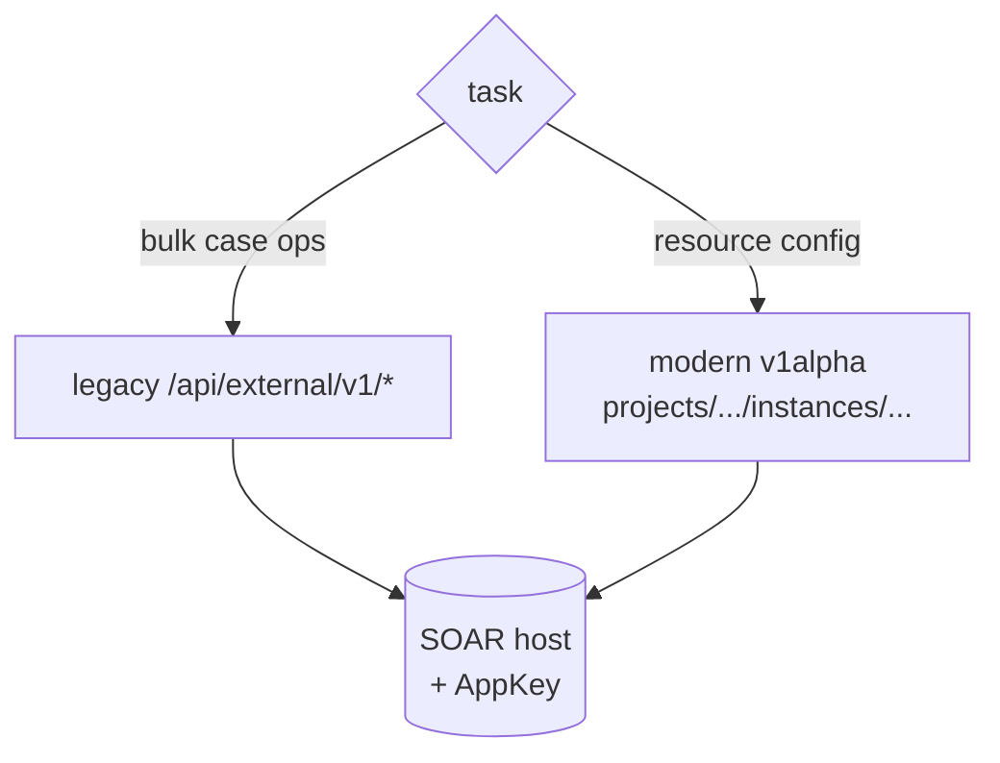
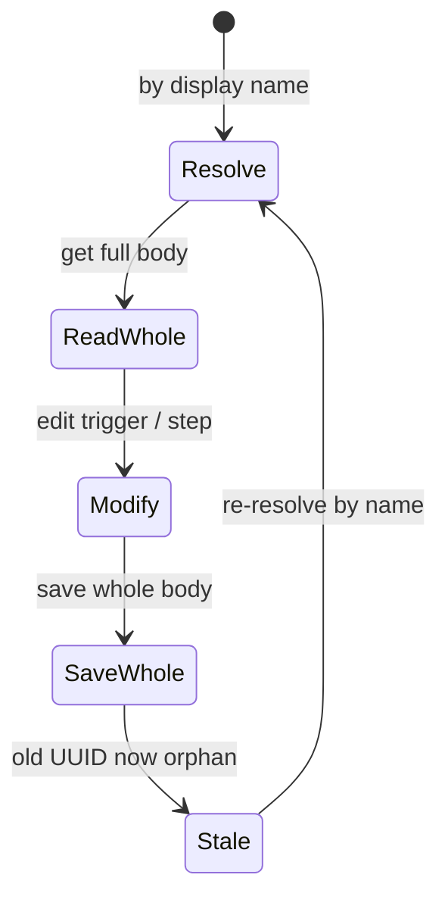

# 09 · SOAR operations

Google SecOps pairs the Chronicle **SIEM** with **Chronicle SOAR** (formerly
Siemplify — Google acquired and rebranded it; the API still carries the older URL
pattern). SOAR is where alerts become **cases**, **playbooks** automate response,
and **connectors** and **jobs** move data in and out.

This doc is conceptual: the two API surfaces, the playbook-versioning trap, and
running case hygiene as detection-as-code on cron. It contains no tenant
specifics.

> SOAR is a **separate API from the SIEM** — different host, different auth.

| Plane | Host | Auth header |
|---|---|---|
| SIEM | Chronicle API host (`<region>-chronicle.googleapis.com`) | `Authorization: Bearer <ADC token>` |
| SOAR | per-tenant SOAR host (`<tenant>.siemplify-soar.com`) | long-lived API key (AppKey) |

Keep the AppKey out of the repo — in an env var or secret store, never in
committed config (same rule as feeds, [08-feeds-parsers.md](08-feeds-parsers.md)).

## 🔀 Two API surfaces

SOAR exposes **two** API surfaces on the **same host**, and the same AppKey works
for both. Pick per task — they don't share response shapes, so don't mix them in
one parser.

| Surface | Style | Best for |
|---|---|---|
| **Legacy** (`/api/external/v1/*`) | RPC-ish paths, payload-style responses | Listing, closing, and **bulk** case operations; playbook export/import/delete. |
| **Modern v1alpha** (Google resource paths) | `projects/.../instances/...`, `{items: [...]}` responses, `updateMask` sparse updates | Integrations and connectors discovery, connector/job *instance* config (schedules, parameters, filters), alert-grouping rules, module settings, the playbook read/save bridge. |

Rule of thumb:

- **Bulk case operations** → legacy.
- **Resource configuration** (connectors, jobs, grouping, module settings) → v1alpha.
- In doubt → list on both, keep whichever returns the richer record.

### Two case ID systems (gotcha)

One conceptual case has **two** identifiers, not interchangeable:

| ID | Form | Used by |
|---|---|---|
| Case ID | integer (shown in the UI URL) | SOAR case endpoints |
| Case UUID | UUID | SIEM-side / legacy case lookups |

Map between them via the lookup that returns both — the SIEM-side case fetch
exposes the SOAR integer ID alongside the UUID. Always know which ID a given
endpoint expects.

## ⚠️ The playbook-versioning gotcha

The SOAR trap that bites everyone:

> **A playbook is version-scoped. Every save mints a *new* identifier, and the
> identifier you just saved is now stale.** Never cache a playbook UUID across a
> save.

The safe pattern:

- After any save, **re-resolve the playbook by display name** (or a stable
  lineage anchor the API exposes) — never by the UUID you held before the save.
- A save **replaces the whole definition** — not a sparse patch. To change one
  thing (a trigger condition, a step), **read the full body → modify → save it
  whole.** Trigger and step edits persist only if they ride that whole-body save.
- Some UUIDs are *readable but un-saveable* — stale orphan versions left from
  prior edits, absent from the list view. A save rejected as un-saveable means
  you're holding an orphan; re-resolve by name.
- **Triggers fire only on new cases.** To run a playbook against an existing or
  historical case, use the explicit **attach-and-run** operation rather than
  waiting for a trigger.

Also: SOAR rejects various punctuation in playbook names — stick to letters,
digits, spaces, hyphens, underscores — and integration-action steps have
step-shape rules. Prototype playbook automation in the UI, then export and check
into git, rather than hand-authoring blind.

## 💡 Case hygiene as detection-as-code

A busy SOAR queue fills with low-value and stale cases. Rather than build native
SOAR playbooks for housekeeping, run **case-hygiene logic as code on a schedule**
— the same detection-as-code philosophy as
[01-secops-as-code.md](01-secops-as-code.md). The logic lives in your repo,
changes go through `git diff` review, and a cron host (or timer / CI schedule)
runs it.

Typical safe loops:

| Loop | What it does | Guard |
|---|---|---|
| Close stale low-priority | cases below a priority threshold, still early-triage, untouched for N days | age + priority ceiling |
| Close confirmed false positives | high-confidence FP (analysis layer or LLM triage), no true-positive signal | priority ceiling |
| Promote named-threat-actor | bump cases whose titles match a threat-actor pattern to review-worthy priority | idempotent — re-run is a no-op once at/above target |

Two design rules make these safe to automate:

1. **A high-value denylist that nothing auto-closes.** Maintain a list of title
   patterns — beaconing, named APTs, RATs, reverse shells, "multiple MITRE
   tactics," etc. — that are **never** auto-closed, even when age or a
   false-positive verdict says "noise." A case can be low priority simply because
   nobody triaged it yet; a future real detection in those categories must
   survive until a human looks. An automated verdict reflects *yesterday's*
   behavior — a strong second opinion, not a replacement for analyst review on
   named-actor surfaces.
2. **Dry-run first; ceilings, not blanket action.** Run the preview when you
   change patterns, cap priority/age thresholds, and chunk bulk closes. These
   standing jobs are the *only* pre-authorized recurring pushes — everything else
   goes through the review gate. See
   [10-llm-and-automation.md](10-llm-and-automation.md) for the broader
   dry-run-first automation pattern.

## 🔒 What's worth tracking

Export and version the SOAR state that matters for review and disaster recovery:

- **Playbooks** — exported definitions.
- **Open-case snapshot** — the current queue.
- **Jobs** — scheduled jobs.
- **Connectors** — including instance config (schedules, parameters, any
  allow-list/filter expressions).

As with every other entity, the file is the reviewable artifact; the live
instance is the thing you actually deploy to.

### The SOAR command groups

The modern groups are plural and split by object:

- **`soar playbooks …`** — playbook lifecycle (list/export/import/deploy/run/debug,
  components, simulation).
- **`soar integrations …`** and **`soar jobs …`** — integration install/configure and
  connector/job instance config (schedules, parameters, filters).
- **`soar connector …`** — connector run/stat operations.
- **`soar ide …`** — authoring/scaffolding: `soar ide build-playbook` and
  `soar ide package-integration` for hand-built playbook and integration content.

Installable vendor content (integrations, content packs) comes from the **Content
Hub**, exposed as the top-level **`content-hub`** group
(`browse`/`list`/`get`/`install`/`uninstall`/`contentpacks`) — install the
integration, then configure its instance with `soar integrations configure`.
