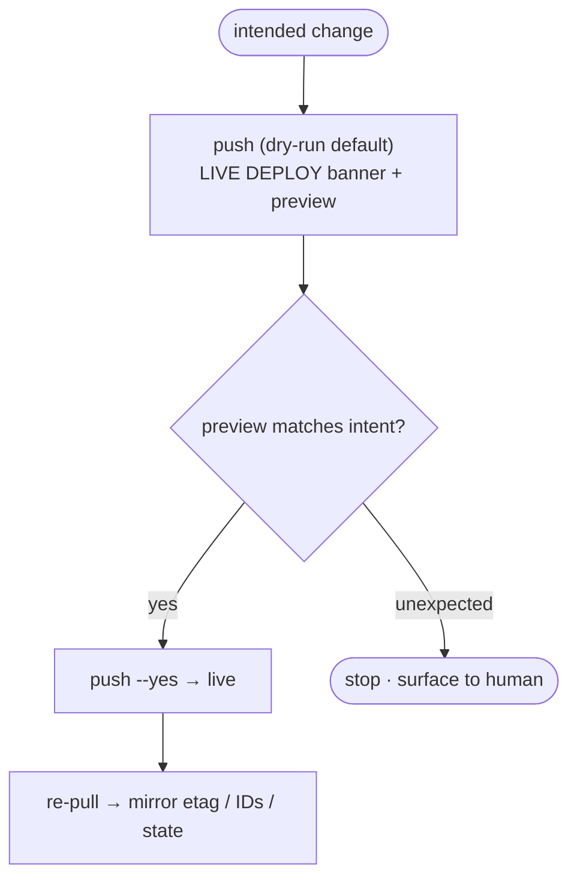
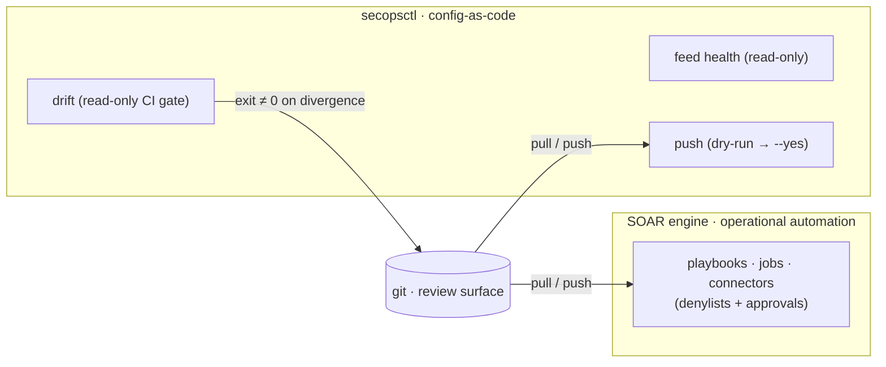

# 10 · LLM agents & automation

`secopsctl` is built so an **LLM agent** can drive it as safely as a human — and
so the safe, repetitive parts of SecOps operations can run unattended. This doc
covers how an agent should call the CLI and the detection-as-code patterns that
keep unattended work reviewable.

Builds on the loop in [01-secops-as-code.md](01-secops-as-code.md) and the client
design in [02-architecture-client.md](02-architecture-client.md).

## Why this CLI is agent-friendly

The choices that make the tool predictable for humans are exactly what an agent
needs:

| Property | What it gives an agent |
|---|---|
| **Deterministic flags, no hidden interactivity** | Every action is a flag, not a menu. The only prompt is the push confirmation, skippable with `--yes` — an agent never stalls on a prompt it can't see. |
| **`--json` / `--format`** | The global `--json` flag emits machine-readable JSON on the read commands (`search`, `alerts`, `cases`, `ti`, `rules`, `lists`, `curated`, `info`, `version`, the `soar` read verbs) **and** on `doctor`, `drift`, `push`, and the `alerts update` / `cases` guarded verbs (`push` reports the plan/result; guarded verbs report `{action, dry_run, applied}`). The `search` group goes further with `--format table\|json\|jsonl\|csv` (`--json` = `--format json`), `--fields` for dotted-path projection, `--out` to a file, and `--all` for the complete result set + total match count ([07-udm-queries.md](07-udm-queries.md)). Parse that output instead of scraping pretty text. `pull` still prints human text — its real output is the files it writes (inspect with `git diff`). |
| **`--help` on every command** | Introspect the surface (`secopsctl --help`, `secopsctl pull --help`, …) to discover targets and flags rather than guessing. |
| **`commands --json`** | The whole verb catalog in one offline call: every command's path, description, local flags, and **kind** (`read` vs `guarded-mutation` — the `--dry-run`/`--yes` gate). Generate an agent's tool list or a per-command allowlist from it instead of walking help screens. |
| **Lazy imports / offline-safe** | `--help`, `info`, and `commands` work with no auth or network, so an agent can explore the surface before any credential is in play. |
| **Explicit read/write asymmetry** | `pull`/`search`/`drift` never mutate; only `push` does, and it says so loudly. |
| **Hard read-only mode** | `SECOPS_READONLY=1` (set in the environment that *launches* the agent) or the global `--read-only` flag degrades **every** guarded mutation to a dry-run preview, `--yes` or not — so an investigation session cannot deploy through the guarded verbs. The env parse fails closed (any value except `0`/`false`/`no`/`off` enables it). One caller-trusted edge: a legacy `soar legacy call <op> --method POST --read` asserts the POST is a read — the tool cannot verify that, so in read-only mode it is sent with a stderr notice and an `asserted-read` audit record. A guardrail against unintended mutation, not a security boundary (the credentials still permit writes). |
| **Local mutation audit log** | Every **confirmed** mutation (and every read-only refusal) appends one JSONL record — time, action, decision — to `~/.secopsctl/audit.jsonl` (`0600`). "What did the agent change yesterday" is answerable locally; the log records guard decisions, not server outcomes. |

## The dry-run-first contract for agents

Treat every mutation as a two-phase operation:

1. **Preview.** Run the mutating command in its default `--dry-run` mode. The
   tool prints a `LIVE DEPLOY` banner and exactly what *would* change — which
   rules get created, which get disabled, which cases close. Add `--json` to get
   the plan as structured output (`push` reports created/updated/deleted +
   `would_change`; `cases` guarded verbs report `dry_run`/`applied`).
2. **Decide, then deploy.** Read the preview text. If — and only if — it matches the
   intended change, re-run with `--yes`. If it touches anything unexpected,
   **stop and surface the preview** to a human.

```bash
secopsctl push rules-create            # dry-run by default: preview what would be created
# (agent inspects the preview)
secopsctl push rules-create --yes      # deploy, only after the preview checks out
```



Guardrails for an autonomous agent:

| Guardrail | Rule |
|---|---|
| **Investigation sessions run read-only** | When the agent's task is to *look*, not *change*, launch it with `SECOPS_READONLY=1` in its environment. Every guarded mutation then degrades to a dry-run preview (`--json` reports `applied: false`), and the refusal is audit-logged. Lift the env only for a session whose explicit job is to deploy. |
| **Reads parallelize; writes serialize** | Agents `pull`/`search` concurrently (reads never touch tenant state). Never run two `push` ops against one instance at once, nor edit the same entity area from two agents without a fresh `pull` each ([01-secops-as-code.md](01-secops-as-code.md)). |
| **Pull before edit; re-pull after deploy** | Refresh local state before editing; re-pull after any mutation so companion metadata (`etag`, server IDs, deployment state) mirrors live. Verify "is X live?" against the instance, not git. |
| **Never invent identifiers** | Read project/region/customer from config ([02-architecture-client.md](02-architecture-client.md)); never hard-code a tenant value into a command. |
| **Escalate, don't improvise** | A surprising dry-run preview, an `etag` mismatch, or a `FAILED` feed ([08-feeds-parsers.md](08-feeds-parsers.md)) → report it rather than forcing through. |
| **Review the audit trail** | After an agent session that deployed anything, `~/.secopsctl/audit.jsonl` lists each confirmed mutation with its timestamp and action — diff it against what the session was *supposed* to do. |

## Verify before you trust (especially as an agent)

The lesson in [07-udm-queries.md](07-udm-queries.md) is doubly important for an
agent, which is prone to reasoning from a rule's *name* rather than its behavior:
**before relying on any curated/third-party rule that filters on a vendor tag,
run a UDM query and confirm your events actually carry that
`vendor_name`/`log_type`.** A rule whose vendor filter never matches is silently
dead. An agent that "verifies enablement" by reading the dashboard reports green
while detection coverage is zero. Verify against data, not against config.

## Driving Gemini safely

The `gemini` group ([11-gemini-and-ai.md](11-gemini-and-ai.md)) lets an agent ask in
natural language and get back a UDM query (`gemini generate`), run it
(`gemini search`), or get assistant prose (`gemini ask`). All three are **reads** —
they create no managed artifact and stay available in hard read-only mode. Two
agent-specific cautions:

- **Generation is non-deterministic.** Prefer `gemini generate` → review the produced
  UDM → run it (so the same verification lesson above applies *before* you act), over
  `gemini search` running an unreviewed query. Pin a query you trust as a `.udm` file
  or a saved search and run *that* on a schedule.
- **The model picks the time window** when the prompt implies one ("last hour"),
  overriding `--hours` — state the range in the prompt when it matters.

## Automation: SOAR orchestrates; secopsctl gates the config

Recurring *operational* automation — case hygiene, enrichment, scheduled response
— is **SOAR's job**, not the CLI's. It lives in SOAR **playbooks and jobs**, runs
on the SOAR engine, and carries its own denylists and approvals. secopsctl's role
is to manage that automation **as code**: pull → review → push the playbooks /
jobs / connectors surfaces ([09-soar-operations.md](09-soar-operations.md)) so the
orchestration logic is itself version-controlled and code-reviewed. Don't
reimplement a stale-case-close loop as a secopsctl cron script — that's a SOAR
job, deployed like any other surface.

secopsctl's *own* unattended role is narrow and read-mostly:

- **Config-drift detection** — run `secopsctl drift` on a CI/cron schedule. It is
  read-only: it diffs the committed baseline against live and reports divergence
  (an out-of-band UI edit, or an undeployed local change) as human text, then
  **exits non-zero**. In automation, branch on the **exit code** (git-style):
  `0` = in sync, `2` = drift detected (act — reconcile), `1` = error or a surface
  that could not be verified (incomplete live list — retry/fix). Add `--json` for a
  per-surface report (`drifted_surfaces`, `surfaces[]` with `+/~/-`/untracked) to
  parse alongside the exit code. Pair it with `pull` in CI.
- **Ingest-health checks** — pull feeds on a schedule and alert on any
  `state: FAILED` ([08-feeds-parsers.md](08-feeds-parsers.md)). Read-only; safe to
  run often.



When a recurring *config-as-code* reconcile is genuinely the CLI's job (not
security orchestration) — e.g. syncing a reference list from an upstream feed —
keep its logic in the repo so it goes through `git diff`, and apply it with the
same dry-run-then-`--yes` push a human uses. Two rules keep any standing mutation
(a SOAR job or a config reconcile) safe to leave running:

1. **A high-value denylist that nothing auto-changes** — beaconing, named APTs,
   RATs, reverse shells, multi-tactic alerts. A future real detection in those
   categories must survive any auto-action until a human looks. An automated (or
   LLM) verdict reflects past behavior; it is a second opinion, not a substitute
   for analyst review on those surfaces.
2. **Bounded and idempotent** — priority/age ceilings, chunked bulk operations,
   re-runs that no-op once the desired state holds. Always dry-run first when you
   change the patterns.

## Review in git; let SOAR orchestrate

The throughline: **everything reviewable lives in git.** Config-as-code — the
detections, lists, feeds, dashboards, *and the SOAR playbooks/jobs themselves* —
is pulled, reviewed as a diff, and deployed via dry-run-then-`--yes`. Recurring
security automation runs in **SOAR**, where it belongs; secopsctl keeps it honest
by version-controlling its definition and gating config drift (`drift`). New,
novel, or destructive changes are never left to a schedule or an autonomous agent
— they go through the human review gate every time.

Cross-references:

- the loop and discipline — [01-secops-as-code.md](01-secops-as-code.md)
- config-as-identity and `etag` — [02-architecture-client.md](02-architecture-client.md)
- rule mutation specifics — [03-yara-l-rules.md](03-yara-l-rules.md)
- deterministic search and the vendor-tag verification lesson — [07-udm-queries.md](07-udm-queries.md)
- ingest health — [08-feeds-parsers.md](08-feeds-parsers.md)
- SOAR case hygiene — [09-soar-operations.md](09-soar-operations.md)
- driving Gemini / NL→UDM — [11-gemini-and-ai.md](11-gemini-and-ai.md)
