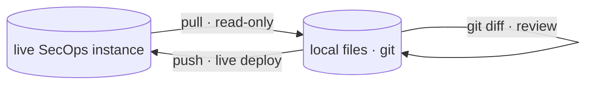

# secopsctl tips

Tenant-neutral craft notes for operating **Google SecOps (Chronicle SIEM + SOAR)**
as code. They share the *workflow*, the API gotchas, the entity conventions, and
the safety habits — with no tenant identifiers or data. They pair with `secopsctl`
but stand on their own.

The whole craft is one loop, repeated per surface (rules, lists, dashboards, feeds,
cases):

Start with [01](01-secops-as-code.md) (the loop) and [02](02-architecture-client.md)
(how the client talks to the instance); the rest read in any order.

| Doc | Summary |
|---|---|
| [01 · SecOps as code](01-secops-as-code.md) | The pull → review → push loop; why `pull` is read-only and every `push` is a live deploy. |
| [02 · Architecture & the client](02-architecture-client.md) | Config-as-identity, the pure typed SDK / file-I/O mirror split, the numeric-vs-string project gotcha, `etag`, slugs, optional IPv4 forcing. |
| [03 · YARA-L detection rules](03-yara-l-rules.md) | Custom detections: `.yaral` + companion `.yaml`, creating vs. editing, deployment state, what `push` mutates. |
| [04 · Reference lists & data tables](04-reference-lists-data-tables.md) | List/table conventions, syntax types, column typing, and destructive-replace pitfalls. |
| [05 · Curated rules](05-curated-rules.md) | Google-managed content: rule-set deployment state vs. the catalog; why curated rules can only be toggled, not edited. |
| [06 · Native dashboards](06-dashboards.md) | Listing vs. full export, curated vs. custom, and why JSON exports are not hand-edited. |
| [07 · Search & UDM queries](07-udm-queries.md) | The `search` suite (udm/raw/stats/event/export/validate/run/saved), the `--format`/`--fields`/`--out`/`--all` output contract, server-side saved & shared searches — and the key lesson: verify `vendor_name`/`log_type` in *your own* data before trusting a curated rule's vendor filter. |
| [08 · Feeds & parsers](08-feeds-parsers.md) | The `ingest` group, ingest health (`state: FAILED` first), secrets never in the repo, prebuilt vs. custom parsers (grep, don't open). |
| [09 · SOAR operations](09-soar-operations.md) | The two SOAR API surfaces, the playbook-versioning gotcha, case hygiene as detection-as-code on cron, and the SOAR command groups (`soar playbooks`/`integrations`/`jobs`/`ide`) plus installing vendor content from the Content Hub (`content-hub`). |
| [10 · LLM & automation](10-llm-and-automation.md) | How an LLM agent drives the CLI (deterministic flags, `--json`/`--format`, dry-run-first) and detection-as-code automation patterns. |
| [11 · Gemini & AI](11-gemini-and-ai.md) | Natural-language → UDM (`gemini generate`/`search`), the assistant (`gemini ask`), the model-inferred time window, one-time opt-in, and driving it safely as an agent. |
